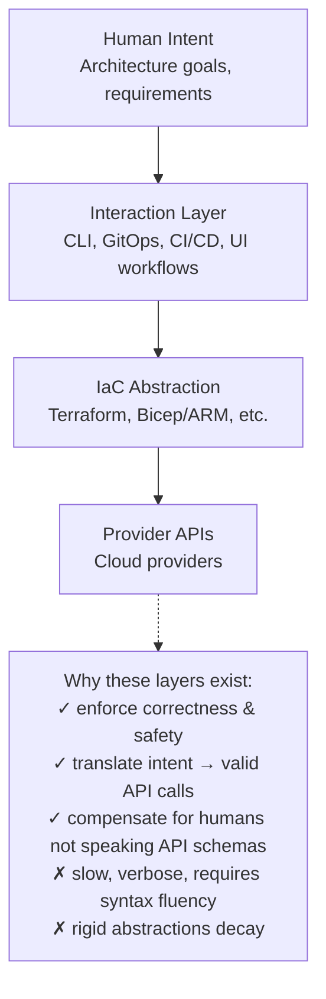
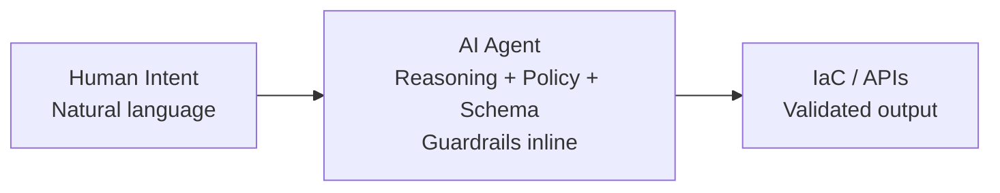
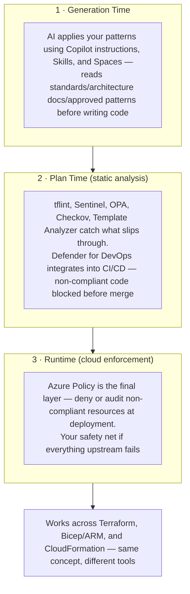
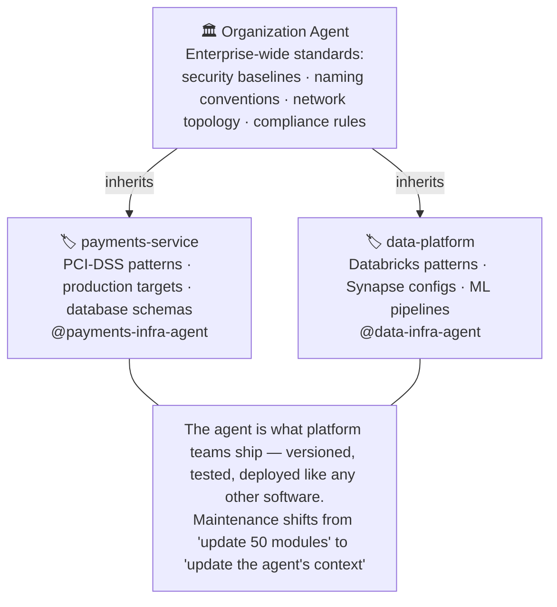
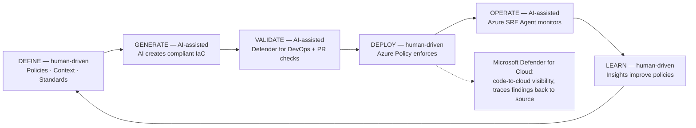
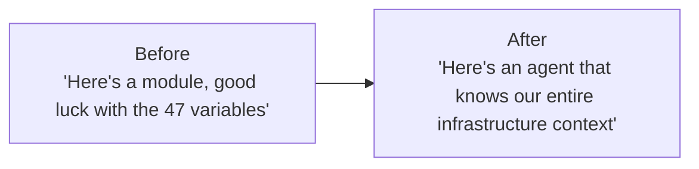
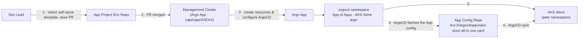
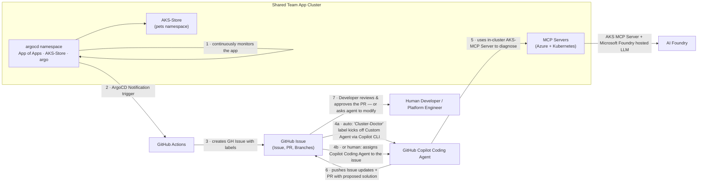
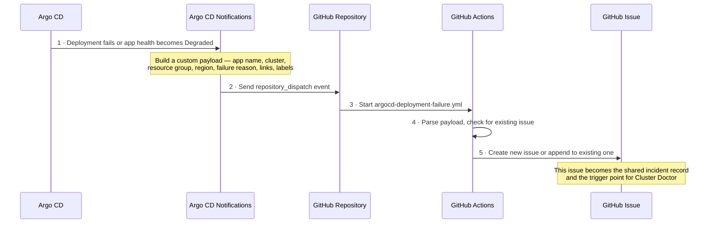

# Agentic Platform Engineering — Diagram Reference

Mermaid recreations of the architecture diagrams embedded in the Microsoft
"All Things Azure" devblog series on agentic platform engineering and
agentic DevOps. These are redraws (interpreted from full-resolution image
inspection, not screenshots) — box/arrow topology, labels, and color-coded
grouping are preserved; exact pixel styling is not. Each diagram is cited
back to its source article and linked from the `architect-*` skill(s) it
informs. `research/SOURCES.md` indexes these under "Web sources (agentic
platform engineering series)".

## 1. Traditional IaC intent-to-execution stack

Source: [Platform Engineering for the Agentic AI Era](https://devblogs.microsoft.com/all-things-azure/platform-engineering-for-the-agentic-ai-era/) — "The Traditional Model."
Informs: `architect-blueprint` (baseline to contrast against the agentic model).

Four color-coded layers in the source image (purple → blue → green → yellow,
human-abstract to machine-concrete), each a single downward arrow to the
next; a standalone gray callout to the right lists the trade-off.

## 2. The agentic shift (collapsed stack)

Source: [same article](https://devblogs.microsoft.com/all-things-azure/platform-engineering-for-the-agentic-ai-era/) — "The Agentic Shift."
Informs: `architect-blueprint` (this is the target-state diagram the whole capstone argues for).

The Interaction Layer and IaC Abstraction boxes from Diagram 1 collapse into
the single "AI Agent" box — the "API interaction layer" still exists but
becomes implicit, dynamically constructed by the agent. Supporting bullets
in the source ("Modern agents can: ingest natural language intent · reason
over API/provider schemas · generate, validate, and execute IaC · apply
changes directly via provider APIs · apply guardrails/policies/approvals
inline") map onto the AI Agent box's capabilities.

## 3. Three layers of enforcement

Source: [same article](https://devblogs.microsoft.com/all-things-azure/platform-engineering-for-the-agentic-ai-era/) — "Three Layers of Enforcement."
Informs: `architect-permissions-mapper` (addendum below), `architect-blueprint` (Security plane).

No connecting arrows in the source image — three stacked, numbered,
color-coded bands (purple/blue/green) whose vertical order itself conveys
generation → plan → runtime sequencing, plus a gray footer band. Maps
directly onto `architect-permissions-mapper`'s "flag rules": a resource
discovered with write access but no plan-time or runtime policy attached is
a governance gap, not just a permissions gap.

## 4. Org-level / repo-level agent inheritance

Source: [same article](https://devblogs.microsoft.com/all-things-azure/platform-engineering-for-the-agentic-ai-era/) — "The New Artifacts."
Informs: `architect-persona-generator` (org-mapping field), `architect-permissions-mapper` (addendum below).

Direct visual analogue for `Persona.org_mapping`: an org-level agent (or, in
our schema terms, an org-wide RBAC/policy binding) is the parent that every
repo-scoped persona inherits guardrails from by default. Repo-level agents
here are the human equivalent of `architect-persona-generator`'s per-team
personas — each one narrows the org baseline to a specific codebase's
patterns and deployment targets.

## 5. Agentic operations loop (Define → Generate → Validate → Deploy → Operate → Learn)

Source: [same article](https://devblogs.microsoft.com/all-things-azure/platform-engineering-for-the-agentic-ai-era/) — "What's the Platform Team's Job Now?"
Informs: `architect-blueprint` (capstone lifecycle framing), `architect-work-sync` (Learn → Define feedback edge is the ticket/work-item loop).

Center of the source diagram reads "Humans control POLICY / AI handles
EXECUTION" — the recurring split in every `architect-*` skill: agents draft
(workloads, personas, work items, permission maps); humans approve the
policy-affecting step (Define, Deploy, Learn). A legend marks alternating
human-driven vs. AI-assisted nodes around the ring.

## 6. Before/after role shift

Source: [same article](https://devblogs.microsoft.com/all-things-azure/platform-engineering-for-the-agentic-ai-era/) — "What's the Platform Team's Job Now?" (closing).
Informs: `architect-blueprint` (framing for what the capstone doc itself should read like).

Below the two boxes, an unconnected 4-card grid: "Platform teams now ship:
Guardrails (policy-as-code, compliance frameworks) · Patterns (approved
architectures, golden paths) · Agents (context-aware infrastructure
automation) · Knowledge (ADRs, diagrams, runbooks as agent input)" — the
last item is exactly what `research/SOURCES.md` + this diagrams file are
for: agent-consumable knowledge artifacts.

## 7. App of Apps GitOps promotion flow

Source: [Agentic Platform Engineering with GitHub Copilot](https://devblogs.microsoft.com/all-things-azure/agentic-platform-engineering-with-github-copilot/) — "The Paradox of Choice" (the diagram illustrates the article's own linked reference, cited there only by title as "Build a GitOps-Driven Platform on AKS with the App of Apps Pattern | AKS LABS" with no separately capturable URL).
Informs: `architect-work-sync` (concrete GitOps-to-ticket wiring pattern), `architect-blueprint` (Integration & Delivery plane, golden-path example).

Solid arrows = provisioning/creation actions; dashed arrows = GitOps
pull/sync (ArgoCD watching git, not being pushed to) — the distinction
`architect-work-sync` should preserve when it documents which of its writes
are "push a ticket" vs. "wait for the reconciler to notice."

## 8. Cluster Doctor — event-driven remediation workflow

Source: [Agentic Platform Engineering with GitHub Copilot](https://devblogs.microsoft.com/all-things-azure/agentic-platform-engineering-with-github-copilot/) — "The Cluster Doctor" and "From Reactive to Adaptive" (two appearances of the same diagram; the second swaps step 4 from an automatic label trigger to a human explicitly assigning the agent — both variants shown below).
Informs: `architect-work-sync` (the canonical adapter example named in the delivery plan), `architect-permissions-mapper` (addendum below — "verify identity before write").

This is the reference pattern for `architect-work-sync`'s Argo CD →
`repository_dispatch` → GitHub Issues → label-triggered agent → PR flow —
step 7 is the non-negotiable human-approval gate that
`architect-work-sync`'s own rule ("never file tickets silently — always
draft for human approval") is modeled on.

## 9. The Wiring — repository_dispatch sequence diagram

Source: [Agentic Platform Engineering with GitHub Copilot](https://devblogs.microsoft.com/all-things-azure/agentic-platform-engineering-with-github-copilot/) — "The Wiring."
Informs: `architect-work-sync` (exact event payload/sequence to adapt per work-tracking system).

This is the source article's own sequence diagram, redrawn as Mermaid
`sequenceDiagram` rather than reinterpreted as boxes/arrows — it was already
in that notation. `architect-work-sync`'s pluggable adapter should treat
step 2 (`repository_dispatch`) as the one GitHub-specific hop; a Linear/Jira
adapter substitutes its own inbound-webhook or API-call equivalent for
steps 2–3, then converges on the same "create or append" idempotency rule
at step 5.

## No diagrams found

Three of the eight source articles fetched this session contain **no**
diagram, flowchart, or architecture-illustration images — verified by full
DOM image/SVG enumeration plus a top-to-bottom visual scroll of each:

- [Agentic DevOps: Practices, Principles, and Strategic Direction](https://devblogs.microsoft.com/all-things-azure/agentic-devops-practices-principles-strategic-direction/) — all structured content (Foundation Checklist, Four Collaboration Zones, Specification Maturity Curve, the Agentic DevOps Maturity Model) is native HTML tables, not images.
- [Frameworks Only Matter When They Force Decisions](https://devblogs.microsoft.com/all-things-azure/frameworks-only-matter-when-they-force-decisions/) — the assessment loop and the three WAF/NIST scorecards (Examples A/B/C) are prose and HTML tables, not graphics.
- [Best of Both Worlds for Agentic Refactoring: GitHub Copilot + MicroVMs via Docker Sandbox](https://devblogs.microsoft.com/all-things-azure/best-of-both-worlds-for-agentic-refactoring-github-copilot-microvms-via-docker-sandbox/) — every embedded image is a terminal/CLI or VS Code UI screenshot; the workspace-sync and "smart deny-all" filtering-proxy concepts are prose-only.

One image was excluded as decorative/non-diagrammatic in each of the two
image-bearing articles per instruction: the stock header illustration on
the "Agentic AI Era" and "Frameworks" articles' own logo art, and a
borderline "Platform Tooling Landscape" logo grid (categorized tool-logo
eye chart with generic plane-to-plane arrows but no individually named
nodes) in the GitHub Copilot article — flagged in the extraction report but
not redrawn here since it lacks the labeled-node/labeled-edge structure a
faithful Mermaid diagram needs.
