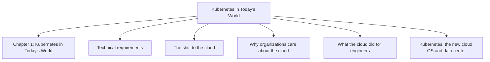
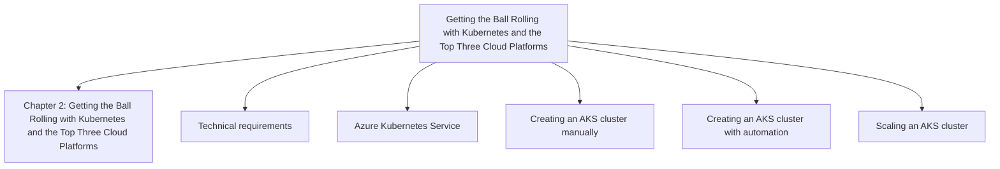
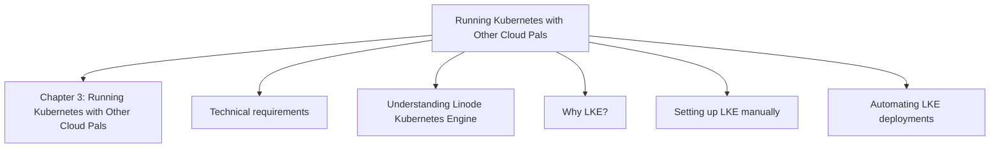
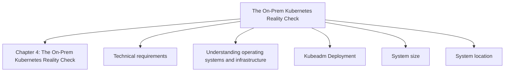
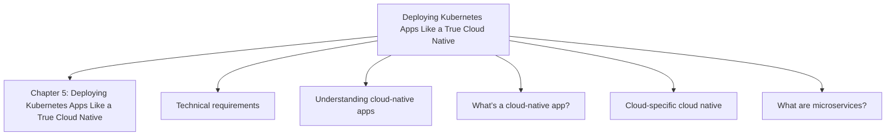
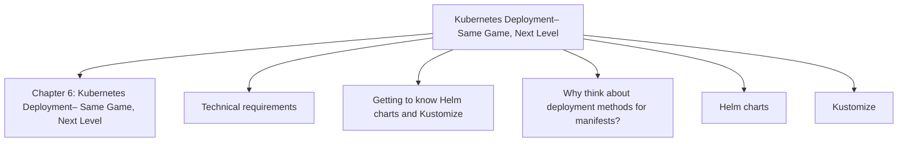
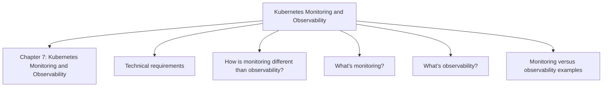
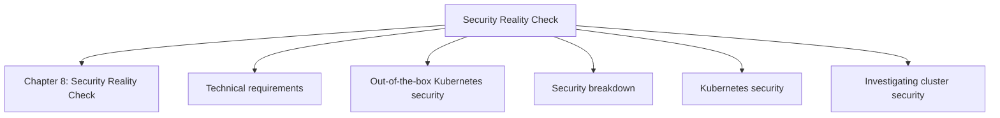

# 50 Kubernetes Concepts Every DevOps Engineer Should Know

*Michael Levan — Book*
## Chapter 1: Kubernetes in Today’s World

**Questions this chapter answers:**
- What does this chapter explain about Chapter 1: Kubernetes in Today’s World?
- What does this chapter explain about Technical requirements?
- What does this chapter explain about The shift to the cloud?

**Key points:**
- Source section: Chapter 1: Kubernetes in Today’s World.
- Source section: Technical requirements.
- Source section: The shift to the cloud.
- Source section: Why organizations care about the cloud.

## Chapter 2: Getting the Ball Rolling with Kubernetes and the Top Three Cloud Platforms

**Questions this chapter answers:**
- What does this chapter explain about Chapter 2: Getting the Ball Rolling with Kubernetes and the Top Three Cloud Platforms?
- What does this chapter explain about Technical requirements?
- What does this chapter explain about Azure Kubernetes Service?

**Key points:**
- Source section: Chapter 2: Getting the Ball Rolling with Kubernetes and the Top Three Cloud Platforms.
- Source section: Technical requirements.
- Source section: Azure Kubernetes Service.
- Source section: Creating an AKS cluster manually.

## Chapter 3: Running Kubernetes with Other Cloud Pals

**Questions this chapter answers:**
- What does this chapter explain about Chapter 3: Running Kubernetes with Other Cloud Pals?
- What does this chapter explain about Technical requirements?
- What does this chapter explain about Understanding Linode Kubernetes Engine?

**Key points:**
- Source section: Chapter 3: Running Kubernetes with Other Cloud Pals.
- Source section: Technical requirements.
- Source section: Understanding Linode Kubernetes Engine.
- Source section: Why LKE?.

## Chapter 4: The On-Prem Kubernetes Reality Check

**Questions this chapter answers:**
- What does this chapter explain about Chapter 4: The On-Prem Kubernetes Reality Check?
- What does this chapter explain about Technical requirements?
- What does this chapter explain about Understanding operating systems and infrastructure?

**Key points:**
- Source section: Chapter 4: The On-Prem Kubernetes Reality Check.
- Source section: Technical requirements.
- Source section: Understanding operating systems and infrastructure.
- Source section: Kubeadm Deployment.

## Chapter 5: Deploying Kubernetes Apps Like a True Cloud Native

**Questions this chapter answers:**
- What does this chapter explain about Chapter 5: Deploying Kubernetes Apps Like a True Cloud Native?
- What does this chapter explain about Technical requirements?
- What does this chapter explain about Understanding cloud-native apps?

**Key points:**
- Source section: Chapter 5: Deploying Kubernetes Apps Like a True Cloud Native.
- Source section: Technical requirements.
- Source section: Understanding cloud-native apps.
- Source section: What’s a cloud-native app?.

## Chapter 6: Kubernetes Deployment– Same Game, Next Level

**Questions this chapter answers:**
- What does this chapter explain about Chapter 6: Kubernetes Deployment– Same Game, Next Level?
- What does this chapter explain about Technical requirements?
- What does this chapter explain about Getting to know Helm charts and Kustomize?

**Key points:**
- Source section: Chapter 6: Kubernetes Deployment– Same Game, Next Level.
- Source section: Technical requirements.
- Source section: Getting to know Helm charts and Kustomize.
- Source section: Why think about deployment methods for manifests?.

## Chapter 7: Kubernetes Monitoring and Observability

**Questions this chapter answers:**
- What does this chapter explain about Chapter 7: Kubernetes Monitoring and Observability?
- What does this chapter explain about Technical requirements?
- What does this chapter explain about How is monitoring different than observability??

**Key points:**
- Source section: Chapter 7: Kubernetes Monitoring and Observability.
- Source section: Technical requirements.
- Source section: How is monitoring different than observability?.
- Source section: What’s monitoring?.

## Chapter 8: Security Reality Check

**Questions this chapter answers:**
- What does this chapter explain about Chapter 8: Security Reality Check?
- What does this chapter explain about Technical requirements?
- What does this chapter explain about Out-of-the-box Kubernetes security?

**Key points:**
- Source section: Chapter 8: Security Reality Check.
- Source section: Technical requirements.
- Source section: Out-of-the-box Kubernetes security.
- Source section: Security breakdown.

