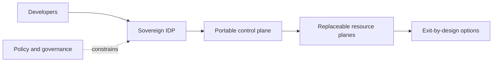

# Building the Sovereign Internal Developer Platform

*Weave Intelligence — Report*

## Agent guide

Explains how internal developer platforms can preserve organizational autonomy through portable architecture, explicit control boundaries, and exit-by-design planning.
### Questions this chapter answers
- How does a sovereign IDP support strategic autonomy?
- What does exit-by-design require from platform architecture?
- Which platform layers need portability and governance controls?
### Key points
- Sovereignty is an architectural and operating-model concern rather than only a hosting decision.
- Exit-by-design makes portability and dependency boundaries deliberate platform requirements.
- Governance must span the developer interface, control plane, and underlying resource planes.

## Conceptual diagram

## Detailed source transcript

### Page 1
Building the sovereign Internal
Developer Platform (IDP)
Achieving strategic autonomy through
an exit-by-design architecture
COMMISSIONED BY CYCLOID
	© 2026 WEAVE INTELLIGENCE
	ALL RIGHTS RESERVED. UNAUTHORIZED REPRODUCTION PROHIBITED.
		BUILDING THE SOVEREIGN INTERNAL DEVELOPER PLATFORM (IDP)   1
### Page 2
Building the sovereign Internal
Developer Platform (IDP)
Table of contents
About Cycloid                                                     03
	The Developer Control Plane                                 16
	The Integration and Delivery Plane                          18
Executive summary                                                 04
	The Resource Plane                                          19
	The Security Plane                                          23
Introduction: The global                                          06
	The Observability Plane                                     24
mandate for digital sovereignty
The geopolitical and legal triggers                               07
	Portability via IaC and GitOps                              25
	The abstraction layer: IaC and configuration                25
The enterprise challenge: The legal                               09   management
sandwich and provider lock-in                                          GitOps and the exit strategy by design                      25
The mechanics of the legal sandwich                               09   Air-gapped and on-premise capabilities                      26
The technical reality of lock-in                                  10
Open source ecosystems vs.                                        10
	Sample use cases                                            27
commercial capture                                                     Use case 1: Multi-cloud and hybrid                          27
	infrastructure provisioning
Strategic framework: Diversification 12                                Use case 2: Sovereign Kubernetes (K8s)                      28
	management
for strategic autonomy
	Use case 3: Sovereign CI/CD pipelines                       29
Pillar 1: Provider diversity and the                              12
multi-cloud imperative                                                 Use case 4: Sovereign Identity and Access                   30
	Management (IAM)
Pillar 2: Architectural decoupling via the IDP                    13
	Use case 5: Sovereign observability                         31
	and monitoring
Reference architecture for the                                    14
	Use case 6: Sovereign database                              32
sovereign IDP                                                          management
The five architectural planes                                     15
	Conclusion: Future-proofing                                 33
Architectural planes in detail                                    16   the platform
	© 2026 WEAVE INTELLIGENCE
	ALL RIGHTS RESERVED. UNAUTHORIZED REPRODUCTION PROHIBITED.
		BUILDING THE SOVEREIGN INTERNAL DEVELOPER PLATFORM (IDP)   2
### Page 3
About Cycloid
	Cycloid’s mission is to scale platform engineering initiatives.
	They provide the core building blocks for an enterprise Internal
	Developer Platform (IDP) that unifies the developer portal and
	platform orchestration, which can be completed with custom
	plugins. Cycloid gives platform engineering teams one control
	layer to stand up self-service golden paths in weeks - replacing
	the multi-year DIY builds typical of catalog-only tools.
	Most vendors force a choice between a portal sitting on top of
	third-party automation or an orchestration engine without a
	developer-facing experience. Cycloid ships both, sharing one
	data model, one authorization engine, one API surface, and one
	audit trail.
	Developers interact through a portal backed by reusable
	infrastructure templates (Stacks) and dynamic configuration
	forms (StackForms) that abstract provider complexity. The
	result: fewer tickets, lower cognitive load, and faster time from
	commit to production across hybrid, multi-cloud, and sovereign
	environments. Integrated FinOps and GreenOps modules -
	pre-deployment cost estimation, cloud cost management,
	carbon footprint tracking - give platform teams financial and
	environmental visibility without external tooling.
	Architecturally, Cycloid is framework-agnostic and built for
	portability. It deploys as SaaS or fully self-hosted, treats IaC as the
	root of trust, and avoids proprietary lock-in to any single cloud
	provider - enabling the exit-by-design posture this whitepaper
	describes.
	Cycloid serves regulated enterprises, public sector bodies,
	scale-ups, and works with global system integrators and managed
	service providers.
	© 2026 WEAVE INTELLIGENCE
	ALL RIGHTS RESERVED. UNAUTHORIZED REPRODUCTION PROHIBITED.
		BUILDING THE SOVEREIGN INTERNAL DEVELOPER PLATFORM (IDP)   3
### Page 4
1
Executive summary
In 2026, digital sovereignty has transitioned                                   where conflicting jurisdictional mandates
from a theoretical policy discussion to a strict                                threaten their operational continuity.
technical requirement for global enterprises.
While the movement is spearheaded by                                            This whitepaper, commissioned by Cycloid
European regulatory frameworks such as                                          and authored by Weave Intelligence, presents
the NIS2 Directive, the Digital Operational                                     a comprehensive reference architecture
Resilience Act (DORA), and the EU Data Act,                                     for a Sovereign Internal Developer Platform
the demand for strategic autonomy is now a                                      (IDP). Unlike traditional IDPs, often designed
recognized global phenomenon. Geopolitical                                      with the native, proprietary services of a
shifts and legal conflicts - most notably the                                   single global hyperscaler in mind, a sovereign
friction between the US Clarifying Lawful                                       IDP decouples from reliance on a single
Overseas Use of Data Act (CLOUD Act)                                            hyperscaler. By leveraging open-source
and regional privacy laws - have created                                        standards, localized service providers,
a precarious environment for data and                                           and self-hosted management planes,
operational stability. Organizations are finding                                organizations can achieve a state of
themselves trapped in a “legal sandwich,”                                       “exit-strategy-by-design.”
	Key findings and architectural sovereignty principles
	Compliance as a                                              Regulatory frameworks in Europe and beyond now mandate
		explicit proof of provider diversification and the existence of
	global driver                                                viable, tested exit strategies to ensure operational resilience
		in critical sectors.
	Self-hosted                                                  SaaS-hosted IDP tooling cedes end-to-end lifecycle control
		to an external provider, making it impossible to enforce
	deployment for                                               custom security policies. Self-hosted IDP building blocks
	security control                                             ensure that the organization’s security controls govern
		every layer of the platform - nothing enters or exits without
		explicit authorization.
	© 2026 WEAVE INTELLIGENCE
	ALL RIGHTS RESERVED. UNAUTHORIZED REPRODUCTION PROHIBITED.
		BUILDING THE SOVEREIGN INTERNAL DEVELOPER PLATFORM (IDP)   4
### Page 5
The abstraction                                              Sovereignty is achieved not only by where data physically
	resides, but by the portability of the workflows that process
	mandate                                                      it. “Everything-as-code” is the primary technical enabler of
		this portability, shifting the root of trust from the vendor to
		the organization’s own Git repositories.
	Decoupled                                                    Using a framework-agnostic platform orchestrator, a
		backend that enables platform engineering teams to
	orchestration                                                maintain a consistent, high-quality developer experience
		across a fragmented, multi-provider sovereign
		infrastructure and tooling landscape.
	AI sovereignty                                               The integration of Artificial Intelligence (AI) into the software
		development lifecycle requires new safeguards. Sovereign
		IDPs must enable the optionality for localized models
		hosted on regional infrastructure to prevent the leakage of
		Intellectual Property (IP) into foreign training datasets.
To achieve true strategic autonomy, organizations must prioritize “sovereignty-by-design.”
They must engineer their internal platforms to ensure the entire software delivery lifecycle
remains fully operational even if foreign legal, commercial, or connectivity ties are severed.
	© 2026 WEAVE INTELLIGENCE
	ALL RIGHTS RESERVED. UNAUTHORIZED REPRODUCTION PROHIBITED.
		BUILDING THE SOVEREIGN INTERNAL DEVELOPER PLATFORM (IDP)   5
### Page 6
2
Introduction:
The global mandate for
digital sovereignty
Digital sovereignty in the modern enterprise                      mandate. The sheer velocity and scale of the
context encompasses an organization’s ability                     managed service ecosystem provided by
to control its technical destiny and protect its                  global cloud providers (predominantly
intellectual property, maintaining operational                    US-based) offered undeniable speed-to-
continuity regardless of external geopolitical,                   market advantages. However, the trade-off
legal, or commercial pressures. It is the                         for this speed is deep technical lock-in
architectural manifestation of                                    through the adoption of proprietary APIs
self-determination.                                               and vendor-specific operational tooling.
For the past decade, enterprise IT strategy
has been dominated by the “hyperscaler-first”
	On 12 June 2026, the US government issued an export control directive
	that forced Anthropic, the maker of Claude, to disable Claude Mythos 5
	and Fable 5 for every non-American customer worldwide, including EU
	governments mid-procurement, for cybersecurity reasons.
	The lesson generalizes beyond more than one vendor or legal jurisdiction.
	Any frontier AI or LLM capability hosted in a single jurisdiction can be
	revoked overnight on national-security grounds that the affected users
	are never made aware of. This action highlights that sovereignty is not a
	procurement preference but is, in fact a continuity requirement.
		© 2026 WEAVE INTELLIGENCE
		ALL RIGHTS RESERVED. UNAUTHORIZED REPRODUCTION PROHIBITED.
			BUILDING THE SOVEREIGN INTERNAL DEVELOPER PLATFORM (IDP)   6
### Page 7
The geopolitical and legal triggers
The landscape has shifted, driven by legal
	ŗ Brazil: The LGPD (General Data
pressure. And while the tension is most acute
	Protection Law) established advanced
in Europe, the Middle East and Asia, the
	frameworks for restrictions on
regulatory ripples are global.
	cross-border data transfers.
In Europe, the regulatory environment                               ŗ North America: Recent legal rulings
tightened dramatically to protect critical                              in Canada demonstrated that even
infrastructure and citizen data.                                        European cloud providers operating
	local data centers can be caught in
	jurisdictional tugs-of-war over data
	ŗ The NIS2 Directive establishes a unified                            stored on foreign soil, highlighting that
		legal framework to ensure cybersecurity                           the risk of extraterritorial legal overreach
		across 18 critical sectors in the European                        is bi-directional.
		Union. It mandates that member states
		define national cybersecurity strategies
		and enforce strict incident reporting and                   The geopolitical tensions in the Middle
		risk management measures, particularly                      East, particularly following the strategic
		regarding supply chain security and cloud                   shifts that accelerated from 2019 onward,
		service providers.                                          have prompted a broad reassessment of
	ŗ DORA is aimed specifically at the                             IT sovereignty. Middle Eastern states and
		financial sector. The act forces                            other US allies are increasingly prioritizing IT
		institutions to map their Information                       sovereignty (e.g. by reducing dependence
		and Communication Technology (ICT)                          on foreign software, hardware, and cloud
		dependencies. It requires financial                         services) to retain autonomy and protect their
		entities to prove they are not overly                       own strategic interests.
		dependent on a single critical ICT
		third-party provider (CTPP) and that                        The US government has similarly recognized
		they maintain highly functional, tested                     the risks of over-reliance on commercial
		exit strategies to migrate away from a                      software in critical infrastructure contexts.
		provider without operational disruption.                    While the US has long led global software
			and technology, a growing policy consensus
While Europe leads this regulatory charge,                        favors retaining control and resilience in key
similar frameworks are establishing a global                      areas, a shift toward domestic technology
baseline for sovereignty:                                         independence rather than global isolation.
	ŗ India: The Digital Personal Data                              China’s approach to technology sovereignty
		Protection Act (DPDP) introduced                            is among the most comprehensive globally,
		stringent mandates for data protection,                     having built a largely self-sufficient
		restricted cross-border transfers and                       technology ecosystem over two decades
		processing of sensitive personal data,                      to reduce reliance on foreign technology,
		forcing multinationals to adopt localized                   protect its economy from sanctions, and
		infrastructure architectures.                               project influence. This strategy, which is tied
		© 2026 WEAVE INTELLIGENCE
		ALL RIGHTS RESERVED. UNAUTHORIZED REPRODUCTION PROHIBITED.
			BUILDING THE SOVEREIGN INTERNAL DEVELOPER PLATFORM (IDP)   7
### Page 8
to national security, economic
development, and geopolitical objectives,
is most visibly embodied in the “Made in
China 2025” initiative.
The sovereignty imperative extends
beyond cloud infrastructure. Organizations
increasingly recognize that an IDP built
on proprietary SaaS-based tooling (e.g.,
portals, orchestrators, CI/CD pipelines, and
secrets managers governed by foreign legal
jurisdictions) is not sovereign regardless
of where the underlying compute resides,
unless those tools are also available as fully
on-premises enterprise deployments under
the customer’s own jurisdictional control.
The VCS that hosts the source code, the
orchestrator that controls deployment logic,
the identity provider that governs access, and
the AI assistant that processes code: each of
these IDP components must be subject to
the same sovereignty evaluation criteria as
the infrastructure layer they manage. A cloud
infrastructure that achieves data residency
compliance while the control plane operates
under foreign legal jurisdiction provides only
partial sovereignty.
	© 2026 WEAVE INTELLIGENCE
	ALL RIGHTS RESERVED. UNAUTHORIZED REPRODUCTION PROHIBITED.
		BUILDING THE SOVEREIGN INTERNAL DEVELOPER PLATFORM (IDP)   8
### Page 9
3
The enterprise challenge:
The legal sandwich and
provider lock-in
The modern enterprise operates at a                               data is stored on servers located within the US
precarious intersection of geopolitical                           or in foreign countries.
legal friction and commercial technology
dependencies. This challenge manifests                            The EU GDPR strictly prohibits the transfer
as a “legal sandwich,” where conflicting                          of European citizens’ personal data to third
jurisdictional mandates (most notably the                         countries unless adequate safeguards are in
friction between the US CLOUD Act and the                         place. It also protects against unwarranted
EU GDPR) threaten operational continuity                          access by foreign governments.
and data sovereignty. However, this legal
vulnerability is profoundly compounded by a                       When a European enterprise uses a US-
technical one: deep vendor lock-in driven by                      based cloud provider or a US-based internal
proprietary cloud APIs and the commercial                         developer portal (even if the provider stores
co-option of open-source ecosystems.                              data in a physical data center in Paris or
Together, these legal and structural forces                       Frankfurt), that provider is caught in the
create an unsustainable risk profile, requiring                   middle. If a US court issues a subpoena
organizations to look past marketing                              under the CLOUD Act, the provider is legally
definitions of open source and engineer true,                     obligated by the US to hand over the data.
self-hosted operational autonomy.                                 Doing so, however, places them in direct
	violation of the GDPR, exposing them and
	The mechanics of the
		their enterprise clients to severe penalties.
	legal sandwich
		For the enterprise, this is an unacceptable,
		unmanageable risk. It undermines the
		premise that data residency equates to data
The US CLOUD Act grants United States law
	sovereignty.
enforcement agencies the authority to compel
US-based technology companies to hand over
requested data, regardless of whether that
	© 2026 WEAVE INTELLIGENCE
	ALL RIGHTS RESERVED. UNAUTHORIZED REPRODUCTION PROHIBITED.
		BUILDING THE SOVEREIGN INTERNAL DEVELOPER PLATFORM (IDP)   9
### Page 10
The technical reality                                                            Open source
	of lock-in                                                                       ecosystems vs.
Beyond the legal risks, the hyperscaler-first                                      commercial capture
approach creates severe technical lock-in,
making a rapid exit strategy nearly impossible                                  A common assumption holds that open
to execute. To comply with frameworks like                                      source software is inherently sovereign and
DORA, organizations cannot simply write a                                       free from lock-in. The reality is more nuanced,
theoretical exit strategy document; they                                        and the trend is moving in an unfavorable
must have the operational capability                                            direction.
to execute it. Achieving this requires a
fundamental decoupling of software                                              Open source software (as defined by the Open
development and delivery from the                                               Source Initiative) makes source code freely
underlying infrastructure providers.                                            available for use, modification, and distribution
	under permissive licensing terms. While open
	source can serve as a foundation for technical
	sovereignty, several structural pressures are
	eroding that advantage.
	TREND                                                           EXAMPLE                             SOVEREIGNTY RISK FACTOR
		Open core model                                                Backstage, Elasticsearch,            Core is open, but enterprise
			MongoDB, Redis, Terraform            features are proprietary —
				users migrate to open source
				and then face commercial
				lock-in for critical capabilities
		License changes                                                Elastic (SSPL), MongoDB              Shifts from permissive
			(AGPL → SSPL), HashiCorp             licenses break trust and
			(BSL)                                retroactively restrict usage
		Cloud co-option                                                AWS OpenSearch, Google               Hyperscalers repackage
			Cloud managed services               open source projects as
				managed services with
				proprietary layers, capturing
				users without contributing
				proportionately back
		Acquisitions                                                   Red Hat (IBM), GitHub                Community priorities shift
			(Microsoft), HashiCorp (IBM)         post-acquisition
			© 2026 WEAVE INTELLIGENCE
			ALL RIGHTS RESERVED. UNAUTHORIZED REPRODUCTION PROHIBITED.
				BUILDING THE SOVEREIGN INTERNAL DEVELOPER PLATFORM (IDP)   10
### Page 11
The practical conclusions for sovereign IDP design are these:
	Sovereignty requires community-driven, pure open source.
	While open-core models provide great entry points, their
	enterprise SaaS layers are proprietary products. True
	technical sovereignty relies on the uncompromised, freely
	modifiable core software.
	License changes erode trust. Organizations must audit
	licenses before adoption and monitor for changes. Recent
	licensing shifts by commercial entities underscore why
	enterprises must champion foundations like the Linux
	Foundation or CNCF, ensuring their core tooling remains
	perpetually open and community-governed.
	Cloud providers co-opt open source. Managed services
	built on open source projects frequently introduce
	proprietary layers that recreate the lock-in the original
	project was designed to avoid.
For organizations evaluating IDP tooling, the test is not whether a tool has an open
source license, but whether the organization can self-host, operate, and migrate
away from it without dependency on a single commercial entity. This is the criterion
that defines sovereign-ready tooling.
	© 2026 WEAVE INTELLIGENCE
	ALL RIGHTS RESERVED. UNAUTHORIZED REPRODUCTION PROHIBITED.
		BUILDING THE SOVEREIGN INTERNAL DEVELOPER PLATFORM (IDP)   11
### Page 12
4
Strategic framework:
Diversification for
strategic autonomy
Real sovereignty requires a paradigm shift                        In the European context, this involves
from geographical residency to technical                          integrating providers certified under stringent
autonomy. A technology stack that is                              sovereign frameworks, such as the French
deemed sovereign solely because its                               SecNumCloud qualification. SecNumCloud
physical servers reside in a specific country                     guarantees that the cloud provider is
is an illusion of sovereignty if the control                      European-owned, immune to extra-European
plane, management APIs, and underlying                            legislation (like the CLOUD Act), and provides
hypervisor are governed by foreign                                the highest levels of security isolation.
legal jurisdictions.
	A sovereign infrastructure strategy within the
To achieve strategic autonomy, enterprises                        EU typically segments workloads based on
must adopt a framework based on two                               risk and regulatory requirements:
core pillars: provider diversity and
architectural decoupling.
	ŗ European sovereign clouds: Highly
	Pillar 1: Provider
		sensitive data, regulated financial
		transactions, and critical infrastructure
	diversity and the
		workloads are mandated to run on
		providers such as OVHcloud, Cloud
	multi-cloud imperative
		Temple, NumSpot, or Bleu.
		ŗ Global infrastructure: Non-sensitive
Strategic autonomy mandates moving                                      workloads and highly elastic web
beyond a single-hyperscaler monoculture.                                applications, along with non-regulated
	environments, may continue to run on
Organizations must design for a
	global providers (AWS, Azure, GCP) to
multi-cloud or hybrid-cloud environment
	leverage specific managed services or
that incorporates sovereign, localized
	global edge networks.
providers alongside global hyperscalers.
	© 2026 WEAVE INTELLIGENCE
	ALL RIGHTS RESERVED. UNAUTHORIZED REPRODUCTION PROHIBITED.
		BUILDING THE SOVEREIGN INTERNAL DEVELOPER PLATFORM (IDP)   12
### Page 13
Pillar 2: Architectural
	decoupling via the IDP
The presence of multiple infrastructure
providers introduces immense operational
complexity. If a developer must learn a
different deployment process for an
EU-based provider like OVHcloud than
the one they use on AWS, development
velocity will collapse.
This is the strategic role of the sovereign
IDP with a portal and platform orchestrator
like Cycloids’ as its centerpiece. The portal
can serve as a central access point, and the
orchestrator acts as an abstraction layer
between the developer and the fragmented
infrastructure landscape. By centralizing the
portal and the orchestration, the IDP ensures
that the golden paths used by developers
to build, test, and deploy software remain
consistent, well-supported and optimize day
2 operations, which are as important as the
design, build, and deployment phase. This
standard applies regardless of whether the
target destination is a local SecNumCloud
provider, a global hyperscaler, or an
on-premise air-gapped environment.
	© 2026 WEAVE INTELLIGENCE
	ALL RIGHTS RESERVED. UNAUTHORIZED REPRODUCTION PROHIBITED.
		BUILDING THE SOVEREIGN INTERNAL DEVELOPER PLATFORM (IDP)   13
### Page 14
5
Reference architecture
for the sovereign IDP
This section presents a enterprise-grade reference architecture for a sovereign IDP. It is
designed to showcase best practices for infrastructure deployment that prioritize scalability,
security, reliability, and absolute strategic autonomy across distributed systems.
The architecture is built upon the fundamental principle of utilizing self-hosted or
open-source-first components. This design localizes the root of trust within the organization’s
legal and physical control, rather than outsourcing it to a foreign SaaS provider.
	© 2026 WEAVE INTELLIGENCE
		ALL RIGHTS RESERVED. UNAUTHORIZED REPRODUCTION PROHIBITED.
			BUILDING THE SOVEREIGN INTERNAL DEVELOPER PLATFORM (IDP)   14
### Page 15
The five architectural planes
Modern platform engineering architectures are designed as interacting planes rather than
rigid layers. Layers imply a strict, top-to-bottom monolithic dependency. Planes are composed
of discrete, swappable capabilities that interact via standardized Application Programming
Interfaces (APIs). This composability is the bedrock of the exit-by-design strategy.
The sovereign IDP reference architecture consists of five distinct planes:
	01
		The Developer Control Plane acts as the primary interface and interaction
		layer for software engineers. Examples include Visual Studio Code, Mistral
		Code, Claude Code Self-hosted, Backstage or Cycloid Self-Hosted.
	02
		The Integration and Delivery Plane is the mechanical engine handling
		continuous integration, continuous delivery, and infrastructure orchestration.
		Examples include Gitea, Terraform, Ansible, Harbor Self-Hosted and ArgoCD
		to name a few.
	03
		The Resource Plane includes physical and virtual infrastructure across
		sovereign and global providers. Examples include OVH, Scaleway, IONOS,
		Outscale or Clevercloud.
	04
		The Security Plane provides localized identity, secret management, and
		policy enforcement across all other planes.
	05
		The Observability Plane is the overarching monitoring and observability
		layer that provides deep visibility into platform health, financials, and the
		carbon footprint.
The platform orchestrator acts as the central nervous system, connecting the developer
intent established in the control plane with the execution mechanics of the Integration and
Delivery Plane, ultimately provisioning resources on the Resource Plane.
	© 2026 WEAVE INTELLIGENCE
	ALL RIGHTS RESERVED. UNAUTHORIZED REPRODUCTION PROHIBITED.
		BUILDING THE SOVEREIGN INTERNAL DEVELOPER PLATFORM (IDP)   15
### Page 16
6
Architectural planes
in detail
The following sections provide a deep dive into the specific tooling, mechanisms, and
sovereign design principles embedded within each architectural plane.
	6.1: The Developer Control Plane
The Developer Control Plane is the entry point for developers interacting with the platform. Its
primary directive is to abstract the complexity of the sovereign infrastructure below it, providing
a frictionless, self-service experience that minimizes cognitive load.
	The portal
	The portal serves as the single pane of glass
	for the entire engineering organization. In a
	sovereign context, relying on a SaaS-based
	portal hosted outside the organization’s
	jurisdiction introduces unacceptable risk.
	This architecture uses a self-hosted Cycloid
	portal instance as an example. By self-hosting,
	the organization guarantees that its service
	catalog, resource discovery mechanisms,
	plugins, and internal documentation remain
	accessible even in an air-gapped scenario
	or during a major external network partition.
	Developers and end-users use the portal to
	request new tools or access them, request
	new environments through forms, and
	monitor deployments. They can access logs
	without ever needing to log directly into a
	cloud provider account and get full visibility
	of ownership and metrics. They can validate
	requests through approvals, get a view on
	© 2026 WEAVE INTELLIGENCE
	ALL RIGHTS RESERVED. UNAUTHORIZED REPRODUCTION PROHIBITED.
		BUILDING THE SOVEREIGN INTERNAL DEVELOPER PLATFORM (IDP)   16
### Page 17
asset inventory, and use plugins designed                        Sovereign AI, Copilots,
by platform teams across all ecosystems
(open source or proprietary) or control cloud                    and Large Language
cost management and carbon footprint.
AI assistants can help end-users navigate
	Models (LLMs)
onboarding, locate information, and trigger                      The rapid adoption of AI coding assistants
day-2 operations where organizational                            introduces a critical new vector for IP leakage.
governance permits.                                              Traditional, proprietary Copilots constantly
	transmit code snippets and context back to
Integrated Development                                           vendor-controlled servers for processing and
	potential model training, violating sovereign
Environments (IDEs)                                              data boundaries.
and Cloud Development                                            To maintain IP control, this architecture
Environments (CDEs)                                              mandates the use of sovereign AI. This
	requires utilizing open-weight models, such
Development environments must be                                 as Mistral Code or locally deployed instances
standardized to prevent the “works on my                         of other open-weight models, hosted on
machine” anti-pattern. The architecture                          localized Graphics Processing Unit (GPU)
supports standardized local IDEs (such as                        infrastructure provided by European vendors
Visual Studio Code) or self-hosted CDEs.                         like Scaleway. By routing all developer AI
All developers operate with the same                             assistance queries to self-hosted or localized
baseline tooling and security configurations,                    models, the enterprise ensures that its
reducing onboarding friction and improving                       proprietary algorithms, business logic, and
code quality.                                                    infrastructure definitions remain under its
	control and are never ingested by foreign,
	centralized AI training pipelines.
	© 2026 WEAVE INTELLIGENCE
	ALL RIGHTS RESERVED. UNAUTHORIZED REPRODUCTION PROHIBITED.
		BUILDING THE SOVEREIGN INTERNAL DEVELOPER PLATFORM (IDP)   17
### Page 18
6.2 The Integration and Delivery Plane
This plane is the mechanical core of the IDP. It translates the intent submitted by the
developer via the portal into executable code. It then tests and delivers it to the designated
infrastructure. To ensure an exit strategy, every component here must be open-source or
fully controllable by the enterprise.
Sovereign Version Control                                         highly performant solutions provide full Git
	functionality. They also provide pull request
Systems (VCS)                                                     workflows and issue tracking, ensuring
	the organization maintains absolute
The source code repository is the ultimate
	cryptographic control over its codebase.
source of truth in any modern engineering
	As an alternative, you can use self-hosted
organization. Relying on centralized,
	GitHub Enterprise or GitLab.
SaaS-based platforms (like GitHub or
GitLab SaaS) means the enterprise doesn’t
truly own its source of truth. If the SaaS
provider changes their terms of service,
	CI/CD pipelines
experiences an outage, or blocks access due                       The CI pipeline is responsible for building,
to geopolitical sanctions, the enterprise’s                       testing, and packaging applications. The
ability to operate ceases immediately.                            architecture uses localized CI runners
	(configured via tools such as GitLab CI
The sovereign architecture utilizes self-                         runners or Jenkins) connected to the
hosted, open-source VCS solutions such                            self-hosted VCS to ensure the build process
as Forgejo or Gitea. These lightweight,                           runs entirely within the sovereign boundary.
	© 2026 WEAVE INTELLIGENCE
	ALL RIGHTS RESERVED. UNAUTHORIZED REPRODUCTION PROHIBITED.
		BUILDING THE SOVEREIGN INTERNAL DEVELOPER PLATFORM (IDP)   18
### Page 19
The Platform Orchestrator                                        a service and the specific Infrastructure as
	Code (IaC) modules required to build that
A platform orchestrator like Cycloid,                            service on the target cloud. By centralizing the
Humanitec, or Kratix is the crucial decoupling                   orchestration logic, the organization avoids
mechanism in this architecture. While CI/                        building brittle, hard-coded deployment
CD pipelines handle the application code, the                    scripts. An orchestrator like Cycloid reads
orchestrator handles the infrastructure and                      the organizational policies. It pulls the correct
the deployment logic.                                            standardized infrastructure modules and
	executes the deployment across the varied
The orchestrator acts as the translation                         Resource Plane.
layer between the developer’s request for
	6.3 The Resource Plane
The Resource Plane represents the actual compute, network, database, and storage capacity
where the applications reside. This architecture intentionally fragments the Resource Plane
to mitigate single-provider risk and comply with DORA requirements.
	© 2026 WEAVE INTELLIGENCE
	ALL RIGHTS RESERVED. UNAUTHORIZED REPRODUCTION PROHIBITED.
		BUILDING THE SOVEREIGN INTERNAL DEVELOPER PLATFORM (IDP)   19
### Page 20
Certified sovereign cloud providers (EU-wide)
These providers meet strict EU sovereignty criteria, including data residency, legal immunity
from non-EU laws, and EU-based ownership.
Tier 1: Fully sovereign (EU-owned, EU-hosted, no US influence)
	PROVIDER                           COUNTRY                      COMPLIANCE                KEY FEATURES                   TARGET USE
		CERTIFICATIONS                                           CASES
	Outscale                           France                       SecNumCloud, GDPR,        Sovereign IaaS/PaaS,           Enterprise,
	(by Dassault                                                    SOC 2 Type II             compatible with AWS            industrial sectors
	Systèmes)                                                                                 APIs (for migration)
	OVHcloud                           France                       GDPR, SecNumCloud,        One of the largest EU-         SMEs, startups,
		ISO 27001                 owned cloud providers,         global enterprises
			self-owned data centers,
			anti-DDoS protection
	Scaleway                           France                       GDPR, ISO 27001,          Sovereign bare metal,          Developers, AI
		SOC 2                     Kubernetes, AI/ML tools        startups
	T-Systems                          Germany                      GDPR, ISO 27001, C5       Hybrid cloud, sovereign        Automotive,
	(Deutsche                                                       (German Cloud)            Kubernetes (Open               finance, public
	Telekom)                                                                                  Telekom Cloud)                 sector
	PlusServer                         Germany                      GDPR, ISO 27001,          100% German-owned,             Mid-market,
		BSI C5                    carbon-neutral data            regulated
			centers                        industries
	Stackit (by                        Germany                      GDPR, ISO 27001, C5       Sovereign Kubernetes,          Retail, logistics, IoT
	Schwarz Group)                                                                            serverless, edge
		computing
	Aruba Cloud                        Italy                        GDPR, ISO 27001,          Sovereign IaaS/PaaS,           Public
		AGID                      Italian government-            administration,
			approved                       healthcare
	CloudFerro                         Poland                       GDPR, ISO 27001,          Sovereign cloud for            Government,
		Polish Government         Polish public sector           defense, critical
		Cloud                                                    infrastructure
		© 2026 WEAVE INTELLIGENCE
		ALL RIGHTS RESERVED. UNAUTHORIZED REPRODUCTION PROHIBITED.
			BUILDING THE SOVEREIGN INTERNAL DEVELOPER PLATFORM (IDP)   20
### Page 21
Tier 2: Sovereign-ready (EU-hosted, strong compliance)
These providers host data in the EU and meet most sovereignty requirements, but may have
some foreign ownership or dependencies.
	PROVIDER                           COUNTRY                      COMPLIANCE               KEY FEATURES                   TARGET USE
		CERTIFICATIONS                                          CASES
	IBM Cloud (EU)                     Germany/                     GDPR, ISO 27001,         Hybrid cloud, AI/ML, EU        Enterprise,
		Netherlands                  SOC 2                    data residency                 regulated
			industries
	SAP BTP                            Germany                      GDPR, ISO 27001,         Sovereign PaaS,                ERP, finance,
		SOC 2                    integrated with SAP apps       supply chain
	Atos OneCloud                      France                       GDPR, SecNumCloud,       Hybrid cloud,                  Defense,
		ISO 27001                cybersecurity services         aerospace, energy
	Orange Business                    France                       GDPR, ISO 27001,         Sovereign SD-WAN,              Telecom, IoT, global
	Services                                                        SecNumCloud              edge computing                 enterprises
	Leaseweb                           Netherlands                  GDPR, ISO 27001,         Bare metal, dedicated          Gaming, media,
		SOC 2                    servers, CDN                   high-performance
			computing
	Hetzner Cloud                      Germany                      GDPR, ISO 27001          Cost-effective,                Startups, SMEs,
		developer-friendly             open-source
			projects
	UpCloud                            Finland                      GDPR, ISO 27001,         High-performance cloud,        Gaming,
		SOC 2                    MaxIOPS storage                e-commerce,
			databases
		© 2026 WEAVE INTELLIGENCE
		ALL RIGHTS RESERVED. UNAUTHORIZED REPRODUCTION PROHIBITED.
			BUILDING THE SOVEREIGN INTERNAL DEVELOPER PLATFORM (IDP)   21
### Page 22
European sovereign cloud initiatives and alliances
These consortia, frameworks, and government-backed projects aim to standardize sovereignty
requirements and promote EU cloud independence.
Government and industry alliances
	INITIATIVE                          LEADERS                      GOAL                         KEY MEMBERS                    STATUS (2026)
	Gaia-X                              Germany, France              Federated, sovereign         SAP, Deutsche Telekom,         Live
		cloud ecosystem for          OVHcloud, Atos, BMW,
		Europe                       Siemens
	EU Cloud                            European                     Standardized                 All Tier 1 providers           Advanced draft
	Rulebook                            Commission                   sovereignty                                                 (2025–2026),
		requirements for                                            mandatory for
		cloud providers                                             public sector
			procurement
			expected
	Sovereign Cloud                     Open source                  Open-source toolkit          SAP, PlusServer, Stackit       Active (used
	Stack (SCS)                         community                    for sovereign clouds                                        by German
		government)
	European Data                       EU Commission                Sector-specific              Siemens, Airbus, Philips,      In force (2025),
	Spaces                                                           sovereign data               Volkswagen                     operational rollout
		sharing                                                     2028–2029
	Open Telekom                        Deutsche                     Sovereign public             T-Systems, SAP, Siemens        Live (GDPR and C5
	Cloud (OTC)                         Telekom                      cloud for Germany/EU                                        certified)
Global infrastructure
The architecture acknowledges that not all                                           sovereign Integration and Delivery Plane.
workloads require strict sovereignty. For                                            The enterprise utilizes global infrastructure
non-sensitive, highly elastic edge workloads,                                        as a pure commodity, managing it entirely
the IDP can still orchestrate deployments to                                         through abstract IaC, ensuring that if a global
global hyperscalers (AWS, Azure, GCP).                                               provider must be abandoned, the workload
	can be redeployed to a sovereign provider
The key architectural safeguard is that control                                      with minimal refactoring.
of these global resources remains within the
	© 2026 WEAVE INTELLIGENCE
	ALL RIGHTS RESERVED. UNAUTHORIZED REPRODUCTION PROHIBITED.
		BUILDING THE SOVEREIGN INTERNAL DEVELOPER PLATFORM (IDP)   22
### Page 23
6.4 The Security Plane
Security cannot be bolted on as an afterthought; it must be a foundational plane that cuts
across all other architectural components. In a sovereign context, the concept of localizing
the root of trust” is paramount.
Identity and Access                                              Policy as Code
Management (IAM)                                                 To enforce compliance and security
	standards automatically, the architecture
Relying on a cloud provider’s native IAM                         utilizes Open Policy Agent (OPA). OPA
(e.g., AWS IAM) ties the organization’s                          allows security teams to define policies
identity perimeter to that specific vendor.                      as code (e.g., “No unencrypted storage
The sovereign architecture utilizes an                           buckets may be created” or “Workloads
independent, self-hosted identity broker                         tagged as ‘sensitive’ can only be deployed
like Keycloak. Keycloak integrates with                          to SecNumCloud providers”). These policies
the enterprise’s existing Active Directory,                      are enforced during the CI/CD pipeline and
providing centralized authentication and                         by the Cycloid orchestrator prior to any
authorization across the entire platform,                        infrastructure provisioning.
regardless of the underlying cloud provider.
Secrets Management
Similarly, utilizing provider-native Key
Management Services (KMS) creates
severe lock-in. The architecture mandates
the use of a centralized, self-hosted
secrets manager like Akeyless, Kubernetes
Secrets store, External Secrets Operator,
Doppler, SOPS, Sealed Secrets, Chamber,
PAss, or Gopass. They serves as the single
source of truth for all API keys, database
passwords, and cryptographic certificates.
Applications fetch secrets dynamically
from the secrets manager, ensuring that
sensitive credentials are never hard-coded
in repositories or tied to a specific cloud
provider’s proprietary vault.
	© 2026 WEAVE INTELLIGENCE
	ALL RIGHTS RESERVED. UNAUTHORIZED REPRODUCTION PROHIBITED.
		BUILDING THE SOVEREIGN INTERNAL DEVELOPER PLATFORM (IDP)   23
### Page 24
6.5 The Observability Plane
Comprehensive visibility is required to manage a fragmented, multi-cloud environment. The
Observability Plane cuts across all components, providing real-time data on system health
and costs, along with environmental impact.
Metrics, logging, and tracing
The architecture utilizes the industry-
standard, open-source monitoring stack:
Prometheus for metric collection and
alerting, and Grafana for data visualization.
By self-hosting this stack, the enterprise
ensures that its operational telemetry
(which often contains sensitive metadata
about system architecture and traffic
patterns) is not exposed to third-party SaaS
monitoring tools.
FinOps and GreenOps
A unique capability of a mature IDP
is tracking both financial and
environmental costs.
The architecture also integrates optional
GreenOps tracking. By monitoring the
carbon footprint of compute resources,
organizations can make data-driven
decisions to route specific workloads
to cloud regions powered by renewable
energy, aligning their technology
strategy with corporate sustainability and
Environmental, Social, and Governance
(ESG) mandates.
	© 2026 WEAVE INTELLIGENCE
	ALL RIGHTS RESERVED. UNAUTHORIZED REPRODUCTION PROHIBITED.
		BUILDING THE SOVEREIGN INTERNAL DEVELOPER PLATFORM (IDP)   24
### Page 25
7
Portability via IaC
and GitOps
The defining characteristic of a sovereign IDP is the methodological enforcement of how
tools are used. Rather than a legal document filed away for compliance purposes, the exit
strategy is a highly functional technical capability.
In this reference architecture, that capability is realized through the strict, unyielding
enforcement of everything-as-code and the principles of GitOps.
The abstraction layer: IaC and                                     By defining all infrastructure, from OVHcloud
	load balancers to AWS S3 buckets, in
configuration management                                          declarative OpenTofu configuration files, the
	enterprise treats infrastructure as disposable
Infrastructure as Code (IaC) is the
	and reproducible.
mechanism that abstracts physical hardware
into declarative configuration files. However,
the choice of IaC tooling is critical to                          GitOps and the exit
maintaining sovereignty.
	strategy by design
Terraform was the industry standard.                              GitOps is the operational framework that
However, changes to proprietary licensing                         enforces the. In a GitOps model, the self-
models highlight the risk of relying on tooling                   hosted VCS (e.g., Forgejo or Gitea) is the sole
governed by a single commercial entity. To                        source of truth for both application code and
ensure true open-source freedom and long-                         infrastructure configuration.
term viability, this reference architecture
explicitly mandates the use of OpenTofu.                          The architecture utilizes ArgoCD as the
	GitOps controller. ArgoCD continuously
OpenTofu, governed by the Linux Foundation,                       monitors the VCS repository. If the desired
offers a drop-in replacement for Terraform,                       state declared in the Git repository differs
guaranteeing the core engine defining the                         from the actual state running in the cluster,
organization’s infrastructure remains open                        ArgoCD automatically reconciles the
and free from vendor capture.                                     difference.
	© 2026 WEAVE INTELLIGENCE
	ALL RIGHTS RESERVED. UNAUTHORIZED REPRODUCTION PROHIBITED.
		BUILDING THE SOVEREIGN INTERNAL DEVELOPER PLATFORM (IDP)   25
### Page 26
All deployments, configuration changes,
infrastructure provisioning, and policy
updates are executed via Git pull requests.
There are no manual interventions. This
traceability is the foundation of the
exit strategy. If the primary data center
experiences a catastrophic failure or a sudden
legal injunction forces the abandonment of a
provider, the organization possesses the entire
state of its business defined as code
in its Git repositories. Disaster recovery
becomes a matter of pointing ArgoCD at a
new cluster on a different sovereign provider
and allowing it to reconstruct the entire
environment from scratch.
Air-gapped and on-premise
capabilities
For highly regulated industries such as
defense contractors and certain financial
institutions, connecting to any public
internet service (even a sovereign one) is not
an option.
The requirement for an IDP to function in a
fully disconnected, air-gapped environment
is the ultimate stress test of its sovereignty.
Because this reference architecture relies
entirely on self-hosted control planes,
self-hosted VCS, local container registries,
and open-source orchestration (Cycloid
and ArgoCD), the entire platform can be
deployed within an isolated on-premise
data center. The development organization
maintains high-velocity, automated software
delivery without sending a single packet of
data across the public internet.
	© 2026 WEAVE INTELLIGENCE
	ALL RIGHTS RESERVED. UNAUTHORIZED REPRODUCTION PROHIBITED.
		BUILDING THE SOVEREIGN INTERNAL DEVELOPER PLATFORM (IDP)   26
### Page 27
8
Sample use cases
The following use cases illustrate how the reference architecture is applied across
representative enterprise scenarios. Each demonstrates how the sovereign IDP decouples
development workflows from specific infrastructure providers, enabling compliance by
design rather than by policy document.
Use case 1: Multi-cloud and hybrid infrastructure provisioning
Scenario: A European financial institution needs to deploy applications across AWS (Frankfurt),
Azure (Germany), and on-premises OpenStack while complying with GDPR and NIS2.
	STEP                               ACTION                       TOOLS                            SOVEREIGNTY BENEFIT
	1. Define IaC                      Use OpenTofu to              OpenTofu, Pulumi,                Avoids cloud-specific lock-in
		define cloud-agnostic        Crossplane
		infrastructure
	2. Store IaC in                    Host code in a self-         Gitea, Forgejo                   No GitHub lock-in; data stays in
	a sovereign Git                    hosted Gitea instance                                         EU
	repo
	1. Use a                           Deploy Tekton or Argo        Tekton, Argo, Workflows,         No GitHub Actions/Azure
	sovereign CI/CD                    Workflows for cloud-         Concourse                        Pipelines lock-in
	pipeline                           agnostic CI/CD
	1. Provision                       Use Cycloid's catalog        Cycloid, Crossplane              Single pane of glass for
	infrastructure                     to deploy IaC modules                                         multi-cloud
	via Cycloid                        across AWS, Azure,
		OpenStack
	1. Enforce                         Use OPA or Kyverno           OPA, Kyverno                     Automated compliance checks
	compliance with                    to validate IaC against
	Policy as Code                     GDPR and NIS2
	1. Audit and                       Use Prometheus,              Prometheus, Grafana,             No Datadog/New Relic
	monitor                            Grafana, and Loki for        Loki                             lock-in
		observability
		© 2026 WEAVE INTELLIGENCE
		ALL RIGHTS RESERVED. UNAUTHORIZED REPRODUCTION PROHIBITED.
			BUILDING THE SOVEREIGN INTERNAL DEVELOPER PLATFORM (IDP)   27
### Page 28
Key benefits:
ŗ Avoids vendor lock-in (works with any cloud or on-premise environment)
ŗ Compliance by design (GDPR and NIS2 enforced via Policy as Code)
ŗ Full organizational control over data and infrastructure
Use case 2: Sovereign Kubernetes (K8s) management
Scenario: A German automotive manufacturer wants to manage Kubernetes clusters
across on-premises (OpenShift) and sovereign clouds (OVHcloud, T-Systems) while
complying with C5 and GDPR.
	STEP                                      ACTION                 TOOLS                              SOVEREIGNTYBENEFIT
	1. Deploy self-                           Use k3s, OpenShift,    k3s, OpenShift, Rancher            No EKS/AKS/GKE
	managed                                   or Rancher for on-                                        lock-in
	Kubernetes                                premises Kubernetes
	1. Use Cycloid for                        Define Kubernetes      Cycloid, Terraform                 Single interface for all
	cluster provisioning                      clusters as catalog                                       clusters
		items in Cycloid
	1. Enforce security                       Use Kyverno or         Kyverno, OPA                       CIS benchmarks, NIS2
	policies                                  OPA Gatekeeper to      Gatekeeper                         compliance
		enforce pod security
		policies
	1. Manage                                 Store Kubernetes       SOPS, Akeyless                     No proprietary vault l
	secrets with                              secrets in SOPS-                                          ock-in
	SOPS or Akeyless                          encrypted files or
		Akeyless
	1. Deploy apps with                       Use ArgoCD for         ArgoCD                             No proprietary CI/CD
	ArgoCD                                    GitOps deployments                                        lock-in
	1. Monitor with                           Self-host the          Prometheus, Grafana,               No Datadog/New Relic
	Prometheus and                            observability stack    Loki                               lock-in
	Grafana
Key benefits:
ŗ Full control over Kubernetes clusters (no managed service lock-in)
ŗ Compliance automated (C5 and GDPR enforced via Policy as Code)
ŗ Portable across clouds (works with any Kubernetes distribution)
	© 2026 WEAVE INTELLIGENCE
	ALL RIGHTS RESERVED. UNAUTHORIZED REPRODUCTION PROHIBITED.
		BUILDING THE SOVEREIGN INTERNAL DEVELOPER PLATFORM (IDP)   28
### Page 29
Use case 3: Sovereign CI/CD pipelines
Scenario: A French healthcare provider needs CI/CD pipelines that comply with GDPR, with no
data leaving the EU.
	STEP                                ACTION                       TOOLS                             SOVEREIGNTY BENEFIT
	1. Self-host                        Replace GitHub/GitLab.       GitLab (self-hosted),             No US jurisdiction; data stays
	GitLab or Gitea                     com with a self-hosted       Gitea                             in EU
		instance
	1. Use Tekton for                   Replace GitHub Actions/      Tekton                            No vendor lock-in
	CI/CD                               Azure Pipelines with
		Tekton
	1. Store pipeline                   Use Akeyless for dynamic     Akeyless                          No proprietary vault lock-in
	secrets in                          secrets
	Akeyless
	1. Define                           Use Cycloid's catalog        Cycloid, Tekton                   Single pane of glass for CI/CD
	pipelines in                        to standardize pipelines
	Cycloid                             across teams
	1. Enforce                          Use OPA to validate          OPA                               Automated compliance
	compliance with                     pipelines against GDPR                                         checks
	OPA
	1. Deploy to                        Deploy apps to               OVHcloud, Outscale,               No AWS/Azure/GCP lock-in
	sovereign                           OVHcloud, Outscale, or       OpenStack
	clouds                              on-premises
Key benefits:
ŗ No data leaves the EU (complies with GDPR)
ŗ No vendor lock-in (works with any cloud or on-premises environment)
ŗ Auditability (all pipeline runs are logged and compliant)
	© 2026 WEAVE INTELLIGENCE
	ALL RIGHTS RESERVED. UNAUTHORIZED REPRODUCTION PROHIBITED.
		BUILDING THE SOVEREIGN INTERNAL DEVELOPER PLATFORM (IDP)   29
### Page 30
Use case 4: Sovereign Identity and Access Management (IAM)
Scenario: A Swedish government agency needs centralized IAM for developers, operations staff,
and contractors while complying with GDPR and Swedish data protection laws.
	STEP                                ACTION                       TOOLS                          SOVEREIGNTY BENEFIT
	1. Deploy                           Self-host Keycloak for       Keycloak                       No Okta/Azure AD lock-in
	Keycloak                            SSO, OIDC, and LDAP
	1. Integrate with                   Use Keycloak as Cycloid's    Cycloid, Keycloak              Single sign-on for all tools
	Cycloid                             identity provider
	1. Enforce RBAC                     Define roles and             Cycloid, OPA                   Fine-grained access control
		permissions in Cycloid's
		catalog
	2. Audit access                     Log all authentication       Loki, Grafana                  Immutable audit trails
	with Loki                           events in Loki
	1. Use short-                       Issue temporary              Teleport, Akeyless             Zero-trust access
	lived credentials                   credentials via Teleport
		or Akeyless
	1. Comply with                      Use OPA to enforce data      OPA                            Automated GDPR
	GDPR                                access policies                                             compliance
Key benefits:
ŗ Full control over identity and access
ŗ No US jurisdiction (Keycloak is EU-hosted)
ŗ Auditability (all access is logged and compliant)
	© 2026 WEAVE INTELLIGENCE
	ALL RIGHTS RESERVED. UNAUTHORIZED REPRODUCTION PROHIBITED.
		BUILDING THE SOVEREIGN INTERNAL DEVELOPER PLATFORM (IDP)   30
### Page 31
Use case 5: Sovereign observability and monitoring
Scenario: A Dutch financial services company needs monitoring and logging that complies with
GDPR and DORA, with no data leaving the EU.
	STEP                                ACTION                       TOOLS                          SOVEREIGNTY BENEFIT
	1. Deploy                           Self-host Prometheus         Prometheus, Grafana            No Datadog/New Relic lock-
	Prometheus and                      and Grafana for metrics                                     in
	Grafana                             and dashboards
	1. Use Loki for                     Self-host Loki for log       Loki                           No Splunk/ELK lock-in
	logs                                aggregation
	1. Integrate with                   Use Cycloid's catalog to     Cycloid, Prometheus,           Single pane of glass for
	Cycloid                             standardize monitoring       Grafana                        observability
		stacks
	1. Enforce                          Use OPA to enforce log       OPA                            Automated compliance
	retention                           retention policies
	policies
	1. Store logs                       Use MinIO or Ceph for        MinIO, Ceph                    No AWS S3/Azure Blob
	in sovereign                        long-term log storage                                       lock-in
	storage
	1. Alert on                         Use Alertmanager for         Alertmanager                   Proactive issue detection
	anomalies                           compliance alerts
Key benefits:
ŗ No data leaves the EU (complies with GDPR and DORA)
ŗ No vendor lock-in (works with any storage or cloud)
ŗ Full control over monitoring data
	© 2026 WEAVE INTELLIGENCE
	ALL RIGHTS RESERVED. UNAUTHORIZED REPRODUCTION PROHIBITED.
		BUILDING THE SOVEREIGN INTERNAL DEVELOPER PLATFORM (IDP)   31
### Page 32
Use case 6: Sovereign database management
Scenario: A Polish e-commerce company needs to manage PostgreSQL and MongoDB
databases while complying with GDPR and Polish data protection laws.
	STEP                               ACTION                       TOOLS                             SOVEREIGNTY BENEFIT
	1. Self-host                       Deploy PostgreSQL and        PostgreSQL, MongoDB               No AWS RDS/Azure Cosmos
	PostgreSQL/                        MongoDB on sovereign                                           DB lock-in
	MongoDB                            clouds (OVHcloud,
		CloudFerro)
	1. Use Cycloid                     Define database              Cycloid, Terraform                Single interface for all
	for database                       templates in Cycloid's                                         databases
	provisioning                       catalog
	1. Manage                          Use Akeyless for dynamic     Akeyless                          No proprietary vault lock-in
	credentials with                   database credentials
	Akeyless
	1. Enforce                         Use OPA to enforce           OPA                               Automated compliance
	backup                             backup retention policies
	policies
	1. Store backups                   Use MinIO for sovereign      MinIO                             No AWS S3 lock-in
	in MinIO                           object storage
	1. Monitor                         Use Prometheus and           Prometheus, Grafana               No Datadog lock-in
	database                           Grafana for database
	performance                        metrics
Key benefits:
ŗ Full control over database data
ŗ No vendor lock-in (works with any cloud or on-premises environment)
ŗ Compliance by design (GDPR and Polish data protection laws)
	© 2026 WEAVE INTELLIGENCE
	ALL RIGHTS RESERVED. UNAUTHORIZED REPRODUCTION PROHIBITED.
		BUILDING THE SOVEREIGN INTERNAL DEVELOPER PLATFORM (IDP)   32
### Page 33
9
Conclusion: Future-proofing
the platform
Building a sovereign IDP is more than an                                     platform, and by extension, their business
IT infrastructure project. It’s a corporate                                  operations, will survive. Even if vendor
risk mitigation strategy. It also serves as an                               relationships deteriorate or legal and
architectural defense against future rigidity                                geopolitical conditions shift, mandating
and vendor lock-in, while addressing the                                     immediate infrastructural isolation. The era of
growing complexity of international                                          trusting a single global vendor to manage the
legal conflicts.                                                             entirety of an enterprise’s technical destiny
	has ended, replaced by the mandate for
By adopting a sovereignty-by-design                                          provable, technical autonomy.
approach, enterprises guarantee that their
Recommendations for strategic action:
	01
		Identify which components of your management stack
		Audit
			(VCS, secret management, CI/CD, orchestration) are
		present plans                   currently SaaS-only and lack a viable self-hosted or
		immediately                     localized alternative. These are single points of failure in
			an exit strategy.
	02
		Begin the transition by migrating non-critical or
		Establish
			newly developed workloads to European sovereign
		golden paths                    providers (SecNumCloud), utilizing framework-agnostic
		on sovereign                    orchestrators. Doing so validates the portability of your
		infrastructure                  IaC modules before attempting a critical migration.
	03
		Halt the uncontrolled usage of proprietary Copilots.
		Implement
			Standardize the organization on localized, open-weight
		strict IP                       models (like Mistral) to maintain visibility and control over
		tracking for AI                 artifact generation and model lineage.
		© 2026 WEAVE INTELLIGENCE
		ALL RIGHTS RESERVED. UNAUTHORIZED REPRODUCTION PROHIBITED.
			BUILDING THE SOVEREIGN INTERNAL DEVELOPER PLATFORM (IDP)   33
### Page 34
The future of the enterprise technology stack is modular. It’s highly portable and fiercely
autonomous. By leveraging the open-source community along with standardized IaC and
framework-agnostic orchestration, organizations can escape the constraints of the legal
sandwich and build a platform that truly serves their own strategic interests.
	© 2026 WEAVE INTELLIGENCE
	ALL RIGHTS RESERVED. UNAUTHORIZED REPRODUCTION PROHIBITED.
		BUILDING THE SOVEREIGN INTERNAL DEVELOPER PLATFORM (IDP)   34
### Page 35
10
Appendix: The sovereign
validation matrix
To help platform engineering leaders evaluate the true sovereignty of their architecture,
Weave Intelligence has developed the following validation matrix. A truly sovereign IDP
must answer “yes” to all criteria across all three domains.
Domain 1: Infrastructure                                          ŗ Is the IaC tooling open-source and free from
	restrictive vendor licensing (e.g., OpenTofu vs.
and data                                                             proprietary Terraform)?
ŗ Does the primary infrastructure provider hold
	relevant regional sovereignty certifications
	(e.g., SecNumCloud, BSI C5)?
		Domain 3: AI and
ŗ Is the data physically stored exclusively within
	intellectual property
	the designated legal jurisdiction?                             ŗ Are AI coding assistants and LLMs hosted on
		local or sovereign infrastructure?
ŗ Is the infrastructure provider corporately
	immune to extraterritorial data requests (e.g.,                ŗ Does the enterprise possess an explicit
	the US CLOUD Act)?                                                guarantee that its code and telemetry data
		are not being ingested into external,
		foreign-owned AI training models?
Domain 2: Tooling and
control plane
ŗ Is the VCS self-hosted or controlled by the
	enterprise within its jurisdiction?
ŗ Is the platform orchestrator framework-
	agnostic, capable of deploying to both
	sovereign and global providers without
	requiring vendor-specific plugins?
ŗ Are all cryptographic keys, secrets, and IAM
	policies managed by a self-hosted solution
	(e.g., local Keycloak/Vault) rather than a cloud
	provider’s native managed service?
		© 2026 WEAVE INTELLIGENCE
		ALL RIGHTS RESERVED. UNAUTHORIZED REPRODUCTION PROHIBITED.
			BUILDING THE SOVEREIGN INTERNAL DEVELOPER PLATFORM (IDP)   35
### Page 36
Authors
	Florian Lipp
	SENIOR ANALYST @ WEAVE INTELLIGENCE
	Dr. Florian Lipp is an analyst at Weave Intelligence, where he researches
	how platform engineering teams design, operate, and evolve their
	platforms. His current work spans topics including cloud economics and
	observability, helping teams move beyond dashboards and cost reports
	toward feedback systems that actually inform decisions. He co-organizes
	PlatformCon, curates its content program, and serves as editor in chief
	at [platformengineering.org](http://platformengineering.org), two of the community’s most important
	gathering points.
	Sam Barlien
	RESEARCHER @ WEAVE INTELLIGENCE
	Sam Barlien is a researcher at Weave Intelligence, the research arm
	of [platformengineering.org](http://platformengineering.org), the world’s largest platform engineering
	community. With more than 10 years tracking technology communities and
	ecosystems, he brings first-hand perspective to his research on platform
	engineering and industry trends. He contributes to Weave Intelligence
	reports and conducts the weekly research interview series. He co-hosts
	PlatformCon, the world’s largest platform engineering conference,
	and contributes to Platform Weekly, the Ambassador program and the
	[platformengineering.org](http://platformengineering.org) blog.
	© 2026 WEAVE INTELLIGENCE
	ALL RIGHTS RESERVED. UNAUTHORIZED REPRODUCTION PROHIBITED.
		BUILDING THE SOVEREIGN INTERNAL DEVELOPER PLATFORM (IDP)   36
### Page 37
11
References
1. European Commission, The NIS2 Directive: High common level of cybersecurity across the
	Union, 2024.
2. European Parliament, Digital Operational Resilience Act (DORA), 2022.
3. Indian Ministry of Electronics and Information Technology, The Digital Personal Data
	Protection Act (DPDP), 2023.
4. Canadian data order risks blowing a hole in EU sovereignty,” The Register, 27 November 2025,
	accessed June 2026, [https://www.theregister.com/2025/11/27/canada_court_ovh/](https://www.theregister.com/2025/11/27/canada_court_ovh/)
5. Agence Nationale de la Sécurité des Systèmes d’Information (ANSSI), SecNumCloud 3.2
	Reference Framework, 2025.
6. OpenTofu Project, The state of open-source infrastructure as code, 2025.
7. Weave Intelligence, Reference architecture of an Internal Developer Platform on AWS, 2025,
	[https://weaveintelligence.io/research/ref-arch-aws](https://weaveintelligence.io/research/ref-arch-aws)
		© 2026 WEAVE INTELLIGENCE
		ALL RIGHTS RESERVED. UNAUTHORIZED REPRODUCTION PROHIBITED.
			BUILDING THE SOVEREIGN INTERNAL DEVELOPER PLATFORM (IDP)   37
### Page 38
About Weave Intelligence
Weave Intelligence is a leading analyst firm specializing in platform engineering.
By uniting a team of senior analysts with industry experts and enterprise leaders, we deliver
the rigorous research that defines the field.
We enable organizations to leverage the #1 trend in IT as the modern framework for
operational excellence and innovation.
Weave Intelligence GmbH
Wöhlertstraße 12-13
10115 Berlin
Disclaimer
This whitepaper was commissioned by Cycloid. Weave Intelligence retained full editorial
independence throughout the research and writing process.
Weave Intelligence does not endorse any specific vendor, product, or service. The information
contained in this report has been obtained from sources believed to be reliable. Weave
Intelligence disclaims all warranties as to the accuracy, completeness, or adequacy of such
information. This publication is provided on an “as-is” basis without warranty of any kind,
either express or implied. Weave Intelligence shall have no liability for errors, omissions, or
inadequacies in the information contained herein or for interpretations thereof. The reader
assumes sole responsibility for the selection of these materials to achieve its intended results.
	© 2026 WEAVE INTELLIGENCE
	ALL RIGHTS RESERVED. UNAUTHORIZED REPRODUCTION PROHIBITED.
		BUILDING THE SOVEREIGN INTERNAL DEVELOPER PLATFORM (IDP)   38
## Code map
- No matching code repository has been identified for this book.
## Source note
This is the complete generated chapter transcript. Source identity and status are recorded in the database properties.
