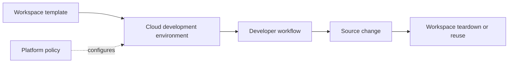

# Cloud Development Environments for Platform Engineers

*Weave Intelligence — Report*

## Agent guide

Examines cloud development environments as a platform capability for standardized, reproducible, and policy-controlled developer workspaces.
### Questions this chapter answers
- Why do cloud development environments matter to platform teams?
- How do CDEs standardize and secure developer workspaces?
- Which adoption and productivity considerations should platform engineers evaluate?
### Key points
- CDEs move environment setup into reusable platform definitions.
- Standard workspaces can improve consistency while centralizing security controls.
- Adoption should be evaluated through developer experience and workflow outcomes.

## Conceptual diagram

## Detailed source transcript

### Page 1
Cloud Development
	Environments (CDEs)
	for Platform Engineers
1   Cloud Development Environments (CDEs) for Platform Engineers   //
### Page 2
Table of contents
Executive summary                                                                         03
Why CDEs matter                                                                           04
	Developer productivity                                                                04
	Security concerns                                                                     05
	AI adoption in the enterprise                                                         06
What are CDEs (and what are they not)?                                                    07
Where do CDEs fit into your platform engineering initiative?                              09
	Real-world adoption and case studies                                                  10
	Analyst validation                                                                    10
The business case for CDEs                                                                11
	Why do enterprises adopt CDEs                                                         11
	ROI calculation                                                                       13
Conclusion                                                                                14
Resources                                                                                 15
2   Cloud Development Environments (CDEs) for Platform Engineers   // Table of contents        2
### Page 3
Executive summary
Today’s software engineering landscape                                         Though it is their impact on developer
is defined by powerful, intersecting trends:                                   productivity that primarily drives their adoption,
the rise of platform engineering as a                                          their ability to solve core organizational
strategic priority, the accelerating impact                                    challenges, dramatically reduce costs and
of AI-powered development, the growing                                         channel opportunities around AI and security
demands of cybersecurity and compliance,                                       will be a key driver of their adoption in the
and the ongoing pressure to boost developer                                    future. CDEs offer a vital opportunity to
productivity. These forces add complexity,                                     proactively strengthen security and compliance
but also open the door to immense gains for                                    posture, with Gartner predicting 40% of
organizations that can respond effectively.                                    organizations in regulated industries will
Cloud Development Environments (CDEs)                                          mandate CDES by 2027.
have emerged as a key enabler, due to their
intersection with all of these defining mega                                   At the same time, CDEs provide the foundation
trends, offering a practical way to turn these                                 required for responsible AI adoption, enabling
challenges into opportunities.                                                 the safe integration and scaling of AI code
	assistants and agents while providing
CDEs are preconfigured development                                             necessary compute resources like GPUs. CDEs
environments that automate, secure, and                                        provide isolated workspaces that prevent AI
standardize development for software                                           tools from accessing sensitive code on local
engineering teams in the cloud-native era.                                     machines, provide audit and compliance
They integrate with version control, tooling,                                  trails, and enable organizations to guardrail
and infrastructure to eliminate local setup,                                   which AI models and datasets that developers
accelerate onboarding, and standardize                                         can use. This allows development teams
workflows across the development lifecycle.                                    to safely experiment with AI within defined
	secure boundaries to ensure enterprise level
They are integral to the success of a large                                    governance while unlocking AI-powered
number of platform engineering initiatives.                                    productivity gains.
By providing consistent environments, CDEs
dramatically accelerate developer productivity                                 CDEs thus provide the opportunity to drive
and developer experience (DevEx).                                              measurable business impact across each of
	the defining trends of the current software
	engineering era.
3   Cloud Development Environments (CDEs) for Platform Engineers   // Executive summary
### Page 4
Why CDEs matter
Developer productivity
87% of engineering decision makers say                                         Traditional development setups heavily
developer productivity is a top priority. But                                  contribute to this friction. Environments differ
turning that priority into measurable gains                                    across teams and individual machines, leading
remains a persistent challenge. Developers                                     to inconsistency, frustration, and delays. This
often spend a disproportionate amount                                          variability makes it difficult to replicate issues or
of time on work unrelated to coding, with                                      share workflows, often resulting in the dreaded
estimates suggesting just 30-40% of their                                      “works on my machine” problems.
time is spent actually writing code. The rest
is lost to maintenance tasks, waiting on                                       These challenges weaken the developer's
builds, or troubleshooting environment issues.                                 inner loop, the critical rapid cycle of coding,
Bottlenecks like context switching, slow setup,                                testing, and iterating, as developers must
and dependency conflicts disrupt focus and                                     constantly troubleshoot inconsistent
kill momentum. While CI/CD workflows have                                      environments, manage access manually, and
matured, the local development loop remains                                    recover from configuration issues instead of
largely manual and inconsistent, dragging                                      staying focused on writing and shipping code.
down iteration speed. This fragmented DevEx                                    When this inner loop is slow and inconsistent,
can reduce engineering output by 20–50% and                                    innovation is stifled, feature velocity decreases,
is a major factor in team burnout and churn.                                   and time-to-market is extended.
4   Cloud Development Environments (CDEs) for Platform Engineers   // Why CDEs matter
### Page 5
CDEs offer a practical way to address these                                    issues. With consistent environments across
challenges. By providing a standardized,                                       teams, collaboration and debugging become
preconfigured workspace, they reduce the                                       easier and faster. Overall, CDEs create a more
time developers spend on setup, configuration,                                 stable foundation for development work,
and troubleshooting. This helps eliminate                                      helping developers focus more on writing
common issues like dependency conflicts                                        code and less on managing their tools.
and entirely removes “works on my machine”
Security concerns
The growing negative impact of unmanaged                                       center. While VDI solutions provide granular
local development machines becomes                                             access controls and prevent sensitive data
even more apparent when focusing on                                            from leaving the corporate network, they
cybersecurity. As cyber threats escalate                                       come with significant overhead in terms of
globally, with AI-powered attack scans                                         infrastructure management, licensing costs,
reaching 36,000 per second, and the                                            and performance limitations that can hinder
average cost of a data breach rising to \$4.88                                  developer productivity.
million, tech leaders increasingly recognize
cybersecurity as a strategic business focus.                                   CDEs represent a more targeted and efficient
When sensitive source code and credentials                                     evolution of this security approach. Rather than
are stored on individual laptops, organizations                                virtualizing entire desktop environments, CDEs
face heightened risks of exfiltration,                                         focus specifically on development workflows
misconfiguration, and noncompliance.                                           while delivering superior security outcomes.
These decentralized setups lack built-in                                       They enforce identity-based access, isolate
policy enforcement and often operate                                           secrets within each workspace, and eliminate
outside centralized oversight, contributing                                    the need to store source code locally.
to “shadow IT” and increasing the attack                                       Their ephemeral nature limits the impact of
surface massively.                                                             vulnerabilities by design, while built-in audit
	trails, centralized controls, and consistent
Organizations have traditionally turned to                                     policy enforcement create a secure-by-default
Virtual Desktop Infrastructure (VDI) to address                                development foundation.
these security concerns by centralizing
desktop environments within the data
5   Cloud Development Environments (CDEs) for Platform Engineers   // Why CDEs matter
### Page 6
AI adoption in the enterprise
The rapid advancement of AI, particularly in                                     mitigating risks like credential leakage or
areas such as code assistants, autonomous                                        unintended code changes. CDEs also provide
software agents, and large language                                              secure access to essential AI/ML resources
models (LLMs), is fundamentally reshaping                                        such as GPU-backed compute, approved
software development workflows. While                                            models, and governed datasets. They ensure
these technologies promise significant                                           consistent environments for AI engineers,
productivity gains and innovation, they also                                     bridging skill gaps and enabling reproducible
introduce complex infrastructure, security, and                                  workflows with full auditability of how AI is
governance challenges that today’s developer                                     used throughout development. Recognizing
environments are not equipped to handle.                                         these benefits, many organizations are already
	mandating secure CDEs as the foundation
When AI tools and agents operate on                                              for any internal AI experimentation.
unmanaged local machines, organizations
face the emergence of “shadow AI” or the                                         As established in a recent article in the
uncontrolled usage of AI tools and models                                        platform engineering community blog,
operating outside IT governance, similar                                         platform engineering and AI are symbiotically
to how “shadow IT” creates blind security                                        driving the future of software. CDEs operate
gaps today. Without centralized control, it’s                                    at this critical intersection, offering the
nearly impossible to enforce policies, audit                                     infrastructure needed to scale AI usage
usage, or monitor agent behavior. Supporting                                     securely and responsibly across an
AI workloads also requires access to GPU-                                        enterprise. They enable organizations to
backed compute, difficult and costly to                                          move beyond local experimentation toward
provision consistently across a fleet of                                         enterprise-grade deployments, with the
developer laptops.                                                               controls, compliance, and reliability required in
	regulated industries. By integrating CDEs into
Just as CDEs are foundational for secure                                         Internal Developer Platforms (IDPs), teams can
software development, they are a                                                 streamline every layerof the AI workflow, from
prerequisite for responsible AI adoption in                                      provisioning compute to using code assistants
the enterprise. Within a CDE, organizations                                      to deploying agents, within a governed,
can enforce access controls, isolate secrets,                                    auditable, and secure environment.
and implement guardrails for AI agent actions,
6   Cloud Development Environments (CDEs) for Platform Engineers   // Why CDEs matter
### Page 7
What are CDEs
(and what are they not)?
As established above, CDEs provide preconfigured, ready-to-use development environments
accessed on demand for human and AI collaboration. These environments are secure, consistent,
and equipped with the dependencies, SDKs, security policies, and tooling necessary for
software engineering teams in the cloud-native era. CDEs integrate deeply with version control
systems, developer tools, infrastructure, and CI/CD pipelines, standardizing workflows across the
development lifecycle.
It is crucial to distinguish CDEs from simpler or                                 Code or IntelliJ. Nor are CDEs just a wrapper
legacy approaches that they might resemble.                                       around VMs or containers. Although they
A CDE is emphatically not simply a cloud-hosted                                   utilize underlying infrastructure like VMs
IDE. While many CDE platforms offer                                               or containers, CDEs provide orchestration
browser-based code editors, they primarily                                        and integration capabilities that tie the
provide a full development environment running                                    environment into organizational workflows,
in the cloud that developers can connect to                                       policies, and security frameworks.
using their preferred local IDEs, such as VS
7   Cloud Development Environments (CDEs) for Platform Engineers   // What are CDEs (and what are they not)
### Page 8
Critically, CDEs are not simply general-purpose                                manual installations, inconsistent tooling,
Virtual Desktop Infrastructure (VDI) solutions.                                and frequent "works on my machine" issues
While VDI can provide some similar security                                    caused by dependency conflicts. While
benefits like preventing local code download,                                  virtualized or containerized environments
CDEs are specifically tailored for the software                                improved portability and isolation, they
development workflow, offering superior                                        often introduced their own complexities
performance, native IDE integration, support                                   for developers to manage at scale and
for specialized hardware like GPUs, and                                        could still suffer from performance or
granular access controls optimized for                                         integration challenges. CDEs move beyond
developers. They also eliminate the poor                                       these limitations by providing a consistent,
developer experience and latency often                                         preconfigured environment that is fully
associated with traditional VDI.                                               managed by the platform team, abstracting
	away the underlying complexity of
Comparing CDEs to traditional development                                      dependencies and infrastructure setup for
models highlights their unique advantages.                                     the developer.
Legacy local setups are characterized by
8   Cloud Development Environments (CDEs) for Platform Engineers   // What are CDEs (and what are they not)
### Page 9
Where do CDEs fit into your
platform engineering initiative?
CDEs serve as a foundational pillar and a critical developer-facing layer within modern platform
engineering initiatives. While Internal Developer Platforms (IDPs) typically provide a unified
interface for discovering and managing the broader developer ecosystem and "outer loop"
workflows, CDEs focus squarely on optimizing the developer's "inner loop", the core activities of
coding, testing, and iterating within the development environment itself.
By translating platform engineering principles directly into the workspace, CDEs give
platform teams a powerful lever for:
	Standardization and golden paths                                                Developer self-service
	Teams can define preconfigured,                                                 Engineers can provision ready-to-use
	policy-compliant environments that                                              workspaces on demand, eliminating
	promote best practices and reduce                                               delays and abstracting infrastructure
	cognitive load.                                                                 complexity.
	Reduced support burden                                                          The secure foundation for AI
	Centralized environment management                                              CDEs provide the controlled, auditable
	minimizes one-off tooling requests and                                          environment necessary for integrating
	support tickets, freeing platform teams to                                      AI-powered development tools while
	focus on scaling core capabilities.                                             maintaining data governance and
		preventing inadvertent exposure of
		proprietary code to external AI services.
Because they’re both highly visible and tightly scoped, CDEs are often a smart starting point
for Minimum Viable Platform (MVP) initiatives. They deliver fast time-to-value, enable secure
experimentation (including with AI), and offer a tangible improvement to developer experience,
making them a foundational building block in modern platform strategy.
9   Cloud Development Environments (CDEs) for Platform Engineers   // Where do CDEs fit into your platform engineering initiative?
### Page 10
Real-world adoption and case studies
Enterprises are deploying CDEs to achieve                                     cutting AWS costs by 90% (\$3M to \$300K)
measurable business outcomes and overcome                                     for developer environments by consolidating
long-standing developer pain points. Palantir,                                workspaces and automating VM shutdowns.
for example, dramatically accelerated
developers' onboarding time to new projects                                   Zooming into one specific case study, Slack,
from 15 days to just 1 hour. Across global                                    the cloud-based team communication platform,
financial services, a VP of Developer                                         proactively addressed the complexities of
Experience at a F500 investment bank                                          their local development workflow, which
reported that developers' time spent coding                                   involved installing dependencies and managing
increased from less than 5% to 20%, yielding                                  resource-intensive software across operating
a 224% ROI on labour costs alone. While                                       systems. Leveraging remote development
another successfully reduced project                                          environments on AWS EC2, Slack enabled
onboarding time to minutes and, crucially for                                 engineers to provision a fresh, isolated
security, centralised developer data off laptops                              environment on demand, ready within minutes.
onto their secure infrastructure, achieving                                   This move dramatically improved developer
over 90% adoption among developers. Plaid's                                   experience, standardised setups, eliminated
Developer Efficiency Team transitioned to a                                   local overhead, and allowed engineers to work
remote development environment backed by                                      on multiple branches concurrently. A particularly
standardized EC2 instances, addressing scaling                                impactful result was the reduction in onboarding
challenges and improving consistency across                                   time for new hires from approximately an hour
development workflows. Beyond finance,                                        to mere minutes. By early 2022, over 90% of
several Federal agencies eliminated source                                    Slack engineers had adopted this workflow,
code from thousands of decentralized laptops,                                 reporting improved productivity and reduced
significantly mitigating data exfiltration risks, and                         performance burden on local machines.
a manufacturing startup reported successfully
Analyst validation
At the same time, analyst validation                                          otherwise mature engineering organizations.
underscores the benefits of CDEs. Gartner                                     Their findings show that AI-augmented
pins CDEs in the Hype Cycle for Platform                                      workflows thrive in standardized, cloud-based
Engineering 2025, identifying them as                                         environments like CDEs, which help mitigate
a rapidly emerging solution for enabling                                      risks like credential leakage and untraceable
platform engineering, developer enablement,                                   model activity. Together, these insights confirm
and secure AI adoption. Meanwhile, the                                        what adopters have already proven: CDEs
DORA report highlights how traditional local                                  deliver tangible value across productivity,
development remains a bottleneck even in                                      security, and innovation.
1 0 Cloud Development Environments (CDEs) for Platform Engineers //   Where do CDEs fit into your platform engineering initiative?
### Page 11
The business case for CDEs
Turning the operational and security benefits of CDEs into a clear financial case is key to driving
strategic adoption and showing they’re more than just a developer tool, they’re a real investment
in business value. CDEs offer a clearly quantifiable economic rationale across multiple cost
categories, directly impacting the bottom line through enhanced productivity, infrastructure
optimization, and improved risk management.
Why do enterprises adopt CDEs                                                       Quantifiable benefits for CDEs are
	Regulated industries need a way to securely                                     most evident in developer productivity
	roll out AI.                                                                    and onboarding efficiency. Developers
		notoriously spend a large portion of
	Security is pushing for VDI, but it’s slowing                                   their time on environment setup and
	developers down.
		maintenance, not coding. CDEs mitigate this,
		potentially saving 10-20% of developer time
	Inconsistent environments lead to bugs,
	frustration, and delayed GTM.                                                   per week, or up to 10 hours. This reclaimed
		time translates directly into increased feature
		Onboarding new developers still takes days,                                    velocity and faster time-to-market. Further,
		or even weeks, and local hardware failures                                     onboarding new developers, mitigating local
		leave developers unable to access code.
			hardware failures, or enabling transitions
	Keeping dev environments consistent                                             between projects is dramatically accelerated.
	requires full-time effort.                                                      For organizations with significant hiring
		or internal mobility, the cost savings
	You need to guarantee code stays inside                                         from accelerated ramp-up are immense.
	secure infrastructure.
		Improved developer experience also boosts
		satisfaction and retention, reducing the
	Collaboration breaks down on complex,
	multi-service projects.                                                         high costs associated with employee churn.
		These gains flow directly into the developer
	You need to evaluate or deploy autonomous                                       productivity cost category.
	coding agents.
1 1 Cloud Development Environments (CDEs) for Platform Engineers //   The business case for CDEs
### Page 12
Forrester Opportunity Snapshot: A Custom Study Commissioned
By Humanitec, February 2023
Beyond direct developer efficiency, CDEs                                      and compliance readiness built into CDEs
drive tangible cost optimization in                                           reduce ongoing security and compliance costs.
infrastructure and IT support, alongside critical
savings in security and compliance. Ephemeral                                 When you add up the impact from saving
environments that automatically scale or shut                                 valuable developer time and speeding up
down based on usage significantly reduce                                      onboarding, to cutting infrastructure costs
cloud infrastructure waste and costs. This can                                and reducing security and AI-related risks,
lead to savings, such as a 90% reduction                                      the business case for CDEs is clear. They’re
in VM spend highlighted above. As                                             not just tools; they’re a strategic investment
established, CDEs also present a superior,                                    that helps teams move faster, stay secure,
developer-optimized alternative to expensive,                                 and build for the future. For any organization
general-purpose Virtual Desktop Infrastructure                                looking to boost engineering output, streamline
(VDI), potentially yielding a 50% reduction                                   operations, and tackle modern software
in VDI-related costs while improving user                                     challenges with confidence, CDEs are a
experience. Centralized controls, audit trails,                               clear strategic opportunity.
1 2 Cloud Development Environments (CDEs) for Platform Engineers //   The business case for CDEs
### Page 13
ROI calculation
The benefits of CDEs as highlighted in this report might be clear to see. However, it is challenging
to secure buy-in with decision makers without quantifiable measures. This can often be difficult
for many teams to articulate to leadership however, as teams might focus on technical language,
rather than the business narrative that might more effectively convince decision makers. Here is
an example of how you could convert technical language around developer productivity into a
business narrative when pitching a buy case for a CDE:
	01 Highlight the cost of troubleshooting time
		Let’s break down what it actually costs to lose 5 hours a week to setup
		issues or environment bugs. Developers are among the highest-paid
		employees, and if they’re only spending around 70% of their time coding,
		each hour of lost productivity ends up costing about \$80 (after factoring in
		benefits, taxes, and time off). That adds up to around \$1,500 per developer
		per month or \$1.8 million per year for a team of 100. And that’s not even
		counting the cost of delayed launches or missed revenue opportunities.
	02 Onboarding time is expensive
		As shown above, several real-world examples show that CDEs can
		reduce onboarding time from days or weeks to just hours. If your current
		onboarding process takes 10 days, it’s realistic to reduce that to just 2 or
		1. That’s a 60-hour time savings per hire. For a company onboarding 30
		developers annually, including hires, contractors, and team transfers, that
		adds up to over \$140,000 in lost time due to inefficient onboarding alone.
	03 The bigger picture
		When you zoom out, the combined impact is massive. A 100-person
		engineering org with 30 annual joiners could reclaim over 24,000
		hours a year by using a CDE. That’s the equivalent of a 19% increase in
		engineering capacity or roughly \$2 million in added value every year.
1 3 Cloud Development Environments (CDEs) for Platform Engineers //   The business case for CDEs
### Page 14
Conclusion
	CDEs are a foundational layer in modern                                  At the same time, CDEs create the secure
	software delivery, not just as a tool for                                and governable foundation needed to
	individual developers, but as strategic                                  adopt AI coding assistants and agents at
	infrastructure that aligns tightly with platform                         scale, while ensuring that sensitive code
	engineering, security and AI goals. By                                   and intellectual property remain within
	standardizing workspaces and abstracting                                 controlled infrastructure.
	away complexity, CDEs help organizations
	streamline the entire development lifecycle,                             As platform engineering matures into a
	unlocking measurable improvements                                        key business strategy, adopting CDEs
	in each of these defining mega trends.                                   becomes a clear strategic step toward
		building a scalable, secure, and future-ready
	Because they sit at the heart of the                                     engineering organization.
	developer’s “inner loop”, the day-to-day
	flow of writing, testing, and iterating, CDEs                            Want to get started? Join our free course:
	offer a unique opportunity to drive impact                               Cloud Development Environments for
	where it matters most. For platform teams,                               Platform Engineers, created alongside leading
	they translate core platform engineering                                 CDE providers Gitpod and Coder to cover
	principles into tangible outcomes: enabling                              everything from CDE fundamentals to
	developer self-service, enforcing golden                                 real-world case studies and common pitfalls
	paths by default, and dramatically reducing                              to avoid.
	the operational burden of managing
	local environments.
11
	44   Cloud Development Environments (CDEs) for Platform Engineers   //
### Page 15
Resources
This whitepaper draws upon extensive research, expert insights, and enterprise case studies.
For more information on Cloud Development Environments and platform engineering best
practices, explore the following resources:
Anderson, Tim. Why Stripe embraced remote coding – and fixed Ruby with Sorbet. DevClass.
Badmaev, Andrey. How to build a business case for purchasing a cloud development
environment. Gitpod Blog.
Bichard, Lou. Why CDEs should be prioritized before IDPs. Gitpod Blog.
Bichard, Lou. Make developer experience in regulated industries fun again. Gitpod Blog.
Coder. Palantir's Journey to the Cloud: Leveraging Coder for Improved Development. Coder
Success Stories.
Coder. Cloud Development Environment Maturity Model. Coder Reports.
DeBellis, Derek, et al. Accelerate State of DevOps 2024: A Decade with DORA. Google Cloud
Galante, Luca. AI and Platform Engineering. Platform Engineering Blog.
Gartner. Hype Cycle for Platform Engineering, 2024.
Gartner. Market Guide for Cloud Development Environments.
Gartner. A Software Engineering Leader's Guide to Improving Developer Experience.
George, Sylvestor. Remote Development at Slack. Slack Engineering Blog.
Forrester Opportunity Snapshot: A Custom Study Commissioned By Humanitec.
FortiGuard Labs. 2025 Global Threat Landscape Report. Fortinet.
IBM Security and Ponemon Institute. Cost of a Data Breach Report 2024. IBM.
Kelly, Don. The Journey to Cloud Development: How Shopify Went All-in on Spin. Shopify
Engineering Blog.
1 5 Cloud Development Environments (CDEs) for Platform Engineers //   Resources
### Page 16
Moyal, Talia. Driving platform adoption through development environments. Gitpod Blog.
Moyal, Talia. The AI security gap: a CTOs & CISOs guide to making their first AI investment. Gitpod
Blog.
Paquette, Marc. What Makes a Great CDE for Enterprise Users 2025. Coder Blog.
Platform Engineering Community. State of Platform Engineering Report, Volume 3.
Potter, Ben. Building the IDE Golden Path. PlatformCon 2024 Talk. Coder.
Puri, Arjun; Dunne, Jarrod; & Dashevskii, Oleg. Scaling Plaid's internal developer experience with a
remote development environment. Plaid Engineering Blog.
Stack Overflow. Stack Overflow Developer Survey 2023. Stack Overflow.
Sundaram, Senthil. Supercharging Remote Development with the Cloud. Rippling
Engineering Blog.
Whiteley, Rob. The AI-Native Developer Stack: Rethinking Code From Ideation to Production in
Minutes. Coder Blog.
1 6 Cloud Development Environments (CDEs) for Platform Engineers //   Resources
## Code map
- No matching code repository has been identified for this book.
## Source note
This is the complete generated chapter transcript. Source identity and status are recorded in the database properties.
