# Cloud Native Anti-Patterns

*Gerald Bachlmayr, Aiden Ziegelaar, Alan Blockley, Bojan Zivic — Book*
## Chapter 1: Benefits of Cloud Native and Common Misunderstandings

**Questions this chapter answers:**
- What does this chapter explain about Chapter 1: Benefits of Cloud Native and Common Misunderstandings?
- What does this chapter explain about The evolution of cloud native?
- What does this chapter explain about The foundations for ML, AI, and cross-functional teams?

**Key points:**
- Source section: Chapter 1: Benefits of Cloud Native and Common Misunderstandings.
- Source section: The evolution of cloud native.
- Source section: The foundations for ML, AI, and cross-functional teams.
- Source section: The age of virtualization.

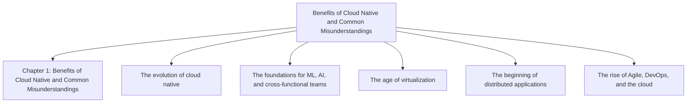

## Chapter 2: The Cost of Unclear Objectives and Strategy

**Questions this chapter answers:**
- What does this chapter explain about Chapter 2: The Cost of Unclear Objectives and Strategy?
- What does this chapter explain about Lack of clear objectives and strategy?
- What does this chapter explain about Common anti-patterns?

**Key points:**
- Source section: Chapter 2: The Cost of Unclear Objectives and Strategy.
- Source section: Lack of clear objectives and strategy.
- Source section: Common anti-patterns.
- Source section: Understanding the business goals and our current state.

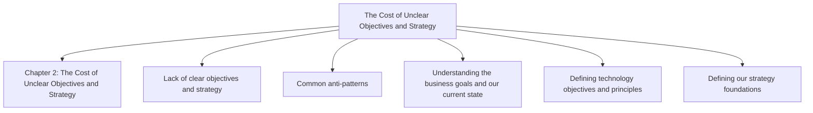

## Chapter 3: Rethinking Governance in a Cloud Native Paradigm

**Questions this chapter answers:**
- What does this chapter explain about Chapter 3: Rethinking Governance in a Cloud Native Paradigm?
- What does this chapter explain about Learning will happen miraculously?
- What does this chapter explain about The cost of ignoring learning?

**Key points:**
- Source section: Chapter 3: Rethinking Governance in a Cloud Native Paradigm.
- Source section: Learning will happen miraculously.
- Source section: The cost of ignoring learning.
- Source section: Addressing the anti-pattern.

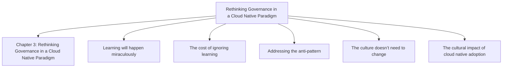

## Chapter 4: FinOps – How to Avoid a Bill Shock

**Questions this chapter answers:**
- What does this chapter explain about Chapter 4: FinOps – How to Avoid a Bill Shock?
- What does this chapter explain about Missing out on the power of good tagging practices?
- What does this chapter explain about Common anti-patterns?

**Key points:**
- Source section: Chapter 4: FinOps – How to Avoid a Bill Shock.
- Source section: Missing out on the power of good tagging practices.
- Source section: Common anti-patterns.
- Source section: Consequences of poor tagging practices.

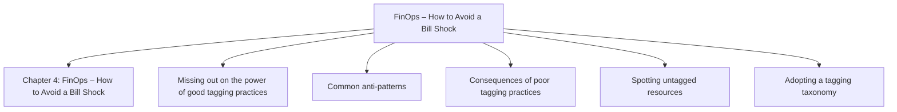

## Chapter 5: Delivering Rapidly and Continuously Without Compromising Security

**Questions this chapter answers:**
- What does this chapter explain about Chapter 5: Delivering Rapidly and Continuously Without Compromising Security?
- What does this chapter explain about Underestimating the cultural impact?
- What does this chapter explain about The siloed model – a long road to production?

**Key points:**
- Source section: Chapter 5: Delivering Rapidly and Continuously Without Compromising Security.
- Source section: Underestimating the cultural impact.
- Source section: The siloed model – a long road to production.
- Source section: DORA – measuring the road.

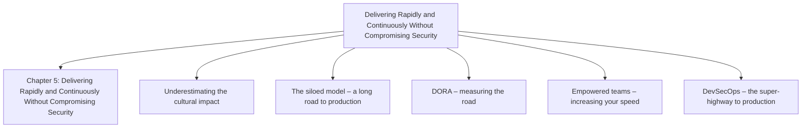

## Chapter 6: How to Meet Your Security and Compliance Goals

**Questions this chapter answers:**
- What does this chapter explain about Chapter 6: How to Meet Your Security and Compliance Goals?
- What does this chapter explain about How to Manage Permissions Without Over-Privilege?
- What does this chapter explain about Securing High-Privilege Accounts?

**Key points:**
- Source section: Chapter 6: How to Meet Your Security and Compliance Goals.
- Source section: How to Manage Permissions Without Over-Privilege.
- Source section: Securing High-Privilege Accounts.
- Source section: Over Privileged Users and Services.

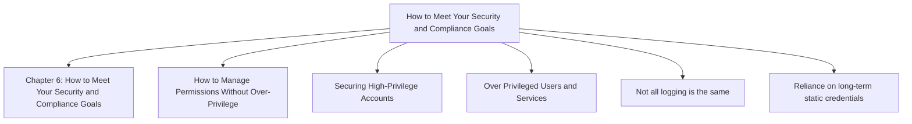

## Chapter 7: Expressing Your Business Goals in Application Code

**Questions this chapter answers:**
- What does this chapter explain about Chapter 7: Expressing Your Business Goals in Application Code?
- What does this chapter explain about Lift and shift?
- What does this chapter explain about Building in the cloud versus building for the cloud?

**Key points:**
- Source section: Chapter 7: Expressing Your Business Goals in Application Code.
- Source section: Lift and shift.
- Source section: Building in the cloud versus building for the cloud.
- Source section: The myth of “We’ll build it right this time”.

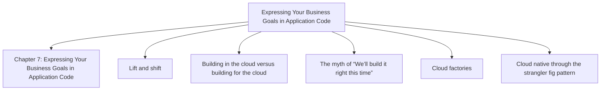

## Chapter 8: Don’t Get Lost in the Data Jungle

**Questions this chapter answers:**
- What does this chapter explain about Chapter 8: Don’t Get Lost in the Data Jungle?
- What does this chapter explain about Picking the wrong database or storage?
- What does this chapter explain about Framing the conversation?

**Key points:**
- Source section: Chapter 8: Don’t Get Lost in the Data Jungle.
- Source section: Picking the wrong database or storage.
- Source section: Framing the conversation.
- Source section: The right database for the right purpose.

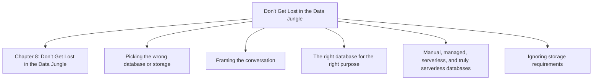

## Chapter 9: Connecting It All

**Questions this chapter answers:**
- What does this chapter explain about Chapter 9: Connecting It All?
- What does this chapter explain about Ignoring latency and bandwidth?
- What does this chapter explain about Cloud native latency?

**Key points:**
- Source section: Chapter 9: Connecting It All.
- Source section: Ignoring latency and bandwidth.
- Source section: Cloud native latency.
- Source section: Cloud native bandwidth.

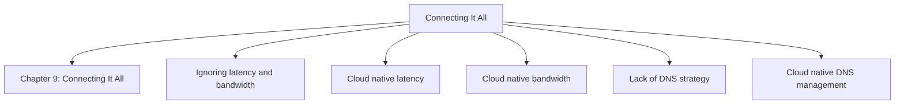

## Chapter 10: Observing Our Architecture

**Questions this chapter answers:**
- What does this chapter explain about Chapter 10: Observing Our Architecture?
- What does this chapter explain about Let’s Capture Everything in the Log Aggregator?
- What does this chapter explain about Why Indiscriminate Logging Fails?

**Key points:**
- Source section: Chapter 10: Observing Our Architecture.
- Source section: Let’s Capture Everything in the Log Aggregator.
- Source section: Why Indiscriminate Logging Fails.
- Source section: Smart Logging: A More Effective Approach.

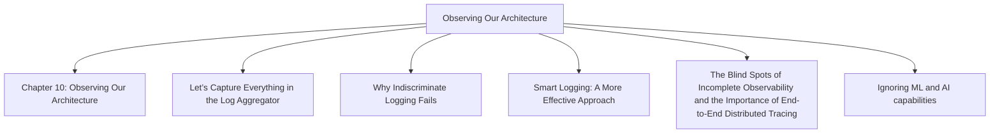

## Chapter 11: Running It Without Breaking It

**Questions this chapter answers:**
- What does this chapter explain about Chapter 11: Running It Without Breaking It?
- What does this chapter explain about Assuming the Cloud is Just ‘Business as Usual’?
- What does this chapter explain about Understanding Cloud Complexity?

**Key points:**
- Source section: Chapter 11: Running It Without Breaking It.
- Source section: Assuming the Cloud is Just ‘Business as Usual’.
- Source section: Understanding Cloud Complexity.
- Source section: Training and Upskilling.

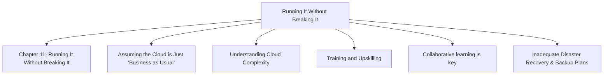

## Chapter 12: Migrating from Legacy Systems to Cloud Native Solutions

**Questions this chapter answers:**
- What does this chapter explain about Chapter 12: Migrating from Legacy Systems to Cloud Native Solutions?
- What does this chapter explain about Planning for an effective migration?
- What does this chapter explain about Jumping in Without a Plan: Why planning is important?

**Key points:**
- Source section: Chapter 12: Migrating from Legacy Systems to Cloud Native Solutions.
- Source section: Planning for an effective migration.
- Source section: Jumping in Without a Plan: Why planning is important.
- Source section: Developing a Clear Migration Strategy.

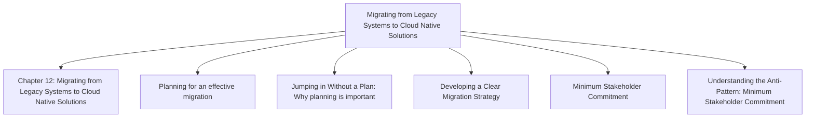

## Chapter 13: How Do You Know It All Works?

**Questions this chapter answers:**
- What does this chapter explain about Chapter 13: How Do You Know It All Works??
- What does this chapter explain about General testing anti-patterns?
- What does this chapter explain about Tests that have never failed?

**Key points:**
- Source section: Chapter 13: How Do You Know It All Works?.
- Source section: General testing anti-patterns.
- Source section: Tests that have never failed.
- Source section: Coverage badge tests.

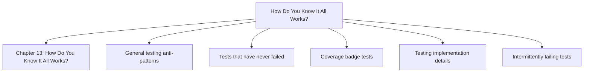

## Chapter 14: How to Get Started with Your Cloud Native Improvement Journey

**Questions this chapter answers:**
- What does this chapter explain about Chapter 14: How to Get Started with Your Cloud Native Improvement Journey?
- What does this chapter explain about Identifying anti-patterns?
- What does this chapter explain about General indicators?

**Key points:**
- Source section: Chapter 14: How to Get Started with Your Cloud Native Improvement Journey.
- Source section: Identifying anti-patterns.
- Source section: General indicators.
- Source section: DevSecOps culture and automation.

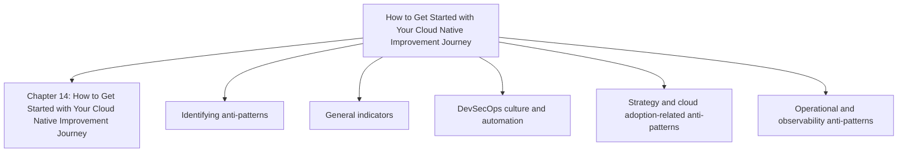

## Chapter 15: Transitioning to Cloud Native Good Habits

**Questions this chapter answers:**
- What does this chapter explain about Chapter 15: Transitioning to Cloud Native Good Habits?
- What does this chapter explain about Stakeholder alignment?
- What does this chapter explain about Stakeholder management considerations?

**Key points:**
- Source section: Chapter 15: Transitioning to Cloud Native Good Habits.
- Source section: Stakeholder alignment.
- Source section: Stakeholder management considerations.
- Source section: Common challenges in stakeholder alignment.

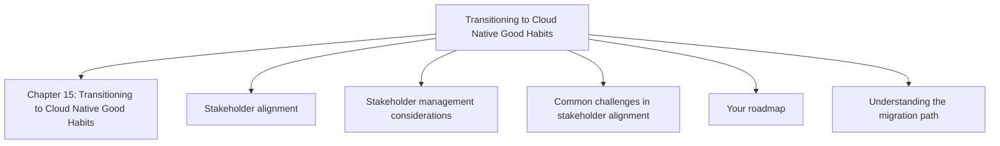

## Chapter 16: Unlock Your Exclusive Benefits

**Questions this chapter answers:**
- What does this chapter explain about Chapter 16: Unlock Your Exclusive Benefits?
- What does this chapter explain about Unlock this Book’s Free Benefits in 3 Easy Steps?
- What does this chapter explain about Step 1?

**Key points:**
- Source section: Chapter 16: Unlock Your Exclusive Benefits.
- Source section: Unlock this Book’s Free Benefits in 3 Easy Steps.
- Source section: Step 1.

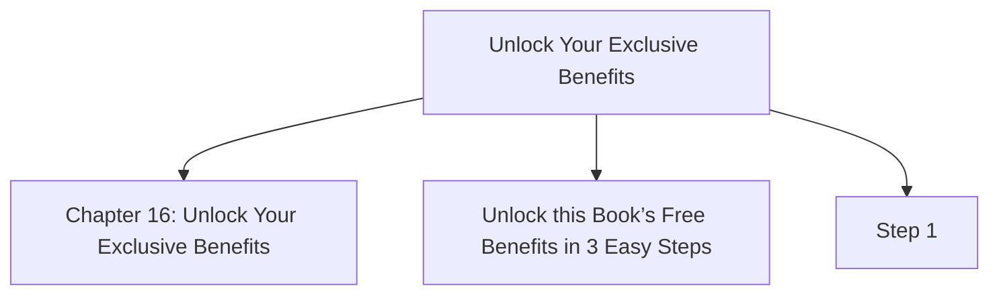
