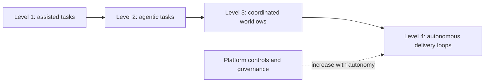

# The Four Levels of Agentic Software Development in the Enterprise

*Weave Intelligence — Report*

## Agent guide

Organizes enterprise agentic software development into four increasing levels of workflow scope and autonomy, with corresponding platform and governance needs.
### Questions this chapter answers
- What distinguishes the four levels of agentic software development?
- How do autonomy, workflow scope, and risk change between levels?
- Which platform and governance capabilities support progression?
### Key points
- Agentic adoption progresses from assistance toward broader workflow autonomy.
- Each level expands both potential leverage and operational risk.
- Platform controls, evaluation, and governance must mature with agent autonomy.

## Conceptual diagram

## Detailed source transcript

### Page 1
The four levels of agentic
software development in
the enterprise
WEAVE INTELLIGENCE PRESENTS
THE FOUR LEVELS OF AGENTIC SOFTWARE DEVELOPMENT IN THE ENTERPRISE
PUBLISHED IN 2026
	© 2026 WEAVE INTELLIGENCE
	ALL RIGHTS RESERVED. UNAUTHORIZED REPRODUCTION PROHIBITED.
		THE FOUR LEVELS OF AGENTIC SOFTWARE DEVELOPMENT IN THE ENTERPRISE   1
### Page 2
The four levels of agentic software
development in the enterprise
Table of contents
Executive summary                                                 03     Changes in the feature development                           39
	value stream (Level 4)
Introduction                                                      05
	Path change level by level                                   43
From assistance                                                   07
	Outlook on our research                                      47
to orchestration
	References                                                   48
The four levels of agentic                                        14
	About the authors                                            49
software development                                                                                                                  51
	About Weave Intelligence
No level is obtainable without an                                 16
Agentic Development Platform (ADP)
Level 0: Paths in software                                        18
development today
Level 1: Human in the loop                                        19
	Changes in the feature development                              19
	value stream (Level 1)
Level 2: Humans on the loop                                       22
	Changes in the feature development                              22
	value stream (Level 2)
Level 3: Humans as orchestrators                                  30
	Changes in the feature development                              30
	value stream (Level 3)
Level 4: Fully autonomous (outlook)                               36
	What Level 4 unlocks                                            37
		© 2026 WEAVE INTELLIGENCE
		ALL RIGHTS RESERVED. UNAUTHORIZED REPRODUCTION PROHIBITED.
			THE FOUR LEVELS OF AGENTIC SOFTWARE DEVELOPMENT IN THE ENTERPRISE   2
### Page 3
Executive summary
Software engineering is entering a throughput                                     intelligence at scale. To achieve this, the
race where output is no longer driven by                                          whitepaper details the necessary transition
human keystrokes. As the role shifts from                                         from traditional Internal Developer Platforms
writing code to overseeing agents, enterprise                                     (IDPs) to Agentic Development Platforms
engineering organizations are encountering                                        (ADPs). An ADP is engineered to harness
a new operational reality. The bottleneck isn’t                                   AI intelligence safely by deeply integrating
developer capacity anymore; it’s the quality of                                   probabilistic systems (foundation models and
the platform, and how safely and effectively it                                   coding agents) with deterministic systems
can work with AI.                                                                 (CI/CD pipelines, policy enforcement, and
	ephemeral environments).
This whitepaper explores that shift and
what it means in practice. It outlines how                                        For engineering leaders navigating this shift,
organizations will need to rethink production                                     this document provides a roadmap and
systems design to stay competitive. Access                                        defines the four levels of agentic software
to more powerful AI models is quickly                                             development. These levels chart the maturity
becoming a commodity, with the real                                               of an organization’s platform, defined by the
differentiator being how well an organization                                     changing nature of human involvement across
can manage and govern probabilistic                                               the feature development value stream:
	THE FOUR LEVELS OF AGENTIC SOFTWARE DEVELOPMENT IN THE ENTERPRISE
	LEVEL 0                   Human is the loop                                   The baseline state. Human developers
		manually write code on a functional IDP with
		no agentic capabilities.
	LEVEL 1                   Human in the loop                                   Agents act as assistants inside the development
		environment via prompt-driven code generation
		and context retrieval. The human developer
		remains the primary execution engine.
	LEVEL 2                   Human on the loop                                   Agents become active, parallel participants in the
		value stream. A new path emerges to dispatch
		work to agents, which generate pull requests
		independently. Crucially, validation transforms
		from a human-driven gate into an industrial
		feedback loop, where agents execute repeatedly
		until the platform’s deterministic checks pass.
		© 2026 WEAVE INTELLIGENCE
		ALL RIGHTS RESERVED. UNAUTHORIZED REPRODUCTION PROHIBITED.
			THE FOUR LEVELS OF AGENTIC SOFTWARE DEVELOPMENT IN THE ENTERPRISE   3
### Page 4
LEVEL 3                   Humans as orchestrators                  The platform begins to operate as a continuous
	background execution layer. Agents respond to
	system signals (such as anomalies or dependency
	updates) without explicit human initiation.
	Human review becomes exception-based,
	and promotion decisions for low-risk changes
	become rule-based.
	LEVEL 4                   Fully autonomous                         The production system becomes partially
		self-adjusting. Agents continuously monitor
		the environment and autonomously initiate,
		implement, validate, and promote changes in
		response to telemetry within predefined guardrails.
The era of human-in-the-loop software development is a temporary stepping stone. The
organizations that succeed in the next decade will be those that evolve their deterministic
platform layers and allow agents to work safely. This whitepaper provides the blueprint for
building the industrial feedback loops needed to safely unleash agentic software development
in the enterprise.
	© 2026 WEAVE INTELLIGENCE
	ALL RIGHTS RESERVED. UNAUTHORIZED REPRODUCTION PROHIBITED.
		THE FOUR LEVELS OF AGENTIC SOFTWARE DEVELOPMENT IN THE ENTERPRISE   4
### Page 5
Introduction
Over the past few months, our research                                 manually codes, reviews diffs line by line, and
has revealed two distinct types of platform                            incrementally advances features, is dissolving.
engineers. Those in denial over the rise                               Not because software disappears, but
of agents in software development, and                                 because human keystrokes are no longer the
those already deploying them and realizing                             primary production mechanism.
breathtaking gains in productivity.
	In other words, the bottleneck is now the
We’re convinced that we are at the forefront                           platform’s quality and its interaction with
of the biggest transformation the world of                             AI models.
software engineering has seen. At a scale
far greater than the rise of cloud computing.                          If your competitors can orchestrate ten
The traditional job of the software engineer                           agents in parallel while you still review every
has ceased to exist since Anthropic launched                           line manually, they’re not ten percent faster.
Opus 4.5 at the end of November 2025, and                              They move on a different curve, and that
is now shifting from writing software to                               curve compounds. What changes is the role
overseeing agents.                                                     of coding. What doesn’t change is the need
	for a platform production system. And the
	role and job profile of the platform engineer
	THE REAL BOTTLENECK                                                  become drastically more important.
	Access to powerful AI models is
	becoming a commodity. The real                                       We acknowledge the existence of critical
	differentiator is no longer how fast                                 perspectives questioning the scalability of
	we can write code, but how well an                                   AI-first software development workflows
	organization can manage and govern                                   within an enterprise context. Key concerns
	probabilistic intelligence at scale.                                 often revolve around security and control,
	The bottleneck has shifted from                                      the maintainability of an auto-generated
	developer capacity to the quality and                                codebase due to potential hallucinations,
	deterministic fabric of the platform.                                 and the inherent risk of spiraling token costs.
		Yet we currently see neither technical nor
We are entering a throughput race. Contrary                            structural reasons why this shouldn’t be
to common belief, this isn’t a race to “adopt                          solved, and in many organizations,
the latest AI model”, that’s a given commodity.                        agent-first development is already the
It’s a race to multiply software output through                        predominant method. AI on its own is not
parallelizing agents in software development,                          the answer to those concerns. But when
which is only possible if the platform allows                          we analyzed failed AI initiatives in
them to act quickly and safely.                                        organizations, in the majority of cases, the
	cause wasn’t the models. It was the provided
In this race, the traditional job description of                       guardrails and the platform’s deterministic
the software developer as the person who                               fabric that failed to provide checks and
	© 2026 WEAVE INTELLIGENCE
	ALL RIGHTS RESERVED. UNAUTHORIZED REPRODUCTION PROHIBITED.
		INTRODUCTION
		THE FOUR LEVELS OF AGENTIC SOFTWARE DEVELOPMENT IN THE ENTERPRISE   5
### Page 6
balances during execution.
	WHY AI INITIATIVES FAIL
	In a majority of failed AI initiatives,
	the cause wasn’t the models themselves.
	It was the failure of the platform’s
	deterministic fabric to provide the
	necessary guardrails, checks, and
	balances during execution.
Organizations that don’t go all in on agentic
development and don’t radically change their
underlying platform will be caught in a
self-confirmation loop. They will simply layer
AI on top and see all the downsides with little
benefit. They then conclude “this isn’t for
me,” reduce their effort, and ultimately fall
significantly behind.
In this research, we propose a four-level
framework for agentic development based
on our observations from working with
software engineering teams worldwide..
Those levels are differentiated by the degree
of human involvement and range from level
zero, with humans as the loop (“traditional”
software development on a modern
Internal Developer Platform (IDP)), to fully
autonomous agents that ship software in
response to environmental changes.
	© 2026 WEAVE INTELLIGENCE
	ALL RIGHTS RESERVED. UNAUTHORIZED REPRODUCTION PROHIBITED.
		THE FOUR LEVELS OF AGENTIC SOFTWARE DEVELOPMENT IN THE ENTERPRISE   6
### Page 7
From assistance
to orchestration
	THE FOUR LEVELS OF AGENTIC SOFTWARE DEVELOPMENT IN THE ENTERPRISE
	© 2026 WEAVE INTELLIGENCE
	ALL RIGHTS RESERVED. UNAUTHORIZED REPRODUCTION PROHIBITED.
		THE FOUR LEVELS OF AGENTIC SOFTWARE DEVELOPMENT IN THE ENTERPRISE   7
### Page 8
From assistance
to orchestration
AI moves into software development in waves,                           software engineering tasks, has risen from
marked by both the technical advancement                               near-zero in 2023 to above 60% for leading
of models and organizational change to                                 models as of early 2026, with no sign of
optimally embed the technology into teams’                             deceleration.
workflows. This is usually characterized by a
lag between technological advancement and                              Yet this, of course, highlights the need for
organizational adoption.                                               policy-checking mechanisms to catch those
	errors and return them to the agent with
It’s worth noting that organizations are at very                       a description of what to improve. These
different stages of adoption. While some of                            agentic improvement loops between several
you may just be dipping your toes into your                            models or models and deterministic policy
first models, others are already working with                          mechanisms will be the cornerstones of
highly parallelized agents tackling different                          getting platforms
tasks simultaneously.                                                  agent-ready.
Yet if you look more closely, the first                                This transition from using AI as assistance to
experiment usually starts by augmenting                                actually letting agents “do the work” creates
the human software development flow with                               friction. In early 2025, some teams saw a 19%
Large Language Models (LLMs) assisted                                  slowdown due to AI noise. But by early 2026,
autocomplete, inline assistance, faster search,                        experienced developers who shifted to a
and well-defined tasks. Some teams do see                              long-horizon agentic workflows reported 18%
minor productivity enhancements, but they                              to 38% speedups 2.
are negligible at scale.
The next level of applying AI is handing tasks
off to agents. The developer describes the
target state, and a specialized agent acts and
	88%
	of firms experiment with AI, only 5.5%
delivers results back to the human. Once
	translate that into a significant impact on
this works stably with a single agent, the
	Earnings Before Interest and Taxes (EBIT)
next step is usually to coordinate teams of
agents operating in parallel, reasoning across
separate context windows, and executing                                At the macro level, the pattern is sharper,
multi-step workflows autonomously 1. While                             underscoring the urgency for enterprises
agents do not always return accurate results,                          to embed agentic AI into the very fabric of
performance on SWE-bench Verified, the                                 software development. McKinsey reports that
industry standard benchmark for autonomous                             while 88% of firms experiment with AI, only
	© 2026 WEAVE INTELLIGENCE
	ALL RIGHTS RESERVED. UNAUTHORIZED REPRODUCTION PROHIBITED.
		THE FOUR LEVELS OF AGENTIC SOFTWARE DEVELOPMENT IN THE ENTERPRISE   8
### Page 9
5.5% translate that into a significant impact                         While all of this is ongoing, we’re aware of
on Earnings Before Interest and Taxes (EBIT).                         at least a handful of organizations already
High performers are five times more likely to                         working on fully autonomous software
make structural AI investments3.                                      development. Almost like high-frequency
	trading, the agents are watching customer
Many organizations understand that this                               interactions, feedback, and environmental
race is happening at breakneck speed.                                 changes, and proactively updating or adding
Based on our conversations with enterprises,                          features to the software.
we predict that by the end of 2026, over
50% of enterprise software teams with a                               From all the interviews and conversations
platform engineering team will have begun                             we’ve had over the last two years, we identified
remodeling their platforms to support                                 four levels of agentic development that help
agent-first development.                                              software teams understand where they are
	today and what needs to change to reach the
	next level. We’ll complement this research
	By the end of 2026, over                                            over the next few months with hands-on
	50% of enterprise platform                                          guides for transitioning from one level to
		the next from an architectural and change
	teams will be architecting for                                      management perspective.
	an agent-first future.
		© 2026 WEAVE INTELLIGENCE
		ALL RIGHTS RESERVED. UNAUTHORIZED REPRODUCTION PROHIBITED.
			THE FOUR LEVELS OF AGENTIC SOFTWARE DEVELOPMENT IN THE ENTERPRISE   9
### Page 10
The four levels
of agentic software
development
	THE FOUR LEVELS OF AGENTIC SOFTWARE DEVELOPMENT IN THE ENTERPRISE
	© 2026 WEAVE INTELLIGENCE
	ALL RIGHTS RESERVED. UNAUTHORIZED REPRODUCTION PROHIBITED.
		THE FOUR LEVELS OF AGENTIC SOFTWARE DEVELOPMENT IN THE ENTERPRISE   10
### Page 11
The four levels of agentic
software development
As organizations climb the ladder and                                that supports execution, deployment,
mature in their agentic coding practices,                            and testing. Gains are linear; human
the role of the human changes. When we                               development bandwidth is the constraint.
propose the levels of agentic development,                           If your organization doesn’t yet have a
we differentiate them depending on the                               functioning IDP, the most important first step
human involvement.                                                   is building the deterministic foundation that
	standardizes paths for delivery, deployment,
At level zero, the human is the loop. This                           and observation. Rather than a prerequisite to
base level is not counted among the four                             thinking about agentic development, this is
levels of agentic software development.                              the same work, seen through a
Software development at this point is the                            different lens. The paths you build today for
interplay between a human writing code                               human developers are the same paths that
and a deterministically functioning platform                         agents will eventually execute.
	THE FOUR LEVELS OF AGENTIC SOFTWARE DEVELOPMENT
		Human                   Agent
	Figure 1 Levels of human involvement in the software development lifecycle
		© 2026 WEAVE INTELLIGENCE
		ALL RIGHTS RESERVED. UNAUTHORIZED REPRODUCTION PROHIBITED.
			THE FOUR LEVELS OF AGENTIC SOFTWARE DEVELOPMENT IN THE ENTERPRISE   11
### Page 12
At the next (and first) level, the human is                        token economics. The organization begins
in the loop. Agents suggest, yet humans                            to operate a background execution layer.
approve line by line. The developer                                There is already a surprising number of
remains the execution engine. Gains                                organizations in between level two and
are still linear but higher, already in the                        three — or even fully on level three, at least
1.x gain region. It’s still output restricted                      for their frontend estate. This situation is
because human review bandwidth remains                             far from a daydream.
the constraint.
	And then there is a fourth level.
The most drastic change is likely the
transition between the first and second                            At this level, the system is fully
levels. Humans increasingly move from                              autonomous for defined classes of work.
being in the loop to only being on the                             Agents monitor external signals (customer
loop. This is, of course, a continuum. At                          feedback, telemetry, cost anomalies,
first, there are still many manual validation                      security findings) and initiate new
flows and code reviews before this is fully                        paths autonomously within predefined
automated. But agents generate pull                                guardrails. They open tickets, propose
requests in parallel, and deterministic                            changes, remediate issues, and adapt
systems validate them. Humans still                                configurations without explicit human
“trigger the change” and send agents off                           prompting. Humans define constraints,
to do things. They also verify behavior                            strategic direction, and escalation
rather than inspect every diff. Throughput                         boundaries. Agents operate continuously
increases because multiple paths advance                           inside that envelope. At this point, the
simultaneously, so the bottleneck shifts                           traditional idea of software development
from typing speed to validation quality.                           collapses, and the agents are taking
	over the entire chain. What remains is
At the third level, the human becomes the                          the platform and with it the platform
orchestrator of the loop. Agents execute                           engineering team.
long-running paths in the background,
verification is largely automated, and                             At this level, the production system
human review becomes exception-                                    becomes partially self-adjusting. The
based. The constraint shifts from review                           productivity curve bends upward at
bandwidth to architectural maturity and                            each step.
	© 2026 WEAVE INTELLIGENCE
	ALL RIGHTS RESERVED. UNAUTHORIZED REPRODUCTION PROHIBITED.
		THE FOUR LEVELS OF AGENTIC SOFTWARE DEVELOPMENT IN THE ENTERPRISE   12
### Page 13
At this level, the production system becomes partially self-adjusting. The productivity curve
bends upward at each step.
	Figure 2 Output capacity by level of human involvement
Level one improves efficiency, level two multiplies throughput, level three increases execution
capacity, and level four introduces autonomous adaptation.
The optimization constraint becomes clear: the lower you can safely reduce human
intervention, the higher the output capacity. But safety depends entirely on the quality of the
underlying platform. The impact on productivity increases by level. While we have anecdotal
insights into how much this uptake can be, we lack reliable data.
	© 2026 WEAVE INTELLIGENCE
	ALL RIGHTS RESERVED. UNAUTHORIZED REPRODUCTION PROHIBITED.
		THE FOUR LEVELS OF AGENTIC SOFTWARE DEVELOPMENT IN THE ENTERPRISE   13
### Page 14
No level is obtainable
without an Agentic Development
Platform (ADP)
It’s tempting to think this is a model race, but                       These components reason, generalize, and
it is not. Models are becoming a commodity                             improve with context. And while they are very
and are already at a level similar to human                            powerful, they are not predictable.
coding capabilities with continuous
incremental gains. Capability is converging.                               On the other side sit the
The differentiator is not coding intelligence. It                          deterministic systems:
is the production system that harnesses the
	ŗ Platform orchestration that
intelligence and provides checks and balances
	ensures safe creation and update of
to keep it safe and ensure predictable outputs.
	infrastructure components
Where today Internal Developer Platforms                                    ŗ Explicit capability boundaries and
(IDP) help humans ship software predictably                                     stable APIs
and at scale, agents require an advanced                                    ŗ CI/CD pipelines with reproducible
platform we call the Agentic Development                                        execution
Platform (ADP).
	ŗ Ephemeral environments for isolation
		and verification
An IDP standardizes paths for humans
following platform-as-a-product principles;                                 ŗ Policy enforcement mechanisms
an ADP makes those paths executable by
	ŗ Identity and Role Based Access Control
agents at scale and eventually allows agents
	(RBAC) management
to initiate them autonomously. To enable this,
the architecture must integrate two domains                                 ŗ State management
that operate under different logics.
	ŗ Ontology or semantic access layers
		over proprietary data
	On one side sit the probabilistic systems:
		ŗ Dependency and license verification
	ŗ Foundation models
		ŗ Observability and audit trails
	ŗ Coding agents
	ŗ Multi-agent coordination frameworks
		How advanced an ADP needs to be depends
	ŗ Model-evaluating patterns                                         on the level of agentic development you’re
		aiming for. The architectural design will go
	ŗ Behavioral evaluation layers
		through a transition.
		© 2026 WEAVE INTELLIGENCE
		ALL RIGHTS RESERVED. UNAUTHORIZED REPRODUCTION PROHIBITED.
			THE FOUR LEVELS OF AGENTIC SOFTWARE DEVELOPMENT IN THE ENTERPRISE   14
### Page 15
We’ve published iterations on the reference                          to interact with the platform to achieve a
architecture for IDPs over the last few years,                       specific outcome within a defined value
and we’ll soon publish a reference architecture                      stream. We’ll use the paths to outcomes
for an ADP 4. Yet more telling than the                              model in this case.
platform’s architecture is the paths that
software developers and later agents use
	Figure 3 Paths to outcomes model
We’ll next walk through the different levels and discuss what paths a well-rounded platform
should expose alongside the value stream of “delivering a feature”. The idea of paths alongside
a value stream that humans or agents can use as needed fits better.
	© 2026 WEAVE INTELLIGENCE
	ALL RIGHTS RESERVED. UNAUTHORIZED REPRODUCTION PROHIBITED.
		THE FOUR LEVELS OF AGENTIC SOFTWARE DEVELOPMENT IN THE ENTERPRISE   15
### Page 16
Level 0: Paths in software
development today
Level 0 characterizes the base case for software development, where no agents are involved
but a functional IDP is already in place. In this case, we assume the most common paths on the
value stream “feature development”.
The table below summarizes the most common paths in the feature development value
stream at Level 0.
	PATH                               TYPICAL INPUT               EXAMPLE CAPABILITIES                        OUTPUT
		INSIDE THE PATH
	Retrieve                           Ticket, issue, or            Repository search, documentation            Context for the
	context                            feature request              retrieval, dependency lookup                developer
	Implement                          Code creation                Editing tools, compilers,                   Candidate code
	change                                                          dependency managers                         change or commit
	Validate                           Code change or               CI pipelines, unit tests, integration       Verified artifact or
	change                             pull request                 tests, security scans                       failing validation
	Promote                            Validated artifact           Review systems, promotion                   Approved artifact
	change                                                          policies, environment checks                ready for deployment
	Deploy                             Release artifact             Deployment orchestrators,                   Running system in
	system                                                          infrastructure provisioning, rollout        staging or production
		automation
	Observe                            Runtime signals              Logging, metrics, tracing, alerting         Operational visibility
	system                                                                                                      and telemetry
	Remediate                          Alert or                     Debugging tools, rollback                   Restored system state
	issue                              operational signal           mechanisms, patch deployment
		© 2026 WEAVE INTELLIGENCE
		ALL RIGHTS RESERVED. UNAUTHORIZED REPRODUCTION PROHIBITED.
			THE FOUR LEVELS OF AGENTIC SOFTWARE DEVELOPMENT IN THE ENTERPRISE   16
### Page 17
In our standard diagram, it will look as follows:
	Figure 4 Level 0: Feature development value stream (baseline)
The baseline IDP, as displayed, uses the paths                         The tools used to implement these
to outcomes model.                                                     paths may vary across organizations and
	technologies. A CI pipeline might beJenkins,
	Seven paths transform value stream                                  GitHub Actions, or GitLab. Deployment
	inputs into outputs:                                                might happen through Kubernetes,
		serverless infrastructure, or virtual machines.
	ŗ Retrieve context
		Yet the structure of the paths remains the
	ŗ Implement change                                                  same. This stability is precisely what makes
		the model useful. It allows us to reason
	ŗ Validate change
		about platforms independently of specific
	ŗ Promote change                                                    tools or architectures.
	ŗ Deploy system
	ŗ Observe system
	ŗ Remediate issue
This stage is the starting point before any
agentic capabilities are introduced. These
paths form the operational backbone of
modern IDPs. Each path encapsulates a
recurring intent: obtain context, implement
a change, verify correctness, promote the
change, deploy the system, observe behavior,
and remediate issues.
	© 2026 WEAVE INTELLIGENCE
	ALL RIGHTS RESERVED. UNAUTHORIZED REPRODUCTION PROHIBITED.
		THE FOUR LEVELS OF AGENTIC SOFTWARE DEVELOPMENT IN THE ENTERPRISE   17
### Page 18
Level 1: Human in the loop
The first level of agent adoption does                                The same repositories, CI pipelines,
not fundamentally change how software                                 deployment systems, and security controls
is produced.                                                          continue to govern how software moves
	toward production. Agents operate inside that
The production system remains                                         system, not outside it. Seen through the path
human-driven. Engineers still design                                  to outcome model, this means that the paths
systems, own the codebase, review changes,                            in the feature development value stream
and decide what enters production. The                                remain unchanged.
change is how certain parts of the work within
a path are executed, most notably during                              A developer still moves from a requirement to
implementation and system exploration.                                an implementation, from implementation to
	validation, and from validation to deployment.
Agents begin assisting developers within                              The change is that some capabilities within
the development environment. Instead                                  these paths now include probabilistic systems.
of writing every line of code manually,
engineers increasingly delegate parts of                              In particular, the implement change path
the implementation to coding agents that                              evolves. Where developers previously
generate, modify, or explain code based on                            wrote code manually, they now increasingly
prompts.                                                              collaborate with coding agents that generate
	and modify code based on prompts.
The important observation is that
the surrounding production system
remains intact.
	© 2026 WEAVE INTELLIGENCE
	ALL RIGHTS RESERVED. UNAUTHORIZED REPRODUCTION PROHIBITED.
		THE FOUR LEVELS OF AGENTIC SOFTWARE DEVELOPMENT IN THE ENTERPRISE   18
### Page 19
Changes in the feature development
value stream (Level 1)
	FEATURE DEVELOPMENT VALUE STREAM AT LEVEL 1
	PATHS EVOLVED FROM LEVEL 0 TO LEVEL 1
		Altered
		Figure 5 Level 1: Humans in the loop with two paths altered. Retrieve context adds agentic search, and implement
			change adds LLM code generation.
From the perspective of capabilities, no new paths are added, and no paths are removed. We
have only two changes to the implementation path. These changed capabilities assist the
developer but don’t yet control the path.
	© 2026 WEAVE INTELLIGENCE
	ALL RIGHTS RESERVED. UNAUTHORIZED REPRODUCTION PROHIBITED.
		THE FOUR LEVELS OF AGENTIC SOFTWARE DEVELOPMENT IN THE ENTERPRISE   19
### Page 20
The most visible capabilities introduced at this                       the feature. The developer inspects the result,
level are autocomplete and prompt-driven                               modifies it where necessary, and integrates
code generation. A developer describes the                             it into the codebase. The important aspect
intended change through a prompt. The                                  is that the developer remains responsible for
agent generates code that implements part of                           accepting or rejecting the generated output.
	LEVEL 1 PATH: IMPLEMENT CHANGE (ALTERED)
		Altered
	Figure 6 Level 1: Implement change path - The Integrated Development Environment (IDE) gains an agent chat
		interface alongside traditional editing tools. LLM code generation joins compilers and dependency managers
		as a capability. Output expands from just candidate code changes to include generated code proposals that
		developers review and refine.
		© 2026 WEAVE INTELLIGENCE
		ALL RIGHTS RESERVED. UNAUTHORIZED REPRODUCTION PROHIBITED.
			THE FOUR LEVELS OF AGENTIC SOFTWARE DEVELOPMENT IN THE ENTERPRISE   20
### Page 21
A second capability appears on the retrieve                           developer prompts the agent to explain how
context path when developers use agents to                            a component works, summarize relevant files,
understand unfamiliar parts of the system.                            or propose a modification strategy. The agent
Instead of manually searching through                                 produces a structured explanation that helps
documentation and source code, the                                    the developer continue their work.
	LEVEL 1: RETRIEVE CONTEXT (ALTERED)
		Altered
	Figure 7       Level 1: Retrieve context path - developers can now use agent chat alongside traditional portals and PM tools to
		gather context. The capability layer adds agentic search that can traverse repositories and documentation more
		efficiently. Output remains context for the developer, but retrieval becomes faster and more comprehensive.
Despite these new capabilities, the production                         capabilities, not a structural transformation of
system’s structure remains unchanged. Code                             the platform in the path to outcome model.
still moves through pull requests. CI pipelines                        It does, however, shield against the risk of
still validate changes. Deployments still                              hallucination and is significantly easier to
occur through controlled delivery systems.                             operate. Of course, the productivity gains
Observability systems still monitor production.                        are limited.
The deterministic platform infrastructure
remains the final authority.                                           The paths that govern software delivery
	remain the same. The change is that some of
Agents assist developers in producing                                  the capabilities within those paths now involve
changes, but they don’t yet control how                                probabilistic systems that help humans
those changes move through the system.                                 perform their work more efficiently.
Level 1 represents a local augmentation of
	© 2026 WEAVE INTELLIGENCE
	ALL RIGHTS RESERVED. UNAUTHORIZED REPRODUCTION PROHIBITED.
		THE FOUR LEVELS OF AGENTIC SOFTWARE DEVELOPMENT IN THE ENTERPRISE   21
### Page 22
Level 2: Human on the loop
Level 1 improved developers’ experience
in their editor. Level 2 is a much more                                Changes in the feature
fundamental change that requires
modifications across the platform.
	development value
Agents stop being a private tool on a
	stream (Level 2)
workstation and become a participant in the
value stream. They do whole batches of work,                               At Level 2, we still have the same
yet they’re still being “sent off” by a human to                           backbone paths described at Level 0
do that. In other words, they aren’t yet reacting                          and Level 1:
to triggers; the trigger is the human, and the
	ŗ Retrieve context
human remains accountable.
	ŗ Implement change
The simplest way to describe the shift is:
	ŗ Validate change
	AT LEVEL 1                                   ŗ Promote change
		ŗ Deploy system
	Work entered the system when
		a developer chose to type.                                       ŗ Observe system
			ŗ Remediate issue
			AT LEVEL 2
			Humans are now sending off
			agents to do chunks of work on
				their behalf.
This scenario is the first real form of
parallelization. Not multiple developers,
but multiple work items moving forward
simultaneously because the human can ask
several agents to make progress in
the background.
	© 2026 WEAVE INTELLIGENCE
	ALL RIGHTS RESERVED. UNAUTHORIZED REPRODUCTION PROHIBITED.
		THE FOUR LEVELS OF AGENTIC SOFTWARE DEVELOPMENT IN THE ENTERPRISE   22
### Page 23
FEATURE DEVELOPMENT VALUE STREAM AT LEVEL 2
	PATHS EVOLVED FROM LEVEL 1 TO LEVEL 2
		Altered                Expanded                      Unchanged
	Figure 8 Level 2: Humans on the loop. The most significant structural shift is illustrated using the path to outcome
		model with eight paths. A new path (dispatch work to agents) enables parallel execution, while the validate
		change path becomes a loop where agents retry until passing. Six of eight paths are new or altered at this level.
No core path disappears. The production
system is not replaced. What changes is:
1. A new path appears that turns
	human-directed work assignments into
	parallel agent execution in a governed way.
2. Several existing paths change because agents
	become callers, and because validation
	becomes a loop rather than a single gate.
		© 2026 WEAVE INTELLIGENCE
		ALL RIGHTS RESERVED. UNAUTHORIZED REPRODUCTION PROHIBITED.
			THE FOUR LEVELS OF AGENTIC SOFTWARE DEVELOPMENT IN THE ENTERPRISE   23
### Page 24
Dispatch work to agents                                               human work assignments and turns them
	into agent-executable work items with the
path (new at Level 2)                                                 appropriate context, identity, and boundaries.
	This is the structural change Level 1 does not
Let’s first analyse the new dispatch work to                          have. And this is also where parallel execution
agents path added at Level 2. This path takes                         becomes operational.
LEVEL 2 PATH: DISPATCH WORK TO AGENTS (NEW)
	New path at level 2
Figure 9       Level 2: Dispatch work to agents path (detail) - a new coordination layer that converts human-directed
	assignments into parallel agent execution. Capabilities include work intake, context packaging, non-human
	identity enforcement, and workspace provisioning. The key shift: one human directive can spawn multiple Pull
	Requests (PRs) generated simultaneously.
	© 2026 WEAVE INTELLIGENCE
	ALL RIGHTS RESERVED. UNAUTHORIZED REPRODUCTION PROHIBITED.
		THE FOUR LEVELS OF AGENTIC SOFTWARE DEVELOPMENT IN THE ENTERPRISE   24
### Page 25
Typical inputs are not “requirements” in the
Software Delivery Life Cycle (SDLC) sense.
	Retrieve context path
They are human-directed assignments:                                   (altered)
ŗ A developer asking an agent to scaffold                              At Level 2, the retrieve context path still
	a component based on a screenshot from                              exists, but the primary consumer is no
	a customer call .                                                   longer only the human. At Level 2, the agent
		must retrieve context reliably enough to act
ŗ A developer tagging an agent to investigate a
	without constant human clarification. This is
	Slack thread.
		where documentation quality stops being a
ŗ A developer routing a Sentry alert into an                           nice-to-have.
	agent workspace.
		Capabilities inside this path now need to
ŗ A developer asking an agent to do
	support agent-scale retrieval:
	pre-work on a backlog item before the sprint
	begins.                                                             ŗ Repository and dependency traversal that
		doesn’t explode context windows
ŗ A developer pointing an agent at a Jira ticket
	to generate a first-pass implementation.                            ŗ Access to architectural intent (docs,
		Architectural Decision Records (ADRs),
The defining pattern: A human sends one or                                  diagrams)
more agents to do work in an agent execution
	ŗ Environment awareness (what services exist,
layer (e.g., the web interface of Claude Code
	where they run, what policies apply)
in their case), where multiple PRs can be
generated in parallel. The human decides later                         Output: Structured context the agent can
what to advance.                                                       actually execute on, not just prose.
Capabilities inside this path:
ŗ Work assignment intake (human directs
	Implement change path
	agent to a task via UI, CLI, or integration)                        (altered)
ŗ Context packaging (“context stack”: repo,                            At Level 1, the implementation change path
	docs, known issues, environment hints)
		was still human-owned with AI assistance. At
ŗ Non-human identity and scope enforcement                             Level 2, it becomes agent-executed for many
	(what the agent may touch)                                          work items. The human has sent the agent to
		do this work. The agent produces
ŗ Workspace provisioning for agent runs (so
	the candidate artifact: PR, patch, or
	parallel work does not collide)
		configuration change.
ŗ Output routing (create a PR or create a ticket
	with PR attached)                                                   There are two perspectives vital to this
		path. It scales because work happens in the
Output: A bounded agent work item plus a                               background and in parallel, not locally.
candidate change (often a PR) or a backlog                             Multi-repo work exists but is still awkward:
artifact with the PR attached.                                         many teams handle it by having one agent
	propose changes and generate instructions
	for another repo.
	© 2026 WEAVE INTELLIGENCE
	ALL RIGHTS RESERVED. UNAUTHORIZED REPRODUCTION PROHIBITED.
		THE FOUR LEVELS OF AGENTIC SOFTWARE DEVELOPMENT IN THE ENTERPRISE   25
### Page 26
Output: candidate change artifact, almost                              longer-term response is to update the agent’s
always a PR.                                                           context stack, rules, or testing expectations so
	the same class of failure is prevented earlier in
	the process.
Validate change path
(altered, becomes a loop)                                              Validation transforms from a passive safety
	net into an industrial feedback mechanism.
This is the most underestimated shift in                               Instead of merely detecting problems, the
agentic development, so we need to spend a                             system continuously pushes defect resolution
little more time on this. At Level 1, validation                       upstream.
is still a gate that humans walk through. A
developer submits a pull request, CI runs a                            Three structural consequences follow.
set of tests, and reviewers inspect the change
before allowing it to progress. The validation
path remains the same. What expands                                       The first is CI capacity pressure
dramatically is the number and depth of                                   Agents iterate far more aggressively
capabilities inside that path.                                            than humans. They retry until validation
	succeeds. They also execute broader
At Level 2 this structure breaks down.                                    verification suites than developers
	typically run locally. This results in more
Once agents begin producing pull requests                                 pipeline executions, more ephemeral
in parallel (at the direction of their human                              environments, and potentially dramatically
operators), validation cannot remain a single                             higher compute consumption. If not
checkpoint. The production system would                                   carefully designed, CI infrastructure and
immediately stall. Instead, validation becomes                            cloud costs can scale faster than the
a loop that agents execute repeatedly until a                             productivity gains agents deliver.
change satisfies the platform’s requirements.
When validation fails, the failure signals are                            The second is that validation must
routed back to the agent that produced                                    widen beyond traditional testing
the change. The agent then modifies the
	Unit tests alone cannot replace the
implementation and attempts again. This
	judgment previously exercised by human
cycle may repeat multiple times before the
	reviewers. Organizations, therefore,
system produces a candidate artifact that
	expand deterministic verification to
satisfies the verification mechanisms.
	include scenario execution, performance
	checks, dependency and license analysis,
The aspiration is that the verification
	and environment integrity checks.
phase should eventually become boring. In
other words, by the time a change reaches
validation, it should almost always pass. If it
doesn’t, the system should treat that failure as
feedback for improving the agent’s operating
model. The immediate response is to
reprompt the agent to fix the issue, while the
	© 2026 WEAVE INTELLIGENCE
	ALL RIGHTS RESERVED. UNAUTHORIZED REPRODUCTION PROHIBITED.
		THE FOUR LEVELS OF AGENTIC SOFTWARE DEVELOPMENT IN THE ENTERPRISE   26
### Page 27
automatically incorporate those corrections.
	The third is security and                                            By the time the pull request reaches a human
	policy enforcement                                                   reviewer, most mechanical issues have already
		been resolved.
	When agents produce changes at
	volume, manual security review does not                              Human review, therefore, shifts in character.
	scale. Security scanning, vulnerability                              Instead of inspecting every line of code,
	detection, secret exposure checks, and                               humans verify the resulting system behavior
	compliance validation must be automated                              and ensure the change aligns with
	as part of the validation loop. The same                             architectural intent.
	applies to infrastructure configuration.
		An important nuance emerges when
		comparing different types of systems.
Policy checks on Infrastructure as Code
(IaC) artifacts (Terraform plans, Kubernetes                           Frontend development often relies on deploy
manifests, Helm charts) must run as                                    previews running in ephemeral environments.
deterministic gates, not as post-deployment                            In these cases, validation focuses on
audits. Tools like Open Policy Agent (OPA),                            behavioral verification. Agents generate the
Kyverno, or Checkov become part of the CI                              change, preview environments render the
pipeline rather than optional additions. If                            result, and reviewers inspect the running
agents can propose infrastructure changes,                             feature rather than the code itself. Some
the platform must verify them against                                  teams even introduce usability agents that
organizational policy before they proceed.                             interact with the application in a browser and
While not new in principle, at Level 2 this                            attach screenshots or videos demonstrating
becomes non-negotiable because the volume                              the feature in action.
and speed of agent-generated changes make
manual policy review impossible.                                       Backend systems require a different emphasis.
	Because backend services enforce data
Well-defined, codified policies will also allow                        integrity, security boundaries, and operational
organizations to safely move from Level                                guarantees, validation must rely more heavily
2 to Level 3, because they make the rules                              on deterministic checks. Automated
machine-readable and machine-enforceable.                              end-to-end scenarios, performance tests,
The quality of the policy layer directly                               startup time regressions, and security policies
determines how much agent autonomy you                                 become essential evidence before a change
can safely grant.                                                      can progress.
Another ordering change also appears.                                  Both approaches share the same principle:
	validation must produce evidence strong
AI-assisted code review is most effective                              enough to replace manual diff inspection.
when it runs early in the validation loop rather
than at the end. Tools such as automated                               The following diagram illustrates how
review agents can generate comments and                                this validation loop operates once agents
improvement suggestions before a human                                 participate in the development flow.
ever looks at the change. The agent can then
	© 2026 WEAVE INTELLIGENCE
	ALL RIGHTS RESERVED. UNAUTHORIZED REPRODUCTION PROHIBITED.
		THE FOUR LEVELS OF AGENTIC SOFTWARE DEVELOPMENT IN THE ENTERPRISE   27
### Page 28
LEVEL 2 PATH: VALIDATE CHANGE (BECOMES A LOOP)
	Altered - most underestimated shift
	Figure 10 Level 2: Validate change as a loop - validation transforms from a gate humans walk through to a loop agents
		execute repeatedly. When validation fails, signals route back to the agent, which modifies and retries. The
		aspiration: by the time changes reach validation, they should almost always pass, and failures become feedback
		to improve the agent’s operating model.
Promote change path                                                    At Level 2, promotion becomes the
	place where:
(altered)                                                              ŗ Behavior is verified via deploy previews
Promotion changes in what the human is                                      (especially on the frontend)
doing. Humans are no longer reading every
	ŗ Evidence is reviewed (tests, scenarios,
diff. They are verifying behavior, reviewing                                policy outcomes)
evidence, and prioritizing what to merge
and ship.                                                              ŗ Work is triaged into “hip now vs park with
	PR attached.
Two prioritization gates that matter here:                             Output: Approved change ready for
“Could we, in theory, ship this today?” “If it                         deployment, or deferred change
doesn’t work, is it easy to fix?” If yes, loop                         packaged correctly.
back and improve the agent’s rules. If no,
backlog with PR attached.
	© 2026 WEAVE INTELLIGENCE
	ALL RIGHTS RESERVED. UNAUTHORIZED REPRODUCTION PROHIBITED.
		THE FOUR LEVELS OF AGENTIC SOFTWARE DEVELOPMENT IN THE ENTERPRISE   28
### Page 29
Observe system path
(altered)
The path exists at Level 0 and Level 1, but at
Level 2, it becomes important as a source
of work that humans direct agents toward.
Observability is no longer only for humans
to read. When an alert fires or an anomaly is
detected, a human can now immediately send
an agent to investigate and propose a fix.
Typical examples:
ŗ Alerts from Sentry that a developer routes
	to an agent for diagnosis
ŗ Anomaly detection (cost spikes, latency
	shifts) that a developer asks an agent to
	investigate
ŗ Recurring operational issues that a
	developer assigns to an agent to generate
	background PRs
Note: at Level 2, the human remains the
trigger. The observed system path doesn’t
yet feed agents directly. That shift happens
at Level 3, when agents begin responding to
signals autonomously.
	© 2026 WEAVE INTELLIGENCE
	ALL RIGHTS RESERVED. UNAUTHORIZED REPRODUCTION PROHIBITED.
		THE FOUR LEVELS OF AGENTIC SOFTWARE DEVELOPMENT IN THE ENTERPRISE   29
### Page 30
Level 3: Humans as orchestrators
Level 2 introduced agents as participants                              which conditions changes may progress
in the production system. They could                                   automatically.
generate pull requests, iterate through
validation loops, and react to operational                             The platform becomes less a tool for
signals. Humans remained on the loop,                                  developers and more an industrial system that
reviewing the evidence produced by                                     developers supervise.
deterministic checks and deciding which
candidate changes should progress.
In Level 3 the role of the human shifts again.
	Changes in the feature
Instead of supervising individual changes,
	development value
humans increasingly orchestrate the overall
system of agents. The production system
	stream (Level 2)
begins to run continuously in the background.                          The backbone paths introduced earlier remain
Agents execute long-running paths and                                  the same:
respond to signals from the system, improving
software incrementally without waiting for a                           ŗ Retrieve context
human to initiate each step.
	ŗ Implement change
It’s worth noting that very few organizations                          ŗ Validate change
have Level 3 platforms running already,                                ŗ Promote change
although they do exist, especially for frontend
changes. The difference between Level 2                                ŗ Deploy system
and Level 3 is therefore not simply more                               ŗ Observe system
automation. It’s a change in how work is
triggered and flows through the platform.                              ŗ Remediate issue
	ŗ Dispatch work to agents
At Level 2, agents respond to discrete
signals and produce candidate artifacts for                            The structure of the production system,
human evaluation. At Level 3, the platform                             therefore, remains stable. What changes is
itself begins to operate as a background                               how frequently these paths are executed and
execution layer where agents continuously                              how independently they can operate.
propose and refine improvements within
predefined guardrails.                                                 Several paths now run continuously in the
	background rather than being triggered by
Humans move further away from direct                                   individual work items. Agents repeatedly cycle
intervention. Their role shifts toward defining                        through observation, implementation, and
the rules of the system, including what                                validation as they attempt to improve
types of work agents may perform, how                                  the system.
validation evidence is interpreted, and under
	© 2026 WEAVE INTELLIGENCE
	ALL RIGHTS RESERVED. UNAUTHORIZED REPRODUCTION PROHIBITED.
		THE FOUR LEVELS OF AGENTIC SOFTWARE DEVELOPMENT IN THE ENTERPRISE   30
### Page 31
FEATURE DEVELOPMENT VALUE STREAM AT LEVEL 3
	PATHS EVOLVED FROM LEVEL 2 TO LEVEL 3
		Altered                New                Unchanged
		Figure 11 Level 3: Humans as orchestrators - the platform runs continuously in the background, displayed using the
			path to outcome model with eight paths. Four paths expand significantly: dispatch work gains scheduling and
			conflict detection, implement change runs without human initiation, validate change handles high volume
			with rare human review, and observe system becomes the primary signal source for background execution.
Three paths change most significantly.
	© 2026 WEAVE INTELLIGENCE
	ALL RIGHTS RESERVED. UNAUTHORIZED REPRODUCTION PROHIBITED.
		THE FOUR LEVELS OF AGENTIC SOFTWARE DEVELOPMENT IN THE ENTERPRISE   31
### Page 32
Dispatch work to                                                       Typical triggers include:
agents (expanded)
	ŗ Recurring operational anomalies
	ŗ Dependency updates and security advisories
At Level 2, this path converted signals into                           ŗ Performance regressions
agent work items. At Level 3, it evolves into
the coordination layer for the entire agent                            ŗ Backlog preparation tasks
ecosystem.                                                             ŗ Incomplete work was detected
	through analysis
Work no longer enters the system only
through human requests or isolated signals.                            Instead of reacting to individual events,
The platform itself begins to generate work                            the system now schedules and prioritizes
based on patterns observed in the system.                              background work streams.
	LEVEL 3 PATH: DISPATCH WORK TO AGENTS (EXPANDED)
		Expanded - coordination layer for agent ecosystem
	Figure 12 Level 3: Dispatch work to agents path - the coordination layer for the entire agent ecosystem. The platform
		generates work from patterns like recurring anomalies, dependency updates, and performance regressions,
		rather than waiting for human direction. New capabilities include scheduling, multi-agent coordination, and
		conflict detection when changes overlap.
		© 2026 WEAVE INTELLIGENCE
		ALL RIGHTS RESERVED. UNAUTHORIZED REPRODUCTION PROHIBITED.
			THE FOUR LEVELS OF AGENTIC SOFTWARE DEVELOPMENT IN THE ENTERPRISE   32
### Page 33
Capabilities inside this path, therefore, expand
to include scheduling mechanisms for agent
	Validate change
tasks, coordination between multiple agents
working on related areas of the system, and
	(expanded)
conflict detection when changes overlap.
	Validation becomes the central control
	mechanism of the production system.
The output remains the same conceptually: a
	Because agents now operate continuously
bounded agent task with sufficient context to
	and often in parallel, the validation layer
produce a candidate change.
	must handle a significantly larger number
	of candidate changes.
Implement change                                                       The validation loops introduced at Level
	2, therefore, expand further. Agents
(expanded)                                                             repeatedly submit their changes to
	deterministic verification systems that
At Level 3 agents increasingly implement                               determine whether the changes satisfy
improvements without explicit human                                    the platform’s requirements.
initiation.
	These verification mechanisms
Many tasks that previously required                                    typically include:
manual intervention can now be executed
	ŗ Functional and scenario testing
automatically. Examples include dependency
upgrades, small refactors, configuration                               ŗ Architectural compliance checks
adjustments, and optimizations triggered by
	ŗ Performance validation
system signals.
	ŗ Dependency and security analysis
The artifact produced by this path remains
	ŗ Policy enforcement
unchanged. Agents still generate candidate
changes such as pull requests, configuration
	When validation fails, the failure signals are
patches, or infrastructure updates.
	routed back to the responsible agent, which
	modifies the change and retries the path.
What changes is the cadence and scale.
Instead of sporadic developer-initiated
	Human review becomes increasingly rare.
commits, the system generates a steady
	Instead of inspecting individual diffs, humans
stream of incremental improvements that
	intervene only when deterministic validation
progress through validation.
	produces ambiguous results or when the
	system proposes high-impact changes.
	© 2026 WEAVE INTELLIGENCE
	ALL RIGHTS RESERVED. UNAUTHORIZED REPRODUCTION PROHIBITED.
		THE FOUR LEVELS OF AGENTIC SOFTWARE DEVELOPMENT IN THE ENTERPRISE   33
### Page 34
Promote change
(altered)
Promotion evolves again at Level 3. At Level
2, humans still reviewed validation evidence
and decided whether a change should move
forward. At Level 3, many low-risk changes
can be promoted automatically once
sufficient validation evidence exists.
	LEVEL 3: PROMOTE CHANGE (ALTERED)
		Altered - rule-based auto-promotion for low-risk changes
	Figure 13 Level 3: Promote change path - rule-based auto-promotion for low-risk changes. A classification engine
		categorizes each change by risk level. In low-risk changes, dependency updates go straight to production, while
		high-risk changes still require human review. The key shift: humans review the rules, not every individual change.
		© 2026 WEAVE INTELLIGENCE
		ALL RIGHTS RESERVED. UNAUTHORIZED REPRODUCTION PROHIBITED.
			THE FOUR LEVELS OF AGENTIC SOFTWARE DEVELOPMENT IN THE ENTERPRISE   34
### Page 35
Promotion decisions therefore become                                   that determine when the system may advance
rule-based. Examples of changes that                                   work independently.
may progress automatically include
dependency updates, minor performance
improvements, and fixes for well-understood
operational issues.                                                    Observe system
Humans remain responsible for defining the                             (expanded)
promotion rules and reviewing exceptional
cases. Their role shifts from approving                                Observation becomes the primary signal
individual changes to designing the policies                           source for the background execution layer.
	LEVEL 3: OBSERVE SYSTEM (EXPANDED)
		Expanded — primary signal source for background execution
	Figure 14 Level 3: Observe system path - telemetry stops being dashboards for humans to watch and becomes the primary
		input feeding the background execution layer. Pattern recognition converts anomalies directly into work items.
		The path now has two outputs: operational visibility (as before) plus agent work triggered autonomously.
Operational telemetry increasingly triggers agent work. Signals such as error spikes, latency
changes, or cost anomalies can initiate new tasks through the dispatch work to agents path.
In this sense, the observability layer becomes the sensing system of the platform. It
continuously feeds information into the production system, enabling agents to propose
improvements without waiting for explicit human requests.
	© 2026 WEAVE INTELLIGENCE
	ALL RIGHTS RESERVED. UNAUTHORIZED REPRODUCTION PROHIBITED.
		THE FOUR LEVELS OF AGENTIC SOFTWARE DEVELOPMENT IN THE ENTERPRISE   35
### Page 36
Level 4: Fully autonomous (outlook)
The fourth level represents the logical                               The key difference from previous levels is
continuation of the patterns described in the                         simple. Agents no longer wait for explicit work
previous sections.                                                    assignments. They initiate work themselves
	in response to environmental signals. One
At Level 3, agents already execute large parts                        example we’ve seen is a SaaS company where
of the production system in the background.                           agents listen to customer calls and transcribe
They retrieve context, implement changes,                             them. When frontend bugs are mentioned,
validate results, and propose improvements                            the system automatically runs tests, detects
based on signals from the platform. Humans                            the issue, and fixes it.
supervise the system and define the policies
that determine how work progresses. Level 4                           Customer behavior, operational telemetry,
pushes this model further.                                            cost anomalies, and security alerts can all
	trigger new work items that agents attempt to
Instead of waiting for humans to dispatch                             resolve automatically.
work or supervise individual improvements,
the production system itself becomes                                  Seen through the path to outcome model, the
autonomous for defined classes of                                     production system still consists of the same
work. Agents continuously monitor the                                 backbone paths introduced earlier. Retrieve
environment, initiate new paths when                                  context, implement change, validate change,
necessary, and evolve software inside the                             promote change, deploy system, observe
boundaries defined by the platform.                                   system, remediate issue, and dispatch work to
	agents all remain part of the system.
It’s important to acknowledge that there
are still very few publicly documented                                What changes is who initiates these paths and
examples of organizations operating software                          how frequently they execute.
production systems at this level. While
we’ve encountered isolated cases of highly
autonomous workflows, most teams today
operate somewhere between Level 1 and Level
2, with some treading the edge of Level 3.
Level 4 should therefore be understood less as
a widely adopted industry practice and more
as the logical endpoint of the trajectory we’re
observing. The assumptions described in
this section are based on patterns emerging
in advanced agentic workflows and on the
architectural constraints required to make
those workflows safe.
	© 2026 WEAVE INTELLIGENCE
	ALL RIGHTS RESERVED. UNAUTHORIZED REPRODUCTION PROHIBITED.
		THE FOUR LEVELS OF AGENTIC SOFTWARE DEVELOPMENT IN THE ENTERPRISE   36
### Page 37
What Level 4 unlocks                                                      Continuous large-scale refactoring
The implications of a production system                                   Refactoring large codebases is one
that can initiate its own work are significant.                           of the most avoided tasks in software
Several classes of activity that are                                      engineering because the cost-benefit
prohibitively expensive or slow when humans                               ratio is unfavorable when humans must
must trigger every step become continuous                                 execute every step. At Level 4, the
background operations.                                                    production system can continuously
	identify technical debt, dependency
	risks, and architectural drift, and
	Competitive feature tracking                                            generate and validate refactoring
	An autonomous production system can                                     changes in the background. Code
	monitor competitor product surfaces,                                    modernization becomes a continuous
	detect new capabilities, and generate                                   process rather than a quarterly initiative
	candidate implementations. A Level 3                                    that never gets prioritized.
	system requires a human to notice the
	competitor change, file a ticket, and
	dispatch an agent. A Level 4 system
		Proactive security and
	detects the change, proposes an
	implementation, validates it against the                                compliance remediation
	existing codebase, and surfaces a                                       Instead of responding to vulnerability
	ready-to-review PR. The human reviews                                   disclosures with manual patching
	and decides whether to ship, but the                                    cycles, a Level 4 system can detect new
	detection and implementation cycle                                      Common Vulnerabilities and Exposures
	happens without human initiation.                                       (CVEs), assess exposure across the
		codebase, generate patches, validate
		them through the full testing loop,
		and present them for promotion. The
	Demand-responsive adaptation                                            same applies to compliance drift: policy
	When usage patterns shift, whether                                      changes propagate through the system
	seasonal load changes, geographic                                       as automated change proposals rather
	expansion, or unexpected traffic spikes, a                              than audit findings.
	Level 4 system can initiate infrastructure
	scaling, configuration changes, and
	even feature adjustments in response.
	Rather than an engineer interpreting a
	dashboard and filing a change request,
	the system itself proposes and validates
	the adaptation. The human governs the
	policy boundaries within which these
	adaptations are allowed.
		© 2026 WEAVE INTELLIGENCE
		ALL RIGHTS RESERVED. UNAUTHORIZED REPRODUCTION PROHIBITED.
			THE FOUR LEVELS OF AGENTIC SOFTWARE DEVELOPMENT IN THE ENTERPRISE   37
### Page 38
Self-improving validation
	Perhaps the most structurally
	important capability: the production
	system can analyze its own failure
	patterns and improve its operating model.
	When a class of validation failure recurs,
	the system can update agent context
	stacks, adjust testing expectations, or
	tighten policy rules to prevent the same
	failure category from reaching validation
	in the future. The feedback loop that was
	introduced at Level 2 becomes
	self-tuning.
In all of these cases, the underlying pattern
is the same. The production system
observes a signal, determines that it falls
within a governed class of work, initiates the
appropriate paths, and presents the result
for human review or automatic promotion
depending on the risk classification. The
human role shifts from initiating and
supervising work to defining the policies,
boundaries, and risk thresholds that
determine what the system is allowed to
do on its own.
The platform becomes both a constraint
and an enabler. The quality of governance,
the precision of policy definitions, and the
robustness of guardrails determine how
much autonomy can be safely extended.
They are also the reasons why Level 4
can’t be reached solely by improving agent
capabilities. Doing so requires a production
system mature enough to govern
autonomous execution at scale.
	© 2026 WEAVE INTELLIGENCE
	ALL RIGHTS RESERVED. UNAUTHORIZED REPRODUCTION PROHIBITED.
		THE FOUR LEVELS OF AGENTIC SOFTWARE DEVELOPMENT IN THE ENTERPRISE   38
### Page 39
Changes in the feature                                                 of a sequence of human-initiated steps,
	the system constantly cycles between
development value                                                      observation, implementation, validation,
	and deployment. Signals from the
stream (Level 4)                                                       environment trigger work, agents attempt
	improvements, deterministic systems validate
At Level 4, the value stream evolves into                              the result, and successful changes propagate
a continuous feedback system. Instead                                  back into production.
	FEATURE DEVELOPMENT VALUE STREAM AT LEVEL 4
	HOW THE PATHS EVOLVED FROM LEVEL 3 TO LEVEL 4
		Altered                New                Unchanged
		Figure 15 Level 4: Fully autonomous - the system operates with minimal human involvement, as shown in the
			path-to-outcome model with eight paths. Dispatch work and observe system paths expand to initiate
			work from environmental signals. Four paths are altered to handle a broader scope, AI-based verification,
			auto-promotion by default, and self-healing remediation.
Several paths, therefore, change again.
	© 2026 WEAVE INTELLIGENCE
	ALL RIGHTS RESERVED. UNAUTHORIZED REPRODUCTION PROHIBITED.
		THE FOUR LEVELS OF AGENTIC SOFTWARE DEVELOPMENT IN THE ENTERPRISE   39
### Page 40
Observe system path                                                    Capabilities inside this path must support
	prioritization and conflict resolution while
(expanded)                                                             enabling safe scheduling of agent activity.
	The goal is not unlimited automation but
Observation becomes the primary entry point                            controlled autonomy. The platform must
for work in the system. In previous levels,                            ensure that agents only act within clearly
observability mainly served human operators                            defined boundaries.
or triggered occasional agent tasks. At Level
	Implement change
4 it acts as the sensing layer of the
autonomous platform.
Telemetry signals such as error spikes,                                (expanded)
performance regressions, unusual usage
	Agents now implement many improvements
patterns, or cost anomalies continuously feed
	without explicit human requests.
into the dispatch work to agents path.
	Work may originate from operational
The platform, therefore, begins to behave
	signals, system analysis, or optimization
like a feedback system. Observation
	opportunities identified by agents
produces signals, signals generate work, and
	themselves. These changes are still proposed
successful changes alter the behavior of the
	as candidate artifacts, such as pull requests or
running system.
	configuration updates.
Dispatch work to agents ŗ Dependency upgrades and security patches
	Examples include:
path (expanded)         ŗ Performance improvements
At Level 4, this path becomes the                                      ŗ Infrastructure adjustments
central coordination mechanism for the
	ŗ Automated remediation of operational issues
autonomous platform.
	Although the work is autonomous, the
Signals from the environment are                                       output remains the same: a candidate change
continuously converted into agent work items.                          that must still pass deterministic validation
Instead of waiting for human instructions, the                         before progressing.
system decides which signals should trigger
actionable tasks. Typical triggers may include:
ŗ Recurring operational failures
ŗ Dependency vulnerabilities
ŗ Performance degradation
ŗ Infrastructure scaling needs
ŗ Feature opportunities detected through
	usage patterns
		© 2026 WEAVE INTELLIGENCE
		ALL RIGHTS RESERVED. UNAUTHORIZED REPRODUCTION PROHIBITED.
			THE FOUR LEVELS OF AGENTIC SOFTWARE DEVELOPMENT IN THE ENTERPRISE   40
### Page 41
LEVEL 4: REMEDIATE ISSUE (ALTERED)
	Altered — autonomous self-healing
Figure 16 Level 4: Remediate issue path (detail). The system becomes self-healing. When alerts arrive, issue classification
	matches against known patterns and playbooks. Auto-remediable issues trigger autonomous actions, such as
	executing a playbook, applying a learned fix, or rolling back, without human involvement. Humans handle only
	novel or high-blast-radius issues, and every remediation expands the pattern library for future autonomy.
	© 2026 WEAVE INTELLIGENCE
	ALL RIGHTS RESERVED. UNAUTHORIZED REPRODUCTION PROHIBITED.
		THE FOUR LEVELS OF AGENTIC SOFTWARE DEVELOPMENT IN THE ENTERPRISE   41
### Page 42
Validate change                                                        artifact. Humans no longer approve individual
	changes. Instead, they define the rules that
(critical control layer)                                               determine when promotion is allowed.
Validation becomes the most important                                  Typical automatically promotable changes
safeguard of the entire production system.                             include routine dependency updates,
	operational fixes, or small optimizations
Because agents now initiate changes                                    with clearly defined validation criteria. More
continuously, the validation layer must ensure                         complex modifications may still require
that only safe, compliant modifications reach                          human escalation, depending on the
production. Deterministic verification replaces                        platform team’s policies.
manual approval as the primary control
mechanism.
	Operating an
These verification systems typically evaluate:
	autonomous
	production system
ŗ Functional correctness
ŗ Architectural compliance
	At Level 4, the platform effectively becomes
ŗ Performance behavior
	a continuously running production system
ŗ Security policies                                                    that evolves software automatically inside
ŗ Dependency integrity                                                 predefined guardrails.
Failures are automatically routed back to the                          Humans don’t disappear from the process.
agent responsible for the change. The agent                            Their role changes again. Instead of executing
attempts to correct the issue and retries the                          work or reviewing individual changes, they
validation path until the change either                                design the rules and constraints that govern
satisfies the requirements or is discarded.                            the system. Platform engineers define
	capability boundaries, validation mechanisms,
In this model, validation acts as the industrial                       promotion policies, and safety controls that
safety system that allows autonomous                                   determine how agents operate.
execution to scale.
	The focus shifts from writing software
	to designing the production system that
Promote change                                                         generates software. Organizations that
	reach this stage no longer think of software
(automated)                                                            development primarily as a human workflow.
	They think of it as an autonomous platform
Promotion decisions become largely                                     process that continuously adapts software to
automated at Level 4.                                                  the environment while remaining bounded by
	deterministic guardrails.
If validation provides sufficient evidence
that a change is safe and compliant, the                               The decisive factor is how well the platform
platform can automatically advance the                                 governs the agent’s behavior.
	© 2026 WEAVE INTELLIGENCE
	ALL RIGHTS RESERVED. UNAUTHORIZED REPRODUCTION PROHIBITED.
		THE FOUR LEVELS OF AGENTIC SOFTWARE DEVELOPMENT IN THE ENTERPRISE   42
### Page 43
Path change level
by level
	THE FOUR LEVELS OF AGENTIC SOFTWARE DEVELOPMENT IN THE ENTERPRISE
© 2026 WEAVE INTELLIGENCE
ALL RIGHTS RESERVED. UNAUTHORIZED REPRODUCTION PROHIBITED.
	THE FOUR LEVELS OF AGENTIC SOFTWARE DEVELOPMENT IN THE ENTERPRISE   43
### Page 44
Path change level by level
As a final overview, the table below shows in detail what paths are added, removed, or altered
level by level:
Status           UNCHANGED           Same as previous level                     EXPANDED      Significantly scaled up                     —   Not yet present
	ALTERED          Meaningfully changed                          NEW     A new path introduced at this level
	PATH                       LEVEL 0                              LEVEL 1                      LEVEL 2                    LEVEL 3                      LEVEL 4
		HUMAN IS THE                          HUMAN IN THE                 HUMAN 0N THE                 HUMAN AS                      FULLY
			LOOP                                  LOOP                         LOOP                   ORCHESTRATOR                  AUTONOMOUS
	Retrieve                BASELINE                             UNCHANGED                     ALTERED                    UNCHANGED                    UNCHANGED
	context
		Ticket or feature                    Still human-driven.            Primary consumer           Continues to serve           Same role as
		request → repo                       Developers can now             shifts to agents.          agents operating             Level 3. Agents
		search, doc retrieval,               prompt agents to               Must support               in the background.           retrieve context
		dependency lookup                    explain components             agent-scale retrieval:     Reliability of               automatically as part
		→ context for the                    or summarise files, but        repo/dependency            retrieval is critical for    of autonomously
		developer.                           the path structure is the      traversal, architectural   continuous execution,        initiated work cycles.
			same.                          intent (ADRs,              but the path structure
				docs), environment         does not change
				awareness. Output is       further.
				structured context an
				agent can act on, not
				just prose.
	Implement               BASELINE                             ALTERED                       ALTERED                    EXPANDED                     EXPANDED
	change
		Human writes code                    Agents assist via              Agent-executed for         Agents implement             Fully autonomous.
		manually → editing                   prompt-driven code             many work items.           improvements                 Agents implement
		tools, compilers,                    generation and inline          Human dispatches           without explicit             changes in response
		dependency                           explanation. Developer         the agent; agent           human initiation             to environment
		managers →                           inspects, modifies, and        produces the               — dependency                 signals (CVEs,
		candidate commit or                  accepts/rejects output.        candidate PR. Work         upgrades, small              anomalies, usage
		code change.                         Developer remains the          happens in parallel in     refactors, config            patterns, competitor
			execution engine.              the background. Multi-     adjustments,                 signals) without
				repo changes possible      signal-triggered             human requests.
				but still awkward.         optimisations. Steady        Output is still a
					stream of incremental        candidate artifact
					background changes           (PR, config patch)
					rather than sporadic         for deterministic
					commits.                     validation.
						EXPANDED — CRITICAL
	Validate                BASELINE                             UNCHANGED                     ALTERED                    EXPANDED                     CONTROL LAYER
	change
		Code change or PR                    Validation still a single      Becomes a feedback         Central control              The most important
		→ CI pipelines, unit                 human-walked gate. CI          loop. Failures route       mechanism of the             safeguard of the
		tests, integration                   runs on the developer’s        back to the agent to fix   production system.           entire system.
		tests, security scans                PR and humans review           and retry. CI capacity     Must handle a much           Replaces manual
		→ verified artifact or               before progression.            pressure rises sharply.    larger volume of             approval as the
		failing validation                   Scope of checks may            Validation widens:         concurrent candidate         primary control
			widen slightly but the         scenario execution,        changes. Human               mechanism.
			structure is unchanged.        performance,               review reserved for          Functional,
				dependency/licence         ambiguous or                 architectural,
				checks, security           high-impact                  performance,
		© 2026 WEAVE INTELLIGENCE
		ALL RIGHTS RESERVED. UNAUTHORIZED REPRODUCTION PROHIBITED.
			THE FOUR LEVELS OF AGENTIC SOFTWARE DEVELOPMENT IN THE ENTERPRISE               44
### Page 45
scanning, IaC policy       results; otherwise       security, and
	enforcement (OPA,          deterministic checks     dependency checks
	Kyverno, Checkov).         govern progression.      all run. Failures
	AI-assisted review                                  auto-routed back
	runs early in the loop.                             to agent. Validation
	Aspiration: by the time                             acts as the industrial
	a change reaches                                    safety system
	validation it should                                enabling autonomous
	almost always pass.                                 execution at scale.
Promote                BASELINE                             UNCHANGED                  ALTERED                    ALTERED                  AUTOMATED
change
	Validated artifact                   Humans still read           Humans no longer           Becomes rule-            Largely automated for
	→ review systems,                    diffs and approve           read every diff. Role      based. Many              safe and compliant
	promotion policies,                  changes manually            shifts to verifying        low-risk changes         changes. Humans
	environment                          before promotion. No        system behavior,           (dependency              define the policies
	checks → approved                    structural change to        reviewing evidence         updates, minor perf      and risk thresholds;
	artifact ready for                   the path.                   (tests, scenarios,         improvements,            the platform
	deployment.                                                      policy outcomes),          well-understood          advances work within
		and triaging into “ship    operational fixes)       those boundaries.
		now” vs “park with         can be promoted          Complex or high-
		PR attached.” Deploy       automatically when       impact changes
		previews used for          validation evidence      may still escalate to
		behavioral verification    is sufficient. Humans    human review based
		on frontend.               define promotion         on policy.
			rules rather than
			approving individual
			changes.
Deploy                 BASELINE                             UNCHANGED                  UNCHANGED                  UNCHANGED                EXPANDED
system
	Release artifact                     Same deterministic          Controlled delivery        Execution of             Deployments
	→ deployment                         deployment                  systems remain             deployments              can be triggered
	orchestrators,                       infrastructure. Agents      intact. Agents             continues via same       automatically by the
	infrastructure                       do not touch this path.     produce artifacts;         orchestration            platform in response
	provisioning,                                                    deployment itself          layer, now at            to autonomously
	rollout automation                                               remains a governed         higher cadence           promoted changes,
	→ running system                                                 deterministic path.        as more changes          infrastructure scaling
	in staging or                                                                               pass promotion           needs, or demand-
	production.                                                                                 automatically.           responsive adaptation
		signals — without
		human initiation.
			EXPANDED — PRIMARY
Observe                BASELINE                             UNCHANGED                  ALTERED                    EXPANDED                 ENTRY POINT
system
	Runtime signals →                    Still a passive             Gains importance as        Becomes the primary      The main entry point
	logging, metrics,                    monitoring layer for        a source of work that      signal source for        for all work in the
	tracing, alerting →                  human operators. No         humans direct agents       the background           autonomous system.
	operational visibility               structural change.          toward. Humans             execution layer.         Continuously feeds
	and telemetry for                                                route Sentry alerts,       Telemetry (error         Dispatch Work to
	human operators                                                  cost anomalies, and        spikes, latency          Agents. The platform
		latency shifts to agents   changes, cost            behaves like a
		for diagnosis and          anomalies) triggers      feedback system:
		background PRs. At L2      agent work through       observation → signals
		the human remains the      the Dispatch path.       → work items →
		trigger — observation      Observability            changes → altered
		does not yet feed          becomes the “sensing     system behavior →
		agents directly.           system” of the           new observations.
			platform rather than a
			read-only dashboard.
	© 2026 WEAVE INTELLIGENCE
	ALL RIGHTS RESERVED. UNAUTHORIZED REPRODUCTION PROHIBITED.
		THE FOUR LEVELS OF AGENTIC SOFTWARE DEVELOPMENT IN THE ENTERPRISE             45
### Page 46
Remediate              BASELINE                             UNCHANGED                 ALTERED                     EXPANDED                 AUTOMATED
Issue
	Alert or operational                 Still human-executed.      Humans can now              Increasingly agent-      Proactive and
	signal → debugging                   Agents may assist with     dispatch agents to          driven. Recurring        automated for
	tools, rollback                                                 investigate alerts and      operational issues       defined issue classes.
		explanation but the
	mechanisms, patch                                               generate remediation        can be assigned to       Platform detects
		path is human-owned.
	deployment →                                                    PRs in the background.      agents to generate       CVEs, assesses
	restored system state                                           Human remains the           and validate fixes       exposure, generates
		decision-maker on           as continuous            and validates patches,
		whether to apply the        background work,         and surfaces them for
		fix.                        reducing human           auto-promotion or
			escalation to            human escalation per
			exceptional cases.       risk policy — without
				waiting for manual
				initiation.
Dispatch               —                                    —                         NEW                         EXPANDED
Work to
	Not present. All                     Humans still read          Converts human-             Evolves into the         Evolves into the
Agents
	work is initiated and                diffs and approve          directed assignments        coordination layer       coordination layer
	executed by humans                   changes manually           (ticket, Slack thread,      for the entire agent     for the entire agent
	directly.                            before promotion. No       screenshot, Sentry          ecosystem. Work is       ecosystem. Work is
		structural change to       alert) into agent-          now also generated       now also generated
		the path.                  executable work             by the platform itself   by the platform itself
			items with packaged         (patterns, anomalies,    (patterns, anomalies,
			context, non-human          dependency               dependency
			identity, workspace         advisories). Adds        advisories). Adds
			provisioning, and           scheduling, multi-       scheduling, multi-
			output routing.             agent coordination,      agent coordination,
			Enables the first real      and conflict detection   and conflict detection
			parallelisation: multiple   for overlapping          for overlapping
			PRs advancing               changes.                 changes.
			simultaneously.
	© 2026 WEAVE INTELLIGENCE
	ALL RIGHTS RESERVED. UNAUTHORIZED REPRODUCTION PROHIBITED.
		THE FOUR LEVELS OF AGENTIC SOFTWARE DEVELOPMENT IN THE ENTERPRISE             46
### Page 47
Outlook on our research
Our ongoing research throughout Q2 and Q3                              autonomous systems, we’ll also need to spend
2026 will focus on two areas:                                          more time and effort understanding how
	agents prioritize and weight incoming feature
First, we’ll publish deeper architectural                              requests and ideas, based on multi-variate
guidance for ADPs, describing how                                      input weighting.
deterministic platform layers must evolve to
safely support agent-driven execution.                                 The organizations that succeed in this
	transition won’t necessarily be those with the
Second, we’ll provide practical transition                             most advanced models. They will be the ones
playbooks for platform teams moving                                    who redesign their platforms early enough to
between levels of agentic development.                                 allow agents to operate safely at scale.
These guides will focus on the concrete
steps organizations can take to redesign                               For teams beginning this journey today, the
their production systems, expand validation                            most important question is not which model
capabilities, and safely introduce agents into                         to adopt, but how to evolve the production
their software delivery workflows.                                     system that governs software development.
As we get closer to Level 4 and fully
	© 2026 WEAVE INTELLIGENCE
	ALL RIGHTS RESERVED. UNAUTHORIZED REPRODUCTION PROHIBITED.
		THE FOUR LEVELS OF AGENTIC SOFTWARE DEVELOPMENT IN THE ENTERPRISE   47
### Page 48
References
1
	Princeton NLP Group, SWE-bench, SWE-bench Verified leaderboard, accessed April
1. See also: Anthropic, Introducing Claude 3.7 Sonnet, February 2026.
2
	Becker, J., Rush, N., Cunningham, T., Rein, D., & Mahamud, K.,
We are Changing our Developer Productivity Experiment Design, February 2026.
3
	McKinsey, State of Organizations 2026, February 2026.
4
	Weave Intelligence, Reference architecture of an Internal Developer Platform on GCP,
November 2026.
	© 2026 WEAVE INTELLIGENCE
	ALL RIGHTS RESERVED. UNAUTHORIZED REPRODUCTION PROHIBITED.
		THE FOUR LEVELS OF AGENTIC SOFTWARE DEVELOPMENT IN THE ENTERPRISE   48
### Page 49
About the authors
	Luca Galante
	Managing Director, Weave Intelligence
	Luca Galante is managing director at Weave Intelligence, the research
	arm of [platformengineering.org](http://platformengineering.org), the world’s largest platform engineering
	community with over 280,000 members. He conducts ongoing primary
	research across hundreds of engineering organizations, distilling patterns
	from real-world platform setups into authoritative analysis and benchmarks
	for the industry. He is the host of PlatformCon, the world’s largest platform
	engineering event, and writes to over 100,000 engineers every Friday in his
	newsletter, Platform Weekly.
	Kaspar von Grünberg
	Author
	Kaspar von Grünberg is an early pioneer in platform engineering. Over the
	last decade he has been building Internal Developer Platforms (IDPs) at
	scale, and is responsible for coining the term IDP. A regular speaker on the
	topic of platform engineering, Kaspar is the author of several associated
	defining articles.
	Mallory Haigh
	Head of Platform Education + Advocacy, Platform Engineering
	Mallory is a platform engineering leader and educator focused on the
	intersection of platforms, behaviour, and agentic development. Drawing
	on experience across full-stack engineering, engineering management,
	DevRel, and technical customer success, she advances platform
	engineering as a discipline centred on adoption and real-world outcomes.
	© 2026 WEAVE INTELLIGENCE
	ALL RIGHTS RESERVED. UNAUTHORIZED REPRODUCTION PROHIBITED.
		THE FOUR LEVELS OF AGENTIC SOFTWARE DEVELOPMENT IN THE ENTERPRISE   49
### Page 50
Ajay Chankramath
	CTO, Platform Engineering Advisory & Consulting
	Ajay Chankramath is CTO at Platform Engineering Advisory & Consulting
	with a career spanning more than three decades in technology leadership,
	including roles as Head of Platform Engineering at Thoughtworks, CTO
	at Brillio and CEO at Platformetrics and VP of Software Development at
	Broadridge. His research covers agentic artificial intelligence (AI) in platform
	engineering, including AI-enabled platforms and platforms purpose-built
	for agentic coding workflows, as well as platform security spanning zero
	trust architecture, policy as code, and runtime threat detection. He is the
	author of Effective Platform Engineering (Manning), Platform Engineer’s
	Handbook (Packt) and Domain Driven Platform Engineering (Springer),
	among other seminal works.
© 2026 WEAVE INTELLIGENCE
ALL RIGHTS RESERVED. UNAUTHORIZED REPRODUCTION PROHIBITED.
	THE FOUR LEVELS OF AGENTIC SOFTWARE DEVELOPMENT IN THE ENTERPRISE   50
### Page 51
About Weave Intelligence
Weave Intelligence is a leading analyst firm specializing in
platform engineering. By uniting a team of senior analysts with
industry experts and enterprise leaders, we deliver the rigorous
research that defines the field.
We enable organizations to leverage the #1 trend in IT as the
modern framework for operational excellence and innovation.
Weave Intelligence GmbH
Wöhlertstraße 12-13
10115 Berlin
Disclaimer
Weave Intelligence does not endorse any specific vendor, product, or
service. The information contained in this report has been obtained from
sources believed to be reliable. Weave Intelligence disclaims all warranties
as to the accuracy, completeness, or adequacy of such information. This
publication is provided on an “as-is” basis without warranty of any kind,
either express or implied. Weave Intelligence shall have no liability for
errors, omissions, or inadequacies in the information contained herein
or for interpretations thereof.
	© 2026 WEAVE INTELLIGENCE
	ALL RIGHTS RESERVED. UNAUTHORIZED REPRODUCTION PROHIBITED.
		THE FOUR LEVELS OF AGENTIC SOFTWARE DEVELOPMENT IN THE ENTERPRISE   51
## Code map
- No matching code repository has been identified for this book.
## Source note
This is the complete generated chapter transcript. Source identity and status are recorded in the database properties.
