# Kubernetes - An Enterprise Guide, Third Edition

*Marc Boorshtein, Scott Surovich — Book*

## Chapter 1: Docker and Container Essentials

**Questions this chapter answers:**
- What does this chapter explain about Technical requirements?
- What does this chapter explain about Understanding the need for containerization?
- What does this chapter explain about Understanding why Kubernetes removed Docker?

**Key points:**
- Source section: Technical requirements.
- Source section: Understanding the need for containerization.
- Source section: Understanding why Kubernetes removed Docker.
- Source section: Introducing Docker.

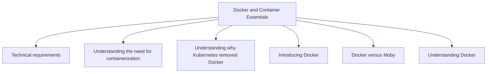

## Chapter 2: Deploying Kubernetes Using KinD

**Questions this chapter answers:**
- What does this chapter explain about Technical requirements?
- What does this chapter explain about Introducing Kubernetes components and objects?
- What does this chapter explain about Interacting with a cluster?

**Key points:**
- Source section: Technical requirements.
- Source section: Introducing Kubernetes components and objects.
- Source section: Interacting with a cluster.
- Source section: Using development clusters.

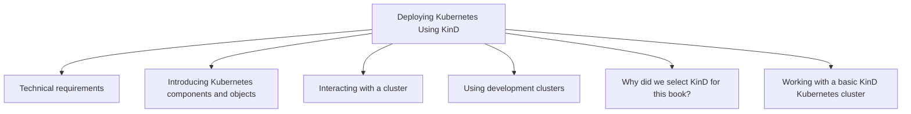

## Chapter 3: Kubernetes Bootcamp

**Questions this chapter answers:**
- What does this chapter explain about Technical requirements?
- What does this chapter explain about An overview of Kubernetes components?
- What does this chapter explain about Exploring the control plane?

**Key points:**
- Source section: Technical requirements.
- Source section: An overview of Kubernetes components.
- Source section: Exploring the control plane.
- Source section: The Kubernetes API server.

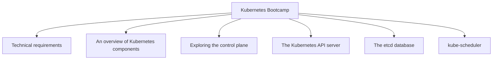

## Chapter 4: Services, Load Balancing, and Network Policies

**Questions this chapter answers:**
- What does this chapter explain about Technical requirements?
- What does this chapter explain about Exposing workloads to requests?
- What does this chapter explain about Understanding how Services work?

**Key points:**
- Source section: Technical requirements.
- Source section: Exposing workloads to requests.
- Source section: Understanding how Services work.
- Source section: Creating a Service.

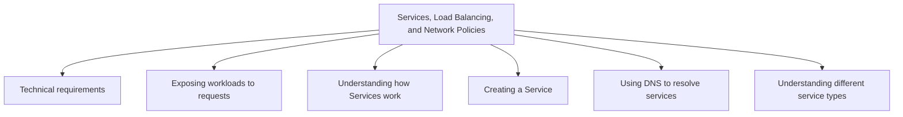

## Chapter 5: External DNS and Global Load Balancing

**Questions this chapter answers:**
- What does this chapter explain about Technical requirements?
- What does this chapter explain about Making service names available externally?
- What does this chapter explain about Setting up ExternalDNS?

**Key points:**
- Source section: Technical requirements.
- Source section: Making service names available externally.
- Source section: Setting up ExternalDNS.
- Source section: Integrating ExternalDNS and CoreDNS.

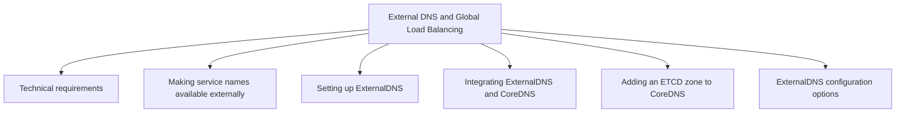

## Chapter 6: Integrating Authentication into Your Cluster

**Questions this chapter answers:**
- What does this chapter explain about Technical requirements?
- What does this chapter explain about Getting Help?
- What does this chapter explain about Understanding how Kubernetes knows who you are?

**Key points:**
- Source section: Technical requirements.
- Source section: Getting Help.
- Source section: Understanding how Kubernetes knows who you are.
- Source section: External users.

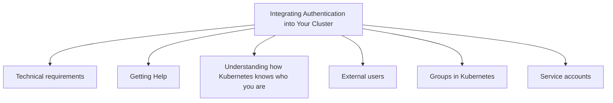

## Chapter 7: RBAC Policies and Auditing

**Questions this chapter answers:**
- What does this chapter explain about Technical requirements?
- What does this chapter explain about Introduction to RBAC?
- What does this chapter explain about What’s a Role??

**Key points:**
- Source section: Technical requirements.
- Source section: Introduction to RBAC.
- Source section: What’s a Role?.
- Source section: Identifying a Role.

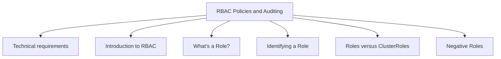

## Chapter 8: Managing Secrets

**Questions this chapter answers:**
- What does this chapter explain about Technical Requirements?
- What does this chapter explain about Getting Help?
- What does this chapter explain about Examining the difference between Secrets and Configuration Data?

**Key points:**
- Source section: Technical Requirements.
- Source section: Getting Help.
- Source section: Examining the difference between Secrets and Configuration Data.
- Source section: Managing Secrets in an Enterprise.

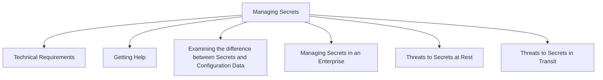

## Chapter 9: Building Multitenant Clusters with vClusters

**Questions this chapter answers:**
- What does this chapter explain about Technical requirements?
- What does this chapter explain about Getting Help?
- What does this chapter explain about The Benefits and Challenges of Multitenancy?

**Key points:**
- Source section: Technical requirements.
- Source section: Getting Help.
- Source section: The Benefits and Challenges of Multitenancy.
- Source section: Exploring the Benefits of Multitenancy.

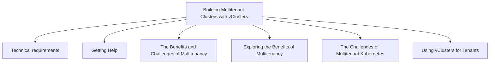

## Chapter 10: Deploying a Secured Kubernetes Dashboard

**Questions this chapter answers:**
- What does this chapter explain about Technical requirements?
- What does this chapter explain about Getting help?
- What does this chapter explain about How does the dashboard know who you are??

**Key points:**
- Source section: Technical requirements.
- Source section: Getting help.
- Source section: How does the dashboard know who you are?.
- Source section: Dashboard architecture.

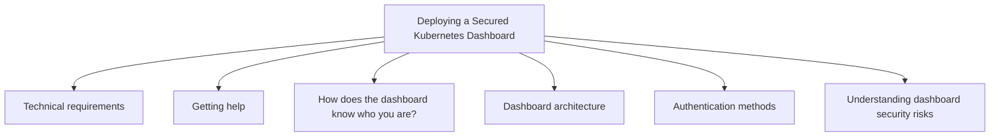

## Chapter 11: Extending Security Using Open Policy Agent

**Questions this chapter answers:**
- What does this chapter explain about Technical requirements?
- What does this chapter explain about Introduction to dynamic admission controllers?
- What does this chapter explain about What is OPA and how does it work??

**Key points:**
- Source section: Technical requirements.
- Source section: Introduction to dynamic admission controllers.
- Source section: What is OPA and how does it work?.
- Source section: OPA architecture.

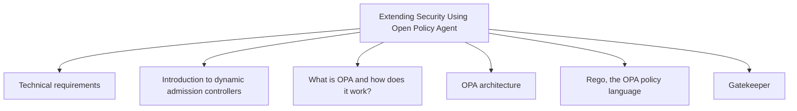

## Chapter 12: Node Security with Gatekeeper

**Questions this chapter answers:**
- What does this chapter explain about Technical requirements?
- What does this chapter explain about What is node security??
- What does this chapter explain about Understanding the difference between containers and VMs?

**Key points:**
- Source section: Technical requirements.
- Source section: What is node security?.
- Source section: Understanding the difference between containers and VMs.
- Source section: Container breakouts.

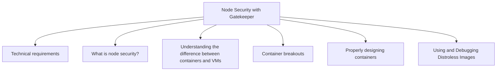

## Chapter 13: KubeArmor Securing Your Runtime

**Questions this chapter answers:**
- What does this chapter explain about Technical requirements?
- What does this chapter explain about What is runtime security??
- What does this chapter explain about Introducing KubeArmor?

**Key points:**
- Source section: Technical requirements.
- Source section: What is runtime security?.
- Source section: Introducing KubeArmor.
- Source section: Introduction to Linux Security.

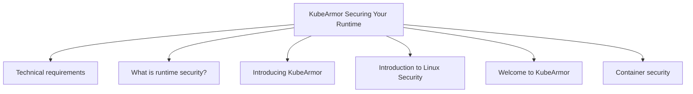

## Chapter 14: Backing Up Workloads

**Questions this chapter answers:**
- What does this chapter explain about Technical requirements?
- What does this chapter explain about Understanding Kubernetes backups?
- What does this chapter explain about Performing an etcd backup?

**Key points:**
- Source section: Technical requirements.
- Source section: Understanding Kubernetes backups.
- Source section: Performing an etcd backup.
- Source section: Backing up the required certificates.

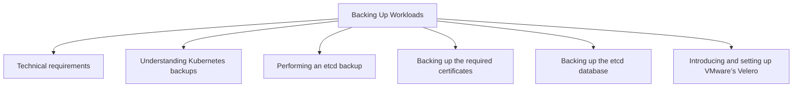

## Chapter 15: Monitoring Clusters and Workloads

**Questions this chapter answers:**
- What does this chapter explain about Technical Requirements?
- What does this chapter explain about Getting Help?
- What does this chapter explain about Managing Metrics in Kubernetes?

**Key points:**
- Source section: Technical Requirements.
- Source section: Getting Help.
- Source section: Managing Metrics in Kubernetes.
- Source section: How Kubernetes Provides Metrics.

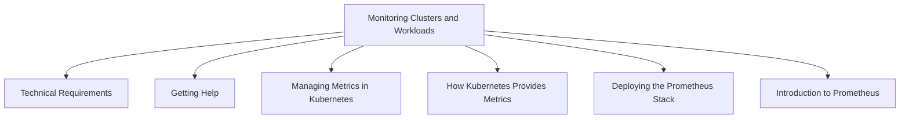

## Chapter 16: An Introduction to Istio

**Questions this chapter answers:**
- What does this chapter explain about Technical requirements?
- What does this chapter explain about Understanding the Control Plane and Data Plane?
- What does this chapter explain about The Control Plane?

**Key points:**
- Source section: Technical requirements.
- Source section: Understanding the Control Plane and Data Plane.
- Source section: The Control Plane.
- Source section: The Data Plane.

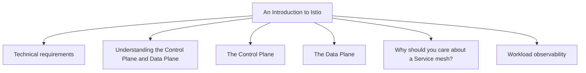

## Chapter 17: Building and Deploying Applications on Istio

**Questions this chapter answers:**
- What does this chapter explain about Technical requirements?
- What does this chapter explain about Comparing microservices and monoliths?
- What does this chapter explain about My history with microservices versus monolithic architecture?

**Key points:**
- Source section: Technical requirements.
- Source section: Comparing microservices and monoliths.
- Source section: My history with microservices versus monolithic architecture.
- Source section: Comparing architectures in an application.

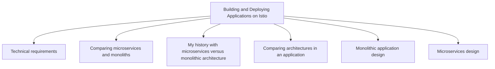

## Chapter 18: Provisioning a Multitenant Platform

**Questions this chapter answers:**
- What does this chapter explain about Technical requirements?
- What does this chapter explain about Designing a pipeline?
- What does this chapter explain about Opinionated platforms?

**Key points:**
- Source section: Technical requirements.
- Source section: Designing a pipeline.
- Source section: Opinionated platforms.
- Source section: Securing your pipeline.

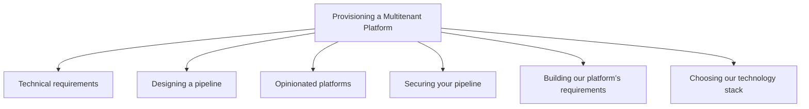

## Chapter 19: Building a Developer Portal

**Questions this chapter answers:**
- What does this chapter explain about Technical Requirements?
- What does this chapter explain about Fulfilling Compute Requirements?
- What does this chapter explain about Using Cloud-Managed Kubernetes?

**Key points:**
- Source section: Technical Requirements.
- Source section: Fulfilling Compute Requirements.
- Source section: Using Cloud-Managed Kubernetes.
- Source section: Building a Home Lab.

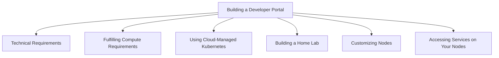
