# Kubernetes Autoscaling

*Christian Melendez — Book*

## Chapter 1: Introduction to Kubernetes Autoscaling

**Questions this chapter answers:**
- What does this chapter explain about Technical requirements?
- What does this chapter explain about Free Benefits with Your Book?
- What does this chapter explain about Scalability foundations?

**Key points:**
- Source section: Technical requirements.
- Source section: Free Benefits with Your Book.
- Source section: Scalability foundations.
- Source section: A bit of history.

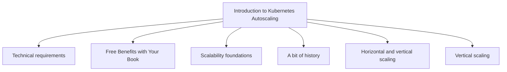

## Chapter 2: Workload Autoscaling Overview

**Questions this chapter answers:**
- What does this chapter explain about Technical requirements?
- What does this chapter explain about Challenges of autoscaling workloads?
- What does this chapter explain about How does the Kubernetes scheduler work??

**Key points:**
- Source section: Technical requirements.
- Source section: Challenges of autoscaling workloads.
- Source section: How does the Kubernetes scheduler work?.
- Source section: Configuring requests.

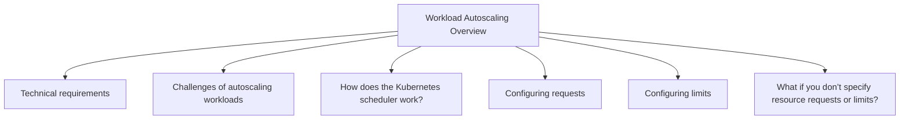

## Chapter 3: Workload Autoscaling with HPA and VPA

**Questions this chapter answers:**
- What does this chapter explain about Technical requirements?
- What does this chapter explain about The Kubernetes Metrics Server?
- What does this chapter explain about The Metrics Server: The what and the why?

**Key points:**
- Source section: Technical requirements.
- Source section: The Kubernetes Metrics Server.
- Source section: The Metrics Server: The what and the why.
- Source section: Hands-on lab: Setting up the Metrics Server.

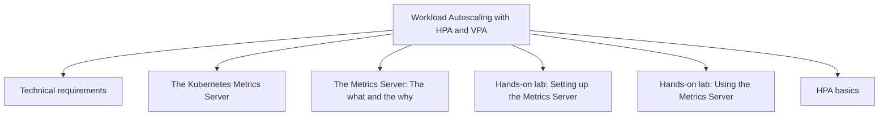

## Chapter 4: Kubernetes Event-Driven Autoscaling – Part 1

**Questions this chapter answers:**
- What does this chapter explain about Technical requirements?
- What does this chapter explain about KEDA: What it is and why you need it?
- What does this chapter explain about KEDA’s architecture?

**Key points:**
- Source section: Technical requirements.
- Source section: KEDA: What it is and why you need it.
- Source section: KEDA’s architecture.
- Source section: KEDA Operator.

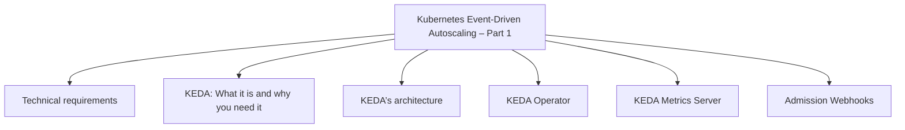

## Chapter 5: Kubernetes Event-Driven Autoscaling – Part 2

**Questions this chapter answers:**
- What does this chapter explain about Technical requirements?
- What does this chapter explain about Autoscaling in KEDA continued?
- What does this chapter explain about Scaling based on schedule?

**Key points:**
- Source section: Technical requirements.
- Source section: Autoscaling in KEDA continued.
- Source section: Scaling based on schedule.
- Source section: Hands-on lab: Scaling to zero during non-working hours.

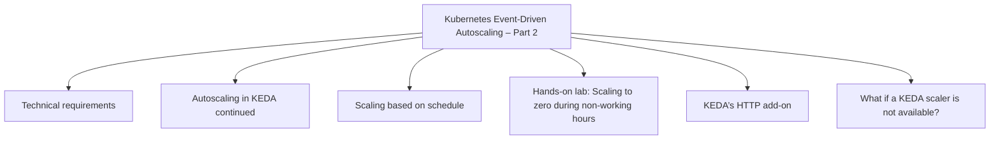

## Chapter 6: Workload Autoscaling Operations

**Questions this chapter answers:**
- What does this chapter explain about Technical requirements?
- What does this chapter explain about Troubleshooting workload autoscaling?
- What does this chapter explain about Troubleshooting HPA?

**Key points:**
- Source section: Technical requirements.
- Source section: Troubleshooting workload autoscaling.
- Source section: Troubleshooting HPA.
- Source section: Reviewing HPA conditions and events.

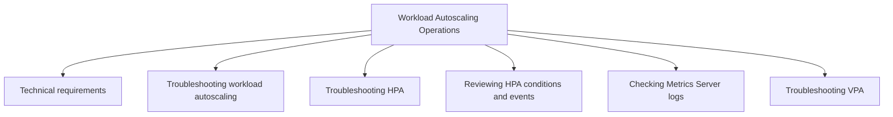

## Chapter 7: Data Plane Autoscaling Overview

**Questions this chapter answers:**
- What does this chapter explain about Technical requirements?
- What does this chapter explain about What is data plane autoscaling??
- What does this chapter explain about Data plane autoscalers?

**Key points:**
- Source section: Technical requirements.
- Source section: What is data plane autoscaling?.
- Source section: Data plane autoscalers.
- Source section: CAS.

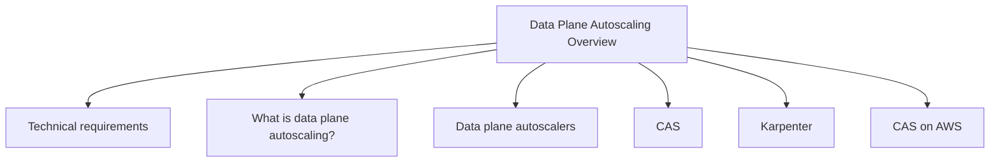

## Chapter 8: Node Autoscaling with Karpenter — Part 1

**Questions this chapter answers:**
- What does this chapter explain about Technical requirements?
- What does this chapter explain about What is Karpenter??
- What does this chapter explain about How does Karpenter work in AWS??

**Key points:**
- Source section: Technical requirements.
- Source section: What is Karpenter?.
- Source section: How does Karpenter work in AWS?.
- Source section: History of Karpenter.

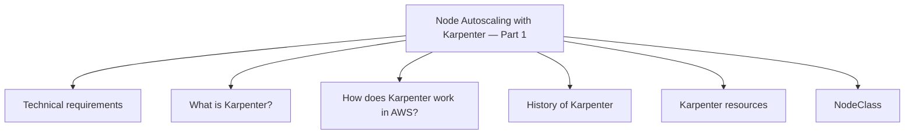

## Chapter 9: Node Autoscaling with Karpenter — Part 2

**Questions this chapter answers:**
- What does this chapter explain about Technical requirements?
- What does this chapter explain about Removing nodes?
- What does this chapter explain about Control flow architecture?

**Key points:**
- Source section: Technical requirements.
- Source section: Removing nodes.
- Source section: Control flow architecture.
- Source section: Disruption controller.

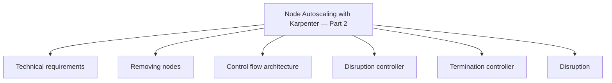

## Chapter 10: Karpenter Management Operations

**Questions this chapter answers:**
- What does this chapter explain about Technical requirements?
- What does this chapter explain about Advanced operations and troubleshooting?
- What does this chapter explain about Troubleshooting Karpenter?

**Key points:**
- Source section: Technical requirements.
- Source section: Advanced operations and troubleshooting.
- Source section: Troubleshooting Karpenter.
- Source section: Getting Karpenter events.

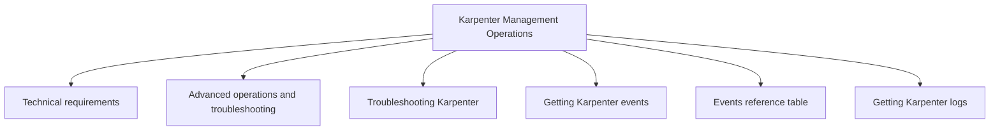

## Chapter 11: Practical Use Cases for Autoscaling in Kubernetes

**Questions this chapter answers:**
- What does this chapter explain about Technical requirements?
- What does this chapter explain about Common workloads for autoscaling?
- What does this chapter explain about Hands-on lab: Create an EKS cluster with batteries included?

**Key points:**
- Source section: Technical requirements.
- Source section: Common workloads for autoscaling.
- Source section: Hands-on lab: Create an EKS cluster with batteries included.
- Source section: Use case 1: Web applications.

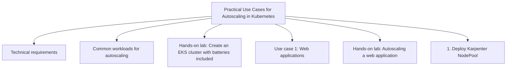

## Chapter 12: Patterns and Recommendations

**Questions this chapter answers:**
- What does this chapter explain about Technical requirements?
- What does this chapter explain about Scaling down to zero?
- What does this chapter explain about Hands-on lab: Scaling to zero nodes?

**Key points:**
- Source section: Technical requirements.
- Source section: Scaling down to zero.
- Source section: Hands-on lab: Scaling to zero nodes.
- Source section: 1. Deploying a sample application.

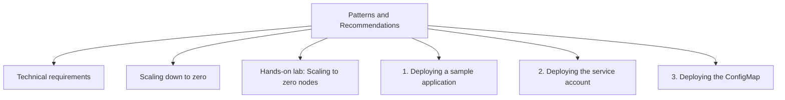

## Chapter 13: Unlock Your Exclusive Benefits

**Questions this chapter answers:**
- What does this chapter explain about Unlock this Book’s Free Benefits in 3 Easy Steps?
- What does this chapter explain about Step 1?
- What does this chapter explain about Step 2?

**Key points:**
- Source section: Unlock this Book’s Free Benefits in 3 Easy Steps.
- Source section: Step 1.
- Source section: Step 2.
- Source section: Step 3.

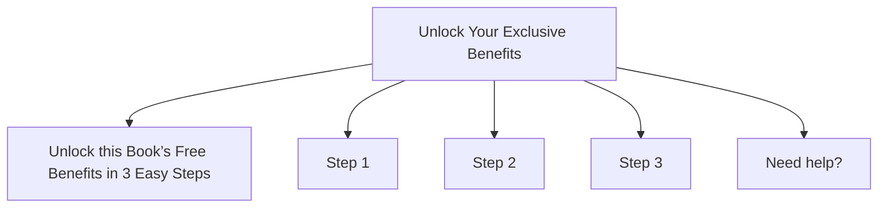
