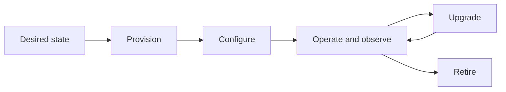

# Kubernetes Cluster Lifecycle Management for Platform Engineers

*Weave Intelligence — Report*

## Agent guide

Frames Kubernetes clusters as managed platform products with repeatable provisioning, configuration, upgrade, observation, and retirement stages.
### Questions this chapter answers
- What stages make up the Kubernetes cluster lifecycle?
- How should platform teams standardize provisioning and upgrades?
- Which operational signals guide cluster maintenance and retirement?
### Key points
- Cluster management is a lifecycle rather than a one-time provisioning task.
- Desired-state automation reduces variation across a Kubernetes fleet.
- Upgrade, observability, and retirement policies are core platform responsibilities.

## Conceptual diagram

## Detailed source transcript

### Page 1
Weave Intelligence
Kubernetes cluster
lifecycle management
for Platform Engineers
WEAVE INTELLIGENCE PRESENTS
Kubernetes cluster lifecycle management for Platform Engineers
PUBLISHED IN 2025
### Page 2
02   Kubernetes cluster lifecycle management for platform engineers
Kubernetes: The
foundation of enterprise
platform engineering
	Kubernetes is the de facto resource              It is a key driver of cloud native
	plane for cloud-native infrastructure            adoption and provides a foundation
	and the foundation of modern Internal            built on standardized API calls,
	Developer Platforms (IDPs). The                  extensible protocols, and modular
	overwhelming majority of advanced                architecture, enabling critical benefits
	platform engineering initiatives are             like resilience, scalability, and
	based on K8s, and the majority of                programmability for the software-
	organisations exploring platform                 dependent world.
	engineering do so with Kubernetes.
	Across the wider industry, the Cloud             Despite this massively increasing
	Native Computing Foundation (CNCF)               adoption, operational maturity often
	reports that production use reached              lags behind. Though K8s excels at
	80% amongst its audience in 2024, up             orchestrating resources within a single
	sharply from 66% in 2023.
		instance, the reality of enterprise
			adoption is far more complex.
	While overall, over 60% of enterprises           Organizations now frequently manage
	have adopted Kubernetes. This rapid              large and complex fleets. Orgs now
	adoption is only intensifying. With              run more than 20 K8s clusters on
	capabilities like those from KubeVirt,           average in production, with many
	Kubernetes can now serve as a fully              running tens or hundreds. This scale
	unified control plane, orchestrating             introduces exponential operational
	not just containers but also virtual             complexity, fragmentation, and
	machines (VMs) and legacy                        fragility. And, with 77% of orgs
	workloads, a modernization strategy              reporting that complexity and security
	that 31% of organizations plan to                concerns have inhibited their
	pursue to unify their estate.
	adoption, the impact of this challenge
		is clear. This complexity stems directly
		The dominant presence of K8s is                  from relying on manual, bespoke
		driven by its inherent technical value.          operations.
### Page 3
03   Kubernetes cluster lifecycle management for platform engineers
	Things like ad-hoc configuration, the            This will mean defining what “good”
	proliferation of snowflake clusters,             lifecycle management looks like and
	unchecked configuration drift, and               adopting a Platform-as-a-Product
	relentless Day 2 toil. In this white paper       mindset, treating infrastructure
	and its companion course, Kubernetes             capabilities as an internal service built
	Cluster Lifecycle Management in                  for developer customers.
	Platform Engineering, we hope to
	demonstrate how you can use best                 Mastering Kubernetes lifecycle
	practices and platform engineering               management lets you scale safely,
	principles to achieve the full potential         boost developer velocity, and lower
	of Kubernetes.
		TCO. It also future-proofs your
			organization for AI/ML workloads and
	These pieces will help you move                  multi-cloud governance. Our goal is to
	beyond reactive fixes to taking a                help you achieve the full potential of
	deliberate, well-structured approach             K8s, transforming your usage from
	to managing the Kubernetes cluster               operational burden into the future-
	lifecycle, the full journey from creation        proof foundation of your Internal
	to retirement.                                   Developer Platform and the
		innovation it powers.
	From the 2025 State of Production Kubernetes report
90%                  Expect to run more AI workloads on
	Kubernetes in the next 12 months. AI is the
	top growth trend.
88%                  Reported increased Kubernetes TCO year on
	year. Cost is the #1 challenge facing adopters.
51%                  Still run clusters as “snowflakes” with highly
	manual operations, despite 80% adopting platform
	engineering practices.
### Page 4
04   Kubernetes cluster lifecycle management for platform engineers
The strategic imperative for
K8s lifecycle management
	The massive expansion of the cloud-native era means Kubernetes has become
	the indispensable backbone of modern IT infrastructure. It provides the
	standardized abstractions, APIs, and extensibility that transform infrastructure
	into a programmable foundation for developer self-service.
	The evolution of scale
	Kubernetes was initially conceived as a single cluster solution. However,
	modern enterprise reality demands far more complexity. Organizations are
	moving well beyond single-cluster operations and are instead managing a
	large, distributed fleet, a "nation of cities".
	This multi-cluster architecture is driven by strategic necessities like:
		Isolation and blast
			Diverse environments
		radius control                                Organizations often need to stand up
			Kubernetes clusters in multiple
		Separating workloads minimizes the            environments, public clouds (AWS,
		impact of a failure or security incident.     Azure, GCP), virtualized data centers,
		Security teams often mandate isolation        bare metal, hybrid deployments, and
		for sensitive data, ensuring compliance       specialized locations like sovereign and
		and reducing the risk exposure of the         air-gapped clouds.
		entire business.
		Specialized workloads
		Different apps have unique needs. AI/
		ML workloads, for example, require
		specific hardware like GPUs and tailored
		software stacks that shape cluster
		placement and configuration.
### Page 5
05   Kubernetes cluster lifecycle management for platform engineers
	The problem: A crisis of
	unmanaged growth
	As organizations frequently manage               This combination of manual
	large, complex Kubernetes fleets, each           operations and fragmented visibility
	often containing many distinct                   results in configuration drift, where
	software layers beyond the core                  clusters subtly deviate from their
	distribution, two major operational              intended blueprints. Drift is dangerous
	deficiencies become clear. First,                because it directly undermines
	relying on manual operations                     platform reliability. It introduces
	transforms every ad-hoc fix into a               security vulnerabilities, creates
	future liability.
		inconsistent testing environments
			that lead to unpredictable failure
	When engineers manage cluster                    modes, and renders compliance
	maintenance (upgrades, patching,                 status unknowable across the fleet.
	scaling, security fixes, etc) by logging
	in cluster-by-cluster, it creates an             The relentless Day 2 toil demoralizes
	unsustainable workload. Second,                  teams, with operational overhead so
	persisting in a single-cluster mindset           immense that many organizations
	(treating the fleet as individual units          admit lacking the skills and headcount
	rather than a cohesive "nation of                to manage it. As a result, they depend
	cities") severely limits operational             on expert intervention and “shadow
	insight. Without a fleet-wide control            ops” instead of scalable systems. The
	point, platform teams lack the unified           outcome is a strategic crisis where
	observability required to reason about           highly paid engineers spend their time
	and manage infrastructure trends or              on manual maintenance rather than
	cost pressures across diverse                    strategic platform development,
	environments.                                    defeating the very purpose of a
		platform initiative.
	Modern platform teams aren’t just managing one Kubernetes
	cluster, they’re managing a whole fleet across diverse
	environments. Success means turning this complexity into a
	unified, resilient, and secure foundation for innovation.”
	Anthony Newman
	DIRECTOR OF CONTENT, SPECTRO CLOUD
### Page 6
06   Kubernetes cluster lifecycle management for platform engineers
How to do K8s
lifecycle management
	Strategic lifecycle management and
	Platform-as-a-Product
	To break the cycle of toil and fragility, organizations need a deliberate
	Kubernetes cluster lifecycle management strategy, treating each cluster as
	part of a planned journey from creation to retirement. They also need to
	operate with a Platform-as-a-Product mindset, investing in curated capabilities
	that deliver real value to developers. A product mindset emphasizes self-
	service, clear roadmaps, and consistent experiences, reducing cognitive load
	and operational chaos. It rests on three survival principles:
		If a cluster activity or configuration is not automated, it
	Automation is                      must be considered unreal. Automation must cover the
	survival                           full stack to minimize the risk of configuration issues and
		protect the limited time of the platform team.
		Clusters must be built from reusable, declarative
	Cattle, not pets                   templates, ensuring they are entirely replaceable. This
		shifts the focus from bespoke manual fixes to
		maintaining scalable standards.
		The only way to maintain the desired state across a
	Guard against drift                diverse fleet is by starting declarative and staying
		declarative. This is achieved using reconciliation loops
		(GitOps) that continuously detect drift and remediate
		the cluster back to the approved state.
### Page 7
07   Kubernetes cluster lifecycle management for platform engineers
The (Multi)cluster
lifecycle, step by step
	Day zero: Defining the blueprint
	You start by defining the complete, production-ready cluster blueprint.
	This is not simply setting up the core distribution; it involves specifying every
	software layer and configuration that makes the cluster production-ready
	and functional.
	You must make critical choices here:
		Operating system (OS)                         Kubernetes distribution
		You choose the underlying Linux               You select the flavour (e.g., lightweight
		distribution (like Ubuntu, RHEL, or a         K3s or FIPS-secure RKE2, or one of
		micro OS optimized for edge) that             dozens of others) based on the specific
		determines kernel-level security and          use case and environment.
		patching behavior.
		Networking and storage                        Core services
		You specify the Container Networking          You bake in essential add-ons, including
		Interface (CNI), impacting policy             the full observability stack (metrics,
		enforcement and performance, and the          logging, tracing), ingress controllers (for
		Container Storage Interface (CSI),            routing and TLS termination), secrets
		ensuring applications receive the             management (Vault), and policy agents
		necessary durability and multi-zone           (like OPA Gatekeeper or Kyverno).
		guarantees.
	Because a GPU-enabled AI/ML cluster differs vastly from a standard web
	application cluster, you need reusable blueprints that support this unavoidable
	diversity while still maintaining standards.
### Page 8
08   Kubernetes cluster lifecycle management for platform engineers
Day one: Provisioning
and placement
	Day one is when you deploy the cluster           Hardware diversity matters too; some
	based on your Day zero blueprint.                environments require small form
	Modern organizational demands mean               factors, while others demand specific
	you are placing clusters across highly           GPUs or specialised infrastructure.
	diverse environments, with the                   You must use automation, often
	average organization running clusters            employing tools like Cluster API
	in more than five different locations.
	(CAPI), to instantiate these clusters
		accurately across environments. You
		This placement is driven by strategic            must also keep a close eye on
		necessity. You might deploy to public            consistency, as a cloud cluster will
		clouds (AWS, Azure, GCP) or on-                  likely assume elastic resources, while
		premises data centres. Increasingly,             an edge cluster will often be memory-
		trends dictate placement to                      constrained and likely running on a
		specialized environments like                    more unique architecture.
		sovereign clouds (for regulatory
		requirements), air-gapped locations,
		or the edge (often for low-latency AI
		inference workloads).
### Page 9
09   Kubernetes cluster lifecycle management for platform engineers
Day two: The
relentless operation
	The moment the cluster is born, Day two begins, and this is where the real,
	ongoing work of operation and maintenance lives. Your platform team faces a
	relentless, cumulative workload of scheduled and event-driven tasks:
	Infrastructure maintenance
	You manage three major Kubernetes releases annually, meaning every cluster must be
	upgraded multiple times a year. This is compounded by applying security patches to the
	underlying OS and the dozens of installed stack components.
	Essential rotations
	You must constantly rotate certificates for services, ingress, and node communication, as
	missed expiry dates inevitably lead to outages.
	Scaling and change
	You tune complex autoscaling systems (HPA, VPA, KEDA, Karpenter) to match changing
	application usage patterns. Meanwhile, you must react immediately to event-driven needs,
	such as sudden CVE alerts requiring hotfixes, or managing application lifecycle updates,
	including shipping new AI models to inference services.
	Resilience and compliance
	You ensure continuous policy enforcement to satisfy governance requirements and regularly
	test disaster recovery capabilities across regions.
	Handled manually, Day-2 work becomes firefighting. This "fire-fighting" is a
	slow death for the platform, hindering the ability to make strategic
	improvements and slowing down developers who are forced to wait for support
	or risk going rogue.
### Page 10
10   Kubernetes cluster lifecycle management for platform engineers
	Scaling: Managing the nation of cities
	At some point, every platform team               chaos, sitting above individual clusters
	hits the same wall: Kubernetes doesn’t           to provide the observability, policy
	just scale up, it scales out. What               enforcement, and automation
	begins as a single “city” of workloads           necessary for scale. At this stage,
	becomes a sprawling nation of cities,            platform teams evolve from “cluster
	dozens, even hundreds of clusters,               admins” to “orchestrators of change.”
	each with unique workloads,
	environments, and operational quirks.            That orchestration requires new
	Managing this nation requires a new              operational disciplines: fleet-wide
	mindset: you’re no longer                        observability unifying telemetry, cost,
	administering clusters, you’re                   and health data; progressive rollouts
	governing an ecosystem.
		using canary deployments, automated
			checks, and safe rollbacks;
	This scale isn’t optional. Isolation for         standardized blueprints defining
	security and compliance, edge                    cluster classes for web, data, GPU,
	deployments for latency-sensitive                and edge workloads; policy
	workloads, sovereign environments                propagation treating security and
	for regulation, GPU nodes for AI, each           configuration as versioned, auto-
	of these requirements spawns more                enforced code; and exception
	clusters. The result is unavoidable              workflows allowing temporary
	diversity: different footprints,                 deviations with clear ownership,
	hardware, and environments, all                  expiry, and automatic reconciliation.
	demanding orchestration without
	fragmentation.
	The answer is about treating the fleet
	as a single logical system. A fleet-level
	control plane brings coherence to
### Page 11
11   Kubernetes cluster lifecycle management for platform engineers
	This is why Snowflake clusters are so damaging. A
	"snowflake cluster" is infrastructure whose configuration
	has drifted significantly from its original desired state.
	This state results from accumulated manual changes,
	undocumented fixes, or one-off tweaks over time. Over
	half of organizations (51%) admit their clusters are
	snowflakes, relying on highly manual operations.
	Snowflakes create future operational liability and
	undermine platform reliability.
	A mature fleet operates on                       Declarative control and GitOps
	measurable signals, not instincts.               reconciliation remain the backbone,
	Platform engineers track metrics like            but the mindset shifts from
	percentage of clusters at N-1 version,           maintenance to orchestration. By
	average drift remediation time, CVE              consolidating visibility and automation
	time-to-patch, and fleet error                   at the fleet level, platform teams
	budgets. These metrics turn lifecycle            eliminate toil, enforce safety by
	management into a repeatable,
	default, and enable developers to
		data-driven discipline.
			move fast without fear. This is where
				Kubernetes stops being an
		Ultimately, scaling the “nation of               operational tax and starts
		cities” is about scaling change,
	behaving like the foundation of a
		not clusters.                                    well-run platform.
### Page 12
12   Kubernetes cluster lifecycle management for platform engineers
Key lessons for success
	Operations as a Product
	To fully succeed, you must embrace treating the aforementioned Day 2
	operations as a platform capability first and foremost. This requires you to
	intentionally plan and manage the platform for long-term sustainable
	operations and reliability. Achieving higher maturity means transitioning from
	reactive responses ("By request") to centrally enabled and eventually
	standardized, managed services. This approach frames operations as a product
	designed for the platform’s internal customers, the developers. This approach
	often includes:
	Full-stack automation and declarative control
	The only sustainable foundation for Day 2 operations is a fully declarative, automated model.
	Platform engineers must define upgrade policies and desired states in Git and utilize
	reconciliation loops (GitOps) to continuously detect and remediate drift, thereby ensuring
	consistency and providing auditable trails.
	Safe self-service defaults
	Developers are enabled safely when platform teams provide self-service tooling built around
	golden templates and clear guardrails (quotas, standard policies). This allows developers to
	consume resources rapidly while the platform team enforces security and stability consistently.
	Integrating observability and cost management
	Observability is the essential foundation for success, providing the context required to
	diagnose incidents, validate deployments, and respond to failures. Integrating real-time cost
	insights into the operational discipline allows platform engineers to manage TCO effectively
	and make data-driven decisions on scaling and optimization.
	Designing for replaceability
	Clusters must be built from declarative templates so they can be recreated, not endlessly
	patched, with confidence and speed.
### Page 13
13   Kubernetes cluster lifecycle management for platform engineers
	By operationalizing the cluster lifecycle through a product mindset, you free
	yourself and can ideally focus on improving the overall developer experience.
	At the same time, this approach dramatically helps platform stability and
	speed, ensures continuous compliance across the cluster fleet, and reduces
	the risk of costly outages. It makes the platform resilient and adaptable.
	Governance and risk
	In highly distributed, multi-cluster             This is achieved through Policy-as-
	Kubernetes environments, the central             Code (PaC), where governance rules
	challenge is balancing developer                 are versioned, testable, and enforced
	autonomy with organizational control.            continuously via admission controllers
	Development teams need speed and                 and automation pipelines. PaC creates
	flexibility, while platform teams must           “guardrails, not gates,” enabling
	enforce consistency, security, and               developers to move fast while the
	reliability. Governance provides the             platform automatically enforces
	mechanism to manage this tension,                critical standards such as mandatory
	ensuring that autonomy operates                  TLS, least-privilege permissions, or
	within well-defined safeguards.
	restrictions on privileged workloads.
		But governance alone is not enough; it
		With the adoption of a Platform-as-a-            must be paired with a disciplined
		Product mindset, platform engineers              approach to risk management.
		establish clear contracts and shared
		responsibility models between teams.             The scale of many organizations
		Rather than attempting to centralize             magnifies security exposure and
		all ownership, mature organizations              operational fragility. To contain risk,
		define a “paved path”, a set of                  platform teams require fleet-level
		standardized templates, policies, and            visibility and declarative automation, a
		workflows that integrate specialized             unified control plane that can instantly
		groups such as networking or security            reveal which clusters are impacted by
		into the declarative stack.
		a vulnerability (e.g., a CVE) and
			reconcile them back to a compliant,
			Governance thus becomes a design                 hardened state.
			principle embedded directly into the
			platform, treating infrastructure itself
			as an API.
### Page 14
14   Kubernetes cluster lifecycle management for platform engineers
	Effective risk management depends on consistently securing key
	infrastructure domains:
		Identity and access                           Secrets management
		control (IAC)                                 Automate secret rotation and ensure
			sensitive data never resides in plaintext
		Centralize authentication and                 ConfigMaps or Git.
		authorization, enforcing Role-Based
		Access Control (RBAC) by team, role,
		and environment, integrated with
		trusted identity providers.
		Vulnerability scanning
		Disaster recovery (DR)
			and patching                                  Implement multi-region DR strategies
				that include cluster state backups,
			Continuously scan for CVEs, verify            regularly tested failover plans, and
			image provenance, and check                   validated recovery processes.
			configuration compliance against
			frameworks like the CIS Benchmarks.
			Despite automation, 15% of
			organizations still require weeks or
			months to patch their fleets.
### Page 15
15   Kubernetes cluster lifecycle management for platform engineers
Conclusion and next steps
	Effective Kubernetes cluster lifecycle           and greater heterogeneity across
	management is essential. Done well, it           clouds, data centers, edge, and
	turns a sprawling fleet into a resilient,        sovereign environments, driven by AI/
	scalable business asset. Success rests           ML and compliance needs.
	on clear foundations, declarative                Kubernetes-native lifecycle tooling is
	blueprints, reconciliation loops, full-          moving into the mainstream as the de
	stack automation, and a platform-as-             facto mechanism for declarative, end-
	a-product mindset, giving platform               to-end management. AI-assisted
	teams a practical path to overcome               operations will improve triage and cost
	the operational challenges that stall            optimization, but leaders should pair
	many Kubernetes adoptions. Done                  automation with human oversight to
	poorly, and teams are crushed
	bridge today’s trust and transparency
		under the complexity of endless
	gaps. You can start now with a focused
		Day 2 operations.
			plan:
		Looking ahead, this complexity will
		grow, not shrink. Expect more clusters
		Assess lifecycle gaps
		The only sustainable foundation for Day 2 operations is a fully declarative,
		automated model. Platform engineers must define upgrade policies and
		desired states in Git and utilize reconciliation loops (GitOps) to continuously
		detect and remediate drift, thereby ensuring consistency and providing
		auditable trails.
		Define standardized blueprints
		Ship reusable, declarative templates that lock in the full stack from OS upward
		for common cluster types.
### Page 16
16   Kubernetes cluster lifecycle management for platform engineers
	Institute fleet visibility and control
	Establish a central layer for unified observability and simultaneous policy
	application across clusters.
	Tighten governance and ownership
	Clarify who owns what; encode Policy-as-Code boundaries to enforce security
	and compliance consistently.
	Harden Day-2 runbooks
	Automate upgrades, patching, and certificate rotation to free engineers for
	higher-leverage work.
	Run a controlled pilot
	Prove the model with one high-value team or service; optimize based
	on measurable outcomes.
	The strategic shift is clear. The challenge is no longer just coping with
	Kubernetes complexity or firefighting Day 2 toil; it’s mastering the full lifecycle
	across the fleet. Lifecycle management rooted in declarative control,
	automation, and full-stack integration is not mere technical hygiene; it’s an
	organizational force multiplier. By embedding governance into platform design
	(Policy-as-Code) and setting clear ownership boundaries, platform teams
	create a clear policy framework that lets developers move fast while core
	security and compliance are enforced continuously. Committing to a
	Platform-as-a-Product mindset and an intentional lifecycle strategy also lays
	the centralized control plane you need to manage cost, contain risk, and
	provide the auditability leadership expects.
## Code map
- No matching code repository has been identified for this book.
## Source note
This is the complete generated chapter transcript. Source identity and status are recorded in the database properties.
