# Mastering Terraform

*Mark Tinderholt — Book*
## Chapter 1: Understanding Terraform Architecture

**Questions this chapter answers:**
- What does this chapter explain about Chapter 1: Understanding Terraform Architecture?
- What does this chapter explain about The plan?
- What does this chapter explain about Configuration language?

**Key points:**
- Source section: Chapter 1: Understanding Terraform Architecture.
- Source section: The plan.
- Source section: Configuration language.
- Source section: Modularity.

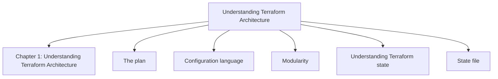

## Chapter 2: Using HashiCorp Configuration Language

**Questions this chapter answers:**
- What does this chapter explain about Chapter 2: Using HashiCorp Configuration Language?
- What does this chapter explain about Resources and data sources?
- What does this chapter explain about Resources?

**Key points:**
- Source section: Chapter 2: Using HashiCorp Configuration Language.
- Source section: Resources and data sources.
- Source section: Resources.
- Source section: Data sources.

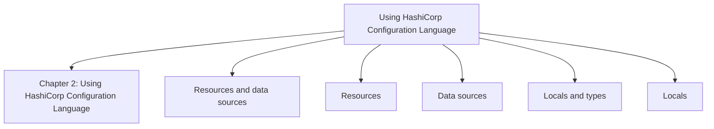

## Chapter 3: Harnessing HashiCorp Utility Providers

**Questions this chapter answers:**
- What does this chapter explain about Chapter 3: Harnessing HashiCorp Utility Providers?
- What does this chapter explain about Working with reality?
- What does this chapter explain about Randomizing?

**Key points:**
- Source section: Chapter 3: Harnessing HashiCorp Utility Providers.
- Source section: Working with reality.
- Source section: Randomizing.
- Source section: Working with time.

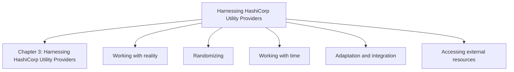

## Chapter 4: Foundations of Cloud Architecture – Virtual Machines and Infrastructure-as-a-Services

**Questions this chapter answers:**
- What does this chapter explain about Chapter 4: Foundations of Cloud Architecture – Virtual Machines and Infrastructure-as-a-Services?
- What does this chapter explain about Understanding the key concepts of networking?
- What does this chapter explain about Networking?

**Key points:**
- Source section: Chapter 4: Foundations of Cloud Architecture – Virtual Machines and Infrastructure-as-a-Services.
- Source section: Understanding the key concepts of networking.
- Source section: Networking.
- Source section: Subnets.

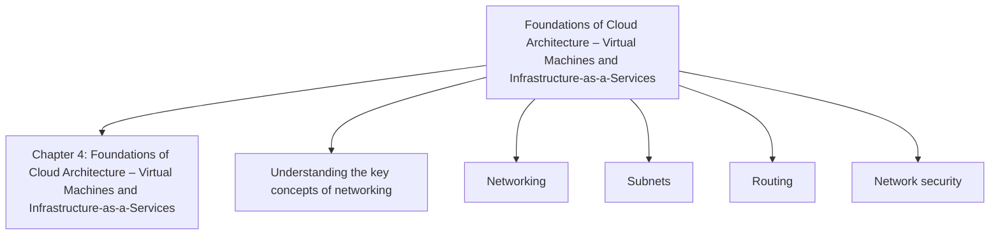

## Chapter 5: Beyond VMs – Core Concepts of Containers and Kubernetes

**Questions this chapter answers:**
- What does this chapter explain about Chapter 5: Beyond VMs – Core Concepts of Containers and Kubernetes?
- What does this chapter explain about Understanding key concepts of container architecture?
- What does this chapter explain about Containers?

**Key points:**
- Source section: Chapter 5: Beyond VMs – Core Concepts of Containers and Kubernetes.
- Source section: Understanding key concepts of container architecture.
- Source section: Containers.
- Source section: Leveraging Docker to build container images.

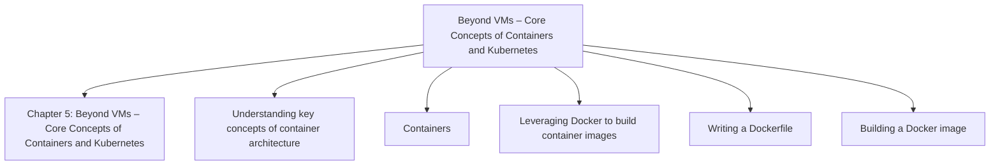

## Chapter 6: Connecting It All Together – GitFlow, GitOps, and CI/CD

**Questions this chapter answers:**
- What does this chapter explain about Chapter 6: Connecting It All Together – GitFlow, GitOps, and CI/CD?
- What does this chapter explain about Understanding key concepts of GitOps?
- What does this chapter explain about Understanding CI/CD?

**Key points:**
- Source section: Chapter 6: Connecting It All Together – GitFlow, GitOps, and CI/CD.
- Source section: Understanding key concepts of GitOps.
- Source section: Understanding CI/CD.
- Source section: Anatomy of pipeline.

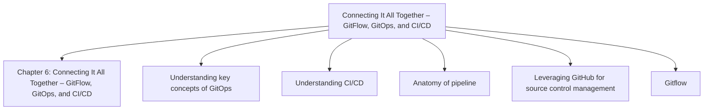

## Chapter 7: Getting Started on AWS – Building Solutions with AWS EC2

**Questions this chapter answers:**
- What does this chapter explain about Chapter 7: Getting Started on AWS – Building Solutions with AWS EC2?
- What does this chapter explain about Laying the foundation?
- What does this chapter explain about Designing the solution?

**Key points:**
- Source section: Chapter 7: Getting Started on AWS – Building Solutions with AWS EC2.
- Source section: Laying the foundation.
- Source section: Designing the solution.
- Source section: Cloud architecture.

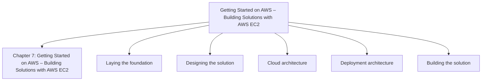

## Chapter 8: Containerize with AWS – Building Solutions with AWS EKS

**Questions this chapter answers:**
- What does this chapter explain about Chapter 8: Containerize with AWS – Building Solutions with AWS EKS?
- What does this chapter explain about Laying the foundation?
- What does this chapter explain about Designing the solution?

**Key points:**
- Source section: Chapter 8: Containerize with AWS – Building Solutions with AWS EKS.
- Source section: Laying the foundation.
- Source section: Designing the solution.
- Source section: Cloud architecture.

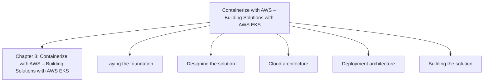

## Chapter 9: Go Serverless with AWS – Building Solutions with AWS Lambda

**Questions this chapter answers:**
- What does this chapter explain about Chapter 9: Go Serverless with AWS – Building Solutions with AWS Lambda?
- What does this chapter explain about Laying the foundation?
- What does this chapter explain about Designing the solution?

**Key points:**
- Source section: Chapter 9: Go Serverless with AWS – Building Solutions with AWS Lambda.
- Source section: Laying the foundation.
- Source section: Designing the solution.
- Source section: Cloud architecture.

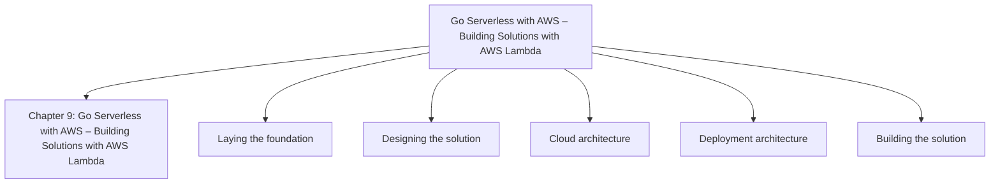

## Chapter 10: Getting Started on Azure – Building Solutions with Azure Virtual Machines

**Questions this chapter answers:**
- What does this chapter explain about Chapter 10: Getting Started on Azure – Building Solutions with Azure Virtual Machines?
- What does this chapter explain about Laying the foundation?
- What does this chapter explain about Designing the solution?

**Key points:**
- Source section: Chapter 10: Getting Started on Azure – Building Solutions with Azure Virtual Machines.
- Source section: Laying the foundation.
- Source section: Designing the solution.
- Source section: Cloud architecture.

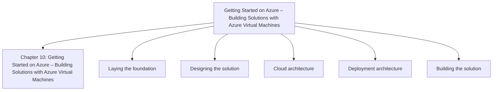

## Chapter 11: Containerize on Azure – Building Solutions with Azure Kubernetes Service

**Questions this chapter answers:**
- What does this chapter explain about Chapter 11: Containerize on Azure – Building Solutions with Azure Kubernetes Service?
- What does this chapter explain about Laying the foundation?
- What does this chapter explain about Designing the solution?

**Key points:**
- Source section: Chapter 11: Containerize on Azure – Building Solutions with Azure Kubernetes Service.
- Source section: Laying the foundation.
- Source section: Designing the solution.
- Source section: Cloud architecture.

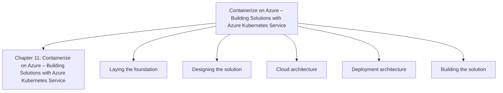

## Chapter 12: Go Serverless on Azure – Building Solutions with Azure Functions

**Questions this chapter answers:**
- What does this chapter explain about Chapter 12: Go Serverless on Azure – Building Solutions with Azure Functions?
- What does this chapter explain about Laying the foundation?
- What does this chapter explain about Designing the solution?

**Key points:**
- Source section: Chapter 12: Go Serverless on Azure – Building Solutions with Azure Functions.
- Source section: Laying the foundation.
- Source section: Designing the solution.
- Source section: Cloud architecture.

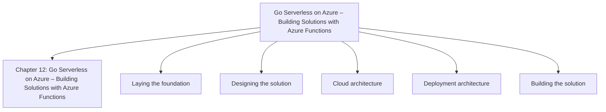

## Chapter 13: Getting Started on Google Cloud – Building Solutions with GCE

**Questions this chapter answers:**
- What does this chapter explain about Chapter 13: Getting Started on Google Cloud – Building Solutions with GCE?
- What does this chapter explain about Laying the foundation?
- What does this chapter explain about Designing the solution?

**Key points:**
- Source section: Chapter 13: Getting Started on Google Cloud – Building Solutions with GCE.
- Source section: Laying the foundation.
- Source section: Designing the solution.
- Source section: Cloud architecture.

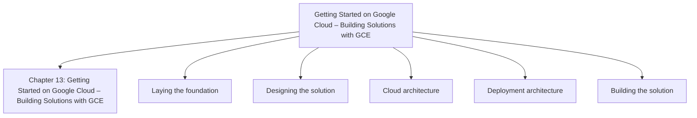

## Chapter 14: Containerize on Google Cloud – Building Solutions with GKE

**Questions this chapter answers:**
- What does this chapter explain about Chapter 14: Containerize on Google Cloud – Building Solutions with GKE?
- What does this chapter explain about Laying the foundation?
- What does this chapter explain about Designing the solution?

**Key points:**
- Source section: Chapter 14: Containerize on Google Cloud – Building Solutions with GKE.
- Source section: Laying the foundation.
- Source section: Designing the solution.
- Source section: Cloud architecture.

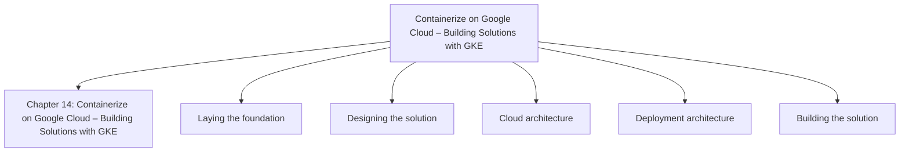

## Chapter 15: Go Serverless on Google Cloud – Building Solutions with Google Cloud Functions

**Questions this chapter answers:**
- What does this chapter explain about Chapter 15: Go Serverless on Google Cloud – Building Solutions with Google Cloud Functions?
- What does this chapter explain about Laying the foundation?
- What does this chapter explain about Designing the solution?

**Key points:**
- Source section: Chapter 15: Go Serverless on Google Cloud – Building Solutions with Google Cloud Functions.
- Source section: Laying the foundation.
- Source section: Designing the solution.
- Source section: Cloud architecture.

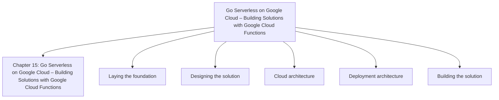

## Chapter 16: Already Provisioned? Strategies for Importing Existing Environments

**Questions this chapter answers:**
- What does this chapter explain about Chapter 16: Already Provisioned? Strategies for Importing Existing Environments?
- What does this chapter explain about Importing individual resources?
- What does this chapter explain about The import command?

**Key points:**
- Source section: Chapter 16: Already Provisioned? Strategies for Importing Existing Environments.
- Source section: Importing individual resources.
- Source section: The import command.
- Source section: Import block.

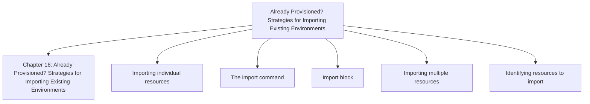

## Chapter 17: Managing Production Environments with Terraform

**Questions this chapter answers:**
- What does this chapter explain about Chapter 17: Managing Production Environments with Terraform?
- What does this chapter explain about Operating models?
- What does this chapter explain about State management?

**Key points:**
- Source section: Chapter 17: Managing Production Environments with Terraform.
- Source section: Operating models.
- Source section: State management.
- Source section: Standalone application.

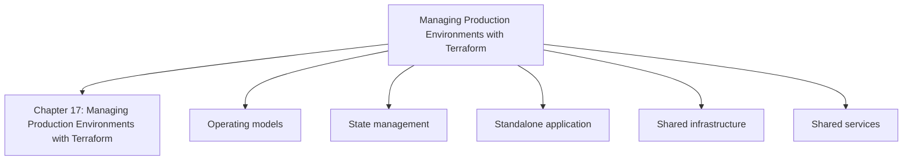

## Chapter 18: Looking Ahead – Certification, Emerging Trends, and Next Steps

**Questions this chapter answers:**
- What does this chapter explain about Chapter 18: Looking Ahead – Certification, Emerging Trends, and Next Steps?
- What does this chapter explain about Preparing for the exam?
- What does this chapter explain about Scope and topics?

**Key points:**
- Source section: Chapter 18: Looking Ahead – Certification, Emerging Trends, and Next Steps.
- Source section: Preparing for the exam.
- Source section: Scope and topics.
- Source section: Preparation.

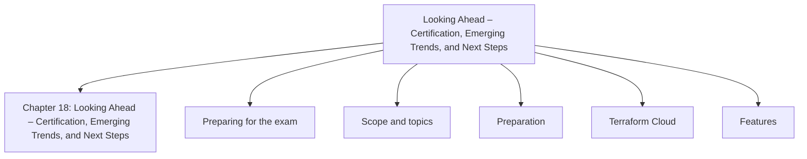
