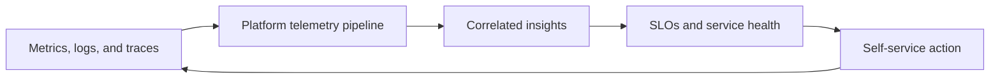

# Observability for Platform Engineers

*Weave Intelligence — Report*

## Agent guide

Describes observability as a shared platform capability that turns telemetry into operational insight and self-service feedback for application teams.
### Questions this chapter answers
- What role does observability play in a platform product?
- How can platform teams provide reusable telemetry and insights?
- How do SLOs and self-service workflows support developers and operators?
### Key points
- Platform observability should provide reusable signals rather than isolated dashboards.
- SLOs connect telemetry to service expectations and platform decisions.
- Self-service access helps development teams act on operational feedback.

## Conceptual diagram

## Detailed source transcript

### Page 1
Weave Intelligence
Observability for
platform engineers
WEAVE INTELLIGENCE PRESENTS
Observability for platform engineers
FIRST PUBLISHED IN 2025
### Page 2
02   Observability for platform engineers
The strategic role
	The rapid evolution toward distributed   To start, observability is simply a
	systems, microservices, and complex      property of the system: the ability to
	cloud-native environments has            reliably determine any internal state
	fundamentally broken traditional         by asking questions from the outside.
	monitoring paradigms. Today’s            If monitoring tells us something is
	platforms consist of layers of well-     wrong, observability provides the
	meaning but leaky abstractions,          essential context required to
	introducing an exponential amount of     understand why it is broken, diagnose
	complexity and moving parts that         incidents, and validate deployments. It
	make reliable operation difficult. For   is the indispensable foundation for
	CTOs, Platform Engineers, and DevEx      building trust and high confidence in
	leaders, the challenge is clear: an      modern systems.
	unobservable platform guarantees
	poor user experience, wasted             Platform engineering organizations
	engineering time, and constant           must strategically address this
	guessing during incidents.
	challenge by treating observability not
		as an afterthought or a collection of
		This complexity mandates a strategic     siloed tools, but as a key platform
		shift from mere monitoring, the          capability. Platform teams bear the
		practice of collecting telemetry to      dual responsibility of observing their
		genuine observability. As a companion    own infrastructure (Kubernetes, CI/
		piece to the Platform Engineering        CD, shared services) and enabling
		University course, Observability for     application developers to observe
		Platform Engineers, this report will     their own applications efficiently.
		break down exactly what observability    Success requires abstracting away
		is, why it matters for platform          complexity and providing a "paved
		engineers, and what we can do to         path to visibility".
		prepare ourselves for the future.
		Platform engineering organizations must strategically
		address this challenge by treating observability not as an
		afterthought or a collection of siloed tools, but as a key
		platform capability.
### Page 3
03   Observability for platform engineers
	This is achieved through aggressive           The future is clear. Observability is not
	automation and rigorous adherence
	an isolated domain. It is a core part of
		to open standards. The adoption of            the platform engineering puzzle and
		OpenTelemetry (OTel), the
		should be treated as such. Investing in
			vendor-neutral standard for collecting        a structured, standards-based
			and structuring telemetry data, is a          observability platform is a strategic
			crucial part of this. OTel provides the       decision that future-proofs your
			unified APIs, semantic conventions,           infrastructure and your organization.
			and standardized protocols necessary          Observability is no longer a cost
			to ensure consistent, correlated data         center; when integrated correctly, it
			(logs, metrics, traces) across all teams      becomes a “capability multiplier
			and environments. By leveraging tools         for scaling the engineering
			like the OpenTelemetry Operator to            organization, dramatically improving
			enable auto-instrumentation,
		platform reliability, accelerating
			platform teams remove manual toil,            incident resolution, and maximizing
			enforce telemetry hygiene, and
		developer productivity.
			allow developers to focus on core
			business logic while receiving insights
			by default.
			Key take-aways from this report
01                   Observability is strategic,    Modern distributed systems demand more than alerts.
	not just monitoring            Observability explains why issues happen, not just that
		something is wrong, enabling faster, confident
		resolution.
02                   Platform engineers have        They must maintain operational visibility of shared
	a dual mandate                 infrastructure while empowering developers with
		effortless, consistent telemetry to reduce friction
		and rework
03                   Standards and                  Manual instrumentation fails at scale. Enforcing
	automation unlock scale        semantic conventions and automating data collection
		with OpenTelemetry ensures reliable, high-quality
		insights across teams.
04                   Treat observability as a       Embed it as a self-service capability with paved paths,
	platform product               golden defaults, and clear guardrails. This future-proofs
		infrastructure and maximizes developer productivity.
### Page 4
04   Observability for platform engineers
What is Observability?
	As we navigate increasingly complex,       form and test hypotheses rapidly to
	distributed, and cloud-native systems,     resolve the issue.
	the distinction between monitoring
	and observability is increasingly          Traditional monitoring has proven ever
	misunderstood. Observability is the        more insufficient as layers upon layers
	ability to reliably determine any          of well-meaning, but leaky,
	internal state of a system simply by       abstractions are added to modern
	asking questions from the outside. It is   infrastructure, particularly with the
	the state of understanding.                rise of microservices and complex
	Monitoring, conversely, is the practical   Kubernetes environments. This
	act of collecting and processing the       complexity introduces countless
	telemetry data (or signals) necessary      moving parts and failure modes that
	to attain that property. While             demand more than simple health
	monitoring is essential for alerting       checks; they require actual insights to
	engineers of issues, observability         ensure system health and build
	provides the context necessary to          confidence in pushing changes to
	explain precisely why something            production.
	might be broken and allows teams to
	Evolving beyond the three pillars
	Historically, observability discussions    Each signal serves a specific purpose
	revolved around the “three pillars”:       in this narrative: Metrics are effective
	logs, metrics, and traces. While these     time series used for identifying trends,
	types of telemetry remain core, the        tracking key indicators (like latency or
	metaphor of pillars did not age well, as   error rate), and driving alerts. Logs
	it fails to convey the importance of       provide detailed, temporal records of
	having these data types seamlessly         events, crucial for forensic analysis
	correlated with one another. Modern        and error context. Traces (composed
	observability treats them not as           of spans) track the full journey of a
	standalone silos, but as                   single user request across multiple
	interconnected signals that                services, highlighting timing,
	collectively form a complete narrative     dependencies, and bottlenecks in
	of system behaviour.                       distributed architectures.
### Page 5
05   Observability for platform engineers
	Furthermore, this converged view integrates signals like production profiles
	(revealing what code is consuming CPU or memory at runtime) and Real User
	Monitoring (RUM), which captures end-user experience directly from the
	browser or mobile application.
	The importance of context and quality
	The convergence of these signals is          To evaluate telemetry quality, leaders
	meaningless, however, if the                 must ensure their data addresses four
	underlying data lacks coherence.             key areas: Semantics (What does the
	Telemetry without context is just data       data represent, and is it clearly
	(or noise). When telemetry is                defined), Context (Does it capture
	confusing, engineers often draw hasty        where and under what conditions it
	and wrong conclusions, exacerbating          was generated, such as the service
	incident response times.
	version or cloud region), Relations (Is it
		linked to related signals, like a log
		To transform raw data into insights we       pointing to a trace), and Accuracy (Is
		can actually act on, telemetry must be       the data correct and reliable).
		intentionally designed to be high-
		quality and trustworthy.                     This emphasis on quality necessitates
			moving away from merely
			instrumenting everything toward
70%
	designing telemetry that answers
	of platform teams cite “data noise and
	lack of context” as the main cause of        specific questions about system
	prolonged outages.                           failure modes.
	To be able to use telemetry effectively to achieve the observability
	of a platform, you really need to understand it. You need to know
	what that telemetry represents. You need to know from which
	system it is coming from. You need to know how different pieces
	of telemetry are related with each other.
	Michele Mancioppi
	Head of Product, Founding Engineer @ Dash0
### Page 6
06   Observability for platform engineers
	Standardization through
	Semantic Conventions
	Achieving context at scale across           These attributes are essential for
	dozens or hundreds of services              grouping, filtering, and joining
	requires standardization. This is where     telemetry meaningfully, especially in
	Semantic Conventions become                 multi-tenant or multi-cluster
	foundational. These conventions,            environments.
	driven primarily by the OpenTelemetry
	(OTel) standard, define the common          Another "superpower" of modern
	vocabulary for telemetry, naming rules      observability is Cross-Signal
	for traces, logs, and metrics. Without      Correlation. By linking metrics, logs,
	them, teams invent conflicting labels,      and traces using shared resource
	leading to broken queries and useless       attributes and trace context
	dashboards. With these standards,           propagation, operators can fluently
	telemetry becomes portable,                 navigate from a high-level metrics
	composable, and reusable across             alert to a specific trace showing the
	different teams and tools.
	slow path, and then to the correlated
		log lines detailing the error. This
		Crucially, OpenTelemetry allows the         capability dramatically reduces Mean
		use of Resource Attributes (metadata        Time to Resolution (MTTR) and
		like [service.name](http://service.name), cloud.region, or         improves overall system confidence.
		[k8s.pod.name](http://k8s.pod.name)) across all signals (logs,
		metrics, and traces).
		Teams using standardized telemetry see up to 44% faster
		incident resolution by eliminating conflicting labels and
		enabling seamless signal correlation.
		As platform complexity increases, managing the entire lifecycle of telemetry,
		from intentional collection and rigorous standardization to reliable correlation,
		becomes the non-negotiable responsibility of the platform engineering team.
		This is the strategic layer that ensures developers receive visibility by default
		and the platform remains robust.
### Page 7
07   Observability for platform engineers
Why observability matters
for platform engineers
	For platform engineers, observability      regarding system visibility. First, they
	is not merely monitoring with a new       must meticulously observe the health
	name; it is fundamental to success in     of the platform infrastructure itself,
	delivering a functional and satisfying    including Kubernetes clusters, cloud
	platform experience.
	resources, databases, message
		brokers, and CI/CD pipelines.
		Because platform teams are
		responsible for managing the              This platform observability involves
		increasing levels of complexity           tracking resource usage, errors, and
		underpinning applications,                interactions across services and
		observability is mission-critical for     tenants to build confidence that
		detecting and troubleshooting issues      changes can be pushed to production
		fast, ensuring fixes are effective, and   safely. Second, the platform team
		ultimately helping developers
	must act as a provider, effectively
		deliver a good user experience to
	enabling developers by building
		their own users. Platform engineers       "observability as a service" for
		operate with two distinct, but            application teams.
		interconnected, responsibilities
### Page 8
08   Observability for platform engineers
	Reducing developer toil
	The future is clear. Observability is not an isolated domain. It is a core
	part of the platform engineering puzzle and should be treated as such.
	Investing in a structured, standards-based observability platform is a
	strategic decision that future-proofs your infrastructure and your
	organization.
	Observability is no longer a cost center; when integrated correctly, it
	becomes a “capability multiplier” for scaling the engineering
	organization, dramatically improving platform reliability, accelerating
	incident resolution, and maximizing developer productivity.
	Shifting observability down into the platform makes visibility effortless and
	consistent. By baking in standards, automation, and context, teams cut manual
	setup, reduce tool drift, and speed root-cause analysis.
63%                  of organizations plan to increase Observability
	investment over the next 2 years
71%                  of organizations use OpenTelemetry or
	Prometheus in some form
2.6x                 average ROI from observability spending, via improved
	developer productivity and operational efficiency
### Page 9
09   Observability for platform engineers
	Correlation as a superpower
	The strategic value of platform-managed observability lies in its ability
	to seamlessly connect different telemetry signals. When logs, metrics,
	and traces are reliably tied together via shared resource attributes and
	trace context, operators gain the superpower to move fluently between
	them during an incident.
	For example, platform teams can navigate instantly from a latency spike
	identified in a metric alert to a specific trace showing a slow
	downstream service, and then to correlated logs that reveal the
	deployment change responsible. This cross-signal fluency dramatically
	reduces Mean Time to Resolution (MTTR) and builds overall system
	confidence and operational reliability.
	By embracing the mindset of Observability as a Product, a core feature
	designed with care for internal developer platform customers, platform
	engineers deliver self-service telemetry, guardrails for compliance, and
	standardized collection. This foundational capability directly shapes the
	developer experience and ensures operational reliability, which sets the
	stage for defining the practical standards and best practices that scale
	this new way of thinking.
### Page 10
10   Observability for platform engineers
Insights & best practices
	Successfully implementing an               enforcing telemetry conventions and
	observability strategy requires            standards through automated
	platform engineering teams to shift        processes.
	their focus from simply selecting tools
	to aggressively operationalizing           OpenTelemetry is key to enabling this.
	standards and automation. Manual           Its unified APIs and semantic
	instrumentation and ad-hoc practices       conventions create a single, vendor-
	do not scale; they lead to gaps in         neutral way to collect and structure
	coverage, noisy data, duplicate efforts,   logs, metrics, and traces. The
	and increased toil for developers. By      OpenTelemetry Collector centralizes
	treating observability as a product        control, letting platform teams shape,
	capability baked into the infrastructure   route, and enrich data without
	with clear defaults, platform engineers    touching application code. This
	ensure that visibility is consistent,      standardization and automation make
	reliable, and effortless for internal      observability scalable, cost-effective,
	customers. The goal is to remove           and easy to evolve as the platform
	repetitive, manual work (toil) by          grows.
	OpenTelemetry is the go-to standard for collecting data about how
	applications and platforms work
### Page 11
11   Observability for platform engineers
	five practical insights you should prioritize
	Automate instrumentation at scale
	Modern distributed systems demand more than alerts. Observability explains why issues
	happen, not just that something is wrong, enabling faster, confident resolution. Modern
	distributed systems demand more than alerts. Observability explains why issues happen, not
	just that something is wrong, enabling faster, confident resolution.
	Standardize Telemetry with OpenTelemetry
	High-quality telemetry requires consistency and meaning. Semantic Conventions,
	standardized by the OpenTelemetry project, define a common vocabulary for logs, metrics,
	and traces (e.g., [service.name](http://service.name), http.response.status_code). Without shared conventions,
	custom labels, and mismatched field names, broken queries and brittle dashboards are
	certain. Platform engineers must define and enforce these standards, making telemetry
	portable, queryable, and reusable across all services.
	Centralize control with the OTel Collector
	The OpenTelemetry Collector is the platform’s telemetry router and policy engine. It receives,
	processes, and routes data to chosen destinations. From this central point, platform
	engineers can cut costs by sampling high-volume traces, enforce compliance by redacting
	sensitive fields, or drop debug logs without changing application code.
	Implement GitOps for configurations
	Dashboards and alerts should be treated as code for consistency and easy recovery. With
	tools like Perses, teams can define dashboards in YAML, version them in Git, and deploy via
	CI/CD. This Dashboards-as-Code approach removes manual UI edits, enables review
	through pull requests, and keeps dashboards portable across tools. The same you should be
	doing with alert rules.
	Provide paved paths and smart defaults
	Platform teams should build opinionated golden paths that deliver value fast: auto-
	instrumentation, standard dashboards, and pre-set alerts and sampling. The goal is to give
	developers a head start, not restrict them. Observability should work out of the box with
	guardrails for compliance, yet allow teams to adjust defaults as needed.
### Page 12
12   Observability for platform engineers
Conclusion: Observability
is a force multiplier
	Our industry is facing a strategic            semantic conventions, ensure data
	evolution from traditional monitoring         consistency, and create "paved paths
	to modern observability, establishing it      to visibility".
	as the fundamental property in
	navigating today’s complex,                   The call to action is clear: investment
	distributed systems. For platform             and focus on standardized, automated
	engineers, observability is defined by a      observability is a key lever in
	dual mandate: maintaining operational         advancing your organization towards
	visibility of critical infrastructure while   the future. This approach reduces
	actively enabling developers with             duplication, eliminates vendor lock-in,
	consistent, high-quality telemetry            and ensures logs, metrics, and traces
	(logs, metrics, and traces). The              are reliably correlated - the
	strategic challenge is beyond tools, to       superpower for resolving incidents
	the operationalization of observability.
	quicker and building incredible system
		confidence. By embedding these
		The path forward is defined by                practices down into the platform now,
		adopting a Platform as a Product              your Internal Developer Platform
		mindset, viewing observability not as a       becomes more adaptable, future-
		checklist or a separate system, but as a      proofing infrastructure, reducing
		core, self-service feature designed for       technical toil, and shifting
		internal users. This requires platform        observability from a cost centre to a
		teams to aggressively implement               force multiplier.
		automation, primarily through the
		OpenTelemetry standard, to enforce            The math couldn’t be easier.
		Observability for Platform Engineers
		This report is a companion piece for the 5 module Observability course
		on Platform Engineering University
			Registe
				Register now
## Code map
- No matching code repository has been identified for this book.
## Source note
This is the complete generated chapter transcript. Source identity and status are recorded in the database properties.
