# Observability in the AI-Native Era

*Andreas Grabner, Hilliary Lipsig, Robert Rati, Max Körbächer — Book*

## Chapter 1: Observability: The Art of Turning Data into Insights

**Questions this chapter answers:**
- What does this chapter explain about Chapter 1: Observability: The Art of Turning Data into Insights?
- What does this chapter explain about What is observability??
- What does this chapter explain about What is observability and how does it differ from monitoring??

**Key points:**
- Source section: Chapter 1: Observability: The Art of Turning Data into Insights.
- Source section: What is observability?.
- Source section: What is observability and how does it differ from monitoring?.
- Source section: Let's ask ChatGPT!.

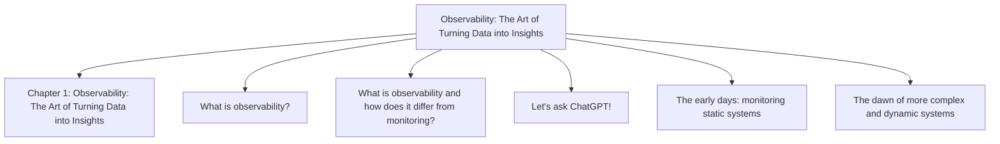

## Chapter 2: The Elephant in the Room: Artificial Intelligence

**Questions this chapter answers:**
- What does this chapter explain about Chapter 2: The Elephant in the Room: Artificial Intelligence?
- What does this chapter explain about Technical requirements?
- What does this chapter explain about Why the hype around AI? What is AI good for??

**Key points:**
- Source section: Chapter 2: The Elephant in the Room: Artificial Intelligence.
- Source section: Technical requirements.
- Source section: Why the hype around AI? What is AI good for?.
- Source section: AI versus automation.

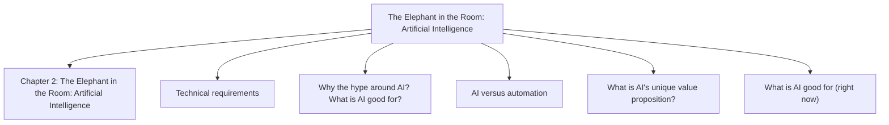

## Chapter 3: From Observability to AIOps and the Use Cases it Solves Today

**Questions this chapter answers:**
- What does this chapter explain about Chapter 3: From Observability to AIOps and the Use Cases it Solves Today?
- What does this chapter explain about When data on glass and static alerts fail?
- What does this chapter explain about Alternatives to static alerts on infrastructure metrics?

**Key points:**
- Source section: Chapter 3: From Observability to AIOps and the Use Cases it Solves Today.
- Source section: When data on glass and static alerts fail.
- Source section: Alternatives to static alerts on infrastructure metrics.
- Source section: Static thresholds: where they make sense.

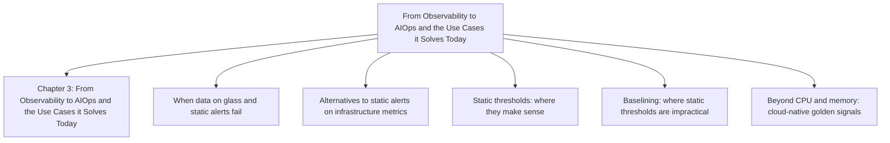

## Chapter 4: ACME Financial Services: Implementing AIOps

**Questions this chapter answers:**
- What does this chapter explain about Chapter 4: ACME Financial Services: Implementing AIOps?
- What does this chapter explain about Technical requirements?
- What does this chapter explain about Our fictitious company?

**Key points:**
- Source section: Chapter 4: ACME Financial Services: Implementing AIOps.
- Source section: Technical requirements.
- Source section: Our fictitious company.
- Source section: After the great cloud migration.

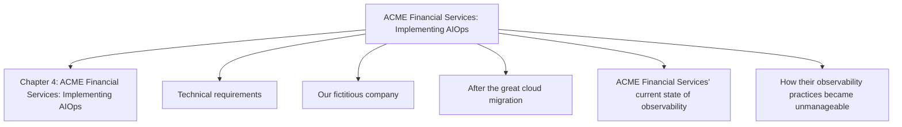

## Chapter 5: Democratizing Observability: A Primer to Self-Service Platforms

**Questions this chapter answers:**
- What does this chapter explain about Chapter 5: Democratizing Observability: A Primer to Self-Service Platforms?
- What does this chapter explain about Technical requirements?
- What does this chapter explain about What is a self-service platform??

**Key points:**
- Source section: Chapter 5: Democratizing Observability: A Primer to Self-Service Platforms.
- Source section: Technical requirements.
- Source section: What is a self-service platform?.
- Source section: Kubernetes standardization.

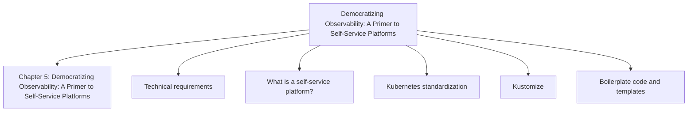

## Chapter 6: The Observability Agent: Real-Life Use Cases

**Questions this chapter answers:**
- What does this chapter explain about Chapter 6: The Observability Agent: Real-Life Use Cases?
- What does this chapter explain about Agentic AI and MCP: How it can revolutionize modern cloud-native organizations?
- What does this chapter explain about Recap on agentic AI, LLMs, and MCP?

**Key points:**
- Source section: Chapter 6: The Observability Agent: Real-Life Use Cases.
- Source section: Agentic AI and MCP: How it can revolutionize modern cloud-native organizations.
- Source section: Recap on agentic AI, LLMs, and MCP.
- Source section: The four phases of agentic AI.

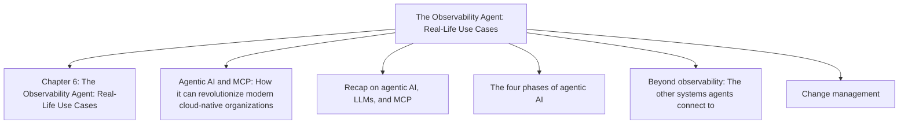

## Chapter 7: ACME Financial Services: How to Move from AIOps to Agentic Platforms

**Questions this chapter answers:**
- What does this chapter explain about Chapter 7: ACME Financial Services: How to Move from AIOps to Agentic Platforms?
- What does this chapter explain about Technical requirements?
- What does this chapter explain about Once more into the breach?

**Key points:**
- Source section: Chapter 7: ACME Financial Services: How to Move from AIOps to Agentic Platforms.
- Source section: Technical requirements.
- Source section: Once more into the breach.
- Source section: The cost drivers.

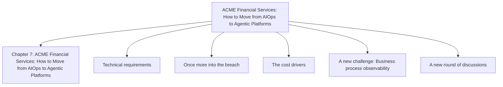

## Chapter 8: Evolving Operations: Proactive \> Preventive \> Self-Driven Architecture

**Questions this chapter answers:**
- What does this chapter explain about Chapter 8: Evolving Operations: Proactive \> Preventive \> Self-Driven Architecture?
- What does this chapter explain about Technical requirements?
- What does this chapter explain about Defining our terms?

**Key points:**
- Source section: Chapter 8: Evolving Operations: Proactive \> Preventive \> Self-Driven Architecture.
- Source section: Technical requirements.
- Source section: Defining our terms.
- Source section: Differentiating proactive versus preventative versus self-driven.

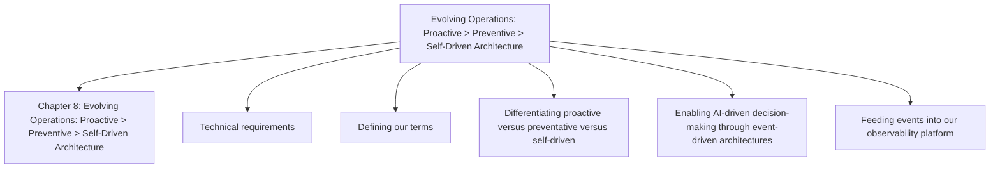

## Chapter 9: No Future Without Challenges

**Questions this chapter answers:**
- What does this chapter explain about Chapter 9: No Future Without Challenges?
- What does this chapter explain about Technical requirements?
- What does this chapter explain about Building trust in the AI?

**Key points:**
- Source section: Chapter 9: No Future Without Challenges.
- Source section: Technical requirements.
- Source section: Building trust in the AI.
- Source section: Regular dry runs.

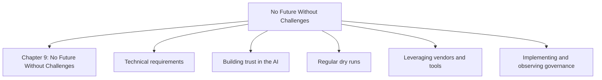

## Chapter 10: ACME Financial Services: How Will the AI Future Shape Our Company?

**Questions this chapter answers:**
- What does this chapter explain about Chapter 10: ACME Financial Services: How Will the AI Future Shape Our Company??
- What does this chapter explain about Technical requirements?
- What does this chapter explain about Our story thus far?

**Key points:**
- Source section: Chapter 10: ACME Financial Services: How Will the AI Future Shape Our Company?.
- Source section: Technical requirements.
- Source section: Our story thus far.
- Source section: Evolving trust in the observability platform.

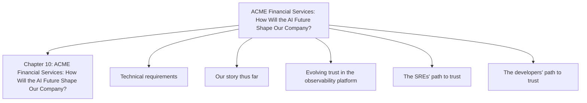

## Chapter 11: Unlock Your Exclusive Benefits

**Questions this chapter answers:**
- What does this chapter explain about Chapter 11: Unlock Your Exclusive Benefits?
- What does this chapter explain about Unlock this Book's Free Benefits in three Easy Steps?
- What does this chapter explain about Step 1?

**Key points:**
- Source section: Chapter 11: Unlock Your Exclusive Benefits.
- Source section: Unlock this Book's Free Benefits in three Easy Steps.
- Source section: Step 1.
- Source section: Step 2.

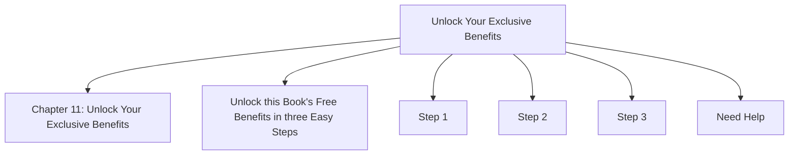
