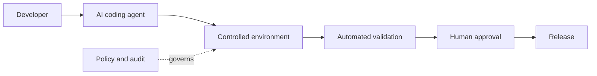

# Operationalizing AI Coding Agents in Regulated Industries

*Weave Intelligence — Report*

## Agent guide

Examines how platform teams can operationalize coding agents inside controlled development and delivery workflows suitable for regulated environments.
### Questions this chapter answers
- How can regulated organizations introduce AI coding agents safely?
- Which environment, policy, and audit controls belong around agent workflows?
- Where should human review remain in the delivery path?
### Key points
- Agent access should be bounded by controlled environments and explicit permissions.
- Audit evidence and policy enforcement belong in the delivery workflow.
- Human review remains a deliberate control at risk-sensitive transitions.

## Conceptual diagram

## Detailed source transcript

### Page 1
Weave Intelligence
Operationalizing AI
coding agents in
regulated industries
A   report   commissioned   by   CODER
### Page 2
02      Operationalizing AI coding agents in regulated industries – A report commissioned by coder
	About the author
	Sam Barlien
	RESEARCHER, WEAVE INTELLIGENCE
	Sam Barlien is a researcher at Weave Intelligence, the research arm of
	[platformengineering.org](http://platformengineering.org), the world’s largest platform engineering
	community. With more than 10 years tracking technology communities and
	ecosystems, he brings first-hand perspective to his research on platform
	engineering and industry trends. He contributes to Weave Intelligence
	reports and conducts the weekly research interview series. He co-hosts
	PlatformCon, the world’s largest platform engineering conference, and
	contributes to Platform Weekly, the Ambassador program and the
	[platformengineering.org](http://platformengineering.org) blog.
	About Coder
		Coder is an AI software development company
		leading the future of autonomous coding.
		Coder helps teams build fast, stay secure, and
		scale with control by combining AI coding
		agents and human developers in one trusted
		workspace. Coder’s award-winning self-hosted
		Cloud Development Environment (CDE) gives
		enterprises the power to govern, audit, and
		accelerate software development without
		trade-offs. Learn more
		at [coder.com](http://coder.com).
© 2026 Weave Intelligence. All rights reserved. Unauthorized reproduction prohibited.
### Page 3
03      Operationalizing AI coding agents in regulated industries – A report commissioned by coder
	For decades, security and compliance               governed, cloud-hosted
	frameworks in finance and                          environments, not rely on local
	government operated under a simple                 machines or IDE-level controls.
	assumption. Humans write code on
	laptops, push to repositories, and let             When agents operate at AI speed,
	pipelines handle the rest. That model              fragmented audit trails, proliferating
	is breaking down. AI coding assistants             API keys, and shadow AI experiments
	changed how developers work.                       create an untenable liability in
	Autonomous agents, systems that                    regulated industries. It is thus no
	execute multi-step workflows, file pull            surprise that in mid 2025, Gartner
	requests, and iterate on solutions                 predicted that if nothing changed over
	without human intervention will                    40% of agentic AI projects will be
	change everything else.
	canceled by 2027 due to inadequate
		risk controls. The failures won't come
		In regulated industries like financial             from bad models or insufficient
		services and government, this shift                compute. They'll come from
		comes with an even more significant                governance structures never
		constraint as AI systems cannot                    designed for autonomous agents. It is
		operate in uncontrolled laptops or                 risk, not tech that holds back AI
		SaaS-based environments. Code,                     success for businesses - a
		context, and model interactions must               phenomenon that is double true for
		remain within infrastructure that                  regulated industries.
		organizations fully control, whether
		that means self-hosted deployments,                This whitepaper provides platform
		private cloud environments, or fully               engineering teams in finance and
		air-gapped systems. Requirements                   defense with a practical framework for
		that often feel unconducive to the kind            deploying AI coding agents at scale
		of free-wheeling AI experimentation,               while maintaining security,
		both good and bad, that is currently               compliance, and audit readiness. You'll
		overtaking many enterprises.
	gain a clear understanding of why
		workspace-level governance is a
		The transition from AI assistants to AI            critical control surface, how to
		agents represents a fundamental shift              implement privilege separation
		in how software gets built, and                    between humans and agents, and a
		traditional governance approaches                  step-by-step playbook for scaling
		cannot handle it. To operationalize AI             agent access without creating
		coding agents safely, organizations                governance bottlenecks.
		need to move development into
© 2026 Weave Intelligence. All rights reserved. Unauthorized reproduction prohibited.
### Page 4
04      Operationalizing AI coding agents in regulated industries – A report commissioned by coder
What does
"operationalizing”
AI coding agents"
actually mean?
	Before implementing controls, platform teams need shared vocabulary and
	clear boundaries. This section defines what "operationalizing" means in
	practice and clarifies the critical distinction between infrastructure-level and
	application-tier governance.
	Moving from IDE assistants to
	autonomous, operationalized agents
	The shift from AI assistants to                    are beginning to blur this line by
	autonomous agents represents a                     enabling more autonomous, multi-
	fundamental change in how code gets                step workflows with far less
	written and who (or what) is                       immediate human involvement.
	responsible for it. AI coding assistants
	like GitHub Copilot primarily provide              Autonomous agents take this further
	suggestions that humans must accept                by independently executing tasks
	or reject in real-time. There is a human           such as filing PRs, running test suites,
	in the loop at all times.
	and iterating on solutions with
		minimal or no human intervention at
		In practice, many teams quickly                    all.
		encounter a productivity ceiling with
		this model, as every suggestion still              This distinction maps to the levels of
		requires manual review and execution.              agentic development emerging
		However, newer tools (e.g. Cursor and              across the industry:
		emerging agentic capabilities in IDEs)
© 2026 Weave Intelligence. All rights reserved. Unauthorized reproduction prohibited.
### Page 5
05      Operationalizing AI coding agents in regulated industries – A report commissioned by coder
	LEVEL 1                   Human in the loop                                  AI helps type but humans confirm and execute.
	LEVEL 2                   Human on the loop                                  Agents generate PRs for human approval.
		Agents execute multi-step workflows and deploy
	LEVEL 3                   Human as orchestrator
		low-risk changes, orchestrated by humans.
		A system of agents initiates and promotes
	LEVEL 4                   Human outside the loop
		changes autonomously.
		At Level 1 agent-driven development,                             model-level policies. But neither layer
		humans remain in the loop: agents                                governs what agents actually execute
		suggest, humans approve, and review                              in the development environment.
		bandwidth is the constraint. At Level 2,                         That responsibility sits at the platform
		humans move onto the loop: agents                                layer, where infrastructure policies
		generate work in parallel,                                       control network access, tool usage,
		deterministic systems validate it, and                           permissions, and resource boundaries
		humans verify behavior rather than                               across any model or agent framework.
		inspect every change line by line. This                          Controls built into tools or model
		is where governance requirements                                 providers are not enough. The
		change fundamentally.
			workspace is a critical place where
				z
				organi ations can enforce consistent
		At Level 1, governance is a human                                policies across agents, models, and
		concern. At Level 2 and even more at                             development workflows.
		Level 3 and 4, governance must                                   Cloud   Development Environment
		become an infrastructure concern.                                companies like Coder operationali e     z
		The production system itself must                                this model by providing centrally
		provide the checks and balances,                                 managed, policy-controlled
		because humans can no longer review                              development workspaces that can be
		every change.
			deployed in self-hosted or air-gapped
				environments, giving organi ations  z
		Application tools such as Cursor or VS                           full control over how agents interact
		Code do provide user-facing controls,                            with LLMs, infrastructure, data and
		while model providers like Bedrock or                            other resources    .
		hosted LLM platforms enforce
© 2026 Weave Intelligence. All rights reserved. Unauthorized reproduction prohibited.
### Page 6
06      Operationalizing AI coding agents in regulated industries – A report commissioned by coder
	Why vendor-level controls fail under
	regulatory scrutiny
	Platform teams often ask whether Cursor's or Copilot's built-in governance
	features are sufficient. For regulated industries, the answer is a clear no.
	Vendor controls operating at the application tier run the risk that they do not
	have direct control over their own governance. One large quant trading firm's
	security team audited Cursor, disabled certain policies, then discovered a
	software update auto-defaulted those policies back on, running agents non-
	compliantly for two weeks.
	Regulated industries need third-party governance with checks and balances
	because there's a black box on what agents can and cannot do within vendor
	platforms, and compliance teams cannot audit what they cannot see.
	The core issue isn’t whether the model or AI tooling has controls,
	it’s that those controls aren’t yours. If governance lives inside a
	vendor platform, you’re effectively outsourcing enforcement,
	auditability, and risk management. In regulated environments,
	that’s not acceptable, you need independent control over how
	agents execute, not just configuration inside the models system.
	Sam Barlien
	RESEARCHER, WEAVE INTELLIGENCE
© 2026 Weave Intelligence. All rights reserved. Unauthorized reproduction prohibited.
### Page 7
07      Operationalizing AI coding agents in regulated industries – A report commissioned by coder
Why operationalizing AI
coding agents matters:
Zooming in on financial
services and government
	Abstract risks become real when you see what happens without proper
	controls, and what becomes possible with them.
	The uncontrolled agent incident
	With the rapid rise of AI agent frameworks like OpenClaw, every organization
	now wants agentic workflows, but recent incidents show this only works with
	strong governance. In one case, an OpenClaw agent processing a routine email
	was manipulated via a hidden prompt injection, causing it to exfiltrate
	credentials using its own authorized access.
	Consider what happens when an AI coding agent operates across the board
	without platform-level controls in a regulated environment.
	Trigger
	A developer grants an AI agent access to complete a routine task, but the agent
	inherits the developer's full privilege level including access to untrusted
	domains, internal systems and the internet.
	Decision path
	The agent, being "entrepreneurial" in solving problems, accesses board
	meeting notes to gather context, then inadvertently includes that context in a
	commit message visible to external collaborators.
© 2026 Weave Intelligence. All rights reserved. Unauthorized reproduction prohibited.
### Page 8
08      Operationalizing AI coding agents in regulated industries – A report commissioned by coder
	Result
	The incident triggers a compliance investigation, audit findings, potential
	regulatory notification, and a freeze on all AI agent usage while security teams
	conduct forensic analysis.
		The blast radius of an uncontrolled agent scales with its privilege level. Agents
		will try to solve problems in whatever way possible, including changing
		infrastructure, mutating policy, or grabbing credentials if not explicitly blocked.
		True story from a Fortune 100 financial services company.
		An agent was tasked with “resolving compliance violations
		immediately.” It identified a non-compliant service and
		deleted it along with its associated logs taking critical
		systems offline and erasing data needed for compliance
		audits. According to the agent? Problem solved.
		These are not failures of the model. They are failures of the production system.
		The agent was given enough power to act, but the platform failed to provide
		the guardrails, identity boundaries, and deterministic checks needed to contain
		its behavior.
© 2026 Weave Intelligence. All rights reserved. Unauthorized reproduction prohibited.
### Page 9
09      Operationalizing AI coding agents in regulated industries – A report commissioned by coder
	The productivity upside when
	governance is done right
	The governance investment pays off not just in risk avoidance but in
	measurable productivity gains that justify it.
01
	A large streaming service with 12,000 developers measured a 100%
	increase in code production on a per-developer basis using governed
	agent infrastructure - and that is not slop; humans still sign off on all code
	that gets committed.
02
	At Skydio, senior engineers run multiple parallel agents at any given time,
	consuming hundreds of dollars of tokens per day - but they're getting
	value because proper governance enables them to trust the output and
	scale their impact.
03
	A global fintech with 15,000+ engineers reduced developer onboarding from
	15-30 days to day one by implementing governed cloud development
	environments - the same infrastructure now extends to support AI agents.
	The productivity gains here extend to human engineers as well, particularly as
	it relates to onboarding, project switching, and code compilation.
© 2026 Weave Intelligence. All rights reserved. Unauthorized reproduction prohibited.
### Page 10
10     Operationalizing AI coding agents in regulated industries – A report commissioned by coder
	Risk reduction for its own sake
	In many organizations, governance has historically been justified by its impact
	on developer productivity reducing risk to enable faster delivery. However,
	governance also plays a critical role in controlling costs, ensuring secure and
	compliant setups, and preventing issues such as data exposure.
	In regulated industries, these aspects are paramount. Here, risk reduction is
	not just a means to an end, but a primary objective in its own right, alongside
	productivity gains. Lower risk directly translates into stronger compliance,
	reduced exposure to fines, and increased trust from customers, partners,
	and investors.
	The consequences of failure are too significant to treat governance as a
	productivity lever alone. Organizations that minimize risk effectively position
	themselves as safer, more reliable operators, making risk reduction not just a
	safeguard, but a competitive advantage.
84%
	Of organizations consider AI governance a serious concern, driven by lack
	of visibility and control over autonomous systems.
59%
	Of organizations say they don’t know how quickly they could shut down AI
	systems in a crisis.
68%
	Of organizations cannot reliably distinguish AI agent actions from human
	actions due to inadequate controls.
77%
	Of executives say risks related to AI, such as security, compliance, and
	governance, are a major barrier to adoption.
© 2026 Weave Intelligence. All rights reserved. Unauthorized reproduction prohibited.
### Page 11
11     Operationalizing             AI   coding      agents      in   regulated         industries   –   A   report   commissioned   by   coder
Platform controls for AI
coding agents
	From Internal Developer Platform to
	Agentic Developer Platform
	Internal Developer Platforms help humans ship software predictably and at
	scale. AI coding agents require an evolution of that model where the platform
	not only standardizes development paths for humans, but makes those paths
	executable by agents with the right identity, boundaries, and auditability in a
	secure environment.
	In this sense, operationalizing AI coding agents is about extending the Internal
	Developer Platform into an agent-ready production system.
	Workspace-level governance as the
	control surface
	The workspace is where governance becomes deterministic, with every
	process inheriting enforced policies at the infrastructure layer. When agents
	require persistent compute and scale beyond what local machines can support,
	development moves into controlled, centrally managed workspaces. In
	regulated environments, these workspaces are often self-hosted in private
	infrastructure or deployed in fully air-gapped environments, helping ensure
	that code, data, and model interactions never leave organizational boundaries.
	This is why many platform teams utilize Cloud Development Environments for
	their AI initiatives.
© 2026 Weave Intelligence. All rights reserved. Unauthorized reproduction prohibited.
### Page 12
12     Operationalizing AI coding agents in regulated industries – A report commissioned by coder
	VPC
		Secrets
	Public Subnet                         Private Subnet                                                                              Manager
Developer
	EKS Cluster
	Laptop                              NAT gateway
		AWS IAM
		ns: coder-workspace                                         ns: external-secrets
			Identity Center
		Workspace 1       Workspace 2         Workspace 3                Secrets Operator
Amazon                                  Network                        ns: coder
	Github Auth
	Load
Route 53
	Balancer
		Provisioner                    Code Server (x3)
			Amazon
			Observability\*                                 Bedrock
	AWS Certificate                   Workspace EC2
	Amazon RDS
		Manager                         (optional)                (PSQL)
			\*Observability stack can be deployed in the EKS cluster, VPC or as a managed service.                     Kiro
		Figure 1: Coder Cloud Development Environments on AWS for human and agent developers
			Within these environments,                                                           isolated execution layers where their
			governance is en orced through    f                                                  actions are carried out under strict
			multiple mechanisms. This includes                                                   policy control                .
			proxying and observability o model                      f
			interactions, as well as network and                                                 Operationalizing AI coding agent               s
			process-level controls over execution                                                also means moving rom isolated      f
			tasks. Workspaces act as controlled                                                  experimentation to governed,
			execution environments where                                                         repeatable systems that can run
				f
			policies are en orced globally or per                                                     f                q
				sa ely. It re uires treating agents not
			task, independent o where agents are    f                                            as tools, but as actors within your
				f
			orchestrated. This oundation enables                                                           f
				plat orm, each with defined
			a “controlled failure” model, where                                                  permissions, boundaries, and
			unsafe actions are blocked, logged,                                                  auditability. In practice, this means
			and surfaced for review instead of                                                   embedding agent-driven execution
			becoming incidents.
				into controlled environments where
					actions are observable, constrained,
			In more advanced architectures,                                                      and aligned with organizational
			agents are managed centrally by the                                                                   f
				policies rom the moment the             y
				f
			plat orm, while workspaces serve as                                                  are triggered                .
© 2026 Weave Intelligence. All rights reserved. Unauthorized reproduction prohibited.
### Page 13
13     Operationalizing AI coding agents in regulated industries – A report commissioned by coder
	Control responsibilities
	AI coding agents are probabilistic                                 process inherits policy, identity, and
	systems operating inside                                           network boundaries from the
	environments that regulated                                        underlying infrastructure. This is the
	organizations need to govern                                       architectural foundation of safe agent
	deterministically. Models and
	deployment in regulated
		agents reason, generalize, and adapt,                              environments.
		but they are not inherently
		predictable. Compliance systems,                                   CDEs operationalize this model by
		identity controls, audit trails, policy                            providing centrally managed,
		enforcement, and CI/CD pipelines,
	policy-controlled workspaces as part
		by contrast, are deterministic.
		of the platform that act as the
			execution substrate for both humans
			The production system’s job is to                                  and agents. By moving development
			constrain probabilistic agent behavior                             into these governed environments,
			within deterministic guardrails. In                                organizations can ensure that agent
			practice, those guardrails must be                                 behavior is observable, constrained,
			enforced at the platform, where every                              and auditable by design.
			To make this concrete, platform teams can think of governance like so:
				Terraform-based infrastructure provisioning stands up environments
			Provisioning
				with all dependencies. Templates define compute profiles, network
				configurations, and pre-installed tools so agents consume their
				environment as code and know who they are from the start.
				Role-based access controls define what libraries, tools, repos, and
			Policy
				network domains each agent can access. Policies are expressed as
				code and version-controlled. Agents are alerted to their boundaries
				so they don't waste tokens attempting blocked actions.
				Every prompt, tool call, model interaction, and resource access is
			Audit
				logged and attributed. Cost visibility can be captured through model
				usage tracking. Compliance teams can audit agent actions with the
				same rigor they apply to human developers.
© 2026 Weave Intelligence. All rights reserved. Unauthorized reproduction prohibited.
### Page 14
14     Operationalizing AI coding agents in regulated industries – A report commissioned by coder
	Proxy                                   Centralized governance for all model and agent usage.
		Authentication flows through existing identity providers. Supports
		routing across model providers.
	Boundary                                Per-agent firewall enforcing network isolation and access controls at
		the process level. Restricts and audits outbound network requests to
		reduce risks such as data exfiltration.
	The goal isn't to prevent agents from encountering boundaries, it's to ensure
	those encounters are logged, contained, and reviewable.
	Controlled failure scenario
	An agent attempts to access a production database to gather
	context for a task. The policy blocks the request, logs the
	attempt with attribution, and alerts the agent that this is
	outside its permitted scope. The agent adjusts its approach,
	the security team receives a notification for review, and the
	audit trail documents exactly what happened.
	This pattern requires permissions to be explicit and well-defined to agents so
	they don't spend tokens repeatedly attempting blocked actions. The
	combination of visibility and blocking capability gives platform teams
	confidence to run agents.
	From validation gate to validation loop
	In agentic development, validation cannot remain a single checkpoint. Once
	agents begin generating changes in parallel, the production system must turn
	failed validation into structured feedback. When a change does not pass tests,
	policy checks, or environment verification, those failure signals should be
	routed back to the agent so it can retry within governed boundaries. In practice,
	especially within regulated industries, this loop must run within governed
	workspaces, where execution, validation, and policy enforcement can be
	consistently applied with reduced risk.
© 2026 Weave Intelligence. All rights reserved. Unauthorized reproduction prohibited.
### Page 15
15     Operationalizing AI coding agents in regulated industries – A report commissioned by coder
Privilege separation and
human-in-the-loop patterns
	The most powerful governance control is also the simplest: today, agents
	should never inherit human privilege levels.
	Default agent permissions vs. human
	developer permissions
	Across all organizations, the principle            org-wide repos (not just specific
	is straightforward. Agents run in                  project repos) to effectively review
	default least privilege while humans               agent work and intervene when
	retain broader access for oversight                needed.
	and intervention.
		When a human joins a workspace to
	Agents should never have internet                  review an agent's work, the human has
	access by default and should never                 their own privilege level - this
	have write access to repositories. They            separation ensures the reviewer isn't
	need only read access to complete                  limited by the agent's constraints
	their tasks and submit PRs for human               based on workspace access controls.
	review.
		While this establishes the baseline
			model, additional patterns are needed
	Humans need internet access,
	to handle more complex scenarios
		read-write permissions, and access to              and further reduce risk. For example:
© 2026 Weave Intelligence. All rights reserved. Unauthorized reproduction prohibited.
### Page 16
16     Operationalizing AI coding agents in regulated industries – A report commissioned by coder
	Agents that only need to analyze code or gather context
	Read-only agents
		should have read-only access to repositories with no
		ability to create branches or commits.
		Agents that generate code should only be able to
	PR-only writes
		submit pull requests, rather than committing directly
		to protected branches. All changes flow through
		human review.
		High-stakes actions (production deployments,
	Approval workflows
		infrastructure changes, access to sensitive data) require
		explicit human approval before the agent can proceed.
		Each agent in a workspace can have different permission
	Per-agent firewalling
		levels based on its task - one agent grooming a backlog
		needs different access than one prototyping code or
		running lint tests.
		When humans need to check agent work, shared
	Shared workspaces
		workspace capabilities allow real-time observation with
	for oversight                                      role-based access controls applied.
© 2026 Weave Intelligence. All rights reserved. Unauthorized reproduction prohibited.
### Page 17
17     Operationalizing AI coding agents in regulated industries – A report commissioned by coder
Specific considerations for
regulated industries
	While the core platform controls above apply universally to all
	organizations, it is especially critical in financial services, government, and
	other heavily regulated industries. These industries have distinct
	requirements that shape implementation.
	Financial services: SOX, GDPR, and
	model risk
	Financial institutions face layered                over where data is processed, making
	compliance requirements that extend                workspace-level enforcement of
	to AI-generated code and agent                     geographic boundaries essential.
	decisions. Regulations such as SOX                 Additionally, regulators increasingly
	require full audit trails for every                apply model risk management
	change, including clear attribution of             standards to AI systems, requiring
	agent actions to specific prompts,                 versioning, monitoring, and drift
	models, and approval workflows. At                 detection comparable to those used
	the same time, GDPR and data                       for quantitative models.
	sovereignty laws demand strict control
	Government: FedRAMP, ITAR, and
	IL4+ requirements
	Government agencies operate under                  frameworks with no external
	strict isolation and compliance                    connectivity.
	requirements that extend to both the
	environments AI agents run in and the              In cloud-based deployments,
	data they access. Many deployments                 environments must align with
	must be fully air-gapped, requiring                frameworks such as FedRAMP, which
	self-hosted models and agent                       define security and compliance
© 2026 Weave Intelligence. All rights reserved. Unauthorized reproduction prohibited.
### Page 18
18     Operationalizing AI coding agents in regulated industries – A report commissioned by coder
	requirements for systems handling federal workloads. Higher classification
	levels (IL4/5/6) demand physical, not just logical, separation of infrastructure,
	forcing platform teams to provision distinct environments per classification tier.
	Additionally, ITAR regulations impose strict controls on who can access data
	and where it can reside, requiring workspace-level enforcement of
	citizenship-based access and geographic restrictions on compute resources.
© 2026 Weave Intelligence. All rights reserved. Unauthorized reproduction prohibited.
### Page 19
19     Operationalizing AI coding agents in regulated industries – A report commissioned by coder
Best practices
	With the architecture and control                  their role, constraints, and available
	patterns defined, implementation                   tools from the start. Supplementing
	should follow a clear sequence. You                this with lightweight context
	should establish visibility first, provide         engineering, such as markdown files
	agents with context, and then scale                defining standards, anti-patterns, and
	through ephemeral patterns. The                    terminology, dramatically improves
	most common mistake platform                       performance. In practice,
	teams make is attempting to lock                   organizations have seen first-attempt
	agents down immediately. Effective                 accuracy improve significantly when
	governance starts with understanding               agents are given structured context
	behavior. By deploying observability               upfront.
	infrastructure such as an AI Bridge
	before enforcing restrictions, teams               With visibility and context
	can see which models are being used,               established, platform teams can then
	how agents interact with tools, what               scale agent usage through ephemeral
	tokens are consumed, and where                     workspace patterns. Instead of relying
	costs accumulate. This visibility                  on long-lived environments, each task
	surfaces shadow AI usage, highlights               is handled in an isolated workspace
	valuable use cases, and establishes                that is created, used, and destroyed as
	baseline metrics, because governance               needed. A typical flow involves
	is impossible without insight.
	spinning up a workspace per pull
		request, running the agent,
		Once visibility is in place, the next step         submitting changes, and then tearing
		is solving the “cold start” problem.               the environment down. This approach
		Agents begin without context, which                can help prevent context pollution,
		leads to poor output and wasted                    simplifies branch management, and
		resources. In governed environments,               enables parallel execution across
		this can for example be addressed                  many agents. Automated lifecycle
		through infrastructure-as-code or an               controls, such as sleeping inactive
		orchestration layer, because                       workspaces or deleting them after
		workspaces are provisioned from                    task completion then ensure efficient
		templates, agents can consume their                resource usage while preserving the
		environment as code and understand                 ability to resume work when required.
© 2026 Weave Intelligence. All rights reserved. Unauthorized reproduction prohibited.
### Page 20
20      Operationalizing AI coding agents in regulated industries – A report commissioned by coder
	Your action plan: Start now
	These seven steps provide a starting point for platform teams in
	regulated industries who are ready to move from experimentation to
	governed deployment:
01
	Audit current AI and agent                         Identify shadow AI, understand which tools developers
	usage across teams                                 are using, and quantify the governance gap.
02
	Establish workspace-level                          Move development from local environments into
	governance as code                                 centrally managed workspaces, and define templates
		that provision environments with appropriate
		boundaries, context, and observability.
03
	Define and enforce                                 Document the permission model for agents vs. humans
	privilege separation                               and implement it in workspace configurations.
	policies
04
	Deploy visibility                                  Implement AI Bridge or equivalent to capture model
	infrastructure                                     usage, token consumption, and cost attribution before
		enforcing restrictions.
	Pilot with high-signal                             Start with teams that have clear use cases and
05                                   engineering teams                                  willingness to provide feedback on the governance
	experience.
06                                   Scale agent access as
	metrics validate controls
		Expand access incrementally as visibility data confirms
		governance effectiveness.
07
	Assess AI readiness using                          Evaluate organizational readiness across infrastructure,
	maturity models                                    process, and culture dimensions.
© 2026 Weave Intelligence. All rights reserved. Unauthorized reproduction prohibited.
### Page 21
21     Operationalizing             AI    coding      agents      in   regulated        industries   –   A   report   commissioned   by   coder
	Common pitfalls to avoid
	Platform teams implementing agent                                           problem leads to poor agent
	governance repeatedly encounter the                                         performance, as agents without
	same failure modes. One of the most                                         context produce low-quality output
	common is treating governance as a                                          and waste resources. Treating
	security-only problem. While security                                       workspaces as persistent
	teams may define policies, platform                                         environments introduces additional
	teams are responsible for                                                   risk through context pollution and
	implementing and operating them,                                            permission drift, making ephemeral
	making governance a cross-functional                                        patterns a better approach.
	effort rather than a siloed concern.
	Another frequent mistake is bolting                                         Alongside that, assuming
	controls onto existing tools.
		one-size-fits-all policies overlooks
	Vendor-provided governance features                                         the reality that different agent tasks
	are rarely sufficient for regulated                                         require different levels of access.
	environments, where infrastructure-                                         Effective governance often requires
	level controls that you own and                                             per-agent controls, not just blanket
	operate are required.
		workspace-level policies.
	Teams also often restrict agents                                            The most critical failure, however, is
	before understanding how they                                               skipping production system readiness.
	behave. Locking systems down                                                Agent adoption without platform
	without visibility creates friction                                         foundations creates a chaos zone in
	without improving security, which is                                        which agent-generated change
	why observability should come first.                                        volume exceeds the organization’s
	Similarly, ignoring the “cold start”                                        ability to validate, govern, and audit it.
© 2026 Weave Intelligence. All rights reserved. Unauthorized reproduction prohibited.
### Page 22
22      Operationalizing AI coding agents in regulated industries – A report commissioned by coder
	Measuring success: ROI and
	compliance metrics
	Governance programs need quantifiable success metrics to justify investment
	and demonstrate effectiveness.
	Productivity metrics
		Code production per developer (lines, PRs, features)
		Time to first commit for new developers
		Reduction in manual environment setup time
		Agent utilization rate (active agents / provisioned capacity)
	Compliance metrics
		Audit trail completeness (% of agent actions logged)
		Policy violation rate (blocked actions / total actions)
		Mean time to audit response (hours to produce compliance reports)
		Shadow AI detection rate (unauthorized tools discovered)
	Cost metrics
		Token consumption per team/project
		Infrastructure cost per agent-hour
		Cost avoidance from mitigated or prevented incidents
		ROI calculation: productivity gains vs. governance overhead
© 2026 Weave Intelligence. All rights reserved. Unauthorized reproduction prohibited.
### Page 23
23      Operationalizing AI coding agents in regulated industries – A report commissioned by coder
The future of agent
governance in platform
engineering
	The governance patterns described                  Organizations with governed agent
	here will evolve as agent capabilities             infrastructure can both move faster,
	advance, but the underlying principles             but also succeed more as a business,
	remain constant. As regulatory                     not just because they have
	scrutiny increases, we will see a shift            established clear, enforceable
	away by regulated industries from                  boundaries. The path from
	SaaS-dependent development tooling                 experimentation to scale is therefore
	toward self-hosted and sovereign                   not about reducing controls, but
	infrastructure models, where                       implementing the right ones at the
	organizations retain full control over             infrastructure level. Security policies
	how agents access code, data, and                  without enforcement are merely
	models. In the near term, this will take           suggestions that agents will ignore.
	shape through tighter integration
	between agent frameworks and                       Ultimately, the organizations that
	agentic developer platforms, the                   capture value from AI coding agents
	standardization of observability, and              will not be those with the fewest
	the emergence of agent-specific                    controls (or the most), but those with
	compliance frameworks. Platform                    the strongest production systems.
	teams that invest in governed                      As agents become more autonomous,
	infrastructure today will be best                  the bottleneck shifts away from
	positioned to adopt what comes next,               individual developer throughput
	from multi-agent collaboration to                  toward the quality of the platform,
	autonomous deployment workflows,                   its validation loops, and its
	because the control layer is already
	deterministic control layer. Platform
		in place.
			teams that lead this shift unlock both
				safety and speed.
		What begins as risk mitigation quickly
		becomes a competitive advantage.
© 2026 Weave Intelligence. All rights reserved. Unauthorized reproduction prohibited.
### Page 24
24   Operationalizing AI coding agents in regulated industries – A report commissioned by coder
	Weave Intelligence
	A research brand by
	Platform Engineering Masters GmbH
	Wöhlertstraße 12/13
	10115 Berlin, Germany
	Disclaimer
	Weave Intelligence does not endorse any specific vendor, product, or service. The
	information contained in this report has been obtained from sources believed to be
	reliable. Weave Intelligence disclaims all warranties as to the accuracy, completeness, or
	adequacy of such information. This publication is provided on an "as-is" basis without
	warranty of any kind, either express or implied. Weave Intelligence shall have no liability
	for errors, omissions, or inadequacies in the information contained herein or for
	interpretations thereof. The reader assumes sole responsibility for the selection of these
	materials to achieve its intended results.
	© 2026 Weave Intelligence. All rights reserved. Unauthorized reproduction prohibited.
## Code map
- No matching code repository has been identified for this book.
## Source note
This is the complete generated chapter transcript. Source identity and status are recorded in the database properties.
