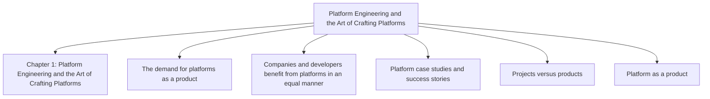
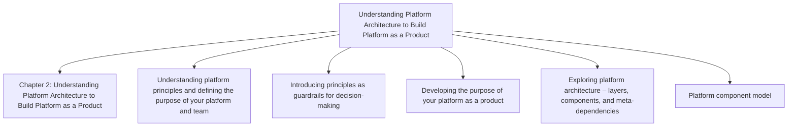
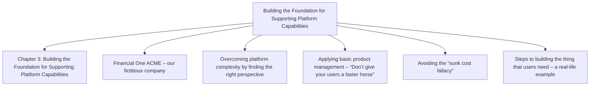
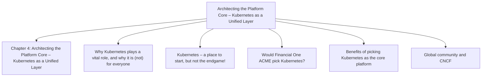
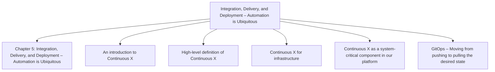
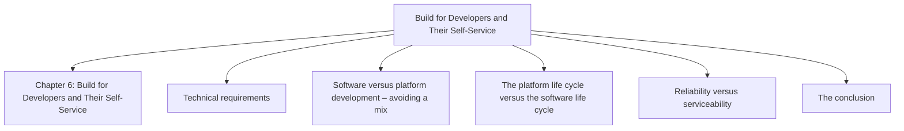
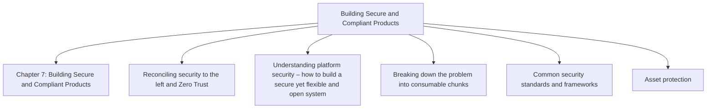
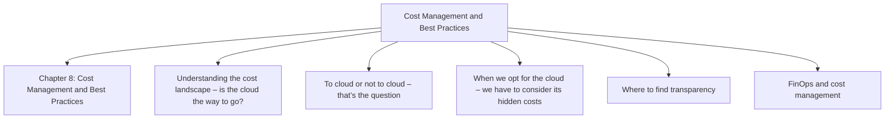
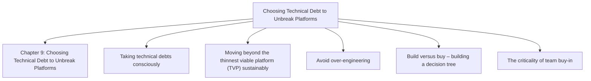
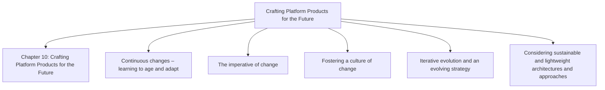

# Platform Engineering for Architects

*Max Körbächer, Andreas Grabner, Hilliary Lipsig — Book*
## Chapter 1: Platform Engineering and the Art of Crafting Platforms

**Questions this chapter answers:**
- What does this chapter explain about Chapter 1: Platform Engineering and the Art of Crafting Platforms?
- What does this chapter explain about The demand for platforms as a product?
- What does this chapter explain about Companies and developers benefit from platforms in an equal manner?

**Key points:**
- Source section: Chapter 1: Platform Engineering and the Art of Crafting Platforms.
- Source section: The demand for platforms as a product.
- Source section: Companies and developers benefit from platforms in an equal manner.
- Source section: Platform case studies and success stories.

## Chapter 2: Understanding Platform Architecture to Build Platform as a Product

**Questions this chapter answers:**
- What does this chapter explain about Chapter 2: Understanding Platform Architecture to Build Platform as a Product?
- What does this chapter explain about Understanding platform principles and defining the purpose of your platform and team?
- What does this chapter explain about Introducing principles as guardrails for decision-making?

**Key points:**
- Source section: Chapter 2: Understanding Platform Architecture to Build Platform as a Product.
- Source section: Understanding platform principles and defining the purpose of your platform and team.
- Source section: Introducing principles as guardrails for decision-making.
- Source section: Developing the purpose of your platform as a product.

## Chapter 3: Building the Foundation for Supporting Platform Capabilities

**Questions this chapter answers:**
- What does this chapter explain about Chapter 3: Building the Foundation for Supporting Platform Capabilities?
- What does this chapter explain about Financial One ACME – our fictitious company?
- What does this chapter explain about Overcoming platform complexity by finding the right perspective?

**Key points:**
- Source section: Chapter 3: Building the Foundation for Supporting Platform Capabilities.
- Source section: Financial One ACME – our fictitious company.
- Source section: Overcoming platform complexity by finding the right perspective.
- Source section: Applying basic product management – “Don’t give your users a faster horse”.

## Chapter 4: Architecting the Platform Core – Kubernetes as a Unified Layer

**Questions this chapter answers:**
- What does this chapter explain about Chapter 4: Architecting the Platform Core – Kubernetes as a Unified Layer?
- What does this chapter explain about Why Kubernetes plays a vital role, and why it is (not) for everyone?
- What does this chapter explain about Kubernetes – a place to start, but not the endgame!?

**Key points:**
- Source section: Chapter 4: Architecting the Platform Core – Kubernetes as a Unified Layer.
- Source section: Why Kubernetes plays a vital role, and why it is (not) for everyone.
- Source section: Kubernetes – a place to start, but not the endgame!.
- Source section: Would Financial One ACME pick Kubernetes?.

## Chapter 5: Integration, Delivery, and Deployment – Automation is Ubiquitous

**Questions this chapter answers:**
- What does this chapter explain about Chapter 5: Integration, Delivery, and Deployment – Automation is Ubiquitous?
- What does this chapter explain about An introduction to Continuous X?
- What does this chapter explain about High-level definition of Continuous X?

**Key points:**
- Source section: Chapter 5: Integration, Delivery, and Deployment – Automation is Ubiquitous.
- Source section: An introduction to Continuous X.
- Source section: High-level definition of Continuous X.
- Source section: Continuous X for infrastructure.

## Chapter 6: Build for Developers and Their Self-Service

**Questions this chapter answers:**
- What does this chapter explain about Chapter 6: Build for Developers and Their Self-Service?
- What does this chapter explain about Technical requirements?
- What does this chapter explain about Software versus platform development – avoiding a mix?

**Key points:**
- Source section: Chapter 6: Build for Developers and Their Self-Service.
- Source section: Technical requirements.
- Source section: Software versus platform development – avoiding a mix.
- Source section: The platform life cycle versus the software life cycle.

## Chapter 7: Building Secure and Compliant Products

**Questions this chapter answers:**
- What does this chapter explain about Chapter 7: Building Secure and Compliant Products?
- What does this chapter explain about Reconciling security to the left and Zero Trust?
- What does this chapter explain about Understanding platform security – how to build a secure yet flexible and open system?

**Key points:**
- Source section: Chapter 7: Building Secure and Compliant Products.
- Source section: Reconciling security to the left and Zero Trust.
- Source section: Understanding platform security – how to build a secure yet flexible and open system.
- Source section: Breaking down the problem into consumable chunks.

## Chapter 8: Cost Management and Best Practices

**Questions this chapter answers:**
- What does this chapter explain about Chapter 8: Cost Management and Best Practices?
- What does this chapter explain about Understanding the cost landscape – is the cloud the way to go??
- What does this chapter explain about To cloud or not to cloud – that’s the question?

**Key points:**
- Source section: Chapter 8: Cost Management and Best Practices.
- Source section: Understanding the cost landscape – is the cloud the way to go?.
- Source section: To cloud or not to cloud – that’s the question.
- Source section: When we opt for the cloud – we have to consider its hidden costs.

## Chapter 9: Choosing Technical Debt to Unbreak Platforms

**Questions this chapter answers:**
- What does this chapter explain about Chapter 9: Choosing Technical Debt to Unbreak Platforms?
- What does this chapter explain about Taking technical debts consciously?
- What does this chapter explain about Moving beyond the thinnest viable platform (TVP) sustainably?

**Key points:**
- Source section: Chapter 9: Choosing Technical Debt to Unbreak Platforms.
- Source section: Taking technical debts consciously.
- Source section: Moving beyond the thinnest viable platform (TVP) sustainably.
- Source section: Avoid over-engineering.

## Chapter 10: Crafting Platform Products for the Future

**Questions this chapter answers:**
- What does this chapter explain about Chapter 10: Crafting Platform Products for the Future?
- What does this chapter explain about Continuous changes – learning to age and adapt?
- What does this chapter explain about The imperative of change?

**Key points:**
- Source section: Chapter 10: Crafting Platform Products for the Future.
- Source section: Continuous changes – learning to age and adapt.
- Source section: The imperative of change.
- Source section: Fostering a culture of change.

