# The Platform Engineering Playbook

*Not recorded — Book*
## Chapter 1: Overview of Infrastructure Management and the DevOps Journey

**Questions this chapter answers:**
- What does this chapter explain about 1 Overview of Infrastructure Management and the DevOps Journey?
- What does this chapter explain about Technical infrastructure before the public cloud and DevOps?
- What does this chapter explain about Evolution of technical infrastructure?

**Key points:**
- Source section: 1 Overview of Infrastructure Management and the DevOps Journey.
- Source section: Technical infrastructure before the public cloud and DevOps.
- Source section: Evolution of technical infrastructure.
- Source section: Issues with traditional technical infrastructure management.

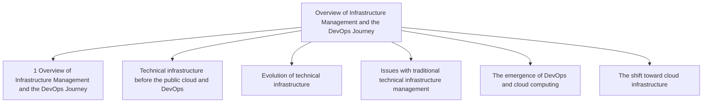

## Chapter 2: Introducing Platform Engineering

**Questions this chapter answers:**
- What does this chapter explain about 2 Introducing Platform Engineering?
- What does this chapter explain about The complexity of delivering SaaS today?
- What does this chapter explain about Architectural complexity of SaaS?

**Key points:**
- Source section: 2 Introducing Platform Engineering.
- Source section: The complexity of delivering SaaS today.
- Source section: Architectural complexity of SaaS.
- Source section: The role of cloud computing.

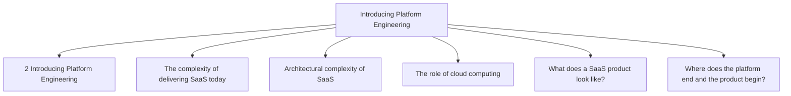

## Chapter 3: Understanding the Business Value of Platform engineering

**Questions this chapter answers:**
- What does this chapter explain about 3 Understanding the Business Value of Platform engineering?
- What does this chapter explain about The business case for platform engineering?
- What does this chapter explain about Why platform engineering matters??

**Key points:**
- Source section: 3 Understanding the Business Value of Platform engineering.
- Source section: The business case for platform engineering.
- Source section: Why platform engineering matters?.
- Source section: Aligning platform engineering with business objectives.

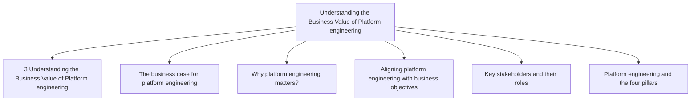

## Chapter 4: Growing into Platform Engineering

**Questions this chapter answers:**
- What does this chapter explain about 4 Growing into Platform Engineering?
- What does this chapter explain about The tipping point?
- What does this chapter explain about Outgrowing traditional embedded DevOps models?

**Key points:**
- Source section: 4 Growing into Platform Engineering.
- Source section: The tipping point.
- Source section: Outgrowing traditional embedded DevOps models.
- Source section: Signs that your organization is ready for a platform team.

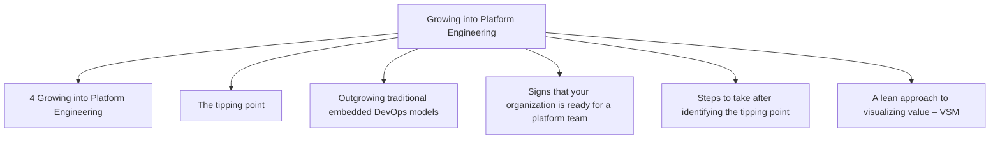

## Chapter 5: Understanding Platform Architecture and Internal Developer Platforms (IDPs)

**Questions this chapter answers:**
- What does this chapter explain about 5 Understanding Platform Architecture and Internal Developer Platforms (IDPs)?
- What does this chapter explain about Capabilities of an IDP?
- What does this chapter explain about Can I just find an IDP as a service??

**Key points:**
- Source section: 5 Understanding Platform Architecture and Internal Developer Platforms (IDPs).
- Source section: Capabilities of an IDP.
- Source section: Can I just find an IDP as a service?.
- Source section: Backstage – An open platform for building developer portals.

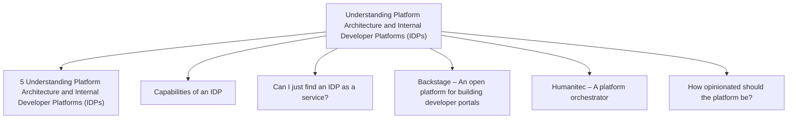

## Chapter 6: Building an IDP with Cloud-native Tools – Core Platform

**Questions this chapter answers:**
- What does this chapter explain about 6 Building an IDP with Cloud-native Tools – Core Platform?
- What does this chapter explain about Approaches to platform architecture?
- What does this chapter explain about Introduction to the B.A.C.K. stack?

**Key points:**
- Source section: 6 Building an IDP with Cloud-native Tools – Core Platform.
- Source section: Approaches to platform architecture.
- Source section: Introduction to the B.A.C.K. stack.
- Source section: Introduction to Cloud Native Operational Excellence.

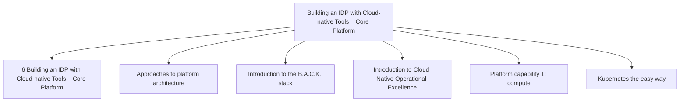

## Chapter 7: Expanding the IDP with CI/CD, Observability, Data Services, and Developer Portals

**Questions this chapter answers:**
- What does this chapter explain about 7 Expanding the IDP with CI/CD, Observability, Data Services, and Developer Portals?
- What does this chapter explain about Building Pipeline Capabilities in the IDP?
- What does this chapter explain about Implementing continuous Integration with Github Actions?

**Key points:**
- Source section: 7 Expanding the IDP with CI/CD, Observability, Data Services, and Developer Portals.
- Source section: Building Pipeline Capabilities in the IDP.
- Source section: Implementing continuous Integration with Github Actions.
- Source section: Implementing continuous Delivery with ArgoCD.

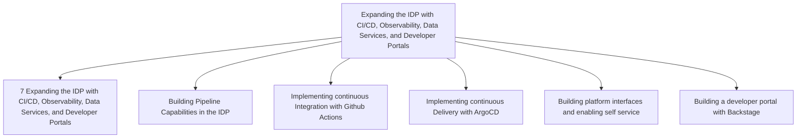

## Chapter 8: Identifying Early Adopters of Platforms and Delivering Quick Wins

**Questions this chapter answers:**
- What does this chapter explain about 8 Identifying Early Adopters of Platforms and Delivering Quick Wins?
- What does this chapter explain about The importance of relationships and reputation in Platform Engineering?
- What does this chapter explain about Overcoming the challenges?

**Key points:**
- Source section: 8 Identifying Early Adopters of Platforms and Delivering Quick Wins.
- Source section: The importance of relationships and reputation in Platform Engineering.
- Source section: Overcoming the challenges.
- Source section: Identifying quick wins.

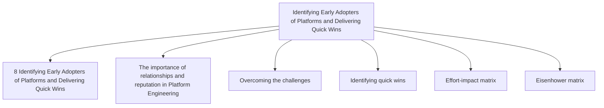

## Chapter 9: Understanding the Financial Aspects of Platform Engineering

**Questions this chapter answers:**
- What does this chapter explain about 9 Understanding the Financial Aspects of Platform Engineering?
- What does this chapter explain about Introducing FinOps?
- What does this chapter explain about Why FinOps matters?

**Key points:**
- Source section: 9 Understanding the Financial Aspects of Platform Engineering.
- Source section: Introducing FinOps.
- Source section: Why FinOps matters.
- Source section: Introducing the FinOps Foundation.

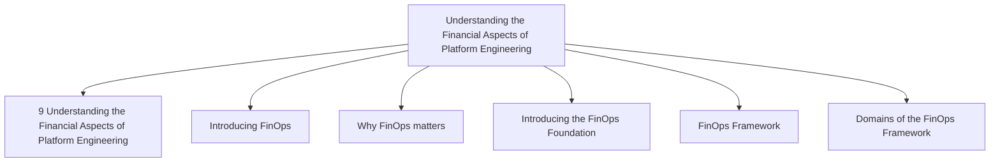

## Chapter 10: Building Your Platform Engineering Team, The Right Way

**Questions this chapter answers:**
- What does this chapter explain about 10 Building Your Platform Engineering Team, The Right Way?
- What does this chapter explain about Conway's Law and Fit-for-Purpose teams?
- What does this chapter explain about Organizational design for large scale engineering teams?

**Key points:**
- Source section: 10 Building Your Platform Engineering Team, The Right Way.
- Source section: Conway's Law and Fit-for-Purpose teams.
- Source section: Organizational design for large scale engineering teams.
- Source section: Leveraging Conway's Law in organizing a platform engineering team.

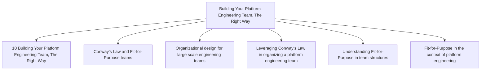

## Chapter 11: Leading Platform Engineering

**Questions this chapter answers:**
- What does this chapter explain about 11 Leading Platform Engineering?
- What does this chapter explain about The multiple roles of a platform leader?
- What does this chapter explain about Technical leadership?

**Key points:**
- Source section: 11 Leading Platform Engineering.
- Source section: The multiple roles of a platform leader.
- Source section: Technical leadership.
- Source section: Don't over engineer your platform.

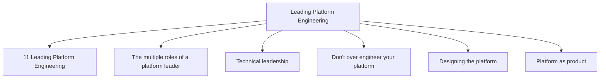

## Chapter 12: Measuring Platform Engineering Success

**Questions this chapter answers:**
- What does this chapter explain about 12 Measuring Platform Engineering Success?
- What does this chapter explain about Understanding Outputs, Outcomes, Impact?
- What does this chapter explain about Understanding DevEx metrics?

**Key points:**
- Source section: 12 Measuring Platform Engineering Success.
- Source section: Understanding Outputs, Outcomes, Impact.
- Source section: Understanding DevEx metrics.
- Source section: Understanding and measuring Flow.

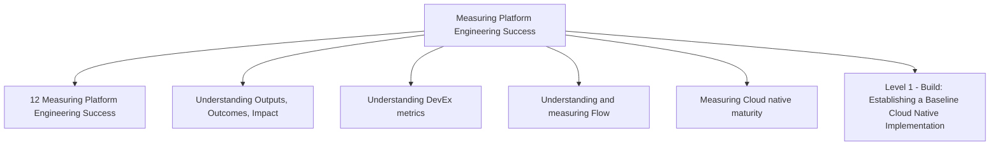

## Chapter 13: Discovering Real-World Platform Use-Cases

**Questions this chapter answers:**
- What does this chapter explain about 13 Discovering Real-World Platform Use-Cases?
- What does this chapter explain about How companies are moving towards platform engineering?
- What does this chapter explain about Uber and Netflix – Building Platforms before Platform Engineering?

**Key points:**
- Source section: 13 Discovering Real-World Platform Use-Cases.
- Source section: How companies are moving towards platform engineering.
- Source section: Uber and Netflix – Building Platforms before Platform Engineering.
- Source section: When to form a platform engineering team.

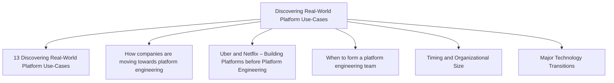
