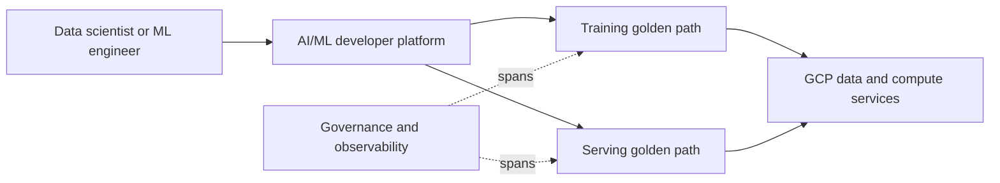

# Reference Architecture for an AI/ML Internal Developer Platform on GCP

*Weave Intelligence — Report*

## Agent guide

Defines a GCP reference architecture for an AI/ML internal developer platform with reusable golden paths for model development, training, and serving.
### Questions this chapter answers
- What capabilities belong in an AI/ML IDP on GCP?
- How do golden paths support model training and serving?
- Where do data, model, infrastructure, and governance services connect?
### Key points
- AI/ML platform workflows combine data, compute, model, and deployment capabilities.
- Golden paths turn those capabilities into repeatable training and serving workflows.
- Governance and observability must follow models across their lifecycle.

## Conceptual diagram

## Detailed source transcript

### Page 1
1   REFERENCE ARCHITECTURE FOR AN AI/ML INTERNAL DEVELOPER PLATFORM ON GCP
### Page 2
Reference architecture for an AI/ML
Internal Developer Platform on GCP
Table of contents
Executive summary                                          03                    Golden path 1: Define and deploying a model     29
	training pipeline
	Golden path 2: Deploying a real-time            30
Introduction                                               04                    serving endpoint
The enterprise AI/ML challenge                             05                   Role: Data engineer                              31
Why IDPs matter for data/AI/ML                             08                    Golden path 1: Publish dataset to catalog       31
	Golden path 2: Setting up data transformation   32
	workflows
The reference architecture                                 10
	Role: Platform engineer                          33
		Golden path 1: Onboarding a new compute         33
		resource (e.g., GPU node pool)
Architectural planes in detail                             12
	Golden path 2: Creating a golden path for       34
	training workloads
Why planes instead of layers?                              13
The Developer Control Plane                                14
Integration and Delivery Plane                             16                   Best practices for adoption                      35
Data and Model Management Plane                            18
Resource Plane                                             20                   Technology mapping                               37
Observability Plane                                        22
Security Plane                                             24
	Organizational & operational                     40
	considerations
Sample use cases & golden paths 26
Role: Data scientist                                       27
	Conclusion                                       42
	Golden path 1: Launching a notebook                    27
	workspace for exploration                                                                                                    44
		References
	Golden path 2: Log experiment to tracking store        28
		About the authors                                45
Role: ML engineer                                          29
2      REFERENCE ARCHITECTURE FOR AN AI/ML INTERNAL DEVELOPER PLATFORM ON GCP
### Page 3
Executive Summary
	We have reached a critical moment                     domain and the constantly evolving
	in enterprise AI adoption. While the                  landscape of tools and application
	promise of AI and machine learning                    domains, this architecture should
	to transform decision-making, boost                   be viewed as a living foundation
	efficiency, and create competitive                    rather than a final state.
	advantage has never been clearer,
	most organizations find themselves                    Think of it as creating a foundation
	stuck in an all-too-familiar place:                   that provides standardized
	unable to scale beyond promising                      environments, automated
	pilots to production-ready,                           workflows, and self-service
	enterprise-wide solutions.                            capabilities, all designed to
		accelerate innovation while
	The culprits? A tangled web                           maintaining iron-clad governance
	of challenges spanning data                           and operational efficiency. By
	management complexity,                                standardizing tooling, improving
	evolving model requirements,                          visibility across the development
	deployment headaches, monitoring                      lifecycle, and protecting
	blind spots, and runaway costs.                       organizational intellectual property,
	These are all compounded by                           a specialized IDP aims to tackle the
	fragmented adoption patterns,                         pain points that keep AI initiatives
	security vulnerabilities, and                         from reaching their full potential.
	reproducibility nightmares.
		The payoff for getting this right
	Add to this a persistent talent crunch                is substantial. We are talking
	and the breakneck pace of change in                   about dramatic improvements in
	AI/ML infrastructure, and you have a                  developer productivity through
	recipe for stalled innovation.                        reduced cognitive load, operational
		efficiency gains via extensive
	The answer lies in building a                         automation, enhanced scalability
	purpose-built Internal Developer                      with fewer errors, and significantly
	Platform (IDP) specifically tailored                  faster deployment cycles that slash
	for Data, AI, and ML workloads on a                   time to market. Most importantly,
	consistent cloud foundation.                          this specialized IDP creates the
		bedrock for effective Machine
	This document presents a proposed                     Learning Operations (MLOps)
	reference architecture based on                       practices. This is the essential
	current industry best practices. It is                ingredient for achieving real-world
	crucial to understand that, given the                 scale and extracting lasting value
	rapid pace of innovation in the AI/ML                 from AI investments.
3   REFERENCE ARCHITECTURE FOR AN AI/ML INTERNAL DEVELOPER PLATFORM ON GCP
### Page 4
Introduction
	Enterprises are racing to harness AI/ML, yet
	most struggle to move from experimentation to
	scalable, secure production. The path is riddled
	with technical, operational, and organizational
	hurdles. From governance and cost control to
	talent gaps and infrastructure complexity, these
	challenges reveal why many AI ambitions stall
	before delivering real impact.
4   REFERENCE ARCHITECTURE FOR AN AI/ML INTERNAL DEVELOPER PLATFORM ON GCP
### Page 5
The enterprise AI/ML challenge
	Let’s face it: enterprises worldwide                  Then there is the financial reality
	are struggling to make the leap                       check. AI/ML workloads come with a
	from AI experimentation to                            hefty price tag, forcing organizations
	production reality. The journey                       to grapple with transparent cost
	from proof-of-concept to fully                        management, optimize cost
	integrated, governed, and                             ownership, and efficiently manage
	scalable enterprise platform is                       infrastructure expenses. Balancing
	littered with obstacles that many                     investments in computational
	organizations underestimate. Those                    resources, model training costs,
	early POCs, designed for limited                      and performance optimization
	experimentation, often buckle under                   becomes a delicate dance of
	real-world operational demands.                       resource allocation. Core MLOps
	What starts as a technical challenge                  components, such as cloud storage
	quickly morphs into a complex                         and high-performance computing,
	puzzle involving data management,                     do not come cheap, making
	model complexity, deployment                          meticulous financial stewardship
	strategies, continuous monitoring,                    non-negotiable.
	and cost control. Each piece is
	interdependent and equally critical.                  The infrastructure landscape itself
		presents its own challenges. The
	Security, reproducibility, and                        rapid pace of change and varying
	compliance present particularly                       maturity levels across tools demand
	thorny challenges. How do you                         continuous adoption of best
	ensure AI/ML initiatives meet                         practices and harmonization efforts.
	stringent security standards, can                     We see this play out as teams across
	be consistently reproduced for                        organizations independently wrestle
	validation, and comply with                           with similar technology decisions,
	ever-evolving regulations? In the                     leading to analysis paralysis and
	rush to innovate, security has                        fragmented, siloed adoption
	too often taken a back seat. This                     patterns. Each team reinvents
	results in weak controls and direct                   the wheel, creating inefficiencies
	(sometimes unauthorized) access                       and lacking coherence. This
	to sensitive data lakes. For large                    unmanaged proliferation of tools
	enterprises, regulations like HIPAA                   and bespoke infrastructure creates
	and GDPR add another layer of                         a sprawling, inconsistent technology
	complexity, imposing strict limits                    landscape that accumulates AI/
	on data collection, storage, and                      ML-specific technical debt. This
	processing that require constant                      includes increased maintenance
	vigilance as models evolve and new                    overhead, collaboration friction,
	data emerges.                                         and absent standardized security
5   REFERENCE ARCHITECTURE FOR AN AI/ML INTERNAL DEVELOPER PLATFORM ON GCP
### Page 6
and compliance. This mounting                          addressing them through
	technical debt does not just slow                      targeted upskilling and structured
	innovation; it actively impedes it                     frameworks, organizations can
	while driving up operational costs.                    unlock tremendous opportunities.
	Organizations need a blueprint for
	dynamic cloud solutions that enable                    Success in AI/ML is not just about
	ML workload optimization and on-                       technology; it equally depends
	demand scalability. A hybrid MLOps                     on organizational maturity,
	approach, for instance, has proven                     cross-functional alignment, and
	effective for cost optimization in                     continuous talent development.
	large enterprises.                                     The platform must therefore reduce
		human-induced friction and foster
	But perhaps the most critical                          enhanced collaboration.
	challenge is the human element,
	which acts as both a bottleneck                        The interconnected nature of cost,
	and an opportunity. The persistent                     scalability, and governance becomes
	talent shortage demands creative                       clear when you step back. Inefficient
	solutions and roadmaps for                             resource allocation, often stemming
	upskilling existing teams in AI/                       from inadequate governance,
	ML topics. A major stumbling                           directly inflates costs and hampers
	block in AI projects often comes                       scalability. Without clear resource
	from misalignment among data                           usage policies, expenses spiral.
	scientists, IT teams, and business                     Without standardized infrastructure,
	stakeholders regarding objectives                      scaling becomes inefficient.
	and expectations. Employee                             Conversely, inability to scale
	turnover and scarce specialized                        efficiently drives up unit costs for AI/
	expertise can derail machine                           ML workloads. This dynamic reveals
	learning lifecycle delivery. These                     how demands for cost optimization
	human factors, including skill                         and scalability create powerful
	gaps, collaboration friction, and                      incentives for improved governance
	misaligned expectations, can stop                      and standardized platform solutions.
	progress cold. Yet by proactively
6   REFERENCE ARCHITECTURE FOR AN AI/ML INTERNAL DEVELOPER PLATFORM ON GCP
### Page 7
The following table summarizes the key challenges
	enterprises face in their AI/ML adoption journey:
		CHALLENGE                        SPECIFIC CHALLENGE           SUPPORTING EVIDENCE
		CATEGORY                         DESCRIPTION
		Scalability                      Transitioning from POC       POCs are typically
			to production                designed for small scale
				experimentation. May not
				possess the scalability
				required for real world
				operations.
		Security &                       Security, reproducibility,   Security has been often
		compliance                       compliance gaps              overlooked in the name of
			progress, resulting in weak
			controls and direct access
			to sensitive data lakes.
		Cost                             High cost impact of ML/      Cost management
		management                       AI workloads                 emerges as a critical
			consideration, with
			organizations grappling
			with the financial
			implications of scaling AI/
			ML pipelines.
		Infrastructure                   High cost impact of ML/      High pace of changes in
		volatility                       AI workloads                 the ML/Ai infra space, with
			varying maturity drive
			need for best practices and
			harmonization
		Talent &                         Talent shortage; lack        A major challenge, in AI
		alignment                        of alignment among           projects is the lack of
			stakeholders                 alignment among data
				scientists IT teams and
				business stakeholders
				regarding objectives and
				expectations.
7   REFERENCE ARCHITECTURE FOR AN AI/ML INTERNAL DEVELOPER PLATFORM ON GCP
### Page 8
Why IDPs matter for data/AI/ML
	The explosive growth of AI and ML                     is cognitive overload. This is the
	in enterprises demands we rethink                     mental exhaustion developers face
	traditional platform approaches.                      when navigating complex, disparate
	While ML/AI workloads share                           toolchains and infrastructure. For
	fundamental challenges with                           AI/ML practitioners, this burden
	cloud-native development, such as                     multiplies due to the diverse tool
	automated deployment, efficient                       landscape, specialized infrastructure
	scaling, and reliable operation,                      requirements (hello, GPUs), and the
	they bring their own unique                           broader user base we mentioned.
	characteristics to the table.
		A Data/AI/ML-specific IDP acts as
	The key differences include                           a unifying force. It abstracts away
	specialized infrastructure                            complexity so practitioners can
	configurations, a distinct tooling                    focus on what they do best, such
	and services landscape, and a much                    as developing models and deriving
	broader user base. This base extends                  insights, rather than wrestling
	well beyond traditional developers                    with infrastructure details. We can
	to include data engineers, data                       measure an AI/ML IDP’s success
	scientists, MLOps specialists,                        directly by how much it reduces
	platform engineers, and BI analysts.                  cognitive load, which translates to
	This diverse audience demands a                       faster iteration cycles and increased
	tailored platform experience.                         innovation velocity. This focus on
		user experience sets it apart from
	Given these distinctions, Internal                    generic IT platforms.
	Developer Platforms emerge as a
	compelling solution. However, there                   A well-architected ML IDP becomes
	is a catch: they must be specifically                 instrumental in establishing
	designed for AI/ML workloads. A                       effective MLOps practices across
	generic SDLC-focused IDP simply                       the organization. MLOps, defined
	will not cut it. Traditional IDPs fall                as the practices for deploying and
	short when it comes to complex                        maintaining ML models reliably and
	data pipelines, interactive notebook                  efficiently, cannot scale without
	environments, and robust model                        a robust platform underneath.
	governance, all of which are central                  The IDP provides essential
	to the AI/ML lifecycle.                               infrastructure, standardized tooling,
		CI/CD pipelines, model versioning,
	An IDP’s core mission is streamlining                 and monitoring frameworks that
	workflows, reducing cognitive load,                   enable MLOps principles to work
	and boosting productivity. The                        at scale. Without the platform,
	fundamental problem IDPs solve                        MLOps remains aspirational; with it,
8   REFERENCE ARCHITECTURE FOR AN AI/ML INTERNAL DEVELOPER PLATFORM ON GCP
### Page 9
MLOps becomes operational reality,                     at any time for novel approaches.
	delivering scalable and reliable ML in                 Golden paths ensure disparate
	production.                                            teams operate within established
		guardrails, preventing technical debt
	One of the most powerful features                      accumulation and IP fragmentation.
	is the provision of curated “golden                    They are not merely about efficiency;
	paths.” These are opinionated,                         they are strategic tools for enforcing
	well-documented, and supported                         standards, mitigating risk, and
	methods for building and deploying                     democratizing access to complex
	software that consistently meet                        AI/ML capabilities, fostering a
	organizational standards. Golden                       consistent and secure ecosystem.
	paths dramatically reduce cognitive
	load and accelerate development by                     Additionally, the IDP empowers
	offering clear, templated workflows.                   developers with self-service tooling,
	In AI/ML, where rapid iteration and                    reducing their dependence on
	experimentation are critical, golden                   operations teams and improving
	paths provide “paved roads” with                       cross-team collaboration. The
	built-in security, compliance, and                     platform must also provide secure
	observability. This significantly                      compute environments and robust
	accelerates experimentation by                         lineage tracking for both data
	removing boilerplate setup, while                      and models.
	offering the flexibility to “break out”
9   REFERENCE ARCHITECTURE FOR AN AI/ML INTERNAL DEVELOPER PLATFORM ON GCP
### Page 10
The reference
architecture
	Our proposed reference architecture for an Internal
	Developer Platform supporting Data, AI, and ML
	workloads revolves around six distinct planes.
	These planes represent logical separations of
	concerns, each specializing in a critical aspect of
	the platform’s functionality. This design transcends
	traditional layered approaches, emphasizing a
	horizontal, cross-cutting perspective where each
	plane addresses specific concerns impacting the
	entire data and ML lifecycle.
10   REFERENCE ARCHITECTURE FOR AN AI/ML INTERNAL DEVELOPER PLATFORM ON GCP
### Page 11
This document presents a proposed reference architecture for
	an Internal Developer Platform for Data and AI, specifically
	leveraging Google Cloud technologies. It is important to note
	that the architecture is flexible, allowing for the substitution of
	featured tools with alternatives in the same category, including
	open-source options.
	REFERENCE ARCHITECTURE FOR DATA/AI INTERNAL DEVELOPER PLATFORM ON GCP
		The architecture can be adapted to integrate setups from
		different cloud vendors as required.
		Further reference architectures will be released in the
		near future.
11   REFERENCE ARCHITECTURE FOR AN AI/ML INTERNAL DEVELOPER PLATFORM ON GCP
### Page 12
Architectural
planes in detail
	Each architectural plane serves a specialized
	function, contributing to overall efficiency,
	governance, and scalability of AI/ML workloads.
	Let’s dive into the responsibilities and specific
	components for each plane as defined in this
	reference architecture.
12   REFERENCE ARCHITECTURE FOR AN AI/ML INTERNAL DEVELOPER PLATFORM ON GCP
### Page 13
Why planes instead of layers?
	Why “planes” instead of conventional                   components such as data ingestion,
	“layers”? This distinction matters.                    storage, processing, and analytics
	Layers often imply strict hierarchy                    are decoupled. This separation
	and sequential dependencies,                           allows independent development,
	introducing rigidity and bottlenecks                   updates, or replacement without
	in complex, rapidly evolving systems.                  disrupting the entire system. The
	Planes, by contrast, suggest parallel                  approach promotes component
	concerns that intersect and interact                   reusability and significantly reduces
	dynamically.                                           development time.
	This architectural choice inherently                   The benefits of modular architecture
	addresses the challenges of                            such as separation of concerns, loose
	intertwined functionalities and siloed                 coupling between components,
	approaches that plague complex data                    high cohesion within components,
	platforms. By abstracting concerns                     and standardized interfaces, directly
	into distinct planes, we provide a                     enable the IDP to adapt to rapid
	conceptual model for managing the                      changes in the ML/AI infrastructure
	inherent complexity of integrating                     space. When each plane functions
	diverse AI/ML tools and workflows.                     as a cohesive, loosely coupled
		module, the platform can evolve,
	This shift from layers to planes is a                  integrate new technologies, and
	proactive strategy to prevent future                   respond to changing business needs
	architectural rigidity and technical                   far more rapidly than monolithic
	debt. It acknowledges that AI/ML                       or tightly coupled systems. This
	systems are not linear software                        enhanced flexibility facilitates faster
	stacks but complex, interconnected                     integration of new tools, increasing
	ecosystems requiring flexible,                         organizational agility in the dynamic
	cross-cutting concerns.                                AI/ML landscape. Plus, this
		“planes” concept offers seamless
	This modular architecture                              extensibility, allowing new planes to
	ensures flexibility, scalability, and                  be incorporated as organizational
	maintainability. In a modular setup,                   needs evolve.
13   REFERENCE ARCHITECTURE FOR AN AI/ML INTERNAL DEVELOPER PLATFORM ON GCP
### Page 14
Developer Control Plane
	This plane serves as the front door for
	all platform users, including Data
	Scientists, ML Engineers, Data
	Engineers, and Platform Engineers. It
	provides intuitive, self-service interfaces
	for development, experimentation,
	and platform interaction.
	By abstracting underlying infrastructure
	complexities, this plane dramatically
	reduces cognitive load on developers
	and data specialists. Rather than
	requiring deep infrastructure knowledge
	or complex manual configurations, users
	interact with simplified, opinionated
	interfaces. This directly enables rapid
	experimentation, reproducibility,
	and self-service access to compliant
	resources without manual infrastructure
	management for Data Scientists.
	Developer Control Plane overview
		DESCRIPTION                           SPECIFIC TOOL          KEY CHALLENGES
			EXAMPLES
		Provide user-friendly                 IDE/CDE:               Ensuring flexibility for
		access points for diverse             Visual Studio Code     experimentation while
		personas; Enable self-                                       accelerating through
		service provisioning                  Notebook Workspace:    standardization and
		and management                        Jupyter Notebook       governance; Ensuring
		of resources; Offer                                          consistent user
		integrated development                CoPilots/Agents/LLM:   experience across
		environments, including               Claude Code            multiple interfaces;
		interactive notebooks                                        Managing access control
		and AI agents.                        Portal:                for different tools.
			Backstage
14   REFERENCE ARCHITECTURE FOR AN AI/ML INTERNAL DEVELOPER PLATFORM ON GCP
### Page 15
Key components include standard Integrated Development
	Environments (IDEs) like Visual Studio Code, interactive
	Notebook Workspaces such as Jupyter Notebook, and
	AI-powered assistants like Claude Code to accelerate the
	inner-loop development process.
	A central Portal, here built on Backstage, provides a “single
	pane of glass” for resource discovery, documentation, and
	self-service provisioning. This plane is not just about providing
	tools. It is about shifting the mental capacity from “how to
	build and run” to “what to build,” driving developer velocity
	and satisfaction within the IDP.
15   REFERENCE ARCHITECTURE FOR AN AI/ML INTERNAL DEVELOPER PLATFORM ON GCP
### Page 16
Integration and Delivery Plane
	This plane automates the entire lifecycle of data and ML workloads, from
	code commit to deployment and updates. It encompasses CI, CD, CT
	(Continuous Testing), and specialized ML pipelines, ensuring changes are
	validated, artifacts managed, and workloads orchestrated efficiently across
	the platform.
	This architecture specifies a highly-opinionated, modern stack.
	The flow begins with GitHub as the single source of truth for
	version control. Score is used to create a platform-agnostic
	Services/App Specification, defining what the workload is,
	while Terraform defines the Platform/Infrastructure as Code,
	or where it will run. GitHub Actions serves as the CI/CD/CT
	engine, automating the building, testing, and packaging of
	applications and models.
16   REFERENCE ARCHITECTURE FOR AN AI/ML INTERNAL DEVELOPER PLATFORM ON GCP
### Page 17
These workflows feed into two distinct orchestrators. The
	Humanitec Platform Orchestrator handles platform-level
	configuration and environment management, translating the
	developer’s intent (from Score) into a running application.
	Kubeflow Pipelines is used as the specialized ML Workflow
	Orchestrator, managing the complex, multi-step graphs of
	training, evaluation, and validation. All resulting container
	images, models, and packages are stored in Google Artifact
	Registry as the central, secure Registry.
	This plane, particularly the dual-orchestrator model, is where platform
	governance and automation truly come alive. It bridges the gap between
	user intent and infrastructure reality while ensuring compliance and
	efficiency at scale.
	Integration and Delivery Plane overview
		DESCRIPTION                           SPECIFIC TOOL                KEY CHALLENGES
			EXAMPLES
		Automate build, test,                 Version Control: GitHub      Integrating diverse
		and deployment;                                                    ML-specific tools into a
		Orchestrate complex                   Services/App                 unified CI/CD framework;
		data, ML, and app                     Specification: Score         Managing complex
		workflows; Manage                                                  dependencies across
		artifacts; Enforce                    Platform/Infrastructure as   data, code, and models;
		quality gates.                        Code: Terraform              Ensuring reproducibility
			of pipeline runs.
			CI/CD/CT: GitHub Actions
			Platform Orchestrator:
			Humanitec
			ML Workflow
			Orchestrator: Kubeflow
			Pipelines
			Registry: Google Artifact
			Registry
17   REFERENCE ARCHITECTURE FOR AN AI/ML INTERNAL DEVELOPER PLATFORM ON GCP
### Page 18
Data and Model Management Plane
	This plane is the heart of data and ML model lifecycle management, spanning
	from raw ingestion to model serving. It provides managed services for data
	preparation, feature engineering, experiment tracking, and model versioning.
	Vertex AI Metadata (formerly ML Metadata) functions
	as the central Metadata Store, capturing the lineage and
	artifacts from all Kubeflow Pipeline runs and other platform
	activities. Vertex Feature Store serves as the Feature Store,
	providing a unified source for ML features. This managed
	service helps address the train-serve skew problem by
	facilitating the use of consistent feature definitions for both
	batch training and real-time inference, which is a common
	challenge with tools like Feast.
	For model management, Vertex AI Model Registry is the
	central repository for all trained models. It goes beyond
	simple storage, providing deep integration with the GCP
	ecosystem for versioning, aliasing (e.g., “staging” vs.
	“production”), and storing “model cards.”
18   REFERENCE ARCHITECTURE FOR AN AI/ML INTERNAL DEVELOPER PLATFORM ON GCP
### Page 19
Model cards provide comprehensive information about
	models, including purpose, performance metrics, training
	data, ethical considerations, and usage guidelines, offering
	rich context for governance and reproducibility. This plane
	also encompasses the training and serving infrastructure,
	which are dynamically provisioned by the orchestrators and
	run on the Resource Plane.
	Data and Model Management Plane overview
		DESCRIPTION                           SPECIFIC TOOL               KEY CHALLENGES
			EXAMPLES
		Provide scalable                      Metadata Store: Vertex AI   Ensuring data
		training infrastructure;              Metadata                    consistency between
		Enable comprehensive                                              training and serving;
		experiment tracking;                  Feature Store: Vertex       Managing feature
		Centralize features for               Feature Store               versioning and
		consistent training/                                              backfilling; Implementing
		inference; Version, store,            Model Registry: Vertex AI   robust data governance
		and govern machine                    Model Registry              and access controls;
		learning models.                                                  Maintaining
			comprehensive model
			metadata.
19   REFERENCE ARCHITECTURE FOR AN AI/ML INTERNAL DEVELOPER PLATFORM ON GCP
### Page 20
Resource Plane
	The Resource Plane provides the computational and storage infrastructure
	powering all data, AI, and ML workloads. This plane abstracts infrastructure
	provisioning and management complexities, offering self-service access to
	diverse compute types and storage solutions.
	The core Compute Operator and Networking layer is GKE
	(Google Kubernetes Engine). GKE provisions and manages
	all containerized workloads, from data processing pipelines to
	model serving endpoints, and handles all service-to-service
	communication and network policies. Google Cloud SQL is
	designated as the primary relational Data Store for structured
	data, metadata, and application backends.
	For large-scale unstructured data, such as training datasets and
	model artifacts, Google Cloud Storage is the scalable Storage
	solution. For real-time data, Apache Kafka is included as the
	Streaming System for high-throughput,
	low-latency data ingestion.
20   REFERENCE ARCHITECTURE FOR AN AI/ML INTERNAL DEVELOPER PLATFORM ON GCP
### Page 21
Finally, a dedicated Model Serving layer is specified, consisting of
	Nvidia Triton for high-performance, multi-framework inference
	and DynamoDB as a low-latency key-value store, potentially for
	feature lookups or prediction caching at the edge.
	Resource Plane overview
		DESCRIPTION                            SPECIFIC TOOL EXAMPLES    KEY CHALLENGES
		Dynamically provision                  Compute Operator:         Optimizing resource
		and manage compute                     GKE                       utilization and cost
		(CPU, GPU); Provide                    Data Stores:              across diverse
		scalable and durable                   Google Cloud SQL          workloads; Managing
		storage; Support                                                 heterogeneous compute
		real-time data ingestion;              Storage:                  environments; Ensuring
			Google Cloud Storage
		Offer high-performance                                           high-throughput access
		model serving.                                                   to storage; Scaling
			Networking:
			GKE                       streaming and inference
				infrastructure on
			Streaming Systems:        demand.
			Apache Kafka
			Model Serving:
			DynamoDB, Nvidia Triton
21   REFERENCE ARCHITECTURE FOR AN AI/ML INTERNAL DEVELOPER PLATFORM ON GCP
### Page 22
Observability Plane
	This plane provides comprehensive visibility into the health, performance,
	and behavior of all data, AI, and ML workloads and the underlying platform. It
	encompasses monitoring, logging, tracing, and cost tracking.
	Google Cloud Monitoring is the foundational tool for Monitoring
	and Logging, collecting logs, metrics, and traces from GKE, Vertex
	AI, and all other GCP services. For deep, business-context-aware
	Observability and distributed tracing, Honeycomb is specified, as
	well as Arize AI for Model Observability. A critical component of
	any modern platform is financial governance. Flexera is designated
	as the FinOps solution, providing cost visibility, optimization, and
	chargeback capabilities.
	Beyond traditional system metrics, this plane includes specialized
	capabilities crucial for AI/ML, though specific tools are not
	prescribed in this architecture. These include model observability,
	hallucination detection, and data validation. A critical addition is
	drift detection.
	Mechanisms are needed to identify when models degrade or “drift”
	from expected behavior as data distributions change. Data quality
	monitoring with Monte Carlo is equally vital to prevent “garbage
	in, garbage out” scenarios.
	Finally, a Lineage and Metadata Catalogue is required
	to capture execution logs, metrics, and results, linking them to
	source models and data lineage for full traceability
	and auditability.
22   REFERENCE ARCHITECTURE FOR AN AI/ML INTERNAL DEVELOPER PLATFORM ON GCP
### Page 23
Observability Plane overview
	DESCRIPTION                            SPECIFIC TOOL EXAMPLES    KEY CHALLENGES
	Collect and visualize                  Monitoring and Logging:   Optimizing resource
	logs, metrics, traces;                 Google Cloud Monitoring   utilization and cost
	Monitor system health;                                           across diverse
		Observability:
	Track costs; Detect                    Honeycomb                 workloads; Managing
	model drift and data                                             heterogeneous compute
	quality issues; Provide                FinOps:                   environments; Ensuring
	data and model lineage.                Flexera                   high-throughput access
		to storage; Scaling
		Model Observability:      streaming and inference
		Arize AI
			infrastructure on
			demand.
		Data Validation:
		Monte Carlo
		Lineage and Metadata
		Catalogue: Dataplex
23   REFERENCE ARCHITECTURE FOR AN AI/ML INTERNAL DEVELOPER PLATFORM ON GCP
### Page 24
Security Plane
	The Security Plane is fundamental to ensuring the integrity, confidentiality,
	and availability of data, models, and the platform itself. It enforces access
	controls, manages sensitive credentials, and implements policies protecting
	against vulnerabilities. This plane integrates security into the CI/CD pipeline
	and at runtime.
	SonarQube is specified for static Code Analysis, scanning
	code for bugs and vulnerabilities before it is deployed. Google
	Secrets Manager is the central Secrets store, securely storing
	and injecting sensitive information, such as API keys, database
	credentials, and model weights, into workloads at runtime. This
	prevents hardcoding sensitive data and reduces exposure risk.
	Google IAM provides the core ID Management, controlling
	user and service account permissions across all GCP resources.
	For fine-grained, in-cluster Policy Control, OPA (Open
	Policy Agent) is used enabling fine-grained access control
	and admission policies across the GKE environment. Cilium
	is used for Network Based Security, providing eBPF-based
	networking, observability, and security, enforcing network
	policies at the kernel level.
	Finally, Model Scanning capabilities are desirable. This involves automated
	checks for licensing compliance, potential biases, PII leakage, and security
	vulnerabilities within model artifacts before production deployment. These
	automated gates ensure models only proceed to production after passing
	rigorous security requirements, preventing manual bottlenecks while
	ensuring governance.
24   REFERENCE ARCHITECTURE FOR AN AI/ML INTERNAL DEVELOPER PLATFORM ON GCP
### Page 25
Security Plane overview
	CATEGORY                     DESCRIPTION                           SPECIFIC TOOL             KEY CHALLENGES
		EXAMPLES
	Responsibilities             Securely manage and                   Code Analysis:            Implementing
		inject secrets; Enforce               SonarQube                 consistent security
		granular access control;                                        policies; Managing
		Provide secure workload               Secrets:                  secrets at scale;
		identities; Automate                  Google Secrets Manager    Ensuring data privacy
		model and code                                                  and compliance;
		scanning.                             ID Management:            Detecting and
			Google IAM                mitigating model-
				specific security
			Policy Control: OPA       risks (e.g., adversarial
			(Open Policy Agent)       attacks).
			Network Based Security:
			Cilium
			Model Scanning:
			Protect AI
25   REFERENCE ARCHITECTURE FOR AN AI/ML INTERNAL DEVELOPER PLATFORM ON GCP
### Page 26
Sample use cases
& golden paths
	Golden paths are the secret sauce of an effective
	Internal Developer Platform. They are opinionated,
	pre-configured, and automated workflows
	that guide users through common tasks while
	reducing cognitive load and ensuring adherence to
	organizational best practices and policies.
	They provide those “paved roads” for data
	scientists, ML engineers, data engineers,
	developers and platform engineers, streamlining
	daily operations.
	Let’s explore key golden paths for each persona to
	see how this IDP transforms their work.
26   REFERENCE ARCHITECTURE FOR AN AI/ML INTERNAL DEVELOPER PLATFORM ON GCP
### Page 27
ROLE
	Data scientist
	Data scientists explore datasets, develop statistical and machine learning
	models, and run experiments.
	They rely on curated data access, feature stores, and scalable compute.
	The platform empowers them with rapid experimentation, reproducibility,
	and self-service access to compliant resources.
	Golden path 1: Launching a notebook
	workspace for exploration
	The data scientist needs a secure, GPU-enabled workspace. This flow
	provisions a Jupyter Notebook with persistent storage and GPU resources
	- no IT tickets required.
		PLANE                                  WHAT HAPPENS
		Developer control                      User requests a Jupyter Notebook environment via
			Backstage portal.
		Integration & delivery                 Humanitec orchestrator triggers provisioning with
			standard templates.
		Resource                               Notebook instance (GKE pod) is created; Google
			Cloud Storage volumes are attached.
		Security                               Google Secrets Manager injects credentials; OPA
			policies enforce isolation.
		Observability                          Logs and metrics flow to Google Cloud Monitoring
			for usage tracking.
			Outcome                                              Example tools & components:
			A ready-to-use notebook                              Backstage, Humanitec, GKE,
			spins up within minutes, fully                       Jupyter Notebook, Google
			compliant and observable.                            Secrets Manager, Google Cloud
				Monitoring, Google Cloud Storage.
27   REFERENCE ARCHITECTURE FOR AN AI/ML INTERNAL DEVELOPER PLATFORM ON GCP
### Page 28
Golden path 2: Log experiment to tracking store
	The data scientist wants to run experiments and log parameters, metrics,
	and artifacts to the central model registry.
		PLANE                                  WHAT HAPPENS
		Developer control                      Experiment is launched via notebook, using Vertex
			AI SDK to log metadata.
		Data & model mgt                       Metadata (params, metrics) is sent to Vertex AI
			Metadata. Model artifacts are sent to Vertex AI
			Model Registry.
		Resource                               Artifacts are stored in Google Cloud Storage;
			metadata in Google Cloud SQL (managed by
			Vertex).
		Security                               Google IAM permissions restrict access to tracking
			data per project.
		Observability                          Experiment runs are visible in the Vertex AI UI,
			linked to pipeline runs.
			Outcome                                               Example tools & components:
			All experiments are consistently                      Jupyter Notebook, Vertex AI
			tracked, enabling reproducibility                     Metadata, Vertex AI Model
			and model comparison.                                 Registry, Google Cloud Storage,
				Google Cloud SQL, Google IAM.
28   REFERENCE ARCHITECTURE FOR AN AI/ML INTERNAL DEVELOPER PLATFORM ON GCP
### Page 29
ROLE
	ML engineer
	ML engineers scale, optimize, and automate machine learning workflows.
	They transform experimental code into production-ready pipelines,
	deploy models, and ensure reliable serving.
	Golden path 1: Define and deploying a model
	training pipeline
	The ML engineer automates the training process using Kubeflow Pipelines.
		PLANE                                  WHAT HAPPENS
		Integration & delivery                 Pipeline spec (Python) is committed to GitHub.
			GitHub Actions triggers Kubeflow Pipelines to
			compile and run the pipeline.
		Data & model mgt                       The pipeline pulls features from Vertex Feature
			Store and logs all outputs (metrics, artifacts) to
			Vertex AI Metadata and Vertex AI Model Registry.
		Resource                               Kubeflow Pipelines provisions GKE nodes (with
			GPUs) for each training step.
		Security                               Google Secrets Manager injects credentials for
			data access.
		Observability                          Pipeline execution, logs, and resource usage are
			monitored in Google Cloud Monitoring and the
			Kubeflow UI.
			Outcome                                               Example tools & components:
			A standardized, reproducible                          Kubeflow Pipelines, GitHub
			training pipeline is executed with                    Actions, GKE, Vertex AI (Feature
			full visibility and governance.                       Store, Metadata, Model Registry),
				Google Secrets Manager, Google
				Cloud Monitoring.
29   REFERENCE ARCHITECTURE FOR AN AI/ML INTERNAL DEVELOPER PLATFORM ON GCP
### Page 30
Golden path 2: Deploying a real-time
	serving endpoint
	The ML engineer deploys a validated model from the registry as a scalable,
	real-time API.
		PLANE                                  WHAT HAPPENS
		Integration & delivery                 A commit to GitHub (e.g., updating a manifest)
			triggers a GitHub Actions workflow to deploy a
			model. The model is pulled from Google
			Artifact Registry.
		Resource                               GKE provisions a Nvidia Triton inference server.
			The model artifact is pulled from Vertex AI
			Model Registry.
		Security                               The API endpoint is protected by Google IAM.
			Cilium policies restrict network access to the pod.
		Observability                          Google Cloud Monitoring tracks latency,
			throughput, and error rates. Honeycomb
			traces requests.
			Outcome                                               Example tools & components:
			A scalable, secure, real-time                         Nvidia Triton, Vertex AI Model
			inference endpoint is deployed,                       Registry, GKE, GitHub Actions,
			observable, and production-ready.                     Google IAM, Cilium, Google Cloud
				Monitoring, Honeycomb.
30   REFERENCE ARCHITECTURE FOR AN AI/ML INTERNAL DEVELOPER PLATFORM ON GCP
### Page 31
ROLE
	Data engineer
	Data engineers design, build, and maintain the pipelines and infrastructure
	powering analytics and machine learning. They ingest raw data, transform
	it, and ensure it’s accessible and secure.
	Golden path 1: Publish dataset to catalog
	The data engineer registers a new dataset in the central metadata store.
		PLANE                                  WHAT HAPPENS
		Integration & delivery                 A GitHub Actions pipeline is triggered, which
			executes a script to register the dataset.
		Data & model mgt                       The dataset’s schema, location, and metadata are
			registered in Vertex AI Metadata.
		Resource                               The underlying data resides in Google Cloud
			Storage or Google Cloud SQL.
		Security                               Google IAM policies are attached to the dataset’s
			metadata definition to govern access.
		Observability                          The dataset becomes discoverable in the platform’s
			lineage view (via Vertex AI).
			Outcome                                               Example tools & components:
			The dataset is now discoverable,                      Vertex AI Metadata, GitHub
			documented, and governed within                       Actions, Google Cloud Storage,
			the platform.                                         Google Cloud SQL, Google IAM.
31   REFERENCE ARCHITECTURE FOR AN AI/ML INTERNAL DEVELOPER PLATFORM ON GCP
### Page 32
Golden path 2: Setting up data
	transformation workflows
	The data engineer needs to transform raw data from Kafka into an
	analytics-ready format in Google Cloud SQL.
		PLANE                                  WHAT HAPPENS
		Integration & delivery                 Transformation logic (e.g., a containerized Python
			app) is stored in GitHub and registered in Google
			Artifact Registry. A GitHub Actions workflow
			deploys it.
		Resource                               A GKE job is provisioned. It reads from Apache
			Kafka, performs transformations, and writes the
			structured data to Google Cloud SQL.
		Security                               Google Secrets Manager injects credentials for both
			Kafka and Cloud SQL.
		Observability                          Job execution logs and run status are captured in
			Google Cloud Monitoring.
			Outcome                                               Example tools & components:
			Structured, validated datasets                        GKE, Apache Kafka, Google Cloud
			are produced from raw data with                       SQL, GitHub Actions, Google Artifact
			repeatable, policy-compliant                          Registry, Google Secrets Manager,
			workflows.                                            Google Cloud Monitoring.
32   REFERENCE ARCHITECTURE FOR AN AI/ML INTERNAL DEVELOPER PLATFORM ON GCP
### Page 33
ROLE
	Platform engineer
	Platform engineers build and maintain the Internal Developer Platform,
	define golden paths, provision environments, and enforce policies.
	Their mission is to reduce cognitive load for all other personas.
	Golden path 1: Onboarding a new compute
	resource (e.g., GPU node pool)
	A new GPU-enabled node pool is needed in GKE. The platform engineer
	integrates it into the IDP.
		PLANE                                  WHAT HAPPENS
		Integration & delivery                 The platform engineer defines the new node pool
			using Terraform and commits to GitHub. GitHub
			Actions applies the change.
		Data & model mgt                       The Humanitec Platform Orchestrator is updated
			with rules to allow ML workloads to target this new
			GPU pool.
		Resource                               GKE provisions the new GPU-enabled nodes.
		Security                               OPA policies are updated to define who can
			consume these expensive GPU resources.
		Observability                          GPU metrics flow to Google Cloud Monitoring.
			Flexera begins tracking the cost of the new pool.
			Outcome                                               Example tools & components:
			GPU-enabled compute becomes                           GKE, Terraform, GitHub Actions,
			available as a self-service resource,                 Humanitec, OPA, Google Cloud
			governed by policy and tracked                        Monitoring, Flexera.
			for FinOps.
33   REFERENCE ARCHITECTURE FOR AN AI/ML INTERNAL DEVELOPER PLATFORM ON GCP
### Page 34
Golden path 2: Creating a golden path for
	training workloads
	The platform engineer wants to standardize how all teams run training jobs.
		PLANE                                  WHAT HAPPENS
		Developer control                      A golden path template for Kubeflow Pipelines is
			published to the Backstage portal.
		Integration & delivery                 The template uses Score to define the workload
			and Terraform to define the infrastructure. The
			Humanitec Orchestrator is configured to wire it
			all together.
		Resource                               The template declares required bindings (e.g., GKE
			compute, Cloud Storage).
		Security                               Google IAM roles and Google Secrets Manager
			paths are embedded in the template logic.
		Observability                          Google Cloud Monitoring dashboards are
			pre-configured by default for all jobs using this path.
			Outcome                                                Example tools & components:
			Teams can launch compliant                             Backstage, Score, Humanitec,
			training jobs using a pre-defined,                     Terraform, GKE, Google Secrets
			observable, and scalable                               Manager, Google Cloud Monitoring,
			golden path.                                           GitHub Actions.
34   REFERENCE ARCHITECTURE FOR AN AI/ML INTERNAL DEVELOPER PLATFORM ON GCP
### Page 35
Best practices
for adoption
	Successfully adopting an Internal Developer
	Platform for Data/AI/ML workloads requires
	intentional sequencing and strong foundations.
	The most successful implementations share
	several interconnected practices. It starts with
	golden paths, not platform complexity. Rather
	than attempting to build an all-purpose platform
	from day one, organizations should first define
	and automate their most common, high-impact
	workflows. These “paved roads” immediately
	reduce cognitive load, deliver visible value, and
	build user confidence, creating the momentum
	needed for broader adoption.
35   REFERENCE ARCHITECTURE FOR AN AI/ML INTERNAL DEVELOPER PLATFORM ON GCP
### Page 36
With these early foundations                           and ML-specific signals like drift
	in place, the platform can then                        detection provides the visibility
	expand gradually. Beginning with                       needed to diagnose issues early and
	simple training workloads before                       continuously improve. Retrofitting
	progressing to serving and more                        these capabilities later almost always
	sophisticated pipelines allows teams                   leads to rework, higher risk, and
	to iterate safely and incorporate                      slower progress.
	feedback. This phased rollout
	mirrors how ML systems evolve                          Finally, early alignment on workload
	in production from training and                        definitions ties everything together.
	evaluation to model registration                       Clearly defining what constitutes
	and finally serving, which helps                       a workload, whether a training
	the platform mature organically                        job, inference endpoint, or data
	alongside real user needs.                             transformation pipeline, gives teams
		a shared mental model. This clarity
	Security and observability must                        enables consistent interfaces, policy
	support this evolution from                            application, and cost attribution,
	the very beginning. Treating                           ensuring that all AI/ML activities
	them as Day 1 priorities ensures                       integrate cleanly into the platform.
	compliance, protects sensitive                         Together, these practices form
	data, and establishes trust across                     a cohesive blueprint that sets
	the organization. At the same time,                    organizations up for long-term
	robust observability including                         platform success.
	logging, monitoring, tracing,
36   REFERENCE ARCHITECTURE FOR AN AI/ML INTERNAL DEVELOPER PLATFORM ON GCP
### Page 37
Technology
mapping
	The Internal Developer Platform for Data/AI/ML, as
	specified in this reference architecture, leverages
	a specific, curated set of technologies from Google
	Cloud, open-source projects, and best-in-class
	commercial vendors.
37   REFERENCE ARCHITECTURE FOR AN AI/ML INTERNAL DEVELOPER PLATFORM ON GCP
### Page 38
This section maps the prescribed tools to each architectural plane, providing
	a clear summary of the technology stack.
	Technology mapping for the GCP data/AI IDP
		ARCHITECTURAL PLANE                    CATEGORY                     PRESCRIBED TOOL(S)
		Observability Plane                    Monitoring and Logging       Google Cloud Monitoring
			Observability                Honeycomb
			FinOps                       Flexera
			Model observability          Arize AI
			Data Validation              Monte Carlo
			Lineage and Metadata         Dataplex
			Catalogue
		Developer Control                      IDE/CDE                      Visual Studio Code
		Plane
			Notebook Workspace           Jupyter Notebook
			CoPilots/Agents/LLM          Claude Code
			Portal                       Backstage
		Integration &                          Version Control              GitHub
		Delivery Plane
			Services/App Specification   Score
			Platform/Infrastructure      Terraform
			as Code
			CI/CD/CT                     GitHub Actions
			Platform Orchestrator        Humanitec Platform
				Orchestrator
			ML Workflow Orchestrator     Kubeflow Pipelines
			Registry                     Google Artifact Registry
38   REFERENCE ARCHITECTURE FOR AN AI/ML INTERNAL DEVELOPER PLATFORM ON GCP
### Page 39
ARCHITECTURAL PLANE                    CATEGORY                 PRESCRIBED TOOL(S)
	Data and Model                         Metadata Store           Vertex AI Metadata
	Management Plane
		Feature Store            Vertex Feature Store
		Model Registry           Vertex AI Model Registry
	Resource Plane                         Compute Operator         GKE
		Data Stores              Google Cloud SQL
		Storage                  Google Cloud Storage
		Networking               GKE
		Streaming Systems        Apache Kafka
		Model Serving            DynamoDB, Nvidia Triton
	Security Plane                         Code Analysis            SonarQube
		Secrets                  Google Secrets Manager
		ID Management            Google IAM
		Policy Control           OPA (Open Policy Agent)
		Network Based Security   Cilium
		Model Scanning           Protect AI
39   REFERENCE ARCHITECTURE FOR AN AI/ML INTERNAL DEVELOPER PLATFORM ON GCP
### Page 40
Organizational
& operational
considerations
	Implementing a comprehensive Internal Developer
	Platform for Data/AI/ML is not just a technical
	endeavor; it fundamentally reshapes organizational
	structures and operational models. Success hinges
	on clear ownership definitions, a product-centric
	mindset, and seamless integration with existing
	enterprise functions. Defining who owns what
	proves crucial.
40   REFERENCE ARCHITECTURE FOR AN AI/ML INTERNAL DEVELOPER PLATFORM ON GCP
### Page 41
Typically, the platform team                           reduce cognitive load in delivering
	builds and maintains core IDP                          and managing data products.
	infrastructure, defines reusable                       When data is treated as a product, it
	components, and curates golden                         becomes discoverable, addressable,
	paths. The data team focuses on                        trustworthy, and self-describing.
	data pipelines, quality, governance,                   This requires platform capabilities
	and ensuring accessibility.                            that automate these aspects. Finally,
		integrating with InfoSec, CloudOps,
	The ML Ops team bridges data                           and Compliance is non-negotiable.
	science and operations, handling                       The IDP cannot operate in isolation.
	model operationalization including
	deployment, monitoring, and                            InfoSec must be involved from
	production maintenance. This clear                     design phase to embed security by
	delineation minimizes overlap and                      design, ensuring policy enforcement
	fosters specialized expertise.                         and vulnerability mitigation.
		CloudOps teams prove critical
	Adopting a “Platform as a Product”                     for managing underlying cloud
	mindset is essential. This means                       infrastructure (in this case, GCP),
	treating the IDP as a product                          optimizing costs, and ensuring
	with internal customers: the data                      operational reliability.
	scientists, ML engineers, and data
	engineers. This approach involves                      Compliance teams ensure all data
	continuous feedback loops, iterative                   and model operations adhere to
	development, and focusing on                           regulatory requirements and internal
	delivering value that reduces                          governance standards. This cross-
	cognitive load and accelerates                         functional collaboration ensures the
	development cycles.                                    IDP is not only technically sound
		but also secure, compliant, and
	Extending this to a ‘Data as a                         operationally efficient within the
	Product’ mindset further shapes                        broader enterprise ecosystem.
	platform capabilities needed to
41   REFERENCE ARCHITECTURE FOR AN AI/ML INTERNAL DEVELOPER PLATFORM ON GCP
### Page 42
Conclusion
	The journey toward enterprise-grade AI, Data, and
	ML capabilities is challenging. Fragmented tooling,
	high costs, reproducibility gaps, and compliance
	issues create significant obstacles. This
	whitepaper has articulated why a tailored Internal
	Developer Platform, specifically this reference
	architecture on GCP, is critical for addressing these
	unique demands.
42   REFERENCE ARCHITECTURE FOR AN AI/ML INTERNAL DEVELOPER PLATFORM ON GCP
### Page 43
Our proposed reference architecture,                   This approach accelerates
	built on distinct functional “planes,”                 innovation while safeguarding
	offers a structured and modular                        organizational intellectual property
	approach to building a scalable,                       and ensuring regulatory adherence.
	secure, and efficient foundation                       To embark on this transformative
	for AI/ML workloads. The “why” is                      journey, start by piloting the
	clear: traditional IDPs fall short in                  reference model, adapting it to your
	supporting the iterative,                              specific enterprise context.
	data-intensive, and specialized nature
	of AI/ML development. The “what” is                    Identify early, high-impact use
	a plane-based architecture providing                   cases that demonstrate immediate
	separation of concerns, enabling                       platform value, such as launching
	specialized capabilities from the                      secure notebook environments or
	Developer Control Plane to the fully                   automating model training pipelines.
	integrated Vertex AI Data & Model                      Simultaneously, prioritize developing
	Management Plane, all underpinned                      initial golden paths for these
	by robust Security and Observability.                  identified use cases. By focusing on
	The “how” lies in implementing                         practical, incremental steps, you can
	curated “golden paths” that empower                    progressively build a robust, future-
	diverse personas like data Scientists,                 ready IDP that truly unlocks the full
	ML engineers, data engineers, and                      potential of your AI, Data, and ML
	platform engineers through                             initiatives on Google Cloud Platform.
	self-service, automated workflows.
43   REFERENCE ARCHITECTURE FOR AN AI/ML INTERNAL DEVELOPER PLATFORM ON GCP
### Page 44
References
Manjunath Bhat. How platform teams can help scale generative AI application delivery.
PlatformCon 2025.
Kevin Cochrane. Building AI-native infrastructure with platform engineering. Platform
Engineering Blog.
Patrick Debois. Why AI needs a platform team. PlatformCon 2025.
Luca Galante. AI and platform engineering. Platform Engineering Blog.
Google Cloud. What is LLMOps (large language model operations)?
IBM. Abusing MLOps platforms to compromise ML models and enterprise data lakes.
MIT CISR. A product mindset for data.
Rakuten SixthSense. The impact of data observability on machine learning and AI models.
S. Sagi. Scaling generative AI in enterprise IT operations: challenges and opportunities.
ResearchGate.
F. M. Stürmer. The developer control plane. [arXiv.org](http://arXiv.org).
Kaspar von Grünberg. Why platform engineering will eat the world. Platform Engineering Blog.
44   REFERENCE ARCHITECTURE FOR AN AI/ML INTERNAL DEVELOPER PLATFORM ON GCP
### Page 45
About the authors
	Luca Galante
	Luca Galante is the Core Contributor to the Platform Engineering
	community, the world’s largest platform engineering community with over
	200,000 members. He routinely speaks to dozens of engineering teams
	every month, and summarizes his learnings and takeaways from hundreds
	of setups into crisp, insightful content for everyone in the industry, from
	beginner-Ops to cloud experts. He is the host of PlatformCon, the world’s
	largest platform engineering event, and writes to over 100,000 engineers
	every Friday in his newsletter, Platform Weekly.
	Dilek Altin
	Dilek is a recognized leader in the European deep-tech ecosystem,
	specializing in the intersection of Artificial Intelligence, robotics, and
	secure cloud architectures. With experience ranging from high-
	performance compute to enterprise SaaS, he develops strategies that
	connect advanced hardware capabilities with modern cloud-native
	software stacks in the age of AI.
	He has championed platform-engineering principles that position AI as a
	core part of cloud-native infrastructure, defining reference architectures
	that secure the software supply chain for machine-learning models
	and enable engineering teams to run heavy-compute AI workloads on
	Kubernetes with strong governance, security, and speed.
	Dilek previously held leadership roles across strategy, product, and
	operations in the deep-tech sector. His perspective is informed by earlier
	work at Intel and McKinsey, where he managed complex technology
	portfolios. He currently serves on the boards of several deep-tech
	startups, advising on scaling, fundraising, and market development.
45   REFERENCE ARCHITECTURE FOR AN AI/ML INTERNAL DEVELOPER PLATFORM ON GCP
### Page 46
Dr. Kessie Francis Kwasi
	Dr. Francis Kessie is a Principal Data Scientist at Fortescue, where he
	leads a portfolio of AI initiatives encompassing large-scale machine
	learning development, operational analytics, and enterprise adoption of
	large language models (LLMs). He has extensive experience architecting
	and productionising industrial ML and data platforms across mining,
	transportation, and other heavy-asset industries.
	Previously, Dr. Kessie led the development of IMDEX’s AiSwyft™ and
	Blastdog™ platforms—cloud-native hyperspectral and geoscience
	analytics systems built on distributed data pipelines and Azure-based
	MLOps. He also served as Big Data Technical Lead at Hitachi Rail,
	contributing to the core architecture of the Hitachi HMAX™ platform for
	high-frequency rail telemetry and predictive analytics.
	His technical expertise spans deep learning, classical ML, IoT and sensor
	analytics, LLM integration, MLOps/LLMOps, and cloud-native data
	engineering. Holding a PhD in computational genomics, he combines
	scientific rigor with scalable engineering to deliver high-performance,
	production-ready AI systems.
	Muhammad Nouman Shahzad
	Muhammad Nouman Shahzad is a data architecture leader with deep
	expertise in designing scalable, resilient, and AI-ready data ecosystems.
	He creates cohesive, interoperable reference architectures that integrate
	data quality, governance, lineage, observability, and a strong developer
	experience. Drawing on platform engineering principles, he enables
	organizations to operate efficient, secure, and developer-friendly data
	platforms that accelerate ML and AI adoption and support the high-velocity
	delivery of trustworthy data products.
46   REFERENCE ARCHITECTURE FOR AN AI/ML INTERNAL DEVELOPER PLATFORM ON GCP
## Code map
- No matching code repository has been identified for this book.
## Source note
This is the complete generated chapter transcript. Source identity and status are recorded in the database properties.
