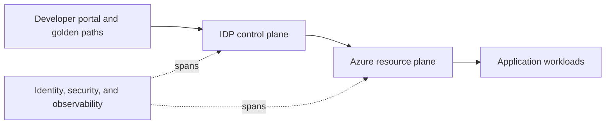

# Reference Architecture of an Internal Developer Platform on Azure

*Weave Intelligence — Report*

## Agent guide

Presents a layered reference architecture for implementing internal developer platform capabilities and developer workflows on Azure.
### Questions this chapter answers
- Which layers make up an IDP reference architecture on Azure?
- How do developer-facing workflows provision Azure resources?
- Where do identity, security, and observability integrate?
### Key points
- A developer-facing layer delegates provisioning through a platform control plane.
- Azure services form resource planes behind standardized platform interfaces.
- Identity, security, and observability span the platform architecture.

## Conceptual diagram

## Detailed source transcript

### Page 1
1   REFERENCE ARCHITECTURE OF AN INTERNAL DEVELOPER PLATFORM ON AZURE
### Page 2
Reference architecture of an Internal
Developer Platform on Azure
Table of contents
Introduction                                                03              The Resource Plane                          17
	Security Plane                              18
Overview of changes in                                      05               Code analysis                              18
version 2.0                                                                  Secrets management                         18
	ID management                              18
Multi-platform reality                                      06
	Policy control                             19
Code as truth, interface as enabler                         06
	Network based security                     19
Central backend still rules                                 06
	Security suites                            19
Security first                                              06
	The Observability Plane                     20
Roles and responsibilities                                  07               Monitoring and Logging                     20
	Observability                              20
Design principles                                           08
	FinOps                                     21
	Incident Management                        22
Deep dive                                                   10
The Developer Control Plane                                 12              Golden paths                                23
	IDE and CDE                                             12               Golden path 1: Adding an S3 bucket to an   24
		existing workload
	Portals                                                 13
		Golden path 2: Fleet updating all S3       25
	Copilot, LLM, agents                                    13               buckets in staging
The Integration and Delivery Plane                          14
	Structuring your Version Control System (VCS)           15
		Conclusion                                  27
	CI pipeline                                             15
	Image registry                                          16
	Platform Orchestrator                                   16
	CD system                                               16
2       REFERENCE ARCHITECTURE OF AN INTERNAL DEVELOPER PLATFORM ON AZURE
### Page 3
Introduction
	When the first standard reference architecture for
	Internal Developer Platforms (IDPs) was published
	at PlatformCon back in June 2023, we couldn’t
	have anticipated how fast it would transform from
	blueprint to industry benchmark. Since its release,
	it has been downloaded more than 100,000 times,
	and has been regularly used by 100s of individuals
	and organizations to reason, plan, and implement
	their platform engineering initiatives.
3   REFERENCE ARCHITECTURE OF AN INTERNAL DEVELOPER PLATFORM ON AZURE
### Page 4
As the Platform Engineering                      and direct data from 480 Internal
	community has grown to over                      Developer Platform examples
	270,000 members worldwide since                  shared by Platform Engineering
	the first release of these reference             certification students, insights
	architectures, we’ve had the privilege           from 90+ platform engineering
	of witnessing the full spectrum of               ambassadors, and data gathered
	platform initiatives from remarkable             from almost hundreds of platform
	successes to instructive failures. At            engineers via the State of Platform
	the same time, in this same period,              Engineering survey.
	we’ve also witnessed AI’s dramatic
	emergence and its profound impact                For the average enterprise platform
	on the Software Development Life                 engineering team, adopting this
	Cycle (SDLC). This rapid influx of new           architecture means investing in a
	data on platform engineering best                proven approach that remains both
	practices, general industry maturity,            financially accessible and practically
	and AI adoption has driven the                   implementable.
	creation of a new standard reference
	architecture for platform teams.                 This whitepaper provides value for
		two distinct audiences: experienced
	It’s worth noting that these                     platform engineering practitioners
	architectures represent practices                seeking to understand what’s next
	from organizations that are                      (with particular emphasis on AI
	both technically advanced                        integration), and those embarking
	and representative of typical                    on their platform engineering
	enterprises. They come from                      journey and who want to get it right
	teams ranging from hundreds                      from the start. For newcomers
	to thousands of developers,                      to the field, we recommend first
	operating in conventional business               familiarizing yourself with the
	environments - not simply tech                   design fundamentals of Internal
	giants like Netflix, or Google. These            Developer Platforms, and enroll
	reference architectures were                     in a certification courses before
	shaped based on direct work across               exploring the advanced concepts
	dozens of organisations, hundreds                presented here.
	of conversations with practitioners,
4   REFERENCE ARCHITECTURE OF AN INTERNAL DEVELOPER PLATFORM ON AZURE
### Page 5
Overview of
changes in
version 2.0
	While preserving the core architectural
	foundation, we are adding several strategic
	adjustments. What are the biggest updates to
	the reference architecture?
5   REFERENCE ARCHITECTURE OF AN INTERNAL DEVELOPER PLATFORM ON AZURE
### Page 6
Multi-platform reality
	We now recognize that enterprises typically operate multiple platform
	types (up to four), rather than a single unified platform. At minimum, most
	organizations deploy separate Internal Developer Platforms (IDPs) for
	traditional backend and frontend services, data/AI workloads, and mobile
	application development. More sophisticated shops even differentiate
	between dedicated frontend and backend platforms, including specialized
	component libraries. This revised version focuses specifically on platforms
	supporting backend and frontend service development, whether in
	microservice-oriented or monolithic architectures.
	Code as truth, interface as enabler
	Developer interfaces and the control plane have become the primary access
	and interaction layer for most user groups. Best practices emphasize logging
	and versioning all changes as code, establishing Git as the single source of
	truth and complete system record.
	Beyond the IDE or CDE, we recommend offering a robust CLI and introducing
	conversational interfaces powered by AI, LLMs, co-pilots, and agents.
	This approach modernizes chat-ops, allowing users to query and modify
	components directly within their preferred chat environments. Our guiding
	principle remains to meet users where they already work embedding platform
	functionality seamlessly, without adding new interfaces.
	Central backend still rules
	Our guidance for the integration and delivery plane remains consistent. We
	continue recommending a central backend with graph-based metadata
	management and configuration rules enforcement. This central system
	functions as both endpoint and executor for interface-generated requests,
	driving standardization and automation throughout the environment.
	Security first
	Significantly more attention than previously is given to the security plane,
	as the domain is more commonly shifted down into the platform, reflecting
	both increasing platform complexity and emerging AI-related requirements.
	This critical infrastructure now spans the entire architecture, establishing the
	fundamental foundation upon which all other components are built.
6   REFERENCE ARCHITECTURE OF AN INTERNAL DEVELOPER PLATFORM ON AZURE
### Page 7
Roles and responsibilities
	We differentiate between those building the IDP and those consuming it,
	though these boundaries can sometimes blur. For instance, infrastructure
	platform engineers may simultaneously build platform capabilities while using
	those same tools to update underlying infrastructure.
	For clarity, we distinguish between platform owners and platform users.
	Typical platform users include backend developers, frontend developers,
	product and project managers, and executives in general.
	Platform owners, on the other hand, have long been referred to as “platform
	engineers”. But with the growing complexity and sophistication level of
	modern platforms, we are seeing specialization within the platform teams. As
	platform teams achieve this level of sophistication, specialized functions like
	security, cloud operations, and infrastructure increasingly assume dedicated
	platform engineering roles.
	This evolution requires strong alignment between the new specialized
	functions and the core platform team, in order to maintain cohesion and
	effectiveness across the platform ecosystem.
	ŗ Infrastructure platform engineers are concerned with the resource
		plane, as well as part of the data plane and integration and delivery plane.
	ŗ DevEx platform engineers primarily focus on interface design and user
		experience for platform consumers, while simultaneously managing
		onboarding processes, driving adoption initiatives and implementing
		measurement frameworks.
	ŗ Security platform engineers oversee the comprehensive security
		plane, integrating protective measures throughout the IDP. They
		automate security controls, establish secure-by-design configurations,
		and implement compliant practices.
	ŗ Observability platform engineers with a specific focus on the
		observability layer
	ŗ Platform Product Managers for the coordination and Head of Platform
		Engineering for the leadership components.
	As we examine the various architectural planes, we’ll identify the responsible
	roles within the platform engineering team. For organizations without
	dedicated security platform engineers, these responsibilities would typically
	fall to your existing security team members.
7   REFERENCE ARCHITECTURE OF AN INTERNAL DEVELOPER PLATFORM ON AZURE
### Page 8
Design principles
	GitOps first
	We’ve opted for a GitOps first design, where every single edit action done
	in the platform is represented as a change in code. A full representation
	of the state of all systems (service, infra and tool configuration) is
	available as code in a versioned way. This approach ensures that any
	modification, whether initiated through user interfaces or automated
	agents acting on behalf of users, triggers a git pull request. Enforcing
	code-first changes guarantees disaster recovery and backup readiness,
	and is the ideal audit-log at scale.
	Backend first
	This has been a long and heated debate, but we strongly believe that
	a platform is only as good as its backend. The backend of a platform in
	the form of a Platform Orchestrator, or well-tuned pipelines, deals with
	the role and access management of your platform and stores a graph
	based representation of how all services and resources fit together,
	versioned by deployment. The backend should be designed API first and
	well documented. Think of the backend as the brain of your platform: if
	you don’t have this, and put everything in linear, on-off pipelines, you will
	accumulate tech debt fast.
	Secure by design
	Security is not an afterthought but a foundation. Every component,
	template, and workflow in the platform should enforce least-privilege
	access, encryption in transit and at rest, and secret retrieval, not
	distribution, by default. Public exposure is denied unless explicitly
	allowed, and all changes are validated through policy-as-code. This
	design minimizes configuration drift and human error, ensuring that
	developers can move fast without creating vulnerabilities. The platform’s
	defaults favor containment and auditable automation, meaning security
	is always on, not added later. When secure practices are built into every
	golden path, the safest way naturally becomes the easiest and most
	productive way.
8   REFERENCE ARCHITECTURE OF AN INTERNAL DEVELOPER PLATFORM ON AZURE
### Page 9
Observability by default
	Observability is built into the platform from the start, not added later.
	Every component emits metrics, logs, and traces by default, using
	standardized formats and centralized aggregation. This ensures
	complete visibility into system health, performance, and user impact
	at any point in time. SLOs are defined per product and platform
	capability, with automated alerts tied to measurable error budgets. The
	observability plane spans across all others, enabling rapid root cause
	analysis, proactive incident detection, and informed capacity planning. A
	platform designed this way turns telemetry into an operational feedback
	loop, continuously improving reliability and developer experience.
	AI-augmented
	AI-augmented platforms embed intelligence directly into developer
	workflows, transforming how users interact with the system. Copilots,
	LLMs, and agents assist within IDEs, CLIs, and portals to automate
	repetitive tasks such as writing configurations, debugging pipelines,
	and generating documentation. These tools analyze logs, deployments,
	and metrics to surface insights, predict issues, and recommend
	optimizations in real time. All AI-driven actions remain governed by
	the platform’s established controls through trusted interfaces like the
	CLI or orchestrator API, preserving auditability and security. The result
	is a platform that learns continuously, amplifies human capability, and
	accelerates software delivery with confidence.
9   REFERENCE ARCHITECTURE OF AN INTERNAL DEVELOPER PLATFORM ON AZURE
### Page 10
Deep dive
	We will now deep dive into every plane and explain
	the components and how they intersect in detail.
	We will later demonstrate how those planes fit
	together by tracing two exemplary flows through
	the reference architectures.
10   REFERENCE ARCHITECTURE OF AN INTERNAL DEVELOPER PLATFORM ON AZURE
### Page 11
PLATFORM TOOLING LANDSCAPE
	INTERNAL DEVELOPER PLATFORM ON AZURE
11   REFERENCE ARCHITECTURE OF AN INTERNAL DEVELOPER PLATFORM ON AZURE
### Page 12
The Developer Control Plane
	This plane focuses on two core
	aspects: first, the interfaces
	through which users interact with
	the platform, and second, the
	representation of every action as
	code within version control.
	Together, these ensure a seamless
	user experience and a complete,
	auditable record of all platform
	operations. The Developer Control
	Plane is primarily designed and
	maintained by the DevEx platform
	engineer, who is responsible for
	optimizing usability, standardizing
	workflows, and embedding platform
	functionality directly into developers’
	existing environments.
	IDE and CDE
	The IDE, for example Visual Studio,              investing heavily in high-quality
	IntelliJ IDEA or PyCharm and the                 plugins and extensions. The goal is
	Cloud Development Environment                    to make the in-editor experience
	(CDE) together form the developer’s              seamless - every instance where a
	primary workspace. The IDE or editor             developer must leave their editor
	provides the interface for writing,              to perform a task represents a
	running, and debugging code, while               potential productivity loss.
	the CDE supplies the underlying,
	pre-configured infrastructure that               CDEs are especially valuable in
	hosts or connects to these editors.              security-sensitive or AI-heavy
	This combination defines the core                environments, as they enable
	of the developer experience and the              consistent, centrally managed,
	most natural integration point for               and compliant development setups.
	platform capabilities such as CLIs,              By provisioning standardized
	copilots, and automation agents.                 environments on demand,
		CDEs reinforce reproducibility,
	We recommend standardizing on a                  accelerate onboarding, and simplify
	small set of IDEs or supported editors           experimentation across teams.
	to reduce integration overhead and
12   REFERENCE ARCHITECTURE OF AN INTERNAL DEVELOPER PLATFORM ON AZURE
### Page 13
Portals
	Portals, often referred to as Internal           users to discover, manage, and
	Developer Portals (IDPs), act as                 operate services through a unified
	the primary user interfaces for                  experience. Core components
	interacting with different layers of             typically include service catalogs,
	the Internal Developer Platform.                 deployment dashboards, and
	They provide centralized access                  resource management views that
	to platform capabilities, allowing               abstract away underlying complexity.
	This reference architecture uses Backstage, an open-source
	developer portal framework originally created by Spotify to
	streamline their internal developer experience by centralizing
	tools, services, and documentation. In September 2020, it was
	accepted into the Cloud Native Computing Foundation (CNCF)
	as a Sandbox project and advanced to Incubating status in
	March 2022, reflecting its growing adoption and maturity in
	the cloud-native ecosystem.
	An emerging trend is the convergence of IDPs with observability
	platforms, creating a single pane of glass that combines operational
	control with real-time insights. Solutions such as Datadog now integrate
	service catalogs directly, enabling developers to monitor service health,
	performance, and dependencies within the same interface.
	Copilot, LLM, agents
	Copilots integrated into the                     When extending the use of LLMs
	IDE can dramatically improve                     beyond code assistance, particularly
	developer productivity and code                  for conversational interfaces
	quality. By offering context-aware               that trigger infrastructure or env
	code suggestions, intelligent                    changes, it is critical to adopt a CLI-
	autocompletion, and real-time                    first approach. This ensures such
	feedback on errors or code                       actions are executed through trusted
	smells, these AI-driven assistants               CLIs, maintaining a verifiable audit
	streamline workflows and reduce                  trail and enforcing role-based access
	cognitive load.                                  controls.
13   REFERENCE ARCHITECTURE OF AN INTERNAL DEVELOPER PLATFORM ON AZURE
### Page 14
Enterprises should also invest in developer education around prompt
	engineering and secure interaction patterns. By equipping teams with the
	skills to use AI tools effectively and responsibly, organizations can fully harness
	their benefits while minimizing security and compliance risks.
	This reference architecture leverages GitHub Copilot for intelligent
	code suggestions, analyzing project context, frameworks, and patterns
	to generate relevant, style-aligned completions. Platform engineers and
	developers gain accelerated development velocity, improved code quality
	via AI-assisted review/testing, and enhanced productivity throughout
	the lifecycle, from implementation to deployment. Studies show
	developers achieve substantial task acceleration on routine activities,
	maintaining quality, with strong benefits for boilerplate, test creation,
	and learning new technologies.
The Integration and Delivery Plane
	This plane focuses on the processes and systems that take the code from
	development to deployment. It ensures that software changes are reliably and
	efficiently delivered to the target environments. The Integration and Delivery
	Plane is primarily the responsibility of the Infrastructure Platform Engineer.
14   REFERENCE ARCHITECTURE OF AN INTERNAL DEVELOPER PLATFORM ON AZURE
### Page 15
Structuring your Version
	Control System (VCS)
	We recommend maintaining a                       by allowing developers to modify
	clear separation between baseline                configurations safely within
	configurations and service code.                 predefined boundaries.
	Baseline configurations include
	infrastructure and configuration                 Infrastructure as Code (IaC)
	templates, scaffolding blueprints,               definitions, such as Terraform
	and platform settings. These                     modules, should remain under
	should be centrally managed to                   the control of the central platform
	ensure consistency, security, and                or operations team and only
	compliance across the organization.              be adjusted when a specific,
		exceptional configuration is
	Service code, by contrast, should                required. This separation of
	define workloads through                         concerns preserves workflow
	an abstract specification (for                   integrity, supports automation,
	example, a Score file) that declares             and balances standardization with
	dependencies, resources, and                     the flexibility developers need to
	environment variables. This                      innovate effectively.
	approach enables true self-service
	CI pipeline
	The CI pipeline automates the building and testing of developed code. It
	compiles the code, runs automated tests, and upon successful completion,
	pushes the resulting container images to the image registry. It can also notify
	the Platform Orchestrator about new images and submit the Workload
	specification to trigger a deployment.
	This reference architecture uses GitHub Actions for CI. Since
	its introduction, GitHub Actions has rapidly become a top CI
	choice, especially for teams already on GitHub, due to its deep
	integration with repository events and a large marketplace of
	reusable actions.
15   REFERENCE ARCHITECTURE OF AN INTERNAL DEVELOPER PLATFORM ON AZURE
### Page 16
Image registry
	The image registry stores container images. It serves as a central repository
	for these images, making them accessible for deployment. The registry itself
	does not have a direct integration with the Platform Orchestrator but can
	have its credentials provided to CI/CD systems or workloads.
	Platform Orchestrator
	The Platform Orchestrator, in this case Humanitec, controls the general
	structure of your estate in the form of a graph. It knows which application
	connects to what resource in what environments and in which part of your
	estate. It also deals with central RBAC, checking which user is allowed
	to deploy to which part or apply which change. Finally it can orchestrate
	sign-off or security checks. It receives deployment metadata from the CI
	pipeline, including image paths, tags, and deployment deltas, and uses this
	information to trigger and manage deployments. It acts as the central control
	point for deploying and managing applications.
	CD system
	The CD system handles the actual deployment of applications. This can be
	the Platform Orchestrator’s deployment capabilities, an external system
	triggered by the Platform Orchestrator via pipelines, or a setup in tandem
	with GitOps operators like Flux or ArgoCD. It ensures that the latest code and
	configurations are deployed to the target environments.
16   REFERENCE ARCHITECTURE OF AN INTERNAL DEVELOPER PLATFORM ON AZURE
### Page 17
The Resource Plane
	This plane is primarily governed
	and developed by the Infrastructure
	Platform Engineering team. It
	encompasses several key categories:
	compute, which includes servers,
	virtual machines, and containers for
	processing workloads; networking,
	which manages the connectivity and
	communication between different
	components, including routing,
	firewalls, and load balancers; storage,
	which handles data persistence
	and retrieval, encompassing
	block storage, object storage,
	and file systems; and databases,
	which provide structured data
	management and access, including
	relational databases, NoSQL
	databases, and data warehouses.
	This reference architecture is for a Internal Developer Platform
	on Azure and uses AKE for compute, Azure SQL, Azure DNS
	and Azure Service Bus.
17   REFERENCE ARCHITECTURE OF AN INTERNAL DEVELOPER PLATFORM ON AZURE
### Page 18
Security Plane
	The Security Plane is primarily the responsibility of the Security Platform
	Engineer. Its components are interwoven into different parts of the SDLC.
	Code analysis
	Code analysis involves scanning source code for vulnerabilities, security
	flaws, and compliance issues. This is integrated early in the SDLC, during
	the coding phase, and as part of the CI pipeline to ensure security is built in
	from the start.
	This reference architecture leverages Codacy to automate
	security vulnerability, code quality, technical debt, and
	compliance detection. This addresses scalability limitations
	and bottlenecks in manual code review, allowing growing
	teams to maintain consistent standards without slowing
	development. Platform engineers and developers gain unified
	analysis, automated quality gates, and pre-deployment security
	scanning. Crucially, it provides real-time quality enforcement
	for both human and AI-generated code through IDE-
	integrated analysis, aiding AI coding assistant adoption.
	Secrets management
	Secrets management focuses on the secure storage and handling of
	sensitive information like API keys, passwords, and certificates. It is critical
	throughout the SDLC, from development to deployment, ensuring that
	secrets are never exposed in code or logs.
18   REFERENCE ARCHITECTURE OF AN INTERNAL DEVELOPER PLATFORM ON AZURE
### Page 19
ID management
	Identity (ID) management, or interchangeably Identity & Access Management
	(IAM), controls user access and authentication within the platform. It is crucial
	at every stage of the SDLC, ensuring that only authorized users can access
	and modify resources, and that actions are auditable.
	Policy control
	Policy control defines and enforces security policies across the platform. This
	includes defining access controls, compliance requirements, and operational
	guidelines. It affects all stages of the SDLC, ensuring that deployments and
	configurations adhere to security standards.
	Network based security
	Network-based security involves protecting the platform’s network
	infrastructure from unauthorized access and attacks. It includes firewalls,
	intrusion detection systems, and network segmentation. This is a continuous
	concern throughout the SDLC and runtime environment.
	Security suites
	Security suites integrate multiple security tools and services into a unified
	platform. These suites can include vulnerability scanners, intrusion detection
	systems, and security information and event management (SIEM) tools. They
	provide comprehensive security coverage and are relevant throughout the
	SDLC and operational phases.
	This reference architecture uses Orca Security, a Cloud-Native
	Application Protection Platform (CNAPP) that provides
	agentless, comprehensive security visibility and risk detection
	across multi-cloud environments. Its patented SideScanning
	technology enables unified cloud security coverage without the
	need for agent installation or operational disruption.
19   REFERENCE ARCHITECTURE OF AN INTERNAL DEVELOPER PLATFORM ON AZURE
### Page 20
The Observability Plane
	The Observability plane provides a comprehensive view into the health
	and performance of the platform and its applications. It encompasses
	monitoring, logging, tracing, and alerting capabilities, enabling teams
	to understand the state of the system in real-time and diagnose issues
	effectively. The Observability Platform Engineer is primarily responsible for
	designing, implementing, and maintaining the Observability Plane, ensuring
	that it provides actionable insights and supports the overall reliability and
	stability of the platform.
	Monitoring and Logging
	Monitoring involves collecting and analyzing metrics related to system
	performance, resource utilization, and application behavior. This includes
	tracking key performance indicators (KPIs) and setting up alerts for
	anomalies or thresholds. Logging captures detailed records of events
	and activities within the platform, providing a historical context for
	troubleshooting and auditing. Both monitoring and logging are crucial
	for identifying and resolving issues promptly, as well as for understanding
	trends and patterns in system usage.
	Observability
	Observability focuses on the health and performance of the underlying
	infrastructure components, such as servers, networks, and storage systems.
	It involves collecting metrics and logs from these components to gain
	insights into their utilization, availability, and potential bottlenecks. This allows
	platform teams to ensure that the infrastructure can support the demands of
	the applications running on it and proactively address any issues before they
	impact users.
20   REFERENCE ARCHITECTURE OF AN INTERNAL DEVELOPER PLATFORM ON AZURE
### Page 21
This reference architecture employs the popular open-source
	monitoring stack of Prometheus and Grafana. Prometheus
	functions as the time-series database, collecting and storing
	metrics via PromQL. Grafana serves as the visualization
	and analytics layer, connecting to Prometheus to create
	interactive dashboards for analyzing metrics, logs, and
	traces. Together, they offer comprehensive insights into
	system performance and health.
	FinOps
	Finops approaches like cost tracking and chargebacks involve monitoring
	the expenses associated with running the platform and its applications,
	and allocating these costs to the respective teams or departments.
	This includes tracking resource usage, cloud provider bills, and other
	expenses. By providing visibility into costs, teams can optimize resource
	utilization, identify cost-saving opportunities, and ensure that expenses are
	aligned with business priorities. Chargebacks can be used to hold teams
	accountable for their resource consumption and encourage efficient usage.
	This reference architecture leverages CloudZero to implement
	industry-standard FinOps practices across the entire inform,
	optimize, and operate lifecycle. It consolidates multi-cloud
	cost data - from Amazon Web Services, Microsoft Azure,
	Google Cloud, Oracle Cloud, and regional providers - into
	unified reports, available in any currency. Optimization
	features include usage reduction, facilitated by rightsizing
	recommendations, and rate reduction, managed through
	automated commitment management.
21   REFERENCE ARCHITECTURE OF AN INTERNAL DEVELOPER PLATFORM ON AZURE
### Page 22
Incident Management
	Incident Management is the process of responding to and resolving incidents
	that disrupt the platform or its applications. It involves detecting, diagnosing,
	and remediating issues, as well as communicating with stakeholders and
	documenting the incident. The Observability Plane plays a crucial role in
	Incident Management by providing the data and tools needed to understand
	the impact of an incident, identify the root cause, and track the progress of
	resolution. Effective Incident Management ensures minimal downtime and
	disruption to users.
22   REFERENCE ARCHITECTURE OF AN INTERNAL DEVELOPER PLATFORM ON AZURE
### Page 23
Golden paths
	Golden paths are standardized, opinionated
	workflows that guide developers through common
	tasks in a consistent, safe, and efficient way;
	essentially “paved roads” that remove ambiguity
	while preserving flexibility. Within the context
	of platform engineering, golden paths represent
	the bridge between developer experience and
	organizational best practices: they ensure that
	teams can deliver quickly while staying compliant
	and secure. As demonstrated in our Platform
	Engineering Certification courses these paths
	help platform teams codify complex workflows
	into repeatable, self-service experiences, turning
	what used to be tribal knowledge into accessible,
	automated processes. The following examples
	illustrate how golden paths manifest in practice,
	from provisioning new resources to orchestrating
	fleet-wide infrastructure updates.
23   REFERENCE ARCHITECTURE OF AN INTERNAL DEVELOPER PLATFORM ON AZURE
### Page 24
Golden path 1: Adding a Azure Blob
Storage object to an existing workload
	A developer, aiming to enhance their application’s functionality, identifies the
	need for an Azure Blob Storage object to manage object storage. Leveraging
	the platform’s intuitive LLM-powered chat interface, they express their
	intent in natural language. The LLM, trained on the platform’s intricacies,
	seamlessly translates this request into a precise CLI command, which in turn
	initiates a GitOps workflow.
	A pull request is automatically generated, targeting the `score.yaml` file that
	defines the application’s resource requirements. The PR introduces a new
	resource block under the relevant service, specifying the bucket’s type and a
	desired name:
		# ... (previous content)
		resources:
			- type: azure-blob-storage
				name: my-data-container
	Upon approval and merge, the                     Storage object and identifies the
	change triggers the CI/CD pipeline.              appropriate infrastructure template
	The pipeline orchestrates the build              to achieve this. However, before
	process, compiling the application               proceeding, the orchestrator
	code into a container image. This                consults the ID management
	image then undergoes rigorous code               system to verify that the developer
	analysis within the security plane,              possesses the necessary
	scanning for potential vulnerabilities           permissions to create and
	and ensuring compliance with                     manage buckets.
	established security policies. Once
	deemed secure, the image is pushed               A sign-off process is initiated,
	to the container registry.                       potentially involving additional
		approvals from senior team
	The orchestrator, now aware                      members or security personnel. If
	of the updated image and its                     required, further security checks are
	resource requirements, analyzes                  performed to assess the potential
	the metadata and application                     impact of the new resource on the
	context. It determines that the                  overall system. Upon successful
	new resource request necessitates                completion of these checks,
	the provisioning of an Azure Blob                the orchestrator executes the
24   REFERENCE ARCHITECTURE OF AN INTERNAL DEVELOPER PLATFORM ON AZURE
### Page 25
Infrastructure as Code (IaC)                          Simultaneously, the infrastructure
	defined within the chosen template.                   observability suite springs into
	This IaC interacts with the cloud                     action, integrating the new object
	provider’s API, dynamically                           into its monitoring and visualization
	provisioning the Azure Blob Storage                   framework. The bucket becomes
	object with the specified name and                    a node within the platform’s
	appropriate configuration.                            comprehensive resource graph,
		allowing for real-time monitoring
	The secret manager, integrated                        of its performance and health.
	into the platform, securely retrieves                 Additionally, the bucket’s endpoint
	the newly created bucket’s access                     is made accessible through the
	credentials and injects them as                       platform’s portal, providing the
	secrets into the application’s                        developer with a convenient
	container environment. This ensures                   interface to manage its contents
	that the application can seamlessly                   and integrate it into their
	interact with the Azure Blob Storage                  application’s workflow.
	object without exposing sensitive
	information. Finally, the orchestrator
	confirms the successful provisioning
	of the bucket to the developer.
Golden path 2: Fleet updating all Azure
Blob Storage object in staging
	This example demonstrates how platform engineers can safely update
	infrastructure using standardized workflows. Each stage from initial code
	changes and automated policy validation to simulation, progressive rollout,
	and real-time observability shows how the platform enforces control,
	transparency, and reliability throughout the entire delivery process.
01                        The IDE and                       The platform engineer initiates the process within their
	IDE, which is seamlessly integrated with the platform’s
	policy engine                     IaC tooling. As the engineer modifies the Azure Blob
STEP
	Storage object template, the policy engine, operating
	in the background, dynamically analyzes the changes.
	This real-time analysis ensures that the proposed
	modifications adhere to the organization’s security
25     REFERENCE ARCHITECTURE OF AN INTERNAL DEVELOPER PLATFORM ON AZURE
### Page 26
policies, compliance standards, and best practices. Any
	potential misconfigurations or violations are immediately
	flagged, preventing the introduction of errors or
	vulnerabilities into the infrastructure.
02
	The platform,                     With the template changes validated, the engineer
		turns to the platform portal. This centralized dashboard
	portal, and                       provides a comprehensive view of the Azure Blob
STEP
	simulation                        Storage object landscape. The engineer can visualize
		all active buckets, their version history, and their
		deployment across various environments (development,
		staging, production). To mitigate risk, the engineer
		leverages the portal’s simulation capabilities. A
		simulation is executed, modeling the impact of the
		proposed changes on the existing environment variables
		and configurations. This predictive analysis helps
		identify potential conflicts or disruptions before the
		changes are applied.
03
	Platform                          The actual deployment of the Azure Blob Storage
		object updates is managed by the platform’s Platform
	orchestration                     Orchestrator. This system automates the rollout process,
STEP
	and progressive                   adhering to a progressive delivery strategy. Initially, the
	rollout                           changes are applied to a small subset of the development
		S3 buckets. This allows for early testing and validation
		in a controlled environment. If no issues are detected,
		the rollout gradually expands to a larger percentage
		of development buckets, and then progresses to the
		staging environment. This incremental approach
		minimizes the blast radius of potential failures and allows
		for rapid rollback if necessary.
04
	Observability                     Throughout the entire rollout process, the observability
		plane plays a crucial role. Metrics and logs from the
	and monitoring                    Azure Blob Storage object are continuously collected
STEP
	and analyzed. The observability plane provides
	real-time insights into the health and performance
	of the updated infrastructure. Any anomalies or
	unexpected behaviors are immediately detected and
	alerted upon. The platform portal displays a live view of
	the rollout’s progress, including the updated S3 bucket
	versions across all environments. This transparency
	enables the engineer to track the impact of the changes
	and make informed decisions.
26     REFERENCE ARCHITECTURE OF AN INTERNAL DEVELOPER PLATFORM ON AZURE
### Page 27
Conclusion
	The evolution from the first to the second
	reference architecture marks a decisive step in
	the maturity of platform engineering. The 2023
	release established a shared vocabulary and
	mental model for Internal Developer Platforms,
	while version 2.0 reflects how the discipline
	has evolved through real-world adoption, the
	rise of AI-driven development, and the growing
	complexity of enterprise ecosystems. This new
	architecture captures not just what teams are
	building, but how they operate at scale, how they
	secure their environments by default, and how
	they use observability and automation to achieve
	predictable, measurable outcomes.
27   REFERENCE ARCHITECTURE OF AN INTERNAL DEVELOPER PLATFORM ON AZURE
### Page 28
The principles underpinning                      an organization is just beginning
	this architecture emphasize                      its platform journey or refining
	that effective platforms are not                 a mature setup, these patterns
	collections of tools, but cohesive               provide the foundation for
	systems built on clarity, consistency,           sustainable platform engineering.
	and control. By codifying every
	action, defining a single source of              By learning from thousands of
	truth, and embedding security and                practitioners and hundreds of
	observability, enterprises can reduce            implementations, this version
	cognitive load, accelerate delivery,             ensures that as technology, AI, and
	and minimize risk.                               organizational structures evolve,
		platform engineering continues to
	Equally important, this version                  serve its core purpose: empowering
	recognizes that no two platforms                 teams to build, ship, and operate
	are alike. The multi-platform                    software faster, more securely, and
	reality acknowledges that modern                 with greater confidence than
	organizations often operate several              ever before.
	internal platforms, spanning
	frontend and backend services,                   Simultaneously, the infrastructure
	data and AI workloads, and mobile                observability suite springs into
	applications. Yet across these                   action, integrating the new S3
	diverse implementations, the same                bucket into its monitoring and
	architectural fundamentals apply:                visualization framework. The
	clear ownership, composability,                  bucket becomes a node within the
	automation, and continuous                       platform’s comprehensive resource
	feedback loops.                                  graph, allowing for real-time
		monitoring of its performance and
	However, it is crucial to take-                  health. Additionally, the bucket’s
	away that this updated reference                 endpoint is made accessible
	architecture is not a prescription               through the platform’s portal,
	but a framework. It enables teams                providing the developer with a
	to design platforms that fit their               convenient interface to manage its
	context while remaining grounded                 contents and integrate it into their
	in proven best practices. Whether                application’s workflow.
28   REFERENCE ARCHITECTURE OF AN INTERNAL DEVELOPER PLATFORM ON AZURE
## Code map
- No matching code repository has been identified for this book.
## Source note
This is the complete generated chapter transcript. Source identity and status are recorded in the database properties.
