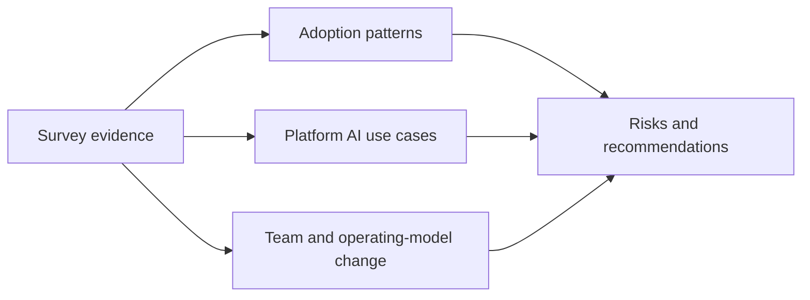

# State of AI in Platform Engineering

*Weave Intelligence — Report*

## Agent guide

Reports on the adoption, use cases, team changes, and governance concerns surrounding AI in platform engineering.
### Questions this chapter answers
- How are platform teams adopting and supporting AI?
- Which use cases, capabilities, and organizational changes are emerging?
- What risks and constraints shape adoption?
### Key points
- AI affects both the capabilities platforms provide and how platform teams work.
- Adoption patterns must be interpreted alongside organizational maturity and constraints.
- Governance and measurable outcomes are necessary for sustainable expansion.

## Conceptual diagram

## Detailed source transcript

### Page 1
State of AI in
Platform Engineering
WEAVE INTELLIGENCE PRESENTS
STATE     OF AI IN PLATFORM ENGINEERING
PUBLISHED IN 2025
1       STATE OF AI IN PLATFORM ENGINEERING
### Page 2
Table of contents
About our partners                            03   The evolving platform team               37
	Addressing the skill gap: Training and   39
	enablement strategies
Executive summary                             04
	Is fear of AI holding us back?           41
Defining AI in the context                    08
of platform engineering                            Five key recommendations to              43
	guide platform teams toward
	effective AI integration into
What is the state of AI in                    11   AI-powered platforms
platform engineering?                                                                       44
	Build foundations before intelligence
Is AI over-hyped or appropriately hyped?      13
	44
	Start with clear intent and
How are platform engineers using AI?          15   measurable outcomes
	Embrace Platform as Product              46
What do platform engineers want to            16
	thinking for AI
use AI for?
	Implement gradual, pragmatic             47
From top-down mandates to                     18
	governance
bottom-up innovation
	Invest in your team’s evolution          48
The platform as an AI enabler:                19
A new mandate
From cloud-native to AI-native                21
	Final outlook: What will the             49
infrastructure
	Distinct demands of AI workloads
		future bring?
		22
	AI-native and the dual mandate            23
	of platform engineering
		Appendix                                 52
	The potential of agentic AI and           27
		Survey methodology snapshot              52
	autonomous systems
		Glossary of key AI terms in              53
		platform engineering
Key challenges and barriers                   30
	References                               58
People-centric hurdles                        31
Technical and operational hurdles             33
Security and governance challenges            35
and solutions
2       STATE OF AI IN PLATFORM ENGINEERING
### Page 3
About our partners
	Vultr is on a mission to make high-performance cloud
	infrastructure easy to use, affordable, and locally accessible for
	enterprises and AI innovators around the world. Vultr is trusted by
	hundreds of thousands of active customers across 185 countries
	for its flexible, scalable, global Cloud Compute, Cloud GPU, Bare
	Metal, and Cloud Storage solutions. Founded by David Aninowsky
	and self-funded for over a decade, Vultr has grown to become the
	world’s largest privately held cloud infrastructure company. Learn
	more at [Vultr.com](http://Vultr.com).
	ONA is mission control for software projects and software
	engineering agents. Ona transforms how software is built by
	moving beyond the IDE to enable developers and agents to work
	together in secure, disposable environments across the entire
	development lifecycle. Ona Agents handle complex tasks like
	refactoring and migrations in parallel while developers focus on
	higher-value work. Ona Environments are consistent and pre-
	configured to eliminate “works on my machine” issues. And finally,
	Ona Guardrails ensure enterprise-grade security, audit trails, and
	VPC deployment so source code and secrets never leave your
	network. Ona is trusted by over 2 million developers and deployed
	at America’s largest banks and Europe’s leading pharmaceutical
	companies. Learn more at [Ona.com](http://Ona.com).
	Coder is the AI software development company leading the future
	of autonomous coding. Coder helps teams build fast, stay secure,
	and scale with control by combining AI coding agents and human
	developers in one trusted workspace. Coder’s award-winning self-
	hosted Cloud Development Environment (CDE) gives enterprises
	the power to govern, audit, and accelerate software development
	without trade-offs. Learn more at [coder.com](http://coder.com).
3   STATE OF AI IN PLATFORM ENGINEERING
### Page 4
Executive
summary
	Platform engineering is eating the world. As
	platforms grow and absorb everything from
	security and compliance to data and infrastructure,
	it is no surprise that AI, the key trend of our times,
	is a defining player in the platform engineering
	story. Our State of AI in Platform Engineering
	report hopes to summarise this immense topic.
	It analyses the survey responses of 242 platform
	engineering professionals from across the
	industry, alongside interviews with platform
	engineering and AI experts from the industry.
	Their responses reveal where AI currently stands,
	and how it is pulsating through every facet of the
	platform engineering story.
4   STATE OF AI IN PLATFORM ENGINEERING
### Page 5
excitement the hype builds, but the
89%
	long term work doesn’t deliver fast
	of respondents reported                   enough on what we want, and the
	daily AI usage                            “AI implementation plateau”, the gap
		between potential and realized
		value, is reached.
	AI is clearly everywhere, but the data
		It is our belief that platform
	gathered reveals a fundamental
		engineering teams are uniquely
	tension. Daily AI usage has
		positioned to break through this
	become standard, with 89% of
		plateau. Already, 75% of respondents
	respondents reporting regular
		are hosting or preparing to host
	use, for code generation (75%) and
		AI workloads. Thus the platform
	documentation (70%). Yet this
		engineer transforms from merely
	widespread adoption hides a critical
		a user of AI to a driver of AI. Their
	gap: most usage remains tactical,
		cross-functional expertise enables
	driven by individual experimentation
		them to curate toolchains, ensure
	rather than strategic value. Tools like
		security compliance, and transform
	Cursor contribute almost 1 billion
		fragmented experiments into
	lines of code a day, roughly one-
		cohesive solutions that actually
	fifth of global code production, but
		deliver on the aspirations of our
	many organizations are struggling
		AI initiatives.
	to measure any meaningful ROI
	(beyond a few productivity metrics).
		At the same time, platform engineers
		are well suited to face the challenges
	The report confirms the facts we
		of AI, since as always, the key
	all know in our gut. 84.5% of those
		challenges remain human-centric.
	who responded report that AI plays
		Skill gaps affect 57% of teams, while
	a large role in org goals and 90%
		56% struggle with AI hallucinations.
	believe AI will have a huge impact
		Security teams, though 69.7% have
	on us in the future. Platform teams
		AI policies, create friction through
	are pressured from both C-suite
		overly restrictive approaches
	mandates demanding ROI and
		(16.9% report blocking). Success
	developers experiencing “prompt
		requires balancing innovation with
	fatigue” from uncoordinated tool
		governance, experimentation with
	proliferation. AI is everywhere, and
		standardization, and understanding
	we are all using it. Every executive
		the socio-technical challenges of org
	is demanding it. We anticipate
		transformation - an operating model
	the rewards to be immense, and
		that non-platform engineering
	thus the pressures are immense
		teams are not used to existing within.
	too. Driven by quick wins and early
5   STATE OF AI IN PLATFORM ENGINEERING
### Page 6
This is reinforced by data from Google Cloud, where a
	staggering 94% of organizations identify AI as either ‘Critical’
	or ‘Important’ to the future of platform engineering. And more,
	86% believe that platform engineering is essential to realizing
	the full business value of AI.
	This research by Google reflects a      ‘AI-native’ era where infrastructure,
	symbiotic relationship: AI‑powered      pipelines, and governance must
	platforms, where AI empowers            evolve to handle GPU-accelerated
	Internal Developer Platforms (IDPs),    workloads, agentic systems, and
	and Platforms for AI, where             new operational patterns. Platform
	purpose-built foundations enable        engineers must rise to the challenge
	the efficient deployment and scaling    of AI and help drive its adoption not
	of AI/ML workloads.                     purely based on individual usage,
		but system wide as a driver of
	This duality underscores the            AI-powered IDPs, and IDPs that
	opportunity. As developers lean         better power AI. At the same time,
	heavily on AI, whether to               platform engineers must ensure that
	auto-generate infrastructure as         their platform teams have robust
	code, anticipate bottlenecks, or        product mindsets, clear and effective
	author CI/CD pipelines, platform        golden paths and automations,
	engineering teams adapt swiftly         and goals driven by the needs of
	to maintain control, reliability, and   their customers (whether they be
	security. And as the most powerful AI   developers or data scientists) not by
	demands platforms built specifically    the whims and demands of the all
	to better enable their deployment       powerful tidal wave of hype.
	and use, platform engineers must
	embrace a new customer, the data        Platform engineers must understand
	scientist or AI engineer. They must     their role, and their importance in
	dive into the challenge of building     this paradigm shift. They must not
	highly specialized ecosystems           forget that the power of platform
	designed to support the world of        engineering will lie with its core
	AI and machine learning. They           principles, which will be enhanced by
	must enable data scientists and         AI, not replaced by it.
	ML engineers to develop, train, and
	deploy AI models efficiently.
	Just as the cloud-native era
	reshaped software delivery, we
	now stand on the edge of an
6   STATE OF AI IN PLATFORM ENGINEERING
### Page 7
KEY TAKEAWAYS FROM REPORT
01
	AI adoption is           89% of platform engineers use it daily,
		yet most usage remains tactical, with
	near-universal
		orgs struggling to achieve measurable
		strategic ROI.
02
	Platform engineers are   Shifting from individual users to
		orchestrators of secure, scalable AI adoption
	becoming AI enablers
		that turns fragmented experiments into
		enterprise-wide value. This includes
		embracing new platform customers like data
		scientists and AI engineers.
03
	Challenges are           Skill gaps, tool sprawl, hallucinations,
		governance friction, and cost concerns
	multifaceted
		create a more complex and challenging
		transformation than many expect.
04
	Future platforms will    Blending AI-powered operations, agentic
		autonomy, and sustainability practices to
	be self-evolving
		deliver adaptive, intelligent infrastructure
		at scale.
05
	Success demands          Measurable outcomes, pragmatic
		governance, and continuous investment
	strong platform
		in people to ensure AI enhances
	foundations evolving     platforms rather than amplifies chaos.
7    STATE OF AI IN PLATFORM ENGINEERING
### Page 8
Defining AI
in the context
of platform
engineering
	It is important that as we discuss the
	intersection of AI and platform engineering,
	we speak the same language, and define terms
	the same way. This section highlights how we
	interpret this terminology, and their importance
	for understanding the relationship between AI
	and platform engineering.
8   STATE OF AI IN PLATFORM ENGINEERING
### Page 9
AI-powered platforms                 Platforms for AI
	As stated, these platforms           Platforms for AI provide the
	leverage AI to enhance               infrastructure and tooling
	traditional platform capabilities,   necessary for AI/ML workloads,
	focusing on making platform          addressing unique challenges
	teams more efficient and             such as managing GPU
	developers more productive.          resources and specialized
	They achieve this through            compute, implementing
	AI-assisted infrastructure           MLOps pipelines for the
	provisioning and configuration,      model lifecycle, providing data
	intelligent troubleshooting          versioning and feature stores,
	and root cause analysis,             ensuring model governance
	automated code reviews and           and compliance, and supporting
	security scanning, natural           experimentation and model
	language interfaces for              serving at scale.
	platform interactions, and
	predictive scaling and resource      This perspective expands
	optimization.                        platform teams’ responsibilities
		to serve new customers: data
	This perspective transforms          scientists, ML engineers, and
	how platform teams, and              AI researchers.
	internal developer platforms
	work, enabling them to
	handle greater complexity with
	less manual effort.
	Generative AI (GenAI)                AI Agents
	GenAI uses Large Language            These software systems take
	Models (LLMs) to understand          task requests and use LLMs
	and produce human-like               to plan and execute steps
	text and code. For platform          autonomously. Unlike traditional
	teams, this means automating         automation, agents adapt to
	repetitive tasks, generating         changing conditions and learn
	boilerplate code, and creating       from experience. They perceive
	documentation. The technology        their environment, make
	also democratizes development        decisions, and take actions
	by enabling natural language         with minimal human oversight,
	interactions with platform           a capability that promises to
	capabilities.                        transform platform operations.
9   STATE OF AI IN PLATFORM ENGINEERING
### Page 10
Agentic AI
	This broader capability combines LLMs, traditional ML, and enterprise
	automation to create truly autonomous systems. Agentic AI operates
	probabilistically, making decisions based on patterns and likelihoods
	rather than deterministic rules. This adaptability makes it ideal
	for complex platform engineering challenges.
“
	It is crucial to understand that LLMs and autonomous
	agents don’t eliminate the need for platforms, they elevate the
	abstraction layer. As AI automates low-level tasks, platforms
	shift from managing granular complexity to providing
	intelligent orchestration. Instead of engineers crafting
	individual CI/CD pipelines, they build platforms enabling AI
	agents to manage releases autonomously.
	Kaspar von Grünberg
	CEO OF HUMANITEC
10   STATE OF AI IN PLATFORM ENGINEERING
### Page 11
What is the state
of AI in platform
engineering?
	AI has clearly crossed the adoption chasm
	in platform engineering. What began as
	experimentation has become daily practice,
	fundamentally changing how we all work. However,
	AI usage for platform engineers is still immature,
	with code and documentation generation
	dominating, and advanced usage (the kind that
	brings step change ROI) lagging behind.
11   STATE OF AI IN PLATFORM ENGINEERING
### Page 12
DO YOU USE AI IN YOUR DAY-TO-DAY WORK?
	The numbers tell a clear story: 89%        at the same time creates “Shadow
	of platform professionals use AI daily,    AI”, uncoordinated tool usage that
	with 81% confirming regular use and        bypasses organizational governance.
	8% reporting intensive usage.
		The ease of accessing AI tools is
		what drives this. Unlike previous
	These are more incredible                  technology waves requiring
	adoption rates. Not since                  infrastructure investment, AI tools
		offer immediate value through
	the Dotcom era in the 1990s
		simple browser interfaces or
	has a new technology seen                  IDE plugins. This accessibility
	such rapid adoption, clear                 accelerates adoption certainly,
		but at the same time complicates
	potential and excitement.
		governance massively.
		It’s no surprise that in many
	Yet these impressive statistics
		organizations, as individual
	mask important nuances. Most
		productivity gains don’t translate
	current usage stems from individual
		to enterprise value, the disconnect
	exploration rather than any
		between AI’s perceived capabilities
	coordinated strategy. Engineers
		and actual outcomes ends up
	experiment with GitHub Copilot,
		frustrating both executives seeking
	Cursor, and ChatGPT, discovering
		ROI and developers experiencing
	individual productivity gains through
		ever increasing pressure and
	trial and error. This grassroots
		expectations from leadership and
	adoption, while valuable for building
		AI mandates.
	familiarity, doesn’t drive the org level
	ROI that leaders are hunting for, and
12   STATE OF AI IN PLATFORM ENGINEERING
### Page 13
Is AI over-hyped or
appropriately hyped?
	It will thus come as no shock that platform engineers are completely divided
	on the appropriate level of hype about AI: 47% consider it “over-hyped”
	while 45% see it as “appropriately hyped”. This split reflects the gap between
	promise and current reality.
		WOULD YOU DESCRIBE AI AS BEING OVER-HYPED, APPROPRIATELY
		HYPED,OR UNDER-HYPED?
	This division in hype perception         cases as foundation models and
	is perfectly explained by the “AI        coding assistants dominate, while
	implementation plateau”, the stage       specialized platform engineering AI
	where organizations stop seeing          tools remain barely utilised.
	rapid gains from AI adoption,
	and face slower ROI, integration         Beyond the data, across all AI talks
	hurdles, and the need for deeper         and panels at PlatformCon 2025,
	cultural or process change. Despite      the recurring point was clear, “We
	widespread usage, organizations          are very far from utilising the full
	struggle to move beyond basic use        potential of AI”.
13   STATE OF AI IN PLATFORM ENGINEERING
### Page 14
Several factors at organizations are
	contributing to this plateau:
		Optimising for the easy                Tool proliferation
		Orgs stick to quick wins,              The overwhelming variety of AI
		avoiding harder integrations.          tools creates decision paralysis.
		Unclear ROI                            Integration challenges
		Productivity gains prove difficult     Fitting AI into existing workflows
		to quantify in business terms.         requires significant effort.
			Breaking through demands strategic
			focus. Orgs need to move beyond
			counting lines of code generated
			to measuring real business impact
			i.e. measuring “usefulness”. This
			requires connecting AI adoption to
		Quality concerns                     specific outcomes: faster delivery,
		AI-generated outputs require         fewer defects, improved developer
		extensive validation.                satisfaction. This kind of thinking
			should be a platform team’s bread
			and butter.
14   STATE OF AI IN PLATFORM ENGINEERING
### Page 15
How are platform
engineers using AI?
	The platform engineering community does show remarkable consensus in
	one area however: 71% expect AI’s major impact within 12 months, and half of
	all platform engineers believing it’s already underway. While overall, 90% of
	professionals anticipate a large impact in their day-to-day work in the future.
		WHEN WILL THIS LARGE IMPACT OCCUR?
	However, as highlighted above, current AI usage still concentrates on
	immediate productivity improvements rather than on large strategic changes.
	Two use cases dominate.
		75%                                      70%
	Quality concerns                           Documentation
		AI accelerates coding through             AI transforms documentation from
		boilerplate generation, function          burden to byproduct. Tools generate
		completion, and syntax assistance.        technical documentation, summarize
		Developers report significant time        code behavior, and create user
		savings on repetitive tasks, allowing     guides automatically, addressing a
		focus on complex problem-solving.         perennial engineering pain point.
15   STATE OF AI IN PLATFORM ENGINEERING
### Page 16
WHAT DO YOU USE AI FOR?
	Beyond these primary uses, AI enhances daily operations through email
	composition (56%), error analysis (44%), and infrastructure file generation
	(42%). A smaller but growing segment (22%) uses AI for ChatOps, integrating
	conversational interfaces into operational workflows.
What do platform engineers
want to use AI for?
	We asked all of those surveyed to write their own answer to the question,
	“What would you like to use AI for?”. This generated a host of interesting, and
	unsurprising answers (49% of people simply wrote some form of “Everything,
	make my life easier, do my job” etc).
	“     Everything ie. AI
		to replace me         “
			Except for mental
			modelling...everything
	“     Anything and
		everything
			“
				Everything
					“
						Everything
	“                           “                           “
		Everything                Everything                  Everything
16   STATE OF AI IN PLATFORM ENGINEERING
### Page 17
Through the many answers,
recurring themes appeared.
	Unrepresented in the survey data,
	25%                    Software Development               but highlighted by experts in the
		community, three specialized
		Life Cycle (SDLC)                  use cases deserve particular
		enhancement                        attention. These are test case
			generation, where the AI analyzes
		Teams want intelligent code
			requirements and historical data
		review that understands
			to produce comprehensive test
		architectural patterns,
			suites that improve coverage
		automated testing that
			and reduce manual effort; legacy
		generates scenarios that are
			code comprehension, where it
		actually meaningful, and CI/
			decodes undocumented systems,
		CD optimization that can learn
			interprets functionality, and
		from deployment history and
			identifies vulnerabilities to support
		improve itself more effectively.
			modernization of decades-old
			codebases. And, architectural
		16%                   Data analysis and
			refactoring, where AI provides
			real-time feedback on design
			observability                      decisions, surfacing technical debt
				and prioritizing improvements
			Deeper operational intelligence.   to prevent the accumulation of
			AI should identify patterns        complexity that can cripple
			humans miss, predict failures      system evolution.
			before they occur, and
			recommend optimizations            These use cases address
			based on system behavior.          fundamental engineering
				challenges, rather than individual
				productivity hacks.
		10%                   Platform management
			See examples of successful AI
			and architecture                   implementations in one of the 30+
			Strategic interest centers on      AI talks from PlatformCon 2025.
			AI managing infrastructure
			complexity. This includes
			capacity planning, cost
			optimization, and architectural
			recommendations based on
			usage patterns.
17   STATE OF AI IN PLATFORM ENGINEERING
### Page 18
“
	Platform teams want AI that understands context, learns from
	patterns, and makes intelligent recommendations. They seek
	partners in platform evolution, not just productivity tools. We
	have enough productivity tools…
	Luca Galante
	CORE CONTRIBUTOR TO PLATFORM ENGINEERING COMMUNITY
From top-down mandates
to bottom-up innovation
	AI adoption in platform engineering is emerging from two converging forces.
	Top-down mandates meet bottom-up innovation. This combination drives
	immense usage but also creates a tension that shapes the implementation
	patterns for orgs.
		WHAT IS YOUR ORGANIZATION’S ATTITUDE TOWARDS AI?
	Executive leadership tries to drive strategic intent, with 84.5% of respondents
	confirming AI plays a large role in organizational goals. AI mandates from
	C-suite typically focus on broad efficiency gains and competitive advantage,
	often without specific guidance for platform teams beyond generic “improve
	ROI for Copilot adoption” directives.
18   STATE OF AI IN PLATFORM ENGINEERING
### Page 19
While at the same time, the             Platform teams must occupy
	grassroots adoption (30%) drives        the crucial middle ground. By
	momentum where leadership is            translating executive vision of
	slow. Local champions demonstrate       “Use AI, cut costs” into practical
	practical value, showing colleagues     tools, and specific use cases, while
	how AI enhances real workflows. This    at the same time supporting and
	peer-driven adoption proves more        providing governance frameworks
	effective at overcoming developer       for grassroots innovation. This way,
	skepticism than top-down mandates.      platform engineers can drive org
	Engineers trust demonstrations from     level AI success by making the right
	peers over executive proclamations.     path the easy path and providing
	However, usage often focuses on         secure, integrated AI capabilities that
	individual productivity or quality of   developers choose voluntarily, and
	life changes, not strategic values.     serve org wide objectives.
	This does come with new challenges for platform teams,
	as it means you must no longer serve only developers; data
	scientists, ML engineers, and business analysts must also
	become platform customers, with each group bringing different
	expectations and requirements, demanding flexible yet
	standardized approaches.
19   STATE OF AI IN PLATFORM ENGINEERING
### Page 20
The platform as an AI
enabler: A new mandate
	Platform teams face a fundamental shift in purpose. No longer just
	infrastructure providers, and AI users but AI enablers at foundation
	level, a transformation already underway with 75% hosting or preparing
	to host AI workloads.
		AS A PLATFORM TEAM, ARE YOU ASKED TO HOST AGENTS
		OR AI-INFUSED APPLICATIONS
	This new mandate encompasses the two critical perspectives
	highlighted above enabling AI-powered platform engineering and
	providing Platforms for AI.
20   STATE OF AI IN PLATFORM ENGINEERING
### Page 21
Key capabilities defining this include:
	RAG Pipeline                     API standardization
	Implementation                   Agentic approaches observe
		and standardize APIs across
	Retrieval-Augmented
		organizations. Platform teams
	Generation connects LLMs
		create unified interfaces
	to organizational knowledge.
		enabling seamless AI service
	Platform teams build and
		integration while maintaining
	maintain these pipelines,
		security boundaries.
	ensuring AI models access
		Techniques such as Multi-
	current, relevant information
		Party Computation (MPC)
	without expensive retraining.
		further strengthen cross-
	RAG reduces hallucinations
		organizational security by
	while providing
		enabling data sharing and
	domain-specific intelligence.
		collaboration without exposing
		sensitive inputs.
	Metadata centralization          Governance frameworks
	AI requires rich context to      Responsible AI deployment
	function effectively. Platform   demands robust governance.
	teams aggregate metadata         Platform teams establish
	about services, dependencies,    prompting guidelines, audit
	and behaviors, creating the      mechanisms, and explainability
	knowledge foundation AI          tools ensuring AI usage aligns
	agents need for                  with organizational policies.
	intelligent decisions.
21   STATE OF AI IN PLATFORM ENGINEERING
### Page 22
From cloud-native to
AI-native infrastructure
	There is one missing ingredient in this story of AI’s ubiquity and the
	new mandate for platform engineers: the infrastructure leap required
	to actually succeed. Think of it as cloud-native’s sequel: AI-native.
	The evolution of enterprise             Cloud-native infrastructure,
	architecture in the last two            pioneered by global cloud
	decades saw the emergence of the        infrastructure providers, enabled
	cloud-native era. It appears now        enterprises to transition from
	that we are entering the threshold      monolithic web applications to
	of the AI-native era. Accelerated       highly flexible, containerised, and
	by large-scale AI adoption, this        microservices-based architectures.
	transformation redefines what           Cloud-native infrastructure
	platforms must deliver. Where           abstracted away much of the
	cloud-native championed agility         underlying hardware. This
	and scalability for web applications,   abstraction, however, primarily
	AI-native demands a more                focused on CPU-centric workloads,
	sophisticated, composable, and          managing virtual machines and
	globally distributed foundation         containers with relative ease. The
	built for GPU-accelerated               rapid emergence of AI introduces
	training, real-time inference, and      new computational demands and
	hybrid deployment, and tighter          architectural patterns that demand
	MLOps governance. For platform          another evolution.
	engineering teams, this shift marks
	the strategic imperative to design
	infrastructure tailored for
“
	intelligent systems.
	The shift from cloud-native to AI-native requires platform
	engineers to apply core principles of composability, governance
	and scalability to GPU-accelerated workloads and inference.
	At Vultr we see platform engineering teams as the ones
	standardizing AI infrastructure so it is consistent, reliable and
	ready for production.
	Kevin Cochrane
	CMO, VULTR
22   STATE OF AI IN PLATFORM ENGINEERING
### Page 23
Distinct demands of AI workloads
	AI workloads, particularly those        Not to mention the need for
	involving machine learning (ML),        AI-native infrastructure to support
	large language models (LLMs),           containerised models and
	and real-time inference, massively      real-time inference across hybrid
	alter infrastructure requirements.      environments, including public
	These applications thrive on            cloud, on-prem systems, and edge
	globally orchestrated GPU + CPU         locations. Imagine a model trained
	infrastructure, demanding a new         in the cloud, updated nightly
	level of performance, efficiency, and   on-prem where sensitive data
	distributed compute capabilities.       lives, and served at the edge in
	Unlike traditional CPU-bound            hospitals, factories, or retail outlets.
	applications, AI models require         This would requires a unified,
	specialised hardware GPUs for           composable cloud approach
	accelerated training and inference.     that integrates CPU and GPU
	The need for composable                 clusters, accelerated storage, and
	architectures at both the application   high-speed, standards-based
	and infrastructure tiers becomes        networking, such as those enabled
	crucial, allowing for the seamless      by initiatives like Ultra Ethernet,
	swapping of resource types as           to handle massive data flows and
	innovation speeds up.                   real-time processing.
	Leading infrastructure vendors are developing full-stack,
	deep-compute architectures where components are highly
	composable and designed for seamless integration, supporting
	diverse open-source frameworks and models. This includes
	robust MLOps pipelines for managing the entire model
	lifecycle, from data versioning and feature stores to model
	governance and scalable serving infrastructure.
23   STATE OF AI IN PLATFORM ENGINEERING
### Page 24
AI-native and the dual mandate
	of platform engineering
	To better understand this infrastructure evolution, we did a separate AI survey
	targeting those in the community who are most actively working building an
	AI-native future. We spoke to 109. This survey revealed both major gaps of
	where we need to be and where we are, and the ever present impact of this
	new “dual mandate” for platform engineering.
		WHO OWNS AI PLATFORM RESPONSIBILITIES IN YOUR ORGANIZATION TODAY?
	The survey data reported that while      Platform engineering may be
	a significant 36.7% of organizations     taking over management of
	assign AI platform responsibilities      AI responsibilities. The data
	to platform engineering teams,           reveals progress and immaturity
	making them the largest single           simultaneously. While 40.8%
	group owning these initiatives,          leverage Kubernetes extended
	25% report shared ownership and          for GPUs and AI for orchestration,
	dedicated AI infrastructure or           surprisingly 24.6% still run AI
	MLOps teams account for 11.7%.           workloads manually, often on single
	Significantly, 15% still have no clear   servers or loosely connected GPU
	ownership, indicating the vast           clusters creating bottlenecks when
	differential in maturity between         scaling into production.
	different enterprises.
24   STATE OF AI IN PLATFORM ENGINEERING
### Page 25
WHAT ORCHESTRATION LAYER(S) ARE YOU USING TO MANAGE AI TRAINING
	AND INFERENCE WORKLOADS?
	Beyond orchestration, enterprises are already embedding AI into their
	existing digital fabric. The survey shows that 59.2% extend their cloud-native
	applications with AI services from their existing cloud provider, while others
	take hybrid (15%) or on-premises GPU approaches (10%). This integration
	trend underscores how AI is being treated not as a separate silo but as an
	expected capability of modern applications.
		HOW DOES YOUR ORGANIZATION EXTEND EXISTING CLOUD-NATIVE APPS
		WITH AI SERVICES?
25   STATE OF AI IN PLATFORM ENGINEERING
### Page 26
At the same time, CI/CD and                applications. Standardisation is
	DevSecOps pipelines are                    emerging as a top priority, with
	unevenly adapting: while 28.5%             more than half of respondents
	of organizations are extending             rating AI infrastructure templates
	pipelines to handle AI models and          and blueprints as either critical
	22.3% are adding inference service         or very important. Together,
	steps, 41.5% haven’t touched their CI/     these findings signal both strong
	CD at all. This means model handoffs       momentum toward AI-native
	remain manual and inference                practices and the work still
	endpoints are often deployed               required to ensure consistency and
	outside the same governance as             maturity across enterprises.
		HOW ARE YOUR CI/CD AND DEVSECOPS PIPELINES EVOLVING TO
		SUPPORT AI ARTIFACTS?
	Collaboration with data science teams, crucial for successful AI initiatives, also
	remains fragmented, with 33.9% reporting “Limited collaboration” and 15.7%
	indicating “No collaboration at all”.
		TO WHAT EXTENT ARE PLATFORM ENGINEERING TEAMS COLLABORATING WITH
		DATA SCIENCE TEAMS ON AI INITIATIVES?
26   STATE OF AI IN PLATFORM ENGINEERING
### Page 27
As Luca Galante of the Platform           and build “golden paths” for AI
	Engineering Community aptly               development. Ultimately, AI-native
	states, “Platform teams want AI           platforms, demanding globally
	that understands context, learns          orchestrated GPU resources,
	from patterns, and makes intelligent      composable architectures, and
	recommendations. They seek                advanced MLOps governance, are
	partners in platform evolution,           becoming the essential
	not just productivity tools”. This        foundation for intelligent and
	necessitates platform teams to            autonomous systems.
	actively embrace new personas
The potential of agentic AI
and autonomous systems
	It is clear that despite the challenges   This future will redefine human-
	and implementation gaps, the              AI collaboration, shifting platform
	future potential for AI and platform      engineers from reviewers to
	engineering is immense. That              strategists, setting objectives
	potential is best emphasized by           and auditing outcomes, rather
	Agentic AI, which represents the          than managing every operational
	next frontier in platform evolution.      detail. This transformation will also
	Moving beyond simple automation,          demand a focus on sustainability,
	these systems demonstrate true            with platform engineers bearing
	autonomy, shaping the trajectory          responsibility for efficient model
	of AI-native infrastructure towards       serving, intelligent caching, and
	autonomous and self-evolving              optimising workloads for renewable
	platforms. In this future, AI becomes     energy. Reflecting this forward-
	a fundamental component of every          looking vision, some organizations
	platform capability, from deployment      foresee their strategy as “Evolving
	to monitoring, enabling systems           our IDP to an AI PaaS” and “Defined
	that observe usage patterns,              agentic golden paths for developers”.
	identify optimization opportunities,      Others anticipate “More open
	and implement improvements                source, more templates, more best
	independently. Agentic AI will            practices,” signifying a collaborative
	not only manage entire platform           and standardised approach to future
	subsystems but also orchestrate           AI infrastructure.
	complex deployments, negotiate
	resource allocation, and even
	design platform features based
	on user needs.
27   STATE OF AI IN PLATFORM ENGINEERING
### Page 28
“
	It is crucial to understand that LLMs and autonomous
	agents don’t eliminate the need for platforms, they elevate the
	abstraction layer. As AI automates low-level tasks, platforms
	shift from managing granular complexity to providing
	intelligent orchestration. Instead of engineers crafting
	individual CI/CD pipelines, they build platforms enabling AI
	agents to manage releases autonomously.
	Kaspar von Grünberg
	CEO OF HUMANITEC
	We see examples of the shift highlighted
	by Kaspar with background agents (also
		Current state -
	sometimes called ‘async’ or ‘parallel’
	agents) with platforms like Ona. This        AI Agents
	is where engineers who previously
		Today’s AI agents execute
	would be doing labour intensive and
		defined tasks using LLM
	low-level work typing code are now able
		planning . They handle specific
	to move to higher-level ‘orchestration’
		workflows like reviewing
	of multiple agents. The long adopted
		pull requests or generating
	tools of developers like their IDEs are
		deployment configurations.
	being upended as engineers demand
		While useful, they operate
	conversation-first interfaces stepping
		within narrow boundaries.
	in to provide steering and guidance only
	when necessary.
	“But here’s the thing: the IDE isn’t
		Emerging reality -
	optimized for the “review changes” task.
	It’s still showing you syntax highlighting   Agentic AI
	and auto-completion suggestions              True agentic systems combine
	when what you really need are better         multiple AI technologies for
	diff views, easier ways to understand        dynamic problem-solving.
	what changed and why, tools for quickly      They perceive environmental
	testing whether the changes actually         changes, adapt strategies, and
	work.” — Kent Beck in Beyond the IDE         learn from outcomes. Unlike
		deterministic automation,
	Against this backdrop, it’s important        they operate probabilistically,
	to understand how AI’s current role          handling uncertainty and
	compares to what’s emerging next.            complexity.
28   STATE OF AI IN PLATFORM ENGINEERING
### Page 29
Platform engineering presents
	ideal use cases for agentic AI:
		Failure remediation               Capacity management
		Agents diagnose issues,           Systems predict demand,
		implement fixes, and learn        allocate resources, and optimize
		from resolutions                  costs autonomously
		Security response                 Change management
		Agents detect anomalies,          AI evaluates change risks,
		investigate threats, and          suggests deployment strategies,
		implement countermeasures         and monitors outcomes
	These capabilities transform        comprise thousands of services
	platform operations from            with intricate dependencies which
	reactive to proactive. Instead of   AI agents can effectively navigate
	responding to alerts, teams focus   making decisions based on
	on strategic improvements while     patterns humans cannot perceive.
	agents handle routine operations.
		Though the absolute majority of
	The impact extends beyond           orgs are far from this capability,
	efficiency. Agentic AI enables      the fasting moving platform
	platforms to handle complexity      teams are already exploring
	exceeding human cognitive           agentic AI capabilities within their
	capacity. Modern platforms          platform initiatives.
29   STATE OF AI IN PLATFORM ENGINEERING
### Page 30
Key challenges
and barriers
	The path to AI-powered platforms, AI platforms
	and an AI-native future is beset with obstacles.
	Understanding these challenges and the strategies
	to overcome them will determine success or failure
	in your AI journey. Platform teams face a complex
	landscape of technical, human, and organizational
	barriers from skill gaps to security and governance.
	These challenges reflect AI’s fundamental nature,
	powerful but unpredictable, accessible but
	complex, transformative but disruptive.
30   STATE OF AI IN PLATFORM ENGINEERING
### Page 31
WHAT AI CHALLENGES HAVE YOU ENCOUNTERED WITHIN
	PLATFORM ENGINEERING?
People-centric hurdles
	Human challenges dominate the barrier landscape, reflecting AI’s profound
	impact on roles, skills, and working patterns.
	Skill gaps                The most cited challenge reveals a
		fundamental mismatch between current
		capabilities and AI demands . Platform
		57%                    engineers need new competencies:
			ŗ Prompt engineering to effectively
				communicate with AI systems
			ŗ Understanding of ML fundamentals and model
				behavior
			ŗ Data literacy to manage AI inputs and outputs
			ŗ Soft skills for cross-functional collaboration
				with data scientists
			The rapid pace of AI evolution means skills
			become obsolete quickly. Yesterday’s best
			practices fail with today’s models. This creates
			continuous learning pressure that many find
			overwhelming.
31   STATE OF AI IN PLATFORM ENGINEERING
### Page 32
Tool proliferation   AI hallucinations, plausible but incorrect
	outputs, pose serious risks. These aren’t bugs
	and fragmentation    to fix but inherent model characteristics.
		Platform teams must implement safeguards:
		56%               ŗ Input validation preventing problematic
			prompts
			ŗ Output verification catching incorrect
				responses
			ŗ Context management ensuring relevant
				information
			ŗ Temperature controls balancing creativity
				with accuracy
			Hallucinations threaten core platform
			engineering values: reliability, predictability,
			and trust. Managing them requires new
			approaches balancing AI benefits with safety
			requirements.
	Understanding        Many of those surveyed expressed total
		confusion about agentic AI concepts. This
	“Agentic” AI         knowledge gap hinders adoption of advanced
		capabilities. Without clear understanding,
		35%
			teams cannot effectively evaluate or
			implement autonomous systems, and more
			so, cannot effectively challenge or embrace
			executive mandates.
	Fear vs.             Job security concerns create resistance.
		While 60% view AI as augmentation, 25% fear
	augmentation         automation of their tasks, and 11% see
		long-term job risk. This fear particularly affects
		mid-level engineers who’ve spent decades
		perfecting now-automatable skills. While
		Junior engineers face extreme challenges as
		AI handles tasks traditionally used for helping
		them learn.
		Organizations need to address these fears head
32   STATE OF AI IN PLATFORM ENGINEERING
### Page 33
on. As historical precedent shows, technology
	transforms rather than eliminates jobs and
	Platform engineers who embrace AI tools
	enhance their value; while those who resist risk
	obsolescence.
	The key message: AI amplifies capabilities for
	those who learn to wield it effectively.
Technical and operational hurdles
	Human-centric hurdles might dominate the barrier landscape, but
	technological challenges are still a challenge facing many teams in
	their race to achieve enterprise value from AI.
	Integration                Existing platforms were never designed
		with AI integration in mind, and monolithic
	complexity                 architectures, legacy systems, and technical
		debt often turn the process into a nightmare.
		51%
			Common issues include data format
			mismatches between systems and AI models,
			performance impacts from AI processing
			overhead, and architectural conflicts between
			deterministic and probabilistic systems.
			New protocols such as the Model Context
			Protocol (MCP) to standardize LLM inputs,
			the Agent Communication Protocol (ACP)
			to enable inter-agent coordination, and
			Agent2Agent (A2A) to facilitate cross-platform
			collaboration attempt to address these
			challenges, but adoption remains fragmented,
			leaving platform teams to support multiple
			standards simultaneously.
33   STATE OF AI IN PLATFORM ENGINEERING
### Page 34
Tool proliferation         The explosion of AI tools creates paradoxical
	problems. Teams struggle choosing among
	and fragmentation          hundreds of options, each claiming revolutionary
		capabilities. This leads to:
		ŗ “Prompt fatigue” from constant tool switching
		ŗ Fragmented workflows reducing productivity
		ŗ Redundant implementations wasting resources
		ŗ Incompatible tools creating data silos
	Code stability             You don’t need us to tell you the issues with
		AI-generated code. While AI produces code
		quickly, quality varies dramatically, presenting
		27%                     unique (to say the least) maintenance challenges.
			ŗ Hidden vulnerabilities escape traditional
				security scans
			ŗ Inconsistent patterns violate coding
				standards
			ŗ Architectural assumptions conflict with
				existing systems
			ŗ Documentation gaps complicate future
				modifications
		AS A PLATFORM TEAM DO YOU HAVE TO DEAL WITH AUTO GENERATED CODE?
	Platform teams must implement rigorous review processes. AI-generated
	code requires significantly more scrutiny than human-written code,
	paradoxically increasing review burden while promising efficiency gains.
34   STATE OF AI IN PLATFORM ENGINEERING
### Page 35
Data privacy              AI’s hunger for data often clashes with privacy
	requirements, as models trained on vast
	50%
		datasets raise concerns around consent for
		data usage in training, the potential exposure of
		sensitive information, reliance on third-party AI
		services that process organizational data, and
		compliance with rapidly evolving regulations.
	Cost                      AI implementation expenses often surprise
		organizations, as costs extend well beyond the
		obvious. Beyond GPU infrastructure for model
		38%                    serving and the increased compute required
			for AI processing, teams must also account for
			specialized platforms and tools, training and
			skill development, and the ongoing updates and
			maintenance that AI systems demand.
Security and governance
challenges and solutions
	The data reveals clear                 challenge: security teams, often
	policy-practice gaps as only           trained to handle deterministic
	69.7% of organizations have            systems, find probabilistic AI
	AI policies (despite the               behaviors difficult to manage.
	aforementioned 89% of platform         This then often leads to blanket
	engineering using AI daily).           prohibitions that ignore nuanced
	While 16.9% report security teams      use cases, approval processes
	blocking simply blocking usage,        modeled on traditional software,
	highlighting how governance            audit requirements that are
	struggles to keep pace.                impossible to apply to black-
		box models, and compliance
	This is corroborated by interviews     frameworks that lack explicit
	with platform engineering              AI provisions.
	teams, who revealed a common
35   STATE OF AI IN PLATFORM ENGINEERING
### Page 36
WHAT IS YOUR SECURITY TEAM’S ATTITUDE TOWARDS AI?
	Some fast moving security teams however are
	embracing the adaptive governance solutions
	required to embrace AI in a safe and productive way.
		Policy as Code (PaC)                        AI observability
		Machine-readable policies enable            Requiring comprehensive
		automated enforcement. PaC                  monitoring to reveal system
		scans AI-generated code, validates          behavior, including input/
		model inputs, and enforces                  output tracking for audit trails,
		constraints without human                   performance metrics that identify
		intervention. This provides flexible,       degradation, drift detection
		transparent governance scaling              to catch model decay, and
		with AI adoption.                           explainability tools that help
			demystify AI decisions.
		Policy as Code (PaC)
		Platform teams implement boundaries controlling AI access. Sensitive data
		remains isolated while AI processes permitted information. This granular
		approach balances capability with security. For example, platform teams
		enforcing AI experimentation within a CDE where each ephemeral workspace
		ships with pre-scoped credentials, approved RAG indexes, and model access
		policies, ensuring prompts and outputs stay within project boundaries and are
		fully auditable.
		These capabilities enable governance based on actual behavior rather than
		theoretical risks.
36   STATE OF AI IN PLATFORM ENGINEERING
### Page 37
The evolving
platform team
	AI catalyzes fundamental changes in platform
	team composition and focus, blurring traditional
	boundaries as teams evolve from infrastructure
	managers to AI enablers. This coming evolution
	will reshape responsibilities: instead of reacting
	to developer requests, AI-enabled teams
	will anticipate needs, with agents identifying
	optimization opportunities before humans notice
	problems; instead of providing static tools,
	teams will deliver adaptive systems that learn
	from usage patterns, automatically adjusting
	configurations and suggesting improvements;
	and instead of serving primarily developers,
	platform teams will support multiple personas,
	including data scientists requiring ML pipelines,
	business analysts needing data platforms, and
	AI researchers demanding GPU clusters, each
	bringing distinct requirements that must be
	balanced and understood.
37   STATE OF AI IN PLATFORM ENGINEERING
### Page 38
These modern platforms will include   As platform engineering expands
	development environments with         beyond its current horizons into new
	integrated AI assistance, knowledge   domains, its focus becomes clearer:
	management systems feeding RAG
		not merely to provide infrastructure,
	pipelines, observability platforms
		but to curate intelligent experiences.
	capable of understanding AI
		This demands an understanding
	behavior patterns, and governance
	frameworks designed to manage         of both technical capabilities
	probabilistic systems. The platform   and human needs, bridging the
	team will also be responsible for     gap between AI’s potential and
	owning new tooling like the Cloud     its practical value for platform
	Development Environment, which        customers, whoever they may be.
	can become the meeting point for
	DevEx, AI security, and MLOps.
	A RAG pipeline (Retrieval-Augmented Generation) boosts
	LLMs by first retrieving relevant data from external sources
	(like vector databases or APIs), then injecting that context into
	the prompt. The model uses both retrieved facts and its own
	reasoning to generate accurate, up-to-date,
	domain-specific answers.
	At the same time, AI integration will create new specializations
	and areas of focus within platform engineering, reflecting the
	technology’s diverse demands.
38   STATE OF AI IN PLATFORM ENGINEERING
### Page 39
Data platform                     ML platform
	engineering                       engineering
	ŗ Designing data pipelines        ŗ Building MLOps pipelines for
		feeding AI models               model lifecycle management
	ŗ Implementing feature stores     ŗ Implementing feature stores
		for ML workflows                for ML workflows
	ŗ Ensuring data quality and       ŗ Ensuring data quality and
		governance                      governance
	ŗ Optimizing storage and          ŗ Optimizing storage and
		compute for AI workloads        compute for AI workloads
	AI security                       Developer
	engineering                       experience
		(DevEx) for AI
	ŗ Developing threat models for
		AI systems                   ŗ Integrating AI tools into
			developer workflows
	ŗ Implementing adversarial
		testing frameworks           ŗ Creating abstractions hiding
			AI complexity
	ŗ Creating audit trails for AI
		decisions                    ŗ Building feedback systems
			improving AI assistance
	ŗ Ensuring model integrity and
		preventing tampering         ŗ Measuring and optimizing
			AI-enhanced productivity
	These specializations must not create silos however, they must deepen
	expertise while maintaining platform coherence. Successful teams will
	balance specialized knowledge with collaborative integration.
39   STATE OF AI IN PLATFORM ENGINEERING
### Page 40
Addressing the skill gap: Training
and enablement strategies
	Skill gaps are one of the biggest       need a multidimensional skill set
	barriers to AI adoption in platform     that blends technical depth with
	engineering, cited by 57% of            collaboration and governance, all
	respondents. This goes beyond           while keeping pace with AI’s rapid
	missing technical know-how, it          evolution. Success depends on
	reflects the breadth of change AI       structured training and, above all,
	brings, where infrastructure and        an endless mindset of continuous
	DevOps skills alone are no longer       learning and adaptation.
	enough. Platform engineers now
	Essential skill categories for platform engineers
		SKILL CATEGORY            DESCRIPTION
		Technical AI/ML           Understanding machine learning fundamentals,
			model development, and lifecycle management
			(MLOps, GenAIOps, LLMOps).
		Cloud/Infrastructure      Expertise in cloud computing, containerization,
			and infrastructure as code for AI workloads.
		Prompt engineering        The ability to craft effective prompts to guide AI
			tools for desired results, providing context and
			reducing ambiguity.
		Soft skills               Communication, collaboration, problem-solving,
			adaptability, and business acumen for
			interdisciplinary AI projects.
		AI governance &           Knowledge of responsible AI principles, data
		ethics                    privacy, compliance, and ethical considerations in
			AI deployment.
40   STATE OF AI IN PLATFORM ENGINEERING
### Page 41
Effective training strategies address
	multiple learning modes
		Formal training                         Experiential learning
		Certifications from the platform        Sandbox environments
		engineering community,                  like CDEs allow safe
		alongside specialised courses           experimentation letting
		on AI and platform engineering          engineers practice with
		from the platform engineering           production-like AI integrations
		university. Alongside, cloud            I.e RAG, vector DBs, model
		providers (Azure AI, AWS ML,            gateways, without risking
		Google Cloud AI) which provide          live data. You can also pair
		foundational knowledge.                 programming with agents
			inside the CDE to accelerate
			skill acquisition while keeping
			guardrails intact.
		Community learning
		Internal communities of practice share discoveries. External conferences
		provide exposure to emerging practices. Open source contributions
		build real-world experience. Hackathons focused on AI integration build
		practical skills. Pair programming with AI tools develops intuition.
	At the same time, critical to this        Yet history provides a hopeful
	evolution is the platform team’s          perspective. Each technological
	role in abstracting complexity.           wave transformed rather than
	Not every developer needs deep            eliminated jobs. Platform
	AI expertise. Platform teams              engineers who adapted to cloud,
	should create interfaces making           containers, and DevOps enhanced
	AI accessible without requiring           their careers. AI presents similar
	specialized knowledge. This               opportunities for those who
	democratization multiplies AI             embrace change.
	impact across organizations.
41   STATE OF AI IN PLATFORM ENGINEERING
### Page 42
Is fear of AI holding us back?
	As highlighted above in people centric hurdles, career concerns
	permeate discussions about AI’s impact. The data reveals nuanced
	perspectives on how AI will impact platform engineers jobs and
	career prospects.
		ARE YOU AFRAID OF AI?
	These fears deserve serious consideration. AI does automate tasks
	previously requiring human expertise. Code generation, documentation, and
	basic troubleshooting; all traditional tasks available at an entry-level, now fall
	within AI capabilities.
42   STATE OF AI IN PLATFORM ENGINEERING
### Page 43
The transformation will affect different
	experience levels uniquely:
		Junior engineers
		AI handles tasks traditionally used for learning basics. This accelerates
		junior engineers into complex problem-solving but requires intentional
		skill development strategies. Successful juniors become AI power users,
		leveraging tools to punch above their weight class. While junior engineers
		who don’t embrace self-learning are at massive risk of being left behind.
		Mid-level engineers
		Sandbox environments like CDEs allow safe experimentation letting
		engineers practice with production-like AI integrations I.e RAG, vector
		DBs, model gateways, without risking live data. You can also pair
		programming with agents inside the CDE to accelerate skill acquisition
		while keeping guardrails intact.
		Senior engineers
		Experienced professionals find AI amplifies their impact. Strategic
		thinking, architectural decisions, and complex problem-solving remain
		distinctly human. AI handles implementation details, freeing seniors for
		higher-value work.
		THE CRUCIAL MESSAGE
	AI proficiency must become mandatory. As one respondent
	noted, engineers skilled with AI tools will outpace those
	without. Platform teams must model this adaptation,
	demonstrating how AI enhances rather than threatens
	professional growth.
43   STATE OF AI IN PLATFORM ENGINEERING
### Page 44
Five key
recommendations to
guide platform teams
toward effective
AI integration into
AI-powered platforms
	If this report hasn’t emphasised it clearly
	enough, AI adoption alone does not guarantee
	impact. To unlock real value, organizations need
	deliberate strategy, disciplined execution, and
	the right mindset. Based on the survey insights
	alongside emerging practices from top platform
	engineering experts and orgs, here are key
	recommendations to help ensure that platform
	teams turn AI from fragmented experiments into
	resilient, enterprise-wide capabilities.
44   STATE OF AI IN PLATFORM ENGINEERING
### Page 45
Build foundations
before intelligence
	The inconvenient truth is that AI      clear service ownership and
	amplifies existing problems rather     boundaries, an established
	than solving them. Organizations       platform-as-product mindset,
	with chaotic deployments, unclear      robust CI/CD pipelines with
	ownership, and technical debt          quality gates, comprehensive
	often find that AI makes things        observability and monitoring,
	worse, not better, as generative       well-documented APIs and
	AI accelerates the accumulation        interfaces, and effective incident
	of technical debt, and                 management processes.
	autonomous agents making
	decisions require clear boundaries     Only with these fundamentals
	and well-defined systems.              in place can AI enhance rather
		than complicate platform
	To prevent this, platform              operations; teams that rush into
	teams must first establish             adoption without them risk messy
	strong foundations, including          expensive failures.
Start with clear intent
and measurable outcomes
	Many organizations adopt AI tools hoping for magical improvements. This
	approach guarantees disappointment. Successful integration begins with
	specific objectives and success metrics.
	Define clear intentions:
		What specific problems                What metrics
		will AI solve?                        demonstrate success?
		Which workflows will                  How will ROI
		improve and how?                      be calculated?
45   STATE OF AI IN PLATFORM ENGINEERING
### Page 46
Move beyond vanity metrics
	DORA metrics                          Business impact
	Deployment frequency, lead             Feature delivery speed,
	time, MTTR, change failure rate        customer satisfaction,
		revenue impact
	Developer productivity                AI-specific metrics
	Time saved on specific tasks,          Model accuracy, hallucination
	cognitive load reduction               rates, adoption percentages
	Without clear intent and measurement, AI initiatives devolve into expensive
	experiments with unclear value.
Embrace Platform as
Product thinking for AI
	Though this is most obvious with platforms built for AI. It is important to
	ensure that product thinking continues to reign supreme whether it’s an AI
	powered platform or a platform for AI.
	Platform engineers must control         very different perspective on
	the flow of AI integration into         AI integration.
	platforms, ensuring that they are
	operating from a standpoint of          Each persona brings unique
	best practice, enterprise value,        requirements, and success
	security and effective governance.      depends on conducting user
	They must utilise product thinking      research to understand those
	to balance the needs, and wants         needs, iterating development
	of the platform’s customers, and        based on feedback, providing
	its other stakeholders like security    clear documentation and
	and leadership - who may have a         onboarding, defining success
46   STATE OF AI IN PLATFORM ENGINEERING
### Page 47
metrics for each user type, and running regular reviews to adapt to
	changing expectations.
	Platform teams must also resist the urge to build everything, instead
	focusing on capabilities that provide maximum value across user
	groups, for example, prioritizing RAG infrastructure that benefits all
	personas rather than specialized tools that serve only a single use case.
	The platform-as-product philosophy is especially critical for
	AI platforms where teams must understand their expanding
	customer base and evolving needs. New platform customers
	now include traditional developers using AI-enhanced tools,
	data scientists requiring ML infrastructure, ML engineers
	needing model deployment pipelines, business analysts
	leveraging data platforms, and AI researchers demanding
	specialized compute.
47   STATE OF AI IN PLATFORM ENGINEERING
### Page 48
Implement gradual,
pragmatic governance
	The tension between innovation and governance requires a delicate
	balance. Overly restrictive policies kill innovation; absent governance
	creates chaos. Pragmatic governance evolves through stages.
STAGE
	01                  Enable experimentation
		Create sandboxes for safe AI exploration. Define clear boundaries
		between experimentation and production. Encourage learning while
		protecting critical systems.
STAGE
	02                  Establish guidelines
		Develop practical guidelines based on actual usage patterns.
		Focus on principles over prescriptive rules. Emphasize outcomes
		rather than methods.
STAGE
	03                  Automate enforcement
		Implement Policy as Code for consistent application. Build observability
		revealing actual AI behavior. Create feedback loops improving policies
		based on reality.
STAGE
	04                  Continuous evolution
		Treat governance as a product requiring iteration. Regular
		reviews adapt to new capabilities. Balance risk management with
		innovation enablement.
		This gradual approach prevents the common trap of either blocking AI
		entirely or allowing unrestricted usage.
48   STATE OF AI IN PLATFORM ENGINEERING
### Page 49
Invest in your team’s evolution
	Like most things in platform engineering (and tech in general), it
	is the human element that will determine AI success more than
	technology choices. Platform teams must model the transformation
	they enable for others. Investment strategies include:
		Dedicated learning time                     Mentorship networks
		Reserve 20% of time for AI skill            Pair AI-experienced members
		development. This isn’t optional,           with learners. External mentors
		it’s survival. Skills decay rapidly         provide fresh perspectives. Reverse
		without continuous learning,                mentoring lets juniors teach AI tools
		especially as AI abilities and best         to seniors, while potentially helping
		practices change rapidly over time.         bridge the education gap juniors
			face with increased AI adoption.
		Rotation programs                           Failure celebration
		Rotate team members through                 Create safe spaces for AI
		AI-focused projects. Exposure to            experiments to fail. Document
		different AI applications builds            learnings from failures publicly.
		versatility. Cross-functional               Reward innovation attempts, not
		collaboration with data science             just successes.
		teams accelerates learning.
		Career pathing
		Define clear progression incorporating AI skills. Show how AI expertise
		enhances career opportunities. Provide resources supporting individual
		growth plans.
		REMEMBER
	Someone skilled with AI tools will outpace those without. Make
	sure your team members are the ones doing the outpacing.
49   STATE OF AI IN PLATFORM ENGINEERING
### Page 50
Final outlook:
What will the
future bring?
	Platform engineering’s future intertwines
	inextricably with AI evolution. The next 3-5 years
	promise fundamental shifts in how platforms
	operate, teams organize, and value gets delivered
	on a massive scale.
50   STATE OF AI IN PLATFORM ENGINEERING
### Page 51
Three converging trends will reshape
	platform engineering by 2028
		Ubiquitous AI integration
		Current projections suggest the vast majority of software development
		will incorporate AI by 2025. For platform engineering, this means AI
		becomes as fundamental as version control. Every platform capability
		from deployment to monitoring will include AI enhancement. Platforms
		without AI will seem as outdated as those without automation today.
		Self-evolving systems
		Platforms will progress from self-service to self-evolving. Today’s
		platforms require human configuration. Tomorrow’s platforms will
		observe usage patterns, identify optimization opportunities, and
		implement improvements autonomously. A platform might notice
		deployment patterns and automatically adjust resource allocation,
		or detect security vulnerabilities and patch them before
		human awareness.
		Human-AI collaboration redefined
		The “human in the loop” evolves from reviewer to strategist. Platform
		engineers won’t review every AI decision, the volume makes this
		impossible. Instead, they’ll set objectives, define constraints, and
		audit outcomes. This shifts focus from operational tasks to strategic
		platform evolution.
	At the same time, Agentic AI will         collaborate with other agents on
	transform platform engineering            cross-cutting concerns. Instead
	by moving beyond discrete                 of operating with a narrow, task-
	tasks to managing entire                  specific context, AI will maintain
	subsystems. Future agents                 organizational memory tracking
	will orchestrate deployments              historical outcomes, service
	across environments, negotiate            relationships, business objectives,
	resource allocation, design and           and even cultural norms. With this
	implement new features, and               understanding, decisions will align
51   STATE OF AI IN PLATFORM ENGINEERING
### Page 52
with both technical efficiency        organizations track and improve
	and organizational values. It         sustainability efforts. Teams
	also seems likely that synthetic      that embrace these practices
	environments will complete the        will not only cut ecological costs
	picture. AI will generate realistic   but also gain a competitive edge
	workloads, failure conditions, and    as environmental responsibility
	user behaviors, enabling testing      becomes central to the
	at a scale and fidelity impossible    technology landscape challenges
	with manual methods. Together,        we cannot ignore, even as we
	these capabilities will redefine      push forward.
	how platforms are built, validated,
	and evolved.                          The opportunity and the
		challenges are immense.
	However, an uncomfortable truth       AI-powered platforms can
	lurks beneath the enthusiasm for      accelerate developers, improve
	AI: massive energy consumption        safety, and enable scale, while
	from training and running large       platforms for AI provide the
	models. Platform engineers,           environments needed to
	as infrastructure gatekeepers,        deploy transformative models
	must balance capability with          responsibly. Currently however, at
	responsibility by designing           adoption is nearly universal, but
	efficient model serving,              maturity lags, and most usage
	applying intelligent caching,         remains tactical, while executives
	and scheduling workloads to           demand strategic impact. This
	align with renewable energy           tension between hype and ROI,
	availability. Transparent reporting   promise and plateau defines the
	on environmental impact will help     mission of our time.
	AI won’t solve fundamental problems automatically, it will
	amplify them, and as the organizations with strong platform
	foundations will thrive, those with chaos will find AI accelerates
	their decline. The future belongs to platform teams that harness
	AI not just as a tool but as a transformative force balancing
	innovation with discipline, capability with sustainability.
	Those who rise to this mandate will break through the plateau,
	shaping the next era of intelligent, adaptive platforms. Those who
	don’t will be left behind.
52   STATE OF AI IN PLATFORM ENGINEERING
### Page 53
Appendix
Survey methodology snapshots
	State of AI in platform engineering survey
	ŗ Participants: 242 platform engineering professionals globally
	ŗ Roles: Platform engineers, architects, technical leaders
	ŗ Scope: 21 questions covering AI usage, challenges, organizational
		attitudes, and future expectations
	ŗ Purpose: Understanding current state and future trajectory of AI in
		platform engineering
	AI infrastructure survey
	ŗ Participants: 120 platform engineering professionals globally
	ŗ Roles: Platform engineers, architects, technical leaders
	ŗ Scope: 9 questions covering AI ownership, orchestration choices,
		cloud-native integration, CI/CD evolution, cross-team collaboration,
		infrastructure standardization, and predictions for the future
	ŗ Purpose: Exploring the maturity of AI infrastructure amongst
		platform engineering teams
53   STATE OF AI IN PLATFORM ENGINEERING
### Page 54
Glossary of key AI terms in platform engineering
A2A (Agent-to-Agent)                       Framework for interactions and workflows between autonomous
	AI agents across platforms.
ACP (Agent                                 Emerging protocol enabling structured coordination and
Communication Protocol)                    messaging between AI agents.
AI agents                                  Autonomous software systems that perceive their environment,
	make decisions, and act toward goals with minimal human
	oversight.
AI-native infrastructure                   Infrastructure purpose-built for GPU-accelerated
	training/inference, composability, and advanced
	MLOps governance.
AI observability                           Monitoring and tracing of AI system behavior, including prompts,
	responses, drift, costs, and explainability.
AI-powered platforms                       Platforms that embed AI to enhance developer workflows (e.g.,
	troubleshooting, provisioning, code review).
AI PaaS                                    Managed service layer abstracting AI runtimes, models, and
(Platform-as-a-Service)                    governance for developers.
Background / async agents                  AI agents that run in parallel, progressing tasks autonomously
	without constant user prompting.
ChatOps                                    Operating workflows through conversational interfaces integrated
	with platform automation.
CDE (Cloud                                 Ephemeral, policy-scoped cloud environments for development
Development Environment)                   with pre-baked tooling and guardrails.
Composable infrastructure                  Disaggregated compute, storage, networking, and GPU resources
	assembled dynamically on demand.
54   STATE OF AI IN PLATFORM ENGINEERING
### Page 55
Context isolation                          Restricting AI systems’ access to specific datasets/resources to
	minimize leakage or risk.
DORA metrics                               Key DevOps performance measures: deployment frequency,
	lead time, change failure rate, and mean
	time to restore.
Feature store                              Central repository for creating, managing, and serving
	ML features for training and inference.
GenAI (Generative AI)                      AI that generates new content such as text, images, or code,
	typically using large language models (LLMs).
GenAIOps                                   Operational practices for generative AI systems across data,
	models, and runtime governance.
GPU orchestration                          Scheduling and managing GPU resources in clusters for
	AI model training and inference.
Hallucination (rate                        Confident but incorrect outputs from AI systems, often
	measured as a quality metric.
Inference endpoint                         API or service that hosts and serves AI/ML models for
	real-time or batch predictions.
LLMs (Large language                       Advanced AI models trained on massive text
models)                                    datasets, capable of understanding and generating
	human language.
LLMOps                                     Practices for operating large language models, including
	versioning, routing, evaluation, and governance.
MCP (Model context protocol)               Standard for connecting tools/data to LLMs with structured,
	contextualized input.
MLOps (Machine                             Application of DevOps principles to ML lifecycle management—
learning operations)                       training, deployment, monitoring.
55   STATE OF AI IN PLATFORM ENGINEERING
### Page 56
Model drift                                Decline in model accuracy over time due to shifts in
	input data or environment.
Model gateway                              Policy and routing layer for managing multiple AI/ML
	model backends or providers.
Model registry                             Central catalog that tracks ML models, their versions, lineage,
	and promotion status.
Platform as a product                      Treating internal platforms as products with defined customers,
	success metrics, and roadmaps.
Platforms for AI                           Platforms that provide infrastructure and tooling for AI/ML
	workloads (e.g., GPU clusters, MLOps, feature stores).
Policy as code (PaC)                       Defining policies in machine-readable form for automated
	enforcement in CI/CD and runtime.
Prompt engineering                         Designing and structuring inputs to guide AI systems toward
	desired outputs.
RAG (Retrieval-augmented                   Framework connecting LLMs to external knowledge
generation)                                bases for accurate, context-rich answers.
Shadow AI                                  Unauthorized or uncoordinated AI tool usage within
	organizations, bypassing governance frameworks.
Temperature                                A generation parameter that controls randomness; higher values
	yield more diverse but less predictable outputs.
Ultra Ethernet                             Next-gen Ethernet standard designed for
	high-performance AI and HPC workloads.
Vector database                            Specialized database optimized for vector embeddings and
	similarity search, often used in RAG.
56   STATE OF AI IN PLATFORM ENGINEERING
### Page 57
Authors
This whitepaper was written by Sam Barlien and Luca Galante, with
contributions from Ajay Chankramath, Rickey Zachary, and Sylvain Kalache.
	Sam Barlien
	Sam Barlien is the Head of Ecosystem for the Platform Engineering
	Community. He is a tech nerd, and has been involved in tech communities
	for more than 10 years. He helps manage Platform Weekly, co-hosts
	PlatformCon, and drives the community Ambassador program, blog
	and Youtube channel. He speaks to 100s of platform engineers a year
	and translates their experience into articles, webinars and reports for the
	wider community.
	Luca Galante
	Luca Galante is the Core Contributor to the Platform Engineering
	community, the world’s largest platform engineering community with over
	200,000 members. He routinely speaks to dozens of engineering teams
	every month, and summarizes his learnings and takeaways from hundreds
	of setups into crisp, insightful content for everyone in the industry, from
	beginner-Ops to cloud experts. He is the host of PlatformCon, the world’s
	largest platform engineering event, and writes to over 100,000 engineers
	every Friday in his newsletter, Platform Weekly.
	Ajay Chankramath
	Ajay Chankramath has over 30 years of technology leadership experience.
	He co-authored Effective Platform Engineering (Manning) and is a frequent
	speaker, panelist, and writer on platform engineering and developer
	productivity. With a strong background in computer science and advanced
	degrees in business and technology management, Chankramath focuses on
	driving digital transformation through domain-driven platform
	engineering and enhancing developer experience at scale.
57   STATE OF AI IN PLATFORM ENGINEERING
### Page 58
Sylvain Kalache
	Sylvain Kalache is a technologist and strategic communicator with two
	decades of experience at the intersection of engineering, public relations,
	and developer advocacy. He leads AI Labs at Rootly, developing AI-driven
	open-source reliability tools and prototypes, sponsored by Anthropic,
	Google DeepMind, and Google Cloud.
	Previously, he co-founded Holberton School – training highly skilled
	software engineers in 25+ countries – forging partnerships with leaders such
	as LinkedIn CEO Jeff Weiner and Grammy-winning artist NE-YO. Graduates
	have gone on to work at top-tier companies including Apple, Nvidia, and
	Meta.
	Earlier, as a Senior SRE at LinkedIn, he co-designed a patented self-
	healing infrastructure. He regularly writes for tech publications, including
	TechCrunch, The New Stack, and VentureBeat.
	Rickey Zachary
	Rickey Zachary specializes in designing and implementing platform
	engineering solutions that solve enterprise-scale challenges. With over
	two decades of experience, he helps organizations establish internal
	developer platforms that increase productivity, reduce cognitive load,
	and accelerate software delivery. Rickey guides global clients in creating
	self-service capabilities, implementing platform governance models, and
	measuring platform effectiveness through DORA and SPACE metrics.
	His industry recognition includes speaking engagements at major
	technology conferences like KubeCon, Google Next, and AWS Re:Invent,
	where he shares insights on platform team structures and operating
	models. His research in platform standardization, developer portals,
	and golden paths enables organizations to transform their technical
	foundations while maintaining the balance between developer autonomy
	and enterprise governance.
58   STATE OF AI IN PLATFORM ENGINEERING
### Page 59
References
Kaspar von Grünberg. Why platform engineering will eat the world. Platform Engineering Blog.
Luca Galante. AI and platform engineering. Platform Engineering Blog.
Patrick Debois. Why AI needs a platform team. PlatformCon 2025
Manjunath Bhat. How platform teams can help scale generative AI application delivery.
PlatformCon 2025
Ajay Chankramath. GenAI in platform engineering: 5 keys to adoption & impact.
PlatformCon 2025.
Ralf Huuck. Platform engineering and AI: How to ensure the ROI. PlatformCon 2025.
Boyan Dimitrov. 10 years of platform engineering at SIXT: Lessons in scaling and innovation.
PlatformCon 2025.
Introducing SONIC: A reference architecture for AI developer experiences in platform
engineering. PlatformCon 2025.
Kevin Cochrane. Building AI-Native infrastructure with platform engineering. Platform
Engineering Blog.
Google Cloud. What is LLMOps (large language model operations)?
Luca Galante. How to build your platform engineering team. Platform Engineering Blog.
Digital Adoption. What is Meta-Prompting? Examples & applications.
Agile Analytics. How to connect DevEx metrics with business success \| Step-by-Step guide.
[Jellyfish.co](http://Jellyfish.co). 15 DevEx metrics for engineering leaders to consider: Because 14 wasn’t enough.
Mia-Platform. Team Topologies to structure a platform team.
Conflux. Team Topologies in action: Effective structures for machine mearning teams.
59   STATE OF AI IN PLATFORM ENGINEERING
## Code map
- No matching code repository has been identified for this book.
## Source note
This is the complete generated chapter transcript. Source identity and status are recorded in the database properties.
