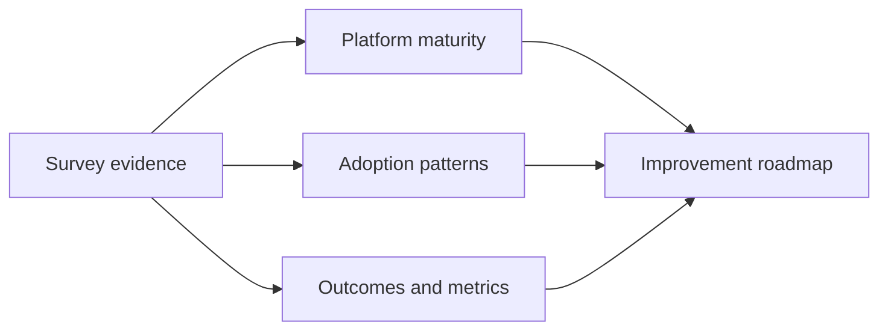

# State of Platform Engineering Report - Volume 4

*Weave Intelligence — Report*

## Agent guide

Synthesizes survey evidence on platform engineering adoption, maturity, outcomes, measurement, and persistent delivery challenges.
### Questions this chapter answers
- What does the report show about platform engineering adoption and maturity?
- Which outcomes and metrics are platform teams prioritizing?
- What organizational and technical challenges remain?
### Key points
- Platform maturity includes product, organizational, and technical dimensions.
- Developer experience and delivery outcomes provide evidence of platform value.
- Survey findings help teams compare their current state with broader adoption patterns.

## Conceptual diagram

## Detailed source transcript

### Page 1
State of Platform
Engineering Report
	VOLUME 4
WEAVE INTELLIGENCE PRESENTS
STATE OF PLATFORM ENGINEERING REPORT VOLUME 4
PUBLISHED IN 2025
1    STATE OF   PLATFORM ENGINEERING REPORT VOLUME 4
### Page 2
State of Platform Engineering
Report Volume 4
Table of contents
Our sponsor                                              04   AI and platform engineering                      21
	New research on AI in platform                   23
	engineering
Executive summary                                        05
	Reference Architecture for a Data/AI             24
	Internal Developer Platform on GCP
Platform engineering is                                  08
eating the world                                              Platform Engineering                             25
Shifting down                                            09   community: What’s new?
New Domains: Expanding beyond                            10   Platform Engineering University                  26
classical DevEx
	Ambassador program                               28
	AI, Data, and LLMOps                                 10
		Training and advisory                            28
	Security platform engineering                        11
		PlatformCon 2025                                 29
	Observability platform engineering                   11
	FinOps and platform engineering                      12
		Survey results                                   30
New platform engineering roles                           13
	Main reasons to set up a platform                31
The end of the artisan software engineer                 15
	engineering team
	Main focus of the platform                       32
	engineering team
Reference architecture and                               17
	Time to deliver value
tooling landscape updates                                                                                      33
in 2025                                                       Platform engineering maturity                    34
Updated reference architecture of                        18    Investment: Allocation of staff and funds to    34
	platform capabilities
Internal Developer Platforms
	Adoption: Why and how users discover and use    35
Platform tooling landscape in 2025                       20    internal platforms and platform capabilities?
2      STATE OF   PLATFORM ENGINEERING REPORT VOLUME 4
### Page 3
Interfaces: How do users interact with and           36   The individual experience                    49
	consume platform capabilities?
		Job titles                                 49
	Operations: How are platforms and their              37
	capabilities planned, prioritized, developed,               Primary work focus                         50
	and maintained?                                             Work setup                                 51
	Measurement: What is the process for gathering 38           Salary                                     52
	and incorporating feedback and learning?
		Working experience of platform engineers   53
	Comparison to platform engineering maturity          39
	results from previous year
Metrics                                                  41
	Main take aways from                         54
	Which metrics to measure to prove success            41
		the results
	Impact on metrics                                    42
How teams approach Platform                              43   Five key recommendations for                 56
as a Product                                                  platform teams
How platform engineers gather                            44
feedback about the platform
	Predictions for the future                   59
Reporting lines                                          45
Annual budget of platform                                46
engineering initiative                                        Appendix                                     61
	Survey methodology snapshot                  61
Does your company have more                              47
than one platform?                                            References                                   62
Biggest challenges for platform teams                    48   Authors                                      63
3      STATE OF   PLATFORM ENGINEERING REPORT VOLUME 4
### Page 4
Our sponsor
	Broadcom’s VMware Cloud Foundation (VCF) is the platform for
	the modern private cloud, delivering a single unified platform for
	VMs and containers that supports all applications, traditional,
	modern, or AI, with a consistent operating model, governance,
	and controls spanning data centers, edge, and managed cloud
	infrastructure. VCF combines the agility and scalability of public
	cloud with the security, performance, architectural control and
	total cost of ownership (TCO) benefits of an on-premises
	environment. VCF frees development teams to focus on
	applications instead of infrastructure. Through the native VMware
	vSphere Kubernetes Service (VKS), an integrated CNCF-certified
	Kubernetes runtime, platform engineering teams can support
	agile modern app development directly from the private cloud.
	GitOps-driven, self-service infrastructure with guardrails balances
	developer autonomy with IT control and reduced risk, while
	multi-tenant, policy-driven delivery and built-in observability
	enable more secure and visible applications that are always in
	their desired state.
4   STATE OF   PLATFORM ENGINEERING REPORT VOLUME 4
### Page 5
Executive
summary
	Platform engineering is eating the world. As
	the defining discipline of our time, platform
	engineering has rapidly evolved into the
	foundational operating system of the modern
	enterprise. Rather than a pure focus on
	infrastructure, or DevEx, modern platform teams
	are absorbing traditional silos like observability,
	security, data, and FinOps directly into their
	centralized paradigm. Thus the discipline has
	begun to move the industry completely from
	“shifting left” to actively “shifting down” by
	embedding essential capabilities like security,
	guardrails, and quality attributes directly into
	the platform. This approach aims to remove toil
	completely, rather than merely dumping it onto
	developers earlier in the software delivery lifecycle.
5   STATE OF   PLATFORM ENGINEERING REPORT VOLUME 4
### Page 6
Platform engineering has begun to            cloud-native era into the AI-native
	replace the manual, bespoke work             era, placing platform engineering
	of the “artisan software engineer,”          at the absolute core of this
	with a standardized model more               transformation.
	reminiscent of an industrialized
	supply chain. No longer is an                Platform teams face a dual mandate:
	organization’s success driven by             they must both deliver AI-powered
	the individual prowess of its “elite         platforms (augmenting Internal
	coders” but by the effectiveness of          Developer Platforms with tools to
	its software supply chain.                   turbocharge developer productivity
		and automation) and construct
		robust Platforms for AI (building
		specialized ecosystems to support
30%
	the deployment, training, and scaling
	of platform teams still                      of complex AI/ML workloads for data
	report that they do not                      scientists). An overwhelming 94%
		of organizations see AI as critical to
	measure success at all
		the future of platform engineering,
		validating the new dual role of the
	This rapid institutionalization              platform engineer as a driver, not
	however exposes a set of critical            merely a consumer, of AI.
	tensions. While the industry is
	moving decisively away from the              The responsibility of the platform
	early “portal trap” toward focusing          engineer has never been greater. We
	on robust core platform logic,               are the architects of the new digital
	measurement practices remain                 factory, tasked with transforming
	alarmingly weak. Despite significant         fragmented experimentation
	improvement from volume 3, nearly            into systematic, governed, and
	30 percent of platform teams still           repeatable value. As we look toward
	report that they do not measure              the future, those organizations that
	success at all, crippling their ability to   embed FinOps into every workflow,
	prove ROI or secure the investment           treat observability as a fundamental
	needed for long-term growth. At the          default, and master the creation
	same time, platform adoption is still        of golden paths for compliance,
	frequently driven by extrinsic push          reliability, and AI, will define the next
	or mandate (36.6%) rather than the           decade.
	intrinsic value necessary for true user
	pull (28.2%).                                This challenge is not purely
		technical, it is fundamentally cultural.
	Above all else however, the defining         It requires dedication to continuous
	trend of this era is AI. The vast            learning, strong product leadership,
	convergence of infrastructure and            and unwavering commitment.
	software has pushed us from the
6   STATE OF   PLATFORM ENGINEERING REPORT VOLUME 4
### Page 7
It requires experimentation, a willingness to take risks, and an acceptance of
	learning from failure. The future belongs to those who invest now in people,
	culture, and AI-native foundations; those who hesitate will be left behind, and
	inherit an insurmountable load of organizational debt. Those who embrace
	this new era of software engineering will ride a wave of innovation, the likes of
	which comes only once in a generation. The choice is yours to make.
“
	If not for AI, platform engineering would be the number 1
	trend in the enterprise.
	Rickey Zachary
	GLOBAL PLATFORM ENGINEERING LEAD, THOUGHTWORKS
7   STATE OF   PLATFORM ENGINEERING REPORT VOLUME 4
### Page 8
Platform
engineering is
eating the world
	As Platform engineering has matured over
	the last few years, it has evolved from an
	emerging methodology nipping at the
	heels of DevOps and focused merely on
	DevEx and infrastructure to a foundation of
	modern software delivery. Much like software
	fundamentally reshaped nearly every industry,
	platform engineering is now transforming
	software development itself, streamlining
	operations, and redefining traditional IT roles
	at an unprecedented pace. This transformation
	is especially driven by the necessity for speed,
	scale, and security in the age of AI.
8   STATE OF   PLATFORM ENGINEERING REPORT VOLUME 4
### Page 9
The shift is so profound that senior executives are acknowledging that
	platform engineering is “consuming all other functions”, absorbing traditional
	roles such as observability, security, data, and more directly into the platform
	paradigm. Organisations that embrace this shift, moving away from artisanal
	workshops to structured digital factories, are achieving incredible results in
	improving DevEx, security, productive AI adoption, and more.
Shifting down
	“Shifting down” is the platform           responsibility model that lets
	engineering strategy that aims to         developers stay focused on product
	maximize value and sustainability         work while the platform absorbs the
	by embedding responsibilities,            underlying complexity.
	controls, and quality attributes
	directly into the platform rather than    “Shifting down” has also driven a
	leaving them to developers. Rather        renewed focus on the foundational
	than “shifting left”, which simply        backend architecture of platforms
	moves the toil earlier in the software    rather than superficial interfaces.
	delivery lifecycle (often simply onto     Early initiatives often fell into the
	the developer), shifting down aims        “portal trap,” chasing quick wins by
	to remove the responsibility entirely     building developer portals while
	by embedding it directly into the         neglecting the deeper orchestration
	platform via automation or                and automation required for real
	improved processes.                       impact. As the hype fades, the
		industry now recognizes that a
	Shifting down eliminates manual toil      platform is defined by its core logic -
	and removes whole classes of errors       not its UI. Portals remain useful entry
	by embedding security, reliability,       points, but they cannot replace the
	and performance directly into             platform orchestrators, pipelines,
	automated platform capabilities. By       and backend systems that deliver
	building policy enforcement, secure       true value. This shift is evident not
	defaults, and architectural guardrails    only in enterprise platform teams
	into the platform, teams reduce           but also among portal vendors, who
	developer burden and make work            are increasingly expanding their
	easier by default. This sociotechnical    backend capabilities to meet these
	approach establishes a shared             more mature expectations.
9   STATE OF   PLATFORM ENGINEERING REPORT VOLUME 4
### Page 10
New domains: Expanding beyond
classical DevEx
	Platform engineering’s scope has        should engage with these domains
	expanded far beyond classical           as well.
	Developer Experience (DevEx)
	and container management.               As platform teams standardize
	Platform teams are now becoming         workflows, automation, and
	foundational enablers across            governance, it becomes natural
	critical new domains like AI, data,     to extend these capabilities
	observability, security, and FinOps.    to adjacent domains where
	Just as the ill-defined role of         fragmentation and manual
	“DevOps” gradually grew to the          processes remain a bottleneck
	absurdly defined “DevSecOps”, and       - especially those organizations
	began to incorporate Observability      suffering under the challenges of
	and FinOps, so too is the obvious       a poorly implemented policy of
	conclusion that platform engineering    “shifting left”.
	AI, Data, and LLMOps
	The intersection of Artificial          sophisticated, globally
	Intelligence (AI) and platform          distributed foundation tailored
	engineering is the most significant     for GPU-accelerated workloads,
	new domain. Platform teams operate      composable architecture, and
	under a dual mandate regarding          advanced MLOps governance.
	AI. Augmenting Internal Developer       Platform teams are already
	Platforms with AI and building new      embracing this, with 75% of
	platforms that support and drive AI     respondents to the State of AI
	itself. This rapid emergence of AI is   in Platform Engineering report
	pushing enterprise architecture         suggesting they are already
	from the cloud-native era into the      hosting or preparing to host
	AI-native era. AI-native                AI workloads.
	infrastructure demands a
10   STATE OF   PLATFORM ENGINEERING REPORT VOLUME 4
### Page 11
Security platform engineering
	Security is now a foundation, not a silo or a blocker with concepts like
	(“Security first” and “Secure by design”) because they are key parts of
	platform engineering best practice. To integrate security directly into the
	platform, Security platform engineers drive:
	Automated guardrails            They enforce least-privilege access, encryption,
		and secure secret retrieval by default. Platform
	and policy enforcement          policy controls enforce these rules to manage
		risks, including AI agent hallucinations.
	Secure golden paths             When secure practices are built into every
		golden path, developers can move fast
		without creating vulnerabilities, as the
		safest way naturally becomes the easiest
		and most productive.
	Centralized                     The platform manages secure secret storage
		and retrieval across the SDLC while the SPE
	secrets management              automates security controls and compliance.
	and compliance                  Policy as Code can scan AI-generated code and
		enforce constraints automatically, providing
		scalable and transparent governance.
	Observability platform engineering
	The Observability Platform                  Thus, the most prominent
	Engineer is responsible for turning         reference architecture for an
	system telemetry into a continuous          Internal Developer Platform in the
	operational feedback loop, with             industry received a large adoption
	observability now designed as               to highlight these changes to
	“observability by default,” meaning         the Observability Plane. This new
	it is built into the platform from the      domain of platform engineering
	start. This begins with end-to-end          spans monitoring, logging, tracing,
	telemetry: every component must             and alerting capabilities and also
	emit metrics, logs, and traces by           incorporates SLO frameworks and
	default, using standardized formats         reliability workflows, where Service
	and centralized aggregation.                Level Objectives are defined
11   STATE OF   PLATFORM ENGINEERING REPORT VOLUME 4
### Page 12
per product and capability, with          analysis and anomaly detection,
	automated alerts tied to error            surfacing issues before they
	budgets to support rapid root cause       impact production.
	analysis and proactive incident
	detection. As the Observability           Together, the data collected through
	Plane touches every other plane, it       the Observability Plane ensures
	integrates closely with orchestrators     continuous, comprehensive visibility
	and is often enhanced by AI-driven        into system health, performance,
	capabilities that automate log            and user impact at all times.
	FinOps and platform engineering
	The intersection of FinOps and            the developer experience.
	platform engineering is one of the        This pushes enterprises from
	most recent strategically important       simple cost control to a more
	areas for the industry as cloud           proactive cost-aware architecture,
	usage accelerates, and platform           where tagging, rightsizing, lifecycle
	teams grow larger and more                policies, and intelligent guardrails
	encompassing. Platform teams are          are directly integrated.
	increasingly responsible for ensuring
	financial accountability at scale.        FinOps-enabled platforms give
	FinOps is shifting from a detached        engineering organisations the
	reporting function into an embedded       ability to balance speed with
	operating model within platforms          financial discipline, which
	themselves, where cost visibility,        removes the constraint of cloud
	allocation accuracy, real-time            cost management, and when
	forecasting, and automated                done right, drives significant
	optimisation can be built directly into   operational advantage.
12   STATE OF   PLATFORM ENGINEERING REPORT VOLUME 4
### Page 13
New platform engineering roles
	The increasing complexity and expansion into new domains necessitate
	specialization within platform teams. This is leading to the emergence of
	dedicated, professionalized platform engineering roles that consolidate
	traditional silos.
		Head of Platform Engineering (HOPE)
		A senior leader overseeing the entire platform engineering function,
		setting strategic direction, aligning with business goals, and coordinating
		teams. The role requires broad skills across architecture, software
		development, security, and operations.
		Platform Product Manager (PPM)
		Acts as the bridge between platform engineering and the organization,
		structuring work and prioritizing features. The PPM balances technical
		understanding with user needs to maximize platform value.
		Infrastructure Platform Engineer (IPE)
		Defines default resource configurations and maintains the core
		infrastructure like servers, networks, databases. Ensures the platform is
		scalable, reliable, and efficient.
		DevEx Platform Engineer (DPE)
		Improves developer experience by streamlining workflows and reducing
		friction. Builds tools, templates, and documentation to make the
		platform intuitive and efficient documentation to empower developers.
13   STATE OF   PLATFORM ENGINEERING REPORT VOLUME 4
### Page 14
Security Platform Engineer (SPE)
	Implements and governs security policies within the development
	pipeline, embedding guardrails and maintaining robust security controls
	across the platform.
	Observability Platform Engineer (OPE)
	An evolution of SRE, responsible for reliability and observability
	standards, resource optimization, and overseeing monitoring and
	observability. Plays a key role in tuning production resources.
	AI-focused platform engineers
	The integration of AI has introduced new specialties to platform teams,
	including AI engineers, data engineers, and MLOps specialists. The
	specialized title Data and AI platform engineer has emerged to interface
	with data science teams.
14   STATE OF   PLATFORM ENGINEERING REPORT VOLUME 4
### Page 15
The end of the artisan
software engineer
	For almost two decades, software        coder” or the “Full-stack engineer”.
	development inside most                 This phenomenon was pushed to its
	organisations operated like a craft:    limits as technological advancement
	manual, bespoke, and heavily            and new philosophies like DevOps
	dependent on individual expertise.      blurred the lines between domains.
	Development relied on the               And so, engineers were (and in
	knowledge and expertise of the          many cases still are) expected to
	individual. That senior engineer who    understand everything from their
	knew your organization’s codebase       increasingly extensive deployment
	inside and out. This came with it the   tooling to infrastructure, security,
	dominance of concepts like the “10x     and beyond.
		Inspired by Daniel Bryant at PlatformCon 2022
	This also now meant that previously     It also meant that the role of the
	simple requests like provisioning a     software engineer was often that
	database could trigger long,            of the master craftsman. As they
	multi-step processes involving          increasingly grew their knowledge
	multiple teams, as the lines between    base and skillset, organizations grew
	roles became more and more              dependent on their understanding
	blurred. This fragmentation led to      of a vast set of skills, languages,
	slow delivery, inconsistent quality,    tools, and the growing complexity of
	and unnecessary cognitive load,         an organization’s IT.
	making it difficult for organisations
	to scale engineering output reliably.
15   STATE OF   PLATFORM ENGINEERING REPORT VOLUME 4
### Page 16
“
	For hundreds of years, the master craftsman made the perfect
	handwoven chair. It was expert quality and had a cost and
	waiting time to match. Now, all chairs are produced en masse
	by extensive industrialized supply chains. Software is going
	through the same process.
	Luca Galante
	CORE CONTRIBUTOR TO PLATFORM ENGINEERING COMMUNITY
	Platform engineering is changing         treating foundational components
	this. The automated and systemized       as reusable products rather than
	approach platform engineering            custom projects, organisations
	takes to software can be thought of      thus unlock a reliability, speed, and
	as industrializing the entire software   predictability that was previously
	delivery process. It standardises        dependent on the individual rather
	core services, abstracts complexity      than the system itself. The result
	behind clear interfaces, and enables     is a shift from artisanal, one-off
	developers to consume capabilities       engineering work to a streamlined
	such as databases, infrastructure,       assembly-line model where teams
	and deployment pipelines through         can build and ship software quickly,
	intuitive self-service workflows. By     safely, and at scale.
16   STATE OF   PLATFORM ENGINEERING REPORT VOLUME 4
### Page 17
Reference
architecture and
tooling landscape
updates in 2025
17   STATE OF   PLATFORM ENGINEERING REPORT VOLUME 4
### Page 18
Since the first standard reference       members, we’ve gained unparalleled
	architecture for Internal Developer      insight into the full spectrum of
	Platforms (IDPs) debuted at              platform programs, both successes
	PlatformCon in June 2023, it has         and failures. Over the same period,
	rapidly evolved from a simple            AI has reshaped the Software
	blueprint into a widely adopted          Development Life Cycle, adding new
	industry benchmark. With over            complexity and opportunity. These
	100,000 downloads and continuous         developments, combined with
	use by hundreds of teams, it has         data from real-world enterprises,
	helped organizations plan and            hundreds of conversations, and
	implement effective platform             480 platform examples submitted
	engineering initiatives.                 through the communities platform
		engineering certification programs,
	As the practitioner community            have informed a new, modernized
	has grown to more than 270,000           reference architecture.
Updated reference architecture
of Internal Developer Platforms
	Version 2.0 of the reference architecture evolves the original model based on
	two years of real-world adoption, expanded industry maturity, and the rapid
	emergence of AI in the SDLC.
	INTERNAL DEVELOPER PLATFORM ON GCP
18   STATE OF   PLATFORM ENGINEERING REPORT VOLUME 4
### Page 19
The biggest change is the               foundational architectural planes
	recognition of a multi-platform         rather than add-ons, reflecting both
	reality: most enterprises now operate   growing platform complexity and
	several platforms across backend,       AI-related risks.
	frontend, data/AI, and mobile, rather
	than a single unified system. The       Together, these changes create a
	new model also shifts to code as the    more realistic, secure, and scalable
	single source of truth, with            framework for modern enterprise
	GitOps-driven workflows ensuring        platforms. This example below
	every action is logged, versioned,      is that of an Internal Developer
	and auditable.                          Platform based on GCP, and using
		the highlighted tools. However,
	Developer interfaces like IDEs,         all cloud providers and tools are
	CDEs, portals, CLIs, and AI-driven      interchangeable. You can download
	conversational tools are elevated       the full reference architecture
	as the primary interaction layer.       whitepaper here. You can also see
	Security and observability become       a reference architecture for Azure.
19   STATE OF   PLATFORM ENGINEERING REPORT VOLUME 4
### Page 20
Platform tooling landscape in 2025
	This newly created reference architecture has also resulted in a redefined
	platform tooling landscape on [platformengineering.org](http://platformengineering.org).
20   STATE OF   PLATFORM ENGINEERING REPORT VOLUME 4
### Page 21
AI and platform
engineering
21   STATE OF   PLATFORM ENGINEERING REPORT VOLUME 4
### Page 22
AI has fundamentally redefined the future of the enterprise, pushing us
	beyond the cloud-native era and into the AI-native era. This profound shift
	has necessitated that platforms and governance structures evolve. Platform
	teams now need to efficiently handle GPU-accelerated workloads, specialised
	agentic systems, and new operational patterns. This transformation has also
	introduced to platform engineering teams a dual mandate:
01                       AI-powered platforms          Integrating AI tools to augment Internal
	Developer Platforms (IDPs). The objective
	is to turbocharge core platform benefits
	by enhancing developer productivity,
	improving compliance, and driving
	automation through features like
	intelligent troubleshooting or automated
	security scanning.
02                       Platforms for AI              Building highly specialized infrastructure
	and tooling specifically designed to
	enable the efficient deployment, training,
	and scaling of AI/ML workloads. This
	requires platform teams to embrace new
	customers, including data scientists and
	ML engineers, and provide them with
	the foundational ecosystems needed for
	complex model development.
	This evolution establishes platform engineering not merely as a consumer of
	AI, but as the critical architect and enabler of enterprise-wide AI value.
22   STATE OF   PLATFORM ENGINEERING REPORT VOLUME 4
### Page 23
New research on AI in
platform engineering
	The hypothesis that a strong            Our State of AI in Platform
	platform foundation is essential for    Engineering report reinforces
	scalable AI adoption is validated by    this. An overwhelming 94% of
	both the 2025 DORA report and our       organizations view AI as critical or
	State of AI in Platform Engineering     important to the future of platform
	findings. DORA confirms that AI’s       engineering, while 86% believe
	impact depends less on individual       platform engineering is essential to
	tools and far more on the quality       realizing AI’s business value. Three-
	of the underlying organizational        quarters (75%) are already hosting
	system. With platform engineering       or preparing to host AI workloads,
	now adopted by nearly 90% of            prompting new roles such as AI
	organizations, DORA identifies a        engineers and MLOps specialists.
	Quality Internal Platform as one of     Yet challenges persist, including skill
	seven capabilities that significantly   gaps (57%), hallucination risks (56%),
	amplify AI’s positive effect            and heightened governance friction.
	on performance.
“
	The data confirms what we all already knew. Everyone is using
	AI (89% reported), but the ones who are truly succeeding
	with AI and achieving the ROI dreams that AI promises are
	those who have a strong platform engineering foundation to
	supercharge it.
	Sam Barlien
	AUTHOR OF THE STATE OF PLATFORM ENGINEERING VOL 4
23   STATE OF   PLATFORM ENGINEERING REPORT VOLUME 4
### Page 24
Reference architecture for an
AI/ML Internal Developer Platform
on GCP
	While standard IDPs focus on application delivery, the AI/ML IDP is designed
	to support the entire lifecycle of data, AI, and ML workloads, bringing new
	architectural requirements, new personas, and more rigorous governance
	requirements. This specialised reference architecture (labeled version 0.1)
	reflects the current immaturity of the industry as AI and platform engineering
	rapidly converge.
	REFERENCE ARCHITECTURE FOR AN AI/ML INTERNAL DEVELOPER PLATFORM ON GCP
		It adds a dedicated Data & Model Management Plane for feature engineering,
		experiment tracking, metadata, lineage, and model registry functions. The
		Developer Control Plane expands to include notebooks, LLM copilots, and
		interfaces tailored to data scientists and ML engineers. The Integration
		& Delivery Plane adopts a dual-orchestrator model combining platform
		orchestration with ML workflow automation.
		The Resource Plane introduces GPU orchestration, streaming systems, and
		high-performance model serving, while the Observability Plane adds model
		monitoring, data validation, drift detection, and lineage tracking. Collectively,
		these capabilities enable the delivery of governed, production-grade AI
		systems rather than traditional applications.
24   STATE OF   PLATFORM ENGINEERING REPORT VOLUME 4
### Page 25
Platform
Engineering
community:
What’s new?
	Launched in 2022, the Platform Engineering
	community has always been a clear barometer
	for the industry at large. Now nearing 270,000
	members across all manner of roles, industries, and
	geographies, its expansion has closely mirrored the
	rise of platform engineering itself.
25   STATE OF   PLATFORM ENGINEERING REPORT VOLUME 4
### Page 26
What began with adoption               demographic in the platform
	from DevOps, SREs, and classic         engineering community.
	operations roles has accelerated
	as observability, security, AI, and    This growth has also coincided with
	data increasingly fold into platform   a massive expansion in community
	engineering.                           initiatives like it’s course ecosystem,
		ambassador program, work with
	Security and observability are         enterprises, and it’s flagship
	currently the fastest-growing          conference, PlatformCon.
	Platform Engineering University
	The platform engineering               Platform engineering learning
	certification ecosystem has grown      paths includes four instructor-
	far beyond its original fundamentals   led programs such as the
	track. It now offers a full suite of   Certified Practitioner, Certified
	instructor-led certifications and      Professional, Certified Leader,
	on-demand courses for                  and Certified Architect. Each
	practitioners, leaders, and            course building deeper skills in
	specialists across the discipline.     platform strategy, design, and
		architecture through hands-on,
		expert-led instruction.
	PLATFORM ENGINEERING LEARNING PATHS
26   STATE OF   PLATFORM ENGINEERING REPORT VOLUME 4
### Page 27
Alongside these, the course ecosystem features a growing library of free,
	on-demand modules covering foundational and emerging topics such as
	Introduction to Platform Engineering, Intro to AI in Platform Engineering,
	Cloud Development Environments, Kubernetes Cluster Lifecycle
	Management, and Observability for Platform Engineering. These shorter
	courses help teams skill up quickly and stay current with best practices.
	PLATFORM ENGINEERING COURSE ECOSYSTEM
		Together, this expanded curriculum forms the most comprehensive learning
		pathway in platform engineering today, with additional courses on portals,
		security, AI, and tooling planned through 2026.
27   STATE OF   PLATFORM ENGINEERING REPORT VOLUME 4
### Page 28
Ambassador program
	As a collective effort to grow and      discuss best practices, and share
	nurture the platform engineering        lessons learned while receiving
	space, the community launched the       support to bring that knowledge
	Platform Engineering Community          to the wider community. Today,
	Ambassadors program in late 2024.       more than 90 ambassadors
	It continues to serve as a way for      actively publish research, create
	practitioners and thought leaders       content, and help elevate the
	to come together, exchange ideas,       discipline of platform engineering.
	Training and advisory
	The community’s extensive learning      alignment of platform strategy
	and research capabilities are applied   with business goals, and hands-on
	directly to support enterprises         deployment support from
	through two flagship offerings:         Minimum Viable Platform to full
	Training and Advisory. Through the      production scale.
	training programme organisations
	receive tailored workshops whether      Together, these services have
	in-person or virtual that equip         transformed raw practitioner
	platform teams, product managers,       insight and community research
	architects and other stakeholder        into enterprise-grade enablement,
	groups with the frameworks and          enabling structured upskilling,
	skills needed to execute a shared       measurable adoption, and lasting
	platform vision. Meanwhile, the         organisational change for a number
	advisory service provides expert        of enterprises in the platform
	diagnosis of adoption blockers,         engineering industry.
28   STATE OF   PLATFORM ENGINEERING REPORT VOLUME 4
### Page 29
PlatformCon 2025
	The world’s largest platform engineering conference, PlatformCon 2025
	marked a new milestone in the maturity and scale of the platform engineering
	industry. This year’s edition brought together an unprecedented volume of
	knowledge with 255+ talks, 30 virtual workshops, and 20+ live day
	sessions - over 160 hours of platform engineering goodness.
	Alongside these live events, 9,500 people participated in the virtual
	workshops, while nearly 40,000 more engaged with PlatformCon’s wider
	universe of talks, panels, and community conversations. Beyond its scale,
	PlatformCon 2025 also reflected a clear shift: the conversation has moved
	decisively from “What is platform engineering?” to “What does great
	platform engineering look like?”.
29   STATE OF   PLATFORM ENGINEERING REPORT VOLUME 4
### Page 30
Survey results
	The data for this State of Platform Engineering
	report was gathered across the platform
	engineering community. We spoke to 518
	engineers across industries, geographies, job
	titles and levels of seniority. The questions ranged
	from the individual on job title, years experience,
	salary, and area of focus, to the organizational like
	platform engineering maturity, platform budget,
	time to ROI and far more.
30   STATE OF   PLATFORM ENGINEERING REPORT VOLUME 4
### Page 31
Main reasons to set up a platform
	engineering team
	The main motivators for creating a platform engineering team center on
	improving developer experience and streamlining the delivery pipeline.
	The most cited reason is standardizing DevOps and delivery setups, closely
	followed by reducing developer cognitive load and enabling self-service to
	move away from ticket-driven “TicketOps.”
		MAIN REASONS TO SET UP A PLATFORM ENGINEERING TEAM
	Together, these highlight a strategic shift toward greater efficiency and
	developer autonomy. Automating repetitive tasks and strengthening security
	and compliance remain significant drivers, balancing efficiency with risk
	reduction. While accelerating time to market and lowering costs matter, the
	overarching theme is the strategic push to standardize, simplify, and support
	developer flow.
31   STATE OF   PLATFORM ENGINEERING REPORT VOLUME 4
### Page 32
Main focus of the platform
	engineering team
	Survey data shows platform engineering teams remain focused on
	foundational enablement and developer experience. The top priorities are
	standardizing infrastructure provisioning through an Internal Developer
	Platform (28.3%) and improving developer experience and productivity (26%).
	Implementing and managing Infrastructure as Code (20.3%) is also a major
	focus, reinforcing the trend toward automated, codified infrastructure.
		THE MAIN MOTIVATORS FOR CREATING A PLATFORM ENGINEERING TEAM
	Notably, adding a developer portal on top of an existing CI/CD setup
	represents only 9.1%, indicating the industry has moved beyond the earlier
	“portal trap.” AI-related efforts like preparing platforms for AI workloads (3.6%)
	and adding AI capabilities (3%) form a small but emerging area, supporting the
	report’s theme of AI integration while showing that core platform foundations
	remain the top priority for most teams.
32   STATE OF   PLATFORM ENGINEERING REPORT VOLUME 4
### Page 33
Time to deliver value
	The time to value delivered by platform engineering initiatives shows a
	bimodal distribution, indicating that early success is achievable but sustained
	value creation often takes longer. A significant portion of teams (35.2%) begin
	delivering measurable value within the first six months, demonstrating the
	effectiveness of an iterative, Minimum Viable Platform (MVP) approach.
		DISTRIBUTION OF TIME TO DELIVER MEASURABLE VALUE
	Specifically, 11.3% report seeing value in less than three months, and 23.9%
	achieve it within three to six months. 40.9% of platform initiatives are unable
	to demonstrate measurable value within the first twelve months. For these
	initiatives, particularly the 18.3% that report having no measurable results
	at all, there is a substantial risk that they will remain underfunded, fail to
	secure necessary executive sponsorship, or face outright deprecation. The
	inability to quickly and clearly prove ROI is a major vulnerability, especially in
	environments where platform teams are already struggling with insufficient
	resources and the need to establish a clear business case.
33   STATE OF   PLATFORM ENGINEERING REPORT VOLUME 4
### Page 34
Platform engineering maturity
	Similar to our methodology in the previous report, this analysis leveraged
	the CNCF Platform Engineering Maturity Model. This model provided the
	framework for questions centered on key areas: investment, adoption,
	interfaces, operations, and measurement.
	Investment
	The distribution of staff and funding models shows that most organizations
	are still in the early stages of platform maturity. The largest share, at 45.5%,
	have a dedicated, budgeted team that remains mostly reactive, which
	suggests that platform functions are established but not yet strategic.
		INVESTMENT: ALLOCATION OF STAFF AND FUNDS TO PLATFORM CAPABILITIES
	Another 13.1% rely on voluntary or temporary, unfunded assignments, showing
	that some teams still operate in an ad hoc way. More advanced maturity
	appears in the 28.2% who treat the platform as a product with data-driven
	investment decisions. Only 13.1% report an optimized, cross-functional
	ecosystem focused on efficiency, indicating that although progress is clear,
	fully mature models remain uncommon.
34   STATE OF   PLATFORM ENGINEERING REPORT VOLUME 4
### Page 35
Adoption
	The data shows that platform adoption varies widely in maturity. The largest
	segment, at 36.6%, adopts platforms through extrinsic push, which indicates
	reliance on top-down mandates. Another 16.9% experience erratic adoption
	with no clear strategy, suggesting fragmented communication or offerings.
		ADOPTION: WHY AND HOW USERS DISCOVER AND USE INTERNAL PLATFORMS AND
		PLATFORM CAPABILITIES
	More positive patterns appear in the 28.2% who adopt platforms
	because of their intrinsic value, showing that users respond when the
	platform is genuinely useful. A further 18.3% report participatory adoption
	in which users contribute back, reflecting early but still limited signs of
	community-driven engagement.
35   STATE OF   PLATFORM ENGINEERING REPORT VOLUME 4
### Page 36
Interfaces
	The data on how users interact with platform capabilities shows that most
	teams rely on familiar and moderately consistent interfaces. Standard tooling
	is the most common approach at 43.2%, suggesting that many organizations
	prioritize predictability and familiarity. Another 31.5% provide self-service
	solutions that offer users a high degree of autonomy, indicating growing
	investment in more advanced platform interactions.
		INTERFACES: HOW DO USERS INTERACT WITH AND CONSUME
		PLATFORM CAPABILITIES?
	Custom processes with inconsistent and manual steps still account for
	15.0%, showing that some teams continue to depend on bespoke or ad hoc
	workflows. Only 10.3% report fully integrated services seamlessly embedded
	into existing tools, which highlights that while integration is a clear aspiration,
	it remains relatively rare in practice.
36   STATE OF   PLATFORM ENGINEERING REPORT VOLUME 4
### Page 37
Operations
	The data shows that most organizations manage platform operations with
	some level of central structure, although maturity varies. The largest group,
	at 35.7%, centrally enables platform work with a strong focus on user needs,
	indicating a shift toward more service-oriented operations.
		OPERATIONS: HOW ARE PLATFORMS AND THEIR CAPABILITIES PLANNED,
		PRIORITIZED, DEVELOPED, AND MAINTAINED?
	Another 31.9% track work centrally with only partial organization, which
	suggests that processes are improving but not yet fully aligned. At the
	same time, 18.8% still operate by request in an ad hoc manner, reflecting
	environments where prioritization is inconsistent. Only 13.6% report having
	proactive and integrated managed services, showing that fully mature
	operational models remain uncommon.
37   STATE OF   PLATFORM ENGINEERING REPORT VOLUME 4
### Page 38
Measurement
	The measurement practices reveal a similar spread in maturity. The largest
	share, at 35.2%, relies on ad hoc and inconsistent feedback, which limits
	continuous improvement. Another 20.2% collect feedback consistently but
	apply limited analysis, indicating that data is gathered but not fully leveraged.
		MEASUREMENT: WHAT IS THE PROCESS FOR GATHERING AND INCORPORATING
		FEEDBACK AND LEARNING?
	More advanced practices appear in the 25.8% who use both quantitative and
	qualitative insights to inform decisions. Only 18.8% achieve comprehensive
	measurement with fully integrated analysis, showing that while some
	organizations have strong data-driven loops, most are still developing robust
	learning processes.
38   STATE OF   PLATFORM ENGINEERING REPORT VOLUME 4
### Page 39
Comparison to platform engineering
	maturity results from previous year
	The CNCF Platform Engineering                                 reactive functions. Adoption has also
	Maturity Model highlights a clear                             improved, with fewer teams stuck
	pattern of steady, incremental                                in erratic or mandate-driven usage
	progress across every area of                                 and more reporting genuine pull
	platform engineering compared                                 from developers who see real value
	with last year’s survey. Investment                           in the platform. Interfaces show a
	has shifted slightly further toward                           similar upward trend, with gradual
	product thinking and early signs of                           movement away from manual,
	ecosystem enablement, showing                                 custom processes and toward more
	that more organizations are                                   consistent tooling and early self-
	beginning to treat their platforms                            service experiences.
	as strategic assets rather than
		2024                    2025
	PLATFORM ENGINEERING MATURITY
	ASPECT                                          PROVISIONAL          OPERATIONAL            SCALABLE              OPTIMIZING
	Investment              How are staff and       Voluntary or         Dedicated team         As product            Enabled
		funds allocated         temporary                                                         ecosystem
		to platform
		capabilities?            43.3%       45.5%                                                 12.2%        13.1%
	Adoption                Why and how do          Erratic              Extrinsic push         Intrinsic pull        Participatory
		users discover
		and use internal
		platforms
		and platform
		capabilities?            35.8%       36.6%                                                 17.3%        18.3%
	Interfaces              How do users            Custom processes     Standard tooling       Self-service          Integrated services
		interact with and                                                   solutions
		consume platform
		capabilities?            42.1%       43.2%                                                     9.1%     10.3%
	Operations              How are                 By request           Centrally tracked      Centrally enabled     Managed services
		platforms and
		their capabilities
		planned,
		prioritized,
		developed and
		maintained?                                   39.3%       35.7%                            10.7%        13.6%
	Measurement             What is the             Ad hoc               Consistent             Insights              Quantitative and
		process for                                  collection                                   qualitative
		gathering and
		incorporating
		feedback and
		learning?                42.5%       35.2%                                                 10.4%        18.8%
39   STATE OF   PLATFORM ENGINEERING REPORT VOLUME 4
### Page 40
Operations and measurement          points to an industry that is
	likewise demonstrate modest but     maturing year over year. At the
	meaningful gains, with more teams   same time, the improvements
	introducing structured processes,   remain incremental, and the overall
	user-focused prioritization, and    landscape still sits far from the fully
	data-informed learning loops.       optimized, ecosystem-level maturity
		that platform engineering aims for.
	While none of these shifts are      We’ve still got a lot of room
	dramatic, the collective pattern    for improvement.
40   STATE OF   PLATFORM ENGINEERING REPORT VOLUME 4
### Page 41
Metrics
	Which metrics to measure to
	prove success
	The data on how teams measure the success of their platform engineering
	initiatives reveals a striking split between those using established metrics
	and those still lacking any measurement practice. DORA metrics remain
	the most widely used approach, cited by the largest share of respondents,
	followed by time to market and, to a lesser extent, SPACE metrics to assess
	developer productivity. These signal a growing reliance on structured,
	industry-recognized methods for evaluating platform impact.
		WHICH METRICS TO MEASURE TO PROVE SUCCESS
	However, the most concerning finding is that 29.6% of teams do not measure
	success at all, which underscores a major gap in accountability across the
	industry. This absence of measurement limits the ability to demonstrate
	value, guide investment decisions, and refine platform capabilities. Taken
	together, the results show that while measurement practices are improving, a
	significant portion of organizations still lack the feedback loops necessary for
	sustained, data-driven platform progress.
41   STATE OF   PLATFORM ENGINEERING REPORT VOLUME 4
### Page 42
Impact on metrics
	The impact of platform engineering on organizational metrics shows a
	generally positive trend, though with clear signs that many teams are still early
	in their journey. A combined majority reports improvement, with the largest
	share seeing slight gains and another substantial group noting significant
	improvement, indicating that platform initiatives are delivering measurable
	benefits for most adopters.
		TO WHAT EXTENT HAVE METRICS IMPROVED SINCE YOUR ORGANIZATION
		INTRODUCED PLATFORM ENGINEERING?
	However, 13.6% report no noticeable change, and nearly a quarter of
	respondents say they do not know whether metrics have improved at all,
	which suggests gaps in visibility, measurement, or communication. Only a
	very small fraction reports any worsening of metrics. Overall, the results show
	that platform engineering is moving the needle in the right direction, but the
	mixed levels of awareness and the persistent absence of measurable impact
	for some teams point to the need for stronger feedback loops and clearer
	outcome tracking.
	AUTHOR’S NOTE
		Last year’s survey revealed that 45% of respondents “Do not measure”,
		so, there has been a large improvement compared to last year. However,
		one key problem still remains. Only 24.4% of respondents this year
		reported that they “do not know” if metrics have improved, despite 29.6%
		answering us that they “do not measure”. This gives us a 5% delta of liars.
42   STATE OF   PLATFORM ENGINEERING REPORT VOLUME 4
### Page 43
How teams approach Platform
as a Product
	The data on how teams approach a        engineers operate with a product
	Platform as a Product mindset shows     mindset, indicating the distributed
	that while awareness is growing, true   approach to product ownership that
	product thinking is still a challenge   was thought to be best practice from
	for teams. This data also begins to     2022-24. Another 25.4% say they do
	answer one of the largest questions     not have a product mindset at all,
	in the platform engineering industry    which highlights a significant barrier
	from the last few years, “does your     to achieving platform maturity. More
	organization need a dedicated           structured models appear in the
	Platform Product Manager?”.             21.6% who have dedicated Platform
		Product Managers, and an additional
	The largest group, at 38%, reports      15% combine PPMs with engineers
	having no dedicated Platform            who also think in product terms.
	Product Managers but says
		HOW DOES YOUR TEAM ENSURE A PLATFORM AS A PRODUCT (PAAP) MINDSET?
	Together, the results suggest that teams are beginning to adopt
	product-oriented behaviors, but dedicated product leadership and a
	consistently applied mindset remain far from universal.
43   STATE OF   PLATFORM ENGINEERING REPORT VOLUME 4
### Page 44
How platform engineers gather
feedback about the platform
	The data shows that platform engineers rely mostly on informal methods to
	gather feedback. Ad hoc conversations are the most common approach, with
	feedback sessions and office hours close behind, indicating that real-time
	discussions continue to drive most insights.
		HOW DO PLATFORM ENGINEERS GATHER FEEDBACK ABOUT THE PLATFORM
	Regular surveys add some structure, though they are used less frequently.
	Nearly 10% of teams do not collect feedback at all, revealing a notable gap in
	understanding platform performance. Built-in telemetry and usage analytics
	are the least used method, showing that automated, data-driven feedback is
	still early in adoption.
	Nearly                  of teams do not collect
10%
	feedback at all, revealing a
	notable gap in understanding
	platform performance
44   STATE OF   PLATFORM ENGINEERING REPORT VOLUME 4
### Page 45
Reporting lines
	The data on reporting structures shows that platform teams most
	commonly report to a Head of Platform Engineering, which reflects the
	growing formalization of platform leadership. The next largest groups
	report into Director or VP Engineering roles and the CTO, indicating that
	platform engineering remains closely aligned with core engineering
	priorities in many organizations.
		WHO DOES THE PLATFORM TEAM REPORT TO?
	Smaller portions report into infrastructure or operations leadership, product
	teams, or other structures, highlighting the ongoing variability in how
	companies position platform work. The distribution suggests that while
	dedicated platform leadership is becoming more common, there is still no
	single dominant organizational model, and reporting lines continue to evolve
	as teams mature.
45   STATE OF   PLATFORM ENGINEERING REPORT VOLUME 4
### Page 46
Annual budget of platform
engineering initiative
	The data on annual platform engineering budgets shows that most
	initiatives continue to operate with very limited funding. Nearly half fall
	into the zero to one million dollar range, highlighting that many teams are
	expected to deliver broad organizational impact with modest resources.
		ANNUAL BUDGET OF PLATFORM ENGINEERING INITIATIVE
	Another sizeable portion sits in the one to five million dollar range, while only
	a small minority report budgets above ten million dollars, and an even smaller
	share exceeds fifty million. This distribution makes it clear that although
	platform engineering is gaining strategic recognition, financial investment has
	not yet caught up, and most initiatives remain underfunded relative to their
	scope and expectations.
46   STATE OF   PLATFORM ENGINEERING REPORT VOLUME 4
### Page 47
Does your company have more than
one platform?
	The data shows that most organizations now operate more than one
	platform, a notable shift from earlier industry assumptions that multiple
	platforms signaled fragmentation or low maturity. With 55.9% reporting
	more than one platform, it is increasingly clear that platform plurality often
	reflects intentional design rather than organizational disconnect.
		DOES YOUR COMPANY HAVE MORE THAN ONE PLATFORM?
	As AI, data, and specialized workloads grow in importance, different teams
	require purpose-built platforms that address distinct needs and constraints.
	While a single, unified platform was once viewed as the ideal, today’s
	landscape shows that multiple platforms can coexist as part of a cohesive
	strategy, provided they are well aligned and not duplicating effort.
47   STATE OF   PLATFORM ENGINEERING REPORT VOLUME 4
### Page 48
Biggest challenges for
platform teams
	The data on current challenges for platform teams shows that cultural
	and organizational barriers continue to outweigh technical ones. Driving
	developer adoption remains the top challenge, closely followed by
	establishing a shared vision or product mindset, which reflects the ongoing
	complexity of shifting teams toward platform-oriented ways of working.
	The complexity of existing systems is another major hurdle, reinforcing how
	difficult it is to modernize fragmented architectures
		BIGGEST CHALLENGES FOR PLATFORM TEAMS
	Many teams also struggle with limited product management capacity,
	insufficient funding, and securing executive buy-in, all of which slow progress
	and reduce long-term impact. Challenges like proving ROI and scaling from
	MVP to a full Internal Developer Platform round out the list, showing that even
	with growing industry maturity, platform teams still face significant structural
	and cultural obstacles.
48   STATE OF   PLATFORM ENGINEERING REPORT VOLUME 4
### Page 49
The individual experience
	Job titles
	The distribution of job titles shows a clear shift toward platform engineering
	as the dominant identity for this type of work. Platform Engineering is now
	the largest cluster by a wide margin, while DevOps titles remain common
	but increasingly represent legacy naming rather than actual responsibilities.
		JOB TITLES (GROUPED)
	Many respondents with DevOps titles indicated that their day-to-day work is
	platform engineering, suggesting that title changes have not yet caught up
	with the evolution of the role. Engineering management, SRE, and architect
	roles appear in smaller proportions, reflecting the adjacent backgrounds
	from which many platform practitioners emerge. Overall, the data highlights
	that while job titles are still mixed, the industry is converging on platform
	engineering as the accurate description of this discipline.
49   STATE OF   PLATFORM ENGINEERING REPORT VOLUME 4
### Page 50
Primary work focus
	The survey data reveals that the core focus areas for Platform Engineering
	teams remain heavily concentrated on foundational infrastructure and
	delivery mechanisms. CI/CD leads with a commanding 72.8% of mentions,
	followed closely by Infrastructure as Code (IaC) at 66.6% and Kubernetes at
	64.8%. This triumvirate clearly indicates that the primary mandate of Platform
	teams is establishing automated, reliable, and standardized ways to build,
	provision, and deploy applications on modern containerized infrastructure.
		WHAT ARE YOUR MAIN AREAS OF FOCUS?
	GitOps (56.5%) and Platform Orchestration (43.6%) further reinforce this
	trend, underscoring the shift towards declarative, system-driven application
	lifecycle management. While traditional Virtual Machines (VMs) still garner
	a significant 25.4% of attention, and Serverless is at 22.3%, the top responses
	confirm that the majority of platform effort is being directed toward maturing
	the cloud-native continuous delivery experience.
50   STATE OF   PLATFORM ENGINEERING REPORT VOLUME 4
### Page 51
Beyond the immediate infrastructure       applications in production. Security,
	concerns, Observability and Security      mentioned by 31.4% of respondents,
	stand out as critical, high-priority      is similarly high on the agenda. This
	cross-cutting concerns, though            suggests that platform teams are
	they trail the top infrastructure         increasingly enabling a “shift down”
	items. Observability is a key focus       security posture, integrating tools
	for 32.8% of respondents, indicating      and processes into the platform
	a strong recognition that platforms       itself to ensure compliance and
	must provide not just deployment          robust security from the earliest
	pipelines, but also the crucial           stages of development, rather than
	visibility required for developers        treating it as a final-stage gate.
	to troubleshoot and monitor their
	Work setup
	The data on work setups shows that hybrid models are now the dominant
	arrangement for platform teams, with just over half of respondents working
	in a mix of remote and on-site environments. Fully remote work remains
	substantial at more than forty percent, reflecting the continued suitability of
	distributed collaboration for engineering organizations.
		DISTRIBUTION OF CURRENT WORK SETUP
	Only a small share operates fully on site, indicating that traditional
	office-centric models have become the exception rather than the norm.
	Overall, the distribution suggests that flexibility has become a standard part of
	platform engineering culture, enabling teams to collaborate effectively across
	locations while maintaining access to in-person interaction when needed.
51   STATE OF   PLATFORM ENGINEERING REPORT VOLUME 4
### Page 52
Salary
	The new salary data shows a clear decrease compared with last year, and the
	shift is closely tied to how the platform engineer title has evolved. In 2024, the
	role was dominated by highly senior engineers who had been early adopters
	of platform engineering practices, which pushed the average salary upward
	in both North America and Europe. In 2025, however, the title has become far
	more widespread, with many mid-level and junior engineers now classified as
	platform engineers as the discipline becomes mainstream.
	AVERAGE SALARY
		This broadening of the talent pool naturally lowers the average: North
		America dropped from about \$193,000 to \$160,000, and Europe from roughly
		\$118,000 to \$104,000. Rather than signaling reduced value, the decline
		reflects a maturing industry where platform engineering is no longer a niche
		practiced only by the most experienced specialists, but a standard function
		across teams with a much more diverse range of experience levels.
52   STATE OF   PLATFORM ENGINEERING REPORT VOLUME 4
### Page 53
Working experience of platform engineers
	The experience data reinforces the same trend seen in the salary numbers:
	platform engineering is no longer a discipline dominated by only the most
	senior and early-adopting practitioners. Compared with last year, the share
	of engineers with more than sixteen years of experience has fallen, and the
	proportion of those in the six-to-ten-year and three-to-five-year ranges has
	grown noticeably. Even the number of respondents with zero to two years of
	experience has increased.
	AVERAGE SALARY
		This shift reflects the rapid mainstreaming of platform engineering, where
		the role has expanded from a niche specialization held by highly seasoned
		engineers to a broad career path that now includes mid-level and junior
		talent. As more organizations formalize platform teams and adopt
		platform-as-a-product practices, the field is drawing in a wider range of
		experience levels, naturally lowering both the average tenure and average
		salary while signaling a maturing, scalable profession rather than an
		exclusive expert domain.
53   STATE OF   PLATFORM ENGINEERING REPORT VOLUME 4
### Page 54
Main take aways
from the results
	The 2025 results show a platform engineering
	industry that is larger, more stable, and more
	mature than ever before. The growth in
	participation, the diversification of roles, and the
	widespread adoption of foundational practices all
	point to a discipline that has moved well beyond
	the hype train of the past.
54   STATE OF   PLATFORM ENGINEERING REPORT VOLUME 4
### Page 55
One of the clearest signs of this        Measurement remains the most
	maturity is the alignment around         significant. Despite improvement
	what platforms are for and how           since last year, a large portion of
	they should be built. This shared        teams still lack clear metrics or
	understanding did not exist a few        cannot articulate whether their
	years ago, when the industry was still   metrics have improved. This
	debating what counted as “platform       signals an industry-wide challenge:
	engineering.”                            even as platforms evolve, many
		organizations still struggle to
	Another major marker of growth is        quantify value, communicate
	the acceptance of multiple platforms     impact, or secure the investment
	within an organization. Historically,    needed for long-term success.
	multiple platforms were treated as       Platform operations and feedback
	evidence of low maturity or internal     collection show similar growing
	fragmentation. The new data tells a      pains…progress is happening, but
	different story: platform pluralism is   maturity remains uneven.
	now the norm, reflecting the reality
	that AI, data engineering and more       Finally, the workforce data reflects
	can often require purpose-built          a major cultural shift. Salaries
	platforms. Instead of striving for       have decreased not because
	a mythical single platform to rule       the discipline is shrinking, but
	them all, organizations are learning     because it is expanding. The title
	to design for interoperability and       “platform engineer” is no longer
	intentional separation of concerns.      held exclusively by senior experts;
		juniors and mid-level engineers now
	This increased maturity also shows       enter the field in large numbers. This
	up in organizational behavior.           democratization is a sign of success:
	Platform product management,             platform engineering is no longer
	once debated, is now broadly             a fad or elite specialization, but a
	acknowledged as necessary. While         mainstream career path. However,
	not every team has a dedicated           it also means organizations must be
	Platform Product Manager, far more       thoughtful when interpreting titles
	organizations recognize the value of     and assessing expertise.
	product leadership and are moving
	toward structured prioritization,        Taken together, the results reveal
	feedback loops, and user-focused         an industry in healthy expansion.
	decision-making.                         Platform engineering is becoming
		standard practice but full maturity
	At the same time, the results            still lies on the road ahead.
	highlight important gaps.
55   STATE OF   PLATFORM ENGINEERING REPORT VOLUME 4
### Page 56
Five key
recommendations
for platform teams
	Across thousands of hours of platform engineering
	webinars, roundtables, discussions, and
	PlatformCon talks, and hundreds of published
	articles and research, the 5 core fundamental
	lessons for platform engineers going into 2026 will
	be very familiar to many readers. They however
	remain the key differentiator between successful
	and disastrous platform engineering initiatives.
56   STATE OF   PLATFORM ENGINEERING REPORT VOLUME 4
### Page 57
FIVE KEY RECOMMENDATIONS FOR PLATFORM TEAMS
01
	Adopt the Platform as         Treat the platform as a continuous
		product, not a one-off project, by
	a Product mindset
		focusing on the holistic developer
		experience and iterating based on real
		user feedback. At the same time, ensure
		the platform’s evolution is explicitly
		tied to strategic business goals, and
		translate technical improvements into
		clear, measurable business outcomes
		to secure lasting executive sponsorship
		and demonstrate value beyond technical
		correctness. The most successful
		enterprises drive this by having a
		dedicated Platform Product Manager
		in their platform teams, rather than
		relying only on your teams adoption of
		a Product mindset.
02
	Start small with the          Use an iterative approach (ideally
		completed in weeks, not months) to de-risk
	Minimum Viable
		the initiative and demonstrate measurable
	Platform (MVP)                value quickly to key stakeholders. Define
		focused golden paths that cover 80%
		of common needs to standardize and
		automate fast.
03
	Prioritize culture and        Understand that platform engineering
		success is fundamentally a cultural
	empathy for adoption
		reframing. Success hinges on fostering
		psychological safety, transparency,
		and trust, and actively listening to the
		platforms customers to understand what
		hurts, rather than immediately prescribing
		technological fixes.
57   STATE OF   PLATFORM ENGINEERING REPORT VOLUME 4
### Page 58
04
	Upskill yourself, your        Platform engineering is a rapidly growing
		discipline now incorporate increasingly
	team, and your org
		more domains, and requirements with AI.
		It is crucial that you are focused heavily
		on your own learning, the learning of your
		team, and the general knowledge of your
		organization, otherwise you will quickly
		fall behind, waste time and resources
		with mistakes, or simply fail to achieve the
		results you hope for.
05
	Master the dual               Recognize that a quality internal platform
		is a key enabler for magnifying the
	relationship of AI and
		positive effects of AI on organizational
	platform engineering          performance. Shift the platform focus
		from managing granular complexity to
		providing intelligent orchestration for AI
		agents and ensure that AI proficiency is
		mandatory for platform teams.
58   STATE OF   PLATFORM ENGINEERING REPORT VOLUME 4
### Page 59
Predictions for
the future
	Platform engineering is no longer an emerging
	discipline, it is becoming the operating model
	of the modern enterprise. As shown throughout
	this report, the industry has crossed a threshold.
	What began as an effort to improve developer
	productivity and right the wrongs of DevOps has
	expanded into a sociotechnical transformation
	touching every domain: AI, security, observability,
	FinOps, culture, and organizational design itself.
	The predictions outlined in this final section
	paint a future that is more interconnected, more
	automated, and more strategically critical than
	ever before.
59   STATE OF   PLATFORM ENGINEERING REPORT VOLUME 4
### Page 60
The coming years will not simply         teams that embrace this new reality.
	demand better tooling or more            Teams that embed FinOps into
	mature architectures, they will          every workflow. Teams that treat
	demand new mental models.                observability as a default, not a
	Platform engineering will become         feature. Teams that build golden
	the backbone of AI-native                paths not just for code, but for
	enterprises, the arbiter of cost         compliance, cost, reliability, and
	efficiency, the owner of security        AI. Teams that understand that
	and compliance automation, and           platform engineering is no longer
	the driving force behind a new           merely an efficiency function, but a
	generation of developer experience       strategic differentiator.
	standards. The shift to specialized
	roles, self-evolving platforms, and      As we look toward 2026, one
	embedded intelligence marks a            conclusion is clear: platform
	decisive departure from the artisanal    engineering as crucial foundation
	era of software development. In its      of successful AI has become the
	place emerges a systematized,            most important force shaping how
	data-driven, AI-augmented                enterprises design, build, secure,
	discipline capable of supporting         and operate software. Those who
	entire ecosystems rather than            invest now in people, in culture,
	individual teams.                        in architecture, and in AI-native
		foundations will define the next
	Yet the greatest challenge ahead         decade of innovation. Those
	is not technical. It is cultural. As     who hesitate will inherit a level of
	organizations adopt platform             organizational debt that becomes
	engineering at scale, the gap            exponentially more costly to unwind.
	between early adopters and late
	movers will widen dramatically.          The future belongs to the
	Maturity, readiness, reskilling, and     organizations that treat platform
	organizational debt will differentiate   engineering not as a project, but as a
	those capable of thriving in the         long-term capability. And it belongs
	AI-native era from those who find        to the teams who see what is coming
	themselves constrained by outdated       and prepare accordingly.
	processes and brittle operating
	models. Platform engineering             The transformation is already
	succeeds where culture supports it,      underway. The question now is
	and it fails where it does not.          who transforms with it and who is
		left behind.
	The next phase of platform
	engineering will be defined by
60   STATE OF   PLATFORM ENGINEERING REPORT VOLUME 4
### Page 61
Appendix
Survey methodology snapshots
	State of Platform Engineering Survey
	ŗ Participants: 518 professionals globally
	ŗ Roles: Platform engineers, DevOps, SREs, Architects, Consultants, and
		technical leaders
	ŗ Timing: Data collected August to October 2025
	ŗ Scope: 30 questions covering AI usage, challenges, organizational
		attitudes, and future expectations
	ŗ Purpose: Understanding current state and future trajectory of the
		platform engineering discipline and industry
61   STATE OF   PLATFORM ENGINEERING REPORT VOLUME 4
### Page 62
References
DORA Research. State of AI-assisted Software Development Report 2025.
Luca Galante. AI and Platform Engineering. Platform Engineering Blog.
Luca Galante. New reference architectures for IDPs on AWS, GCP, and Azure: Version 2.0 now
available.
Kaspar von Grünberg. Why Platform Engineering Will Eat the World. Platform Engineering
Blog.
Weave Intelligence. State of AI in Platform Engineering 2025
Weave Intelligence. Reference architecture for an AI/ML Internal Developer Platform on GCP.
62   STATE OF   PLATFORM ENGINEERING REPORT VOLUME 4
### Page 63
Authors
This report was written by Sam Barlien, with contributions from Luca Galante.
	Sam Barlien
	Sam Barlien is the Head of Ecosystem for the Platform Engineering
	Community. He is a tech nerd, and has been involved in tech communities
	for more than 10 years. He helps manage Platform Weekly, co-hosts
	PlatformCon, and drives the community Ambassador program, blog
	and Youtube channel. He speaks to 100s of platform engineers a year
	and translates their experience into articles, webinars and reports for the
	wider community.
	Luca Galante
	Luca Galante is the Core Contributor to the Platform Engineering
	community, the world’s largest platform engineering community with over
	270,000 members. He routinely speaks to dozens of engineering teams
	every month, and summarizes his learnings and takeaways from hundreds
	of setups into crisp, insightful content for everyone in the industry, from
	beginner-Ops to cloud experts. He is the host of PlatformCon, the world’s
	largest platform engineering event, and writes to over 100,000 engineers
	every Friday in his newsletter, Platform Weekly.
63   STATE OF   PLATFORM ENGINEERING REPORT VOLUME 4
## Code map
- No matching code repository has been identified for this book.
## Source note
This is the complete generated chapter transcript. Source identity and status are recorded in the database properties.
