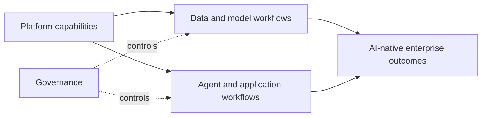

# The Great Unlock - How Platform Engineering Creates AI-Native Enterprises

*Weave Intelligence — Report*

## Agent guide

Connects platform engineering capabilities with the organizational, technical, and governance foundations needed to scale AI across an enterprise.
### Questions this chapter answers
- How can platform engineering enable enterprise AI adoption?
- Which shared capabilities turn isolated AI work into an operating model?
- How do enablement and governance interact in an AI-native platform?
### Key points
- Shared platforms convert repeated AI infrastructure work into reusable capabilities.
- AI enablement requires developer workflows, data and model services, and governance to operate together.
- Enterprise outcomes depend on adoption and operating-model change as well as technology.

## Conceptual diagram

## Detailed source transcript

### Page 1
Weave Intelligence
The great unlock:
How platform
engineering creates
AI-native enterprises
A   report   commissioned   by   VULTR
### Page 2
The great unlock: How platform engineering creates AI-native
02      enterprises – A report commissioned by VULTR
	About the author
	Sam Barlien
	RESEARCHER, WEAVE INTELLIGENCE
	Sam Barlien is a researcher at Weave Intelligence, the research arm of
	[platformengineering.org](http://platformengineering.org), the world’s largest platform engineering
	community. With more than 10 years tracking technology communities and
	ecosystems, he brings first-hand perspective to his research on platform
	engineering and industry trends. He contributes to Weave Intelligence
	reports and conducts the weekly research interview series. He co-hosts
	PlatformCon, the world’s largest platform engineering conference, and
	contributes to Platform Weekly, the Ambassador program and the
	[platformengineering.org](http://platformengineering.org) blog.
	About Vultr
		Vultr is on a mission to make high-performance
		cloud infrastructure easy to use, affordable, and
		locally accessible for enterprises and AI
		innovators around the world. Vultr is trusted by
		hundreds of thousands of active customers
		across 185 countries for its flexible, scalable,
		global Cloud Compute, Cloud GPU, Bare Metal,
		and Cloud Storage solutions. Founded by David
		Aninowsky and self-funded for over a decade,
		Vultr has grown to become the world’s largest
		privately held cloud infrastructure company.
		Learn more at [Vultr.com](http://Vultr.com).
© 2026 Weave Intelligence. All rights reserved. Unauthorized reproduction prohibited.
### Page 3
The great unlock: How platform engineering creates AI-native
03      enterprises – A report commissioned by VULTR
Breaking the AI
implementation plateau
	AI has seen the fastest rate of                    At the same time, they may lack the
	adoption of any technology in history.             confidence in skillset, and especially
	Almost 90% of organizations report                 security and governance to expand
	their usage of it. The potential gains             their AI workflows from simple code
	are massive, and so the hype and                   generation prompts to full-fledged
	optimism are massive too. Most                     agentic workflows, systems where AI
	enterprises however, are not seeing                agents act on behalf of users within
	these gains. They remain stuck at what             governed platform boundaries, not
	we call the “AI implementation                     just assist them.
	plateau”, the stage where
	organizations stop seeing rapid gains              The result? Cost proliferation,
	from AI adoption, and face slower ROI,             compliance gaps, failed projects that
	integration hurdles, and the need for              never reach production, and a
	deeper cultural or process change.
	confusing disappointing dive into AI
		enablement.
		One key reason this plateau exists is
		because enterprises treat AI                       This is not a set fate for enterprises
		infrastructure as a special case                   however. Achieving the aspired results
		requiring new organizational patterns.             of AI is possible. Platform engineering
		They spin up siloed GPU clusters                   is the unlock.
		managed by data science teams. They
		bypass governance frameworks that
		took years to establish for cloud-
		native workloads. They fragment
		ownership across business units, each
		building custom pipelines without
		shared standards.
© 2026 Weave Intelligence. All rights reserved. Unauthorized reproduction prohibited.
### Page 4
The great unlock: How platform engineering creates AI-native
04      enterprises – A report commissioned by VULTR
	The same platform teams that built                 This whitepaper delivers the
	golden paths, and composable                       architectural patterns, ownership
	infrastructure templates for cloud-                boundaries, and implementation
	native applications must now do the                roadmap required to support this
	same for AI whether running on-prem                transformation. You'll see the three-
	GPU clusters, cloud inference, or a                layer blueprint that separates
	hybrid of both. They must abstract                 concerns and enables scale. You'll
	infrastructure complexity, provide pre-            understand exactly how enterprises
	built application stacks, embed                    can execute on this module through a
	governance before workloads go to                  case study of how a hospitality
	production and enable downstream                   organization can double room revenue
	developers to focus on business                    through AI-native guest experiences
	outcomes with AI rather than                       deployed in weeks. You’ll learn what
	infrastructure tuning.
	AI-native really means, and how
		platform engineering enables you to
		attain it.
		It’s like a star collapse before going supernova, right? So there
		needs to be a collapsing of the star. Down into platform
		engineering as a choke point for governance and compliance.
		Then you can go supernova.
		Kevin Cochrane
		CMO, Vultr
© 2026 Weave Intelligence. All rights reserved. Unauthorized reproduction prohibited.
### Page 5
The great unlock: How platform engineering creates AI-native
05      enterprises – A report commissioned by VULTR
	What does AI-native mean for
	infrastructure teams?
	An AI-native enterprise embeds                     They design products, services, and
	artificial intelligence into every                 internal workflows with AI as a core
	business process and customer                      capability, integrating models, data
	experience as a first-class operational            pipelines, and inference services
	capability, not an experimental add-               directly into their application blueprint
	on. This distinction matters. Every                and operational systems.
	organization today is AI-enabled now.
	They all have access to AI tools,                  They version control datasets
	whether it’s Copilot, ChatGPT or their             alongside code. They maintain audit
	own internal model (Copilot with                   trails showing which data trained
	lipstick). But from an infrastructure              which model for which application.
	standpoint, there's a meaningful                   They deploy models through CI/CD
	operational difference. Organizations              pipelines with build, test, and
	that treat models, datasets, and                   production environments. The
	inference endpoints as versioned,                  difference is architectural. AI-enabled
	containerized platform services, with              teams integrate AI tools into existing
	the same rigor they apply to                       workflows.
	microservices and APIs are able to
	move from experimentation to                       AI-native teams integrate AI into the
	production in ways that others simply              platform itself, using platform
	cannot.
		engineering to make governance,
			data, and compute first-class
	AI-enabled organizations merely use                concerns from day one, not retrofits.
	AI tools within existing workflows.
	Developers might rely on Copilot for               Just as platform teams built golden
	coding assistance, teams might use                 paths, paved routes from intent to
	ChatGPT-style interfaces, and                      production outcome, for cloud-native
	applications may occasionally call                 applications, they must now do the
	external models through APIs. AI-                  same for AI workloads. This means
	native organizations take a different              centralized model hubs containing
	approach.                                          pre-approved LLMs and custom
		models that downstream teams can
		consume.
© 2026 Weave Intelligence. All rights reserved. Unauthorized reproduction prohibited.
### Page 6
The great unlock: How platform engineering creates AI-native
06      enterprises – A report commissioned by VULTR
	It means composable infrastructure                 For example, a golden path to a
	templates that provision compute,                  production-ready customer service
	whether GPU clusters, managed                      agent would include GPU clusters for
	inference endpoints, or cloud-native               inference, vector databases for RAG,
	AI services, alongside storage and                 data pipelines for real-time updates,
	networking, with the right                         and API endpoints for application
	configuration for each use case.
	integration, all pre-configured,
		governed, and ready to consume.
		These golden paths for AI
		infrastructure abstract GPU                        Developers customize business logic
		complexity while maintaining                       and deploy without touching
		flexibility. They are pre-built, pre-              infrastructure configuration. This puts
		tested, secure templates that ensure               the power of advanced AI workflows in
		downstream development success.                    the hands of your developers,
			enabling teams to stand up and scale
			use cases in parallel, while still
			maintaining all necessary security and
			governance protocols.
		This is what allows enterprises to execute on safe,
		repeatable, and massively valuable AI workflows.
		More than just blasting through the AI implementation
		gap, these are the enterprises that will own the future
		of their industries.
© 2026 Weave Intelligence. All rights reserved. Unauthorized reproduction prohibited.
### Page 7
The great unlock: How platform engineering creates AI-native
07      enterprises – A report commissioned by VULTR
	Why platform engineering creates
	AI-native organizations
	An element of why the AI                           The gap between experimentation
	implementation plateau exists is                   and business impact widens because
	because enterprises lack the                       infrastructure complexity, fragmented
	operational playbook to industrialize AI           ownership, and governance concerns
	delivery. In the State of AI in Platform           increasingly block progress.
	Engineering report, 89% of platform
	engineers report using AI daily, yet               Platform engineering solves this by
	most usage remains tactical, focused               applying proven cloud-native
	on code generation and                             principles and product management
	documentation rather than production               to AI infrastructure. The same
	systems that drive measurable                      discipline that enabled enterprises to
	business outcomes. At the same time,               deploy thousands of microservices
	on the infrastructure layer,                       now enables them to deploy hundreds
	organizations experiment heavily,                  of AI models. The mechanism is
	hiring data scientists, launching pilot            identical. You centralize governance,
	projects, and accessing GPU                        abstract infrastructure complexity,
	resources through cloud providers or               provide golden paths, enable
	internal infrastructure.
	distributed innovation and treat your
		users like they are your customers.
		But experimentation alone does not                 The technology stack differs, but the
		translate into enterprise impact.                  organizational pattern remains
			constant.
		Consider what happens without platform engineering. Each
		business unit spins up its own GPU cluster. Data science teams
		build custom pipelines without shared standards. Developers
		integrate AI through third-party APIs, sending proprietary data
		to external services. Security teams discover compliance gaps
		after deployment or worse, and out of fear simply block all
		experimentation. Finance sees GPU costs proliferate without
		clear ROI, and race to shut it all down.
© 2026 Weave Intelligence. All rights reserved. Unauthorized reproduction prohibited.
### Page 8
The great unlock: How platform engineering creates AI-native
08      enterprises – A report commissioned by VULTR
	Projects fail time and time again because teams spend
	months on infrastructure instead of business logic.
	This is the mainframe anti-pattern                 Platform engineering breaks this
	applied to AI. Enterprises centralize              pattern by treating AI infrastructure as
	GPU resources in a single location,                composable, distributed, and on-
	force global teams to schedule time on             demand. GPU clusters spin up when
	shared clusters, and overprovision for             needed and scale to zero when idle.
	peak capacity. When demand spikes                  Inference workloads deploy globally,
	in Europe at midnight, underutilized               close to users, with auto-scaling based
	GPUs sit idle in North America. When               on demand. Developers consume pre-
	a new model requires retraining,                   built stacks through self-service
	teams wait weeks for cluster                       portals without understanding GPU
	availability. The economics don't work,            memory management or network
	the developer experience suffers, and              optimization. Governance happens at
	AI remains experimental.
	the platform layer, before workloads
		reach production.
© 2026 Weave Intelligence. All rights reserved. Unauthorized reproduction prohibited.
### Page 9
The great unlock: How platform engineering creates AI-native
09      enterprises – A report commissioned by VULTR
	AI-native blueprint
	The three-layer blueprint by Vultr is an           NVIDIA Vera CPUs and Rubin GPUs)
	effective example of the concepts                  run Slurm, monitoring agents, and
	explored in this report. Its primary               GPU management components.
	objective is to separate concerns and              High-performance memory and
	enable scale. Each layer has a distinct            storage (HBM, NVMe SSD) connect to
	purpose, clear ownership boundaries,               a shared VAST data platform for
	and well-defined interfaces. This                  globally distributed data and model
	separation allows platform teams to                access. The blueprint supports elastic
	abstract complexity while giving                   scale-up and scale-out inference
	application teams the flexibility to               clusters for production AI applications.
	innovate on business logic.
		It's important to understand that the
	The blueprint highlighted in this report           power of this blueprint is in its
	shows a scalable, AI-native inference              composability. The specific
	platform running on Vultr Kubernetes               infrastructure underneath, whether
	with NVIDIA GPUs utilising VAST as                 GPU clusters, managed cloud
	the data platform.
	inference, or a combination, is
		interchangeable. What matters are
		It includes a centralized master node              the architectural principles:
		providing enterprise IAM, Slurm                    composability, centralized
		workload management, observability                 governance, and platform-managed
		(Grafana, Prometheus, Loki), and                   complexity.
		automation via Ansible. NVIDIA
		Dynamo (including Planner,
		SmartRouter, and Events) orchestrates
		and optimizes inference workloads.
		Across multiple racks, NVIDIA GPU
		nodes (GB300 NVL72 systems with
© 2026 Weave Intelligence. All rights reserved. Unauthorized reproduction prohibited.
### Page 10
The great unlock: How platform engineering creates AI-native
10     enterprises – A report commissioned by VULTR
	Layer 1: Governed data foundation
	The data layer provides versioned,                                                                                                                                                                                                                                                                                                                                                                                                                                                                                                                                          A hotel booking dataset utilised at
	encrypted, and compliant datasets                                                                                                                                                                                                                                                                                                                                                                                                                                                                                                                                   multiple hotel locations globally might
	that power AI workloads. It serves as a                                                                                                                                                                                                                                                                                                                                                                                                                                                                                                                             be versioned monthly, encrypted at
	governed foundation where every                                                                                                                                                                                                                                                                                                                                                                                                                                                                                                                                     rest and in transit, and tagged with
	dataset is tracked, auditable, and                                                                                                                                                                                                                                                                                                                                                                                                                                                                                                                                  compliance metadata (GDPR-
	approved for specific use cases.                                                                                                                                                                                                                                                                                                                                                                                                                                                                                                                                    compliant, PCI-DSS certified).
	Platform teams, often working
	alongside data governance and                                                                                                                                                                                                                                                                                                                                                                                                                                                                                                                                       When a demand forecasting model
	compliance officers, certify datasets,                                                                                                                                                                                                                                                                                                                                                                                                                                                                                                                              needs training data, it pulls a specific
	establish access controls, and                                                                                                                                                                                                                                                                                                                                                                                                                                                                                                                                      dataset version with a full audit trail.
	maintain data lineage.
		When a RAG pipeline needs real-time
			updates, it subscribes to a data stream
	In this example, containerized datasets                                                                                                                                                                                                                                                                                                                                                                                                                                                                                                                             with guaranteed freshness and quality.
	flow through the blueprint just like
	containerized microservices.
		SAN FRANCISCO
			MASTER NODE
		LONDON                                                                                                                                                                                                                                                                                                                                                                                                                                                                                                                                                                                                                                                AMSTERDAM
			Enterprise
	Slum
		Loki
			Grafana                  Prometheus                                                              Ansible
			IAM                          Manager                                                                                Integration
				VULTR KUBERNETES
				NVIDIA Dynamo
				Planner                                                                SmartRouter                                                   Events
			RACK #1                                                                                                                                                                                                                                                                                    RACK #n
				GPU NODE #1                                                                   GPU NODE #9                                                                      GPU NODE #n                                                                 GPU NODE #n+8
			MASTER NODE                                                                                                                                                                                                                                                                                                                                                                                                                                                                                                                                                                                                                                                                 MASTER NODE
				Slum Daemon                                                                   Slum Daemon                                                                      Slum Daemon                                                                  Slum Daemon
			Enterprise
		Slum
			Loki
				Enterprise
		Slum
			Loki
				Grafana                  Prometheus                                                                            Ansible                                                                                                             Ansible Daemon                                                                Ansible Daemon                                                                   Ansible Daemon                                                               Ansible Daemon                                                                                                                                                                               Grafana                  Prometheus                                                                            Ansible
				IAM                                Manager                                                                                              Integration                                                                                                                                                                                                                                                                                                                                                                                                                                                                                                                         IAM                                Manager                                                                                              Integration
					VULTR KUBERNETES                                                                       Loki Daemon                                                                   Loki Daemon                                                                      Loki Daemon                                                                  Loki Daemon                                                                                                                                                                                                                                                                                                                                VULTR KUBERNETES
					NVIDIA Dynamo                                                                                                                                                                                                      Prometheus Daemon                                                             Prometheus Daemon                                                                Prometheus Daemon                                                            Prometheus Daemon
						NVIDIA Dynamo
						Grafana Alloy                                                                 Grafana Alloy                                                                    Grafana Alloy                                                                Grafana Alloy
					Planner                                                                              SmartRouter                                                                 Events                                                                                                                                 GB300 NVL72                                                                   GB300 NVL72                                                                      GB300 NVL72                                                                  GB300 NVL72
						Planner                                                                              SmartRouter                                                                 Events
						Vera CPUs
							SCALE
			Vera CPUs
				SCALE
			Vera CPUs
				SCALE
			Vera CPUs
				RACK #1                                                                                                                                                                                                                                                                                                                                                RACK #n                                                                                 UP                                                                               ACROSS                                                                            UP                                                                      RACK #1                                                                                                                                                                                                                                                                                                                                  RACK #n
					Rubin GPUs                                                                    Rubin GPUs                                                                       Rubin GPUs                                                                   Rubin GPUs
					GPU NODE #1                                                                                 GPU NODE #9                                                                                    GPU NODE #n                                                                              GPU NODE #n+8                                                                                                                                                                                                                                                                                                                                                                                      GPU NODE #1                                                                      GPU NODE #9                                                                                    GPU NODE #n                                                                              GPU NODE #n+8
						Pre-fill Workers                               Decode Workers                 Pre-fill Workers                               Decode Workers                    Pre-fill Workers                                Decode Workers               Pre-fill Workers                               Decode Workers
						Slum Daemon                                                                                 Slum Daemon                                                                                    Slum Daemon                                                                                Slum Daemon                                                                                                                                                                                                                                                                                                                                                                                    Slum Daemon                                                                        Slum Daemon                                                                                    Slum Daemon                                                                                Slum Daemon
							NVIDIA Dynamo                                                                 NVIDIA Dynamo                                                                    NVIDIA Dynamo                                                                NVIDIA Dynamo
						Ansible Daemon                                                                              Ansible Daemon                                                                                 Ansible Daemon                                                                             Ansible Daemon                                                                                                                                                                                                                                                                                                                                                                                  Ansible Daemon                                                                    Ansible Daemon                                                                                 Ansible Daemon                                                                             Ansible Daemon
							Loki Daemon                                                                                 Loki Daemon                                                                                    Loki Daemon                                                                                Loki Daemon                                                                                                                                                                                                                                                                                                                                                                                    Loki Daemon                                                                        Loki Daemon                                                                                    Loki Daemon                                                                                Loki Daemon
					Prometheus Daemon                                                                           Prometheus Daemon                                                                              Prometheus Daemon                                                                          Prometheus Daemon                                                                   DRAM      NVMe SSD   HBM                                                      DRAM      NVMe SSD   HBM                                                         DRAM      NVMe SSD   HBM                                                     DRAM      NVMe SSD   HBM                                           Prometheus Daemon                                                              Prometheus Daemon                                                                              Prometheus Daemon                                                                          Prometheus Daemon
						Grafana Alloy                                                                               Grafana Alloy                                                                                  Grafana Alloy                                                                              Grafana Alloy                                                                   VAST Dataspace                                                                VAST Dataspace                                                                   VAST Dataspace                                                               VAST Dataspace
							Grafana Alloy                                                                      Grafana Alloy                                                                                  Grafana Alloy                                                                              Grafana Alloy
						GB300 NVL72                                                                                 GB300 NVL72                                                                                    GB300 NVL72                                                                                GB300 NVL72                                                                                                                                                                                                                                                                                                                                                                                    GB300 NVL72                                                                        GB300 NVL72                                                                                    GB300 NVL72                                                                                GB300 NVL72
							Vera CPUs
								SCALE
					Vera CPUs
						SCALE
					Vera CPUs
						SCALE
				Vera CPUs                                                                                                                                                                                                                                                                                                                                                                                     Vera CPUs
					SCALE
					Vera CPUs
						SCALE
					Vera CPUs
						SCALE
				Vera CPUs
					UP                                                                                             ACROSS                                                                                          UP                                                                                                                                                                                                                                                                                                                                                                                                                                                                           UP                                                                                             ACROSS                                                                                          UP
					Rubin GPUs                                                                                  Rubin GPUs                                                                                     Rubin GPUs                                                                                 Rubin GPUs                                                                                                                                                                                                                                                                                                                                                                                     Rubin GPUs                                                                         Rubin GPUs                                                                                     Rubin GPUs                                                                                 Rubin GPUs
					Pre-fill Workers                                             Decode Workers                 Pre-fill Workers                                             Decode Workers                    Pre-fill Workers                                              Decode Workers               Pre-fill Workers                                               Decode Workers                                                                                                                                                                                                                                                                                                                       Pre-fill Workers                               Decode Workers                 Pre-fill Workers                                             Decode Workers                    Pre-fill Workers                                              Decode Workers               Pre-fill Workers                                               Decode Workers
						NVIDIA Dynamo                                                                               NVIDIA Dynamo                                                                                  NVIDIA Dynamo                                                                              NVIDIA Dynamo                                                                                                                                                                                                                                                                                                                                                                                 NVIDIA Dynamo                                                                       NVIDIA Dynamo                                                                                  NVIDIA Dynamo                                                                              NVIDIA Dynamo
						NVIDIA Inference Transfer Engine (NIXL)                                                     NVIDIA Inference Transfer Engine (NIXL)                                                        NVIDIA Inference Transfer Engine (NIXL)                                                    NVIDIA Inference Transfer Engine (NIXL)                                                                                                                                                                                                                                                                                                                                                                                                                                           NVIDIA Inference Transfer Engine (NIXL)                                                        NVIDIA Inference Transfer Engine (NIXL)                                                    NVIDIA Inference Transfer Engine (NIXL)
							NVIDIA KV Cache Manager                                                                     NVIDIA KV Cache Manager                                                                        NVIDIA KV Cache Manager                                                                    NVIDIA KV Cache Manager                                                                                                                                                                                                                                                                                                                                                                                                                                                           NVIDIA KV Cache Manager                                                                        NVIDIA KV Cache Manager                                                                    NVIDIA KV Cache Manager
							DRAM        NVMe SSD          HBM                                                           DRAM        NVMe SSD          HBM                                                              DRAM        NVMe SSD          HBM                                                          DRAM        NVMe SSD          HBM                                                                                                                                                                                                                                                                                                                                                               DRAM      NVMe SSD   HBM                                                         DRAM         NVMe SSD          HBM                                                             DRAM         NVMe SSD          HBM                                                         DRAM         NVMe SSD          HBM
								VAST Dataspace                                                                              VAST Dataspace                                                                                 VAST Dataspace                                                                             VAST Dataspace                                                                                                                                                                                                                                                                                                                                                                                VAST Dataspace                                                                      VAST Dataspace                                                                                 VAST Dataspace                                                                             VAST Dataspace
									VAST POLARIS
									VAST SITE #1                                                                                                                                                                                                                                                                                                                                                                                                                                                                                                                                                                                                                                                                 VAST SITE #2
									POLICIES                                                                                                                            GOVERNANCE                                                                                                                                                                                                                                                                                                                                                                                                                                                                                                                                      POLICIES                                                                                                                     GOVERNANCE
					Without governed data, AI models lack accuracy and trust. No matter how high
					quality or valuable your data might be. Revenue teams won't act on pricing
					recommendations if they don't trust the underlying data. Compliance teams
					won't approve deployments if data lineage is unclear. Platform engineering
					solves this by treating data as a first-class platform service with the same rigor
					as APIs and microservices.
© 2026 Weave Intelligence. All rights reserved. Unauthorized reproduction prohibited.
### Page 11
The   great     unlock:       How    platform                       engineering                                           creates                     A I - n a t i v e
11     enterprises         –   A   report     commissioned                                           by          VULTR
	Layer 2: Accelerated compute
	The compute layer provides GPU                                                                                                                                                              A template might define the GPU type
	clusters optimized for two distinct                                                                                                                                                         and count, networking configuration,
	workloads, scale-up training and                                                                                                                                                            storage optimization, auto-scaling
	scale-out inference. Training requires                                                                                                                                                      policies, and cost thresholds.
	massive parallel compute on large                                                                                                                                                           Developers would then consume the
	datasets. Imagine thousands of GPUs                                                                                                                                                         template simply through the
	working together to build or tune a                                                                                                                                                         developer portal, customize
	model. Inference requires distributed                                                                                                                                                       parameters (region, capacity, budget),
	compute close to users - think                                                                                                                                                              and deploy with a single click. The
	hundreds of smaller clusters globally,                                                                                                                                                      platform would abstract and handle
	each handling real-time requests with                                                                                                                                                       Kubernetes configuration, GPU
	low latency.
		memory management, and cluster
			orchestration. This keeps the
	Platform teams provision and manage                                                                                                                                                         cognitive load, and the skill knowledge
	these clusters through the                                                                                                                                                                  away from many of your developers.
	aforementioned composable
	infrastructure templates.
		MASTER NODE
		Enterprise
	Slum
		Loki
			Grafana               Prometheus                                                                        Ansible
			IAM                         Manager                                                                                    Integration
				VULTR KUBERNETES
				NVIDIA Dynamo
			Planner                                                                         SmartRouter                                                              Events
		RACK      #1                                                                                                                                                                                                                                                                                                                                     RACK           #n
	INFERENCE
		GPU NODE #1                                                                                GPU NODE #                 9                                                             GPU NODE #n                                                                                  GPU NODE #n                     +8
	NODE POOL                                                         Slurm Daemon                                                                               Slurm Daemon                                                                             Slurm Daemon                                                                                   Slurm Daemon
		Ansible Daemon                                                                             Ansible Daemon                                                                           Ansible Daemon                                                                                 Ansible Daemon
			Loki Daemon                                                                                Loki Daemon                                                                              Loki Daemon                                                                                    Loki Daemon
		Prometheus Daemon                                                                          Prometheus Daemon                                                                        Prometheus Daemon                                                                              Prometheus Daemon
			Grafana Alloy                                                                              Grafana Alloy                                                                            Grafana Alloy                                                                                  Grafana Alloy
			G  B300 NVL72                                                                              G  B300 NVL72                                                                            G  B300 NVL72                                                                                  G  B300 NVL72
	VULTR NVIDIA RUBIN GPUS
		Vera CPUs
			SCAL  E
		Vera CPUs
			SCAL   E
		Vera CPUs
			SCAL     E
			Vera CPUs
		AS WORKER NODES
			UP                                                                                          ACROSS                                                                                          UP
		FOR MODEL INFERENCE                                                           Rubin GPUs                                                                                 Rubin GPUs                                                                               Rubin GPUs                                                                                     Rubin GPUs
			-fill Workers                                             c d Workers                      -fill Workers                                             c d Workers                    -fill Workers                                              c d Workers                         -fill Workers                                              c d Workers
				De o e                                                                                     De o e                                                                                    De o e                                                                                         De o e
				Pre                                                                                        Pre                                                                                      Pre                                                                                            Pre
					NVIDIA Dynamo                                                                              NVIDIA Dynamo                                                                            NVIDIA Dynamo                                                                                  NVIDIA Dynamo
						c                  ( XL)
					NVIDIA Inferen e Transfer Engine NI                                                                       c                  ( XL)
						NVIDIA Inferen e Transfer Engine NI                                                                     c                  ( XL)
							NVIDIA Inferen e Transfer Engine NI                                                                           c                  ( XL)
								NVIDIA Inferen e Transfer Engine NI
						NVIDIA   KV Cache Manager                                                                  NVIDIA   KV Cache Manager                                                                NVIDIA   KV Cache Manager                                                                      NVIDIA   KV Cache Manager
						DRAM          NVMe SSD         HBM                                                         DRAM          NVMe SSD         HBM                                                       DRAM          NVMe SSD         HBM                                                             DRAM          NVMe SSD         HBM
							VAST Dataspa ec                                                                            VAST Dataspa ec                                                                          VAST Dataspa ec                                                                                VAST Dataspa ec
			Another key element of this is auto-scaling. Autoscaling to zero is critical for
			cost e       ffi ciency. Inference clusters scale up when demand spikes and scale
			down to zero when idle. A hotel chain doesn t pay for GPU capacity at                                                                                                                         '                                                                                                                       3 M     A
			when booking tra                                                         ffi               c is minimal. The platform would monitor demand, oin                                                                                                                                                                        j
			nodes to the cluster as needed, and decommission them when tra                                                                                                                                                                                                                                      ffi     c drops.
			This is cloud-native economics applied to AI infrastructure.
© 2026 W eave Intelligence. All rights reserved. Unauthorized reproduction prohibited.
### Page 12
The great unlock: How platform engineering creates AI-native
12     enterprises – A report commissioned by VULTR
	Layer 3: Production orchestration
	If layer one establishes trust in
	They move through controlled build,
		data and layer two provides scalable                               test, and production environments
		compute power, layer three is
		with the same focus as traditional
		what turns AI into the repeatable                                  software.
		production capability we are
		Platform teams do not expect AppDev
		looking for.
			teams to understand GPU scheduling,
				distributed inference routing, or K8s
		The production orchestration layer                                 configuration. Instead, they provide
		operationalizes AI workloads the same                              golden paths for deployment
		way cloud-native platform                                          encapsulating best practices for
		orchestrators operationalized                                      global inference deployment,
		microservices.
			observability, security policies,
				networking, and failover, all
		Models, inference endpoints, and AI                                embedded into certified templates
		apps components are treated as
		versioned, deployable artifacts.
			OPTIMIZED
			OP & REVENUE
			COMPOSABLE
			CLOUD STACKS
			PRE-COMPOSED
			PIPELINES, SERVICES,                                                             PERSONALIZED
	PLATFORM
		MODELS, HELM                                          DEVELOPER                CUSTOMER
	ENGINEERING
		CHARTS, TERRAFORM                                                                 EXPERIENCE
			TEMPLATES
				USE-CASE FOCUSED
		ENHANCED
			CUSTOMER
			OUTCOME-ORIENTED
			LOYALTY &
				RETENTION
				GRC GOVERNED
© 2026 Weave Intelligence. All rights reserved. Unauthorized reproduction prohibited.
### Page 13
The great unlock: How platform engineering creates AI-native
13     enterprises – A report commissioned by VULTR
	A developer building a pricing optimization service or an AI-native guest
	experience application does not write low-level manifests or tune cluster
	parameters. They consume a production-ready deployment template that
	includes:
		Containerized model and application packaging
		Integration with centralized model hubs and registries
		Multi-region deployment patterns
		Observability and monitoring instrumentation
		Security controls and policy enforcement
		Rollback and version management capabilities
	Remember that composability is the key to handling
	enterprise heterogeneity. A large organization will run
	various GPUs, NetApp and DDN storage, multiple
	cloud providers, and on-premises infrastructure.
	Platform teams can't standardize on a single vendor stack,
	they need to provide flexibility just as much as they need
	to maintain governance.
	The complexity of orchestration remains within the platform boundary. The
	simplicity of consumption is what enables the AI driven velocity that
	enterprises are hungry for.
© 2026 Weave Intelligence. All rights reserved. Unauthorized reproduction prohibited.
### Page 14
The great unlock: How platform engineering creates AI-native
14     enterprises – A report commissioned by VULTR
Hospitality case study:
Operational AI for
revenue optimization
	As we navigate through this case                   experiences to drive incremental
	study, think about how these same                  revenue per room.
	concepts could be executed inside
	your organization. A global hotel chain            The business requirements are clear.
	faces the classic hospitality challenge            They must increase RevPAR, improve
	where occupancy has stabilized,                    gross operating profit per available
	revenue per available room (RevPAR)                room (GOPPAR), reduce labor cost per
	gains are modest, and labor costs                  occupied room, and strengthen
	continue rising.
	demand forecast accuracy. This isn’t
		something that traditional analytics
		Their profitability now depends on                 dashboards, and weekly strategy
		operational efficiency and margin                  meetings can deliver. The chain needs
		optimization, not volume growth.
	operational AI that makes real-time
		decisions during the best moments of
		The chain needs to price smarter, staff            opportunity for revenue.
		more efficiently, and personalize guest
		From analytics to operational AI
		The transformation starts with the three-layer blueprint. Layer one
		unifies booking, revenue, loyalty, and operational data into a governed
		foundation. Guest profiles, stay history, room service orders, and booking
		patterns are versioned, encrypted, and made available through secure APIs.
		This operates as a real-time data platform where updates flow continuously
		to inference systems.
© 2026 Weave Intelligence. All rights reserved. Unauthorized reproduction prohibited.
### Page 15
The great unlock: How platform engineering creates AI-native
15     enterprises – A report commissioned by VULTR
	Layer two provides GPU clusters for demand forecasting, pricing optimization,
	and scenario simulation. Models run on NVIDIA-accelerated infrastructure,
	training on historical data and inferring on real-time booking patterns. The
	platform handles model deployment, version control, and API endpoint
	creation. Revenue teams don't manage infrastructure - they consume
	forecasting services through dashboards and applications.
	Layer three orchestrates deployment                deployment patterns that plug
	across properties. AI-native                       directly into existing hotel systems.
	applications such as front desk
	reservation system, in-room tablet                 That gives developers a paved road to
	experience, employee clienteling tools             build the AI applications they actually
	are able to be deployed consistently               need, whether for dynamic pricing,
	whether the property is in San                     staff scheduling, front desk upsell
	Francisco, London, or Amsterdam.                   recommendations, in-room concierge
	Kubernetes handles container                       experiences, or employee clienteling,
	orchestration, auto-scaling, and                   without becoming experts in
	failover as the platform ensures                   Kubernetes, GPU tuning, or
	compliance with regional data                      distributed inference.
	residency requirements.
		In practice, the platform team absorbs
	This is where platform engineering                 the complexity so application teams
	becomes the enabler of outcomes.                   can focus on business logic and guest
	They standardize the discussed                     outcomes, turning the blueprint into a
	blueprint into reusable single-click               repeatable engine for higher RevPAR,
	infrastructure templates, pre-                     stronger GOPPAR, lower labor cost
	composed software stacks, approved                 per occupied room, and more
	models and endpoints, and secure                   accurate real-time demand
		forecasting.
	Beyond productivity improvements, the platform team also
	provides the secure guardrails that allow AI applications to access
	the data they need to succeed without creating security,
	governance, or policy risk.
	Sam Barlien
	RESEARCHER, WEAVE INTELLIGENCE
© 2026 Weave Intelligence. All rights reserved. Unauthorized reproduction prohibited.
### Page 16
The great unlock: How platform engineering creates AI-native
16     enterprises – A report commissioned by VULTR
	The AI-native hotel guest experience
	Let's break down what's possible with a mature AI-native platform, the
	full capability set that organizations are working toward. In this case,
	agentic applications focused on radically improving the guest
	experience and increasing RevPAR.
	A traveler checks in late at 10 PM after a delayed flight. In
	a traditional hotel, the front desk (human) agent
	processes the reservation and hands over keys. In an AI-
	native hotel, the front desk application includes an
	embedded (AI) agent that has analyzed the guest's
	profile, detected the flight delay, and identified a
	pattern… this guest often forgets to order dinner when
	checking in late, and has remarked as such to staff.
	The agent prompts the guest, "Mrs. Malone, I see you’ve
	arrived late. Would you like me to order your usual
	hamburger and onion soup for dinner? We can have it
	sent up in 15 minutes." The guest, focused on getting to
	the room, hadn't thought about dinner. But now that it's
	offered - yes, that would be perfect. The hotel just made
	\$75 in incremental revenue that wouldn't have happened
	without the AI-native system.
	In the room, a tablet application offers three options,
	control lights, control TV, or talk to your agent. The
	agent, knowing the guest is attending a conference the
	next morning via the booking information, recommends
	car service to the venue and offers to pre-order breakfast
© 2026 Weave Intelligence. All rights reserved. Unauthorized reproduction prohibited.
### Page 17
The great unlock: How platform engineering creates AI-native
17     enterprises – A report commissioned by VULTR
	to arrive 30 minutes before pickup. The guest books both
	through the tablet. Another \$275 in incremental revenue.
	Ten minutes later, room service arrives with the
	hamburger. The staff member, prompted by the
	employee clienteling application, brings a glass of the
	guest's preferred wine and an ice cream sundae. "I took
	the liberty of bringing these - I thought you might want
	to spoil yourself after the long travel day." The guest
	accepts both. Another \$50 in incremental revenue.
	The room rate was \$400. The hotel just generated an
	additional \$400 through AI-native personalization,
	doubling revenue for that night. And this is just the first
	night of a multi-night stay. The pattern repeats, and the
	guest profile updates with new preferences that inform
	future stays in different locations across the globe.
© 2026 Weave Intelligence. All rights reserved. Unauthorized reproduction prohibited.
### Page 18
The great unlock: How platform engineering creates AI-native
18     enterprises – A report commissioned by VULTR
	How did they do it?
	This hotel chain didn’t become AI-                 Example builds in this case were a
	native because it “used agents app.” It            front desk reservation app, an in-room
	became AI-native because it                        tablet app, and an employee
	mobilized a composable AI stack                    clienteling app. All backed by a fourth
	through platform engineering allowing              capability, a unified guest profile and
	developers to easily and safely build              memory.
	the exact AI applications they needed
	to deliver the best results for their              While ensuring that the stack is
	organization.
	vendor-agnostic with NVIDIA GPUs
		and software or AMD accelerators,
		Behind the scenes, the infrastructure              and NetApp, DDN, or VAST for the
		is intentionally “overwrought with GPU             data platform. This means that
		clusters, inference routing, storage               enterprises are heterogeneous by
		tiers, global distribution, observability,         default.
		security controls. The unlock is that              The same inference-backed
		downstream developers don’t need to                applications also must run across
		understand or rebuild any of it. The               properties in different regions, and the
		platform team packages that                        guest memory must travel with the
		complexity into certified composable               customer.
		stacks.
			That means globally distributed
		That’s how the applications were built             inference infrastructure and a
		quickly. One example organization,                 globally distributed data layer, so a
		with a composable AI stack already in              preference learned in San Francisco
		place, built over 40 agentic workflows             improves the experience in London
		in just 3 weeks during a series of                 and Amsterdam.
		Hackathons. The platform and DevRel
		teams had pre-built the stack, the
		hard part was already done, then
		teams built on top of it.
© 2026 Weave Intelligence. All rights reserved. Unauthorized reproduction prohibited.
### Page 19
The great unlock: How platform engineering creates AI-native
19     enterprises – A report commissioned by VULTR
	From single agents to agent swarms
	AI-native velocity also comes from how the “agent” work is structured. These
	experiences aren’t powered by a single agent, they require a swarm:
		Brand-to-agent                                Agent-to-agent
		The business (the brand) defining how         One agent summarizes historical
		the AI agent should behave, what it is        behavior while another optimizes for the
		allowed to do, what it should optimize        best offer and highest revenue
		for, and how it represents the company.       likelihood.
		Agent-to-employee                             Agent-to-customer
		The system generates the staff talk           The tablet/voice experience confirms
		track (“they arrived late, here’s what to     car service, recommends add-ons, and
		offer, here’s how to phrase it”).             closes the loop.
	This is the great unlock in action, when platform
	engineering absorbs the complexity of infrastructure,
	governance, and agent orchestration, application
	teams can focus purely on business outcomes turning
	AI from experimentation into scalable,
	revenue-generating operations.
© 2026 Weave Intelligence. All rights reserved. Unauthorized reproduction prohibited.
### Page 20
The great unlock: How platform engineering creates AI-native
20      enterprises – A report commissioned by VULTR
	How to get started
	The hospitality use case demonstrates what's possible with \$400 incremental
	revenue per guest stay through coordinated AI agents, deployed globally in weeks
	rather than months. The ability to deliver operational AI scale, compressing time-
	to-production and running multiple use cases in parallel, is the competitive
	differentiator.
	Start now with FIVE immediate actions:
01
	Assess your platform                               The three-layer blueprint delivers results only when the
		foundational platform discipline is in place. Teams still
	foundation first
		operating with fragmented, ad-hoc infrastructure should
		establish that baseline before layering AI workloads on
		top.
02
	Audit your current
	Identify which projects are stuck in experimentation and
		which have clear paths to production. Prioritize the latter.
		AI initiatives
03
	Establish platform                                 Don't let every business unit build their own GPU
		clusters. Centralize governance while distributing
	engineering ownership
		capability.
	for AI infrastructure
		Start with one use case, customer service agent, or
04
	Build your first
		forecasting model and create a template that bundles
	composable template
		GPU clusters, data pipelines, and AI frameworks.
		Version-control it. Test it. Deploy it.
05
	Partner with CISO and                              Embed security and governance into templates from day
		one. Don't bolt them on later.
	compliance
© 2026 Weave Intelligence. All rights reserved. Unauthorized reproduction prohibited.
### Page 21
The    great     unlock:       How    platform       engineering          creates   A I - n a t i v e
21     enterprises          –   A   report     commissioned          by   VULTR
	Measure velocity and outcomes
	Track time-to-production for AI applications. Track business outcomes
	(revenue, cost reduction, accuracy improvements). Use these metrics to justify
	continued investment. Can developers stand up a complete AI stack in 48
	hours? Can they deploy operational AI in weeks rather than months? Track
	metrics like these:
	Time to first inference
	How long from project kickoff to first production inference request?
	Template adoption rate
	What percentage of AI projects use platform-provided templates?
	GPU utilization
	Are clusters efficiently used or sitting idle?
	Cost per inference
	What's the unit economics of AI workloads?
	Deployment frequency
	How often do teams deploy new model versions?
	Governance coverage
	What percentage of AI workloads have complete audit trails?
© 2026 Weave Intelligence. All rights reserved. Unauthorized reproduction prohibited.
### Page 22
The great unlock: How platform engineering creates AI-native
22      enterprises – A report commissioned by VULTR
Start now: Unlock
the AI revolution
	The AI-native rebuild is underway.                 The three-layer blueprint shared here
	Platform engineering is the discipline             provides a key structure. Governed
	that operationalizes AI. Organizations             data foundation, accelerated
	that extend their platform engineering             compute, production orchestration.
	remit to AI will compress deployment               Each layer has clear ownership, well-
	timelines from months to weeks,                    defined interfaces, and composable
	maintain governance and compliance,                components. Platform teams provide
	and deliver operational AI that drives             certified infrastructure and data
	the incredible business outcomes that              services. Application teams build
	AI promises. Those that treat AI as a              business logic and deploy through
	special case requiring new                         golden paths.
	organizational patterns will remain
	stuck at the implementation plateau,               The gate is ready to be unlocked. We
	unable to move beyond                              are at the dawn of a new technology
	experimentation.
	cycle. Just as enterprises rebuilt
		infrastructure for web servers and
		The same centralized teams that built              cloud-native applications, they must
		developer portals and golden paths for             now rebuild for AI-native operations.
		cloud-native applications must now                 The technology differs, but the
		provide composable stacks for AI                   principles remain constant. Centralize
		workloads. The same governance                     governance. Abstract complexity.
		frameworks that enabled secure,                    Provide golden paths. Enable
		compliant microservices deployment                 distributed innovation.
		must now cover models, datasets, and
		inference endpoints. The same                      The organizations that move first, that
		separation of concerns - platform                  extend platform engineering remit to
		teams abstract complexity,
	AI infrastructure now, will establish
		application teams focus on outcomes                unfathomable competitive
		- must now apply to GPU clusters and               advantages that compound over time.
		vector databases.                                  And the organizations that wait, or do
			not start at all, will likely cease to exist.
© 2026 Weave Intelligence. All rights reserved. Unauthorized reproduction prohibited.
### Page 23
The great unlock: How platform engineering creates AI-native
23   enterprises – A report commissioned by VULTR
	Weave Intelligence
	A research brand by
	Platform Engineering Masters GmbH
	Wöhlertstraße 12/13
	10115 Berlin, Germany
	Disclaimer
	Weave Intelligence does not endorse any specific vendor, product, or service. The
	information contained in this report has been obtained from sources believed to be
	reliable. Weave Intelligence disclaims all warranties as to the accuracy, completeness, or
	adequacy of such information. This publication is provided on an "as-is" basis without
	warranty of any kind, either express or implied. Weave Intelligence shall have no liability
	for errors, omissions, or inadequacies in the information contained herein or for
	interpretations thereof. The reader assumes sole responsibility for the selection of these
	materials to achieve its intended results.
	© 2026 Weave Intelligence. All rights reserved. Unauthorized reproduction prohibited.
## Code map
- No matching code repository has been identified for this book.
## Source note
This is the complete generated chapter transcript. Source identity and status are recorded in the database properties.
