# The Kubernetes Bible

*Gineesh Madapparambath, Russ McKendrick — Book*

## Chapter 1: Kubernetes Fundamentals

**Questions this chapter answers:**
- What does this chapter explain about Understanding monoliths and microservices?
- What does this chapter explain about Understanding the growth of the internet since the late 1990s?
- What does this chapter explain about Understanding the need for more frequent software releases?

**Key points:**
- Source section: Understanding monoliths and microservices.
- Source section: Understanding the growth of the internet since the late 1990s.
- Source section: Understanding the need for more frequent software releases.
- Source section: Understanding the organizational shift to agile methodologies.

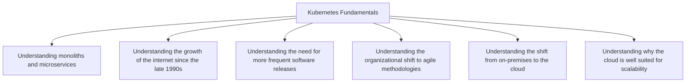

## Chapter 2: Kubernetes Architecture – from Container Images to Running Pods

**Questions this chapter answers:**
- What does this chapter explain about Technical requirements?
- What does this chapter explain about The name – Kubernetes?
- What does this chapter explain about Understanding the difference between the control plane nodes and compute nodes?

**Key points:**
- Source section: Technical requirements.
- Source section: The name – Kubernetes.
- Source section: Understanding the difference between the control plane nodes and compute nodes.
- Source section: The master and worker nodes.

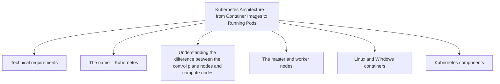

## Chapter 3: Installing Your First Kubernetes Cluster

**Questions this chapter answers:**
- What does this chapter explain about Technical requirements?
- What does this chapter explain about Installing a Kubernetes cluster with minikube?
- What does this chapter explain about Installing minikube?

**Key points:**
- Source section: Technical requirements.
- Source section: Installing a Kubernetes cluster with minikube.
- Source section: Installing minikube.
- Source section: Installing minikube on Linux.

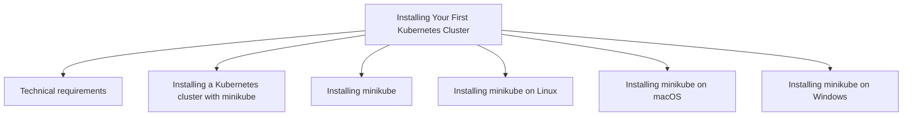

## Chapter 4: Running Your Containers in Kubernetes

**Questions this chapter answers:**
- What does this chapter explain about Technical requirements?
- What does this chapter explain about Let’s explain the notion of Pods?
- What does this chapter explain about What are Pods??

**Key points:**
- Source section: Technical requirements.
- Source section: Let’s explain the notion of Pods.
- Source section: What are Pods?.
- Source section: Each Pod gets an IP address.

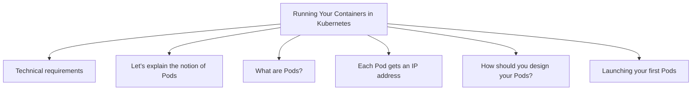

## Chapter 5: Using Multi-Container Pods and Design Patterns

**Questions this chapter answers:**
- What does this chapter explain about Technical requirements?
- What does this chapter explain about Understanding what multi-container Pods are?
- What does this chapter explain about Concrete scenarios where you need multi-container Pods?

**Key points:**
- Source section: Technical requirements.
- Source section: Understanding what multi-container Pods are.
- Source section: Concrete scenarios where you need multi-container Pods.
- Source section: Creating a Pod made up of two containers.

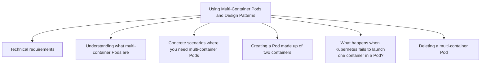

## Chapter 6: Namespaces, Quotas, and Limits for Multi-Tenancy in Kubernetes

**Questions this chapter answers:**
- What does this chapter explain about Technical requirements?
- What does this chapter explain about Introduction to Kubernetes namespaces?
- What does this chapter explain about The importance of namespaces in Kubernetes?

**Key points:**
- Source section: Technical requirements.
- Source section: Introduction to Kubernetes namespaces.
- Source section: The importance of namespaces in Kubernetes.
- Source section: How namespaces are used to split resources into chunks.

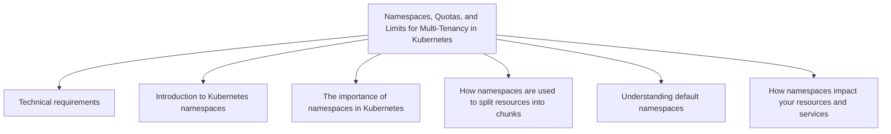

## Chapter 7: Configuring Your Pods Using ConfigMaps and Secrets

**Questions this chapter answers:**
- What does this chapter explain about Technical requirements?
- What does this chapter explain about Understanding what ConfigMaps and Secrets are?
- What does this chapter explain about Decoupling your application and your configuration?

**Key points:**
- Source section: Technical requirements.
- Source section: Understanding what ConfigMaps and Secrets are.
- Source section: Decoupling your application and your configuration.
- Source section: Understanding how Pods consume ConfigMaps and Secrets.

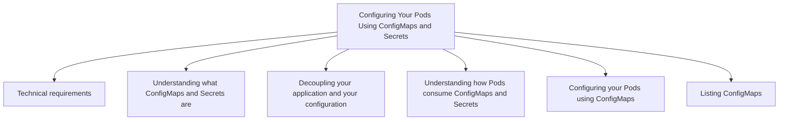

## Chapter 8: Exposing Your Pods with Services

**Questions this chapter answers:**
- What does this chapter explain about Technical requirements?
- What does this chapter explain about Why would you want to expose your Pods??
- What does this chapter explain about Cluster networking in Kubernetes?

**Key points:**
- Source section: Technical requirements.
- Source section: Why would you want to expose your Pods?.
- Source section: Cluster networking in Kubernetes.
- Source section: IP address management in Kubernetes.

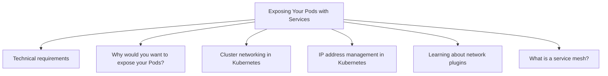

## Chapter 9: Persistent Storage in Kubernetes

**Questions this chapter answers:**
- What does this chapter explain about Technical requirements?
- What does this chapter explain about Why use persistent storage??
- What does this chapter explain about Introducing Volumes?

**Key points:**
- Source section: Technical requirements.
- Source section: Why use persistent storage?.
- Source section: Introducing Volumes.
- Source section: Introducing PersistentVolumes.

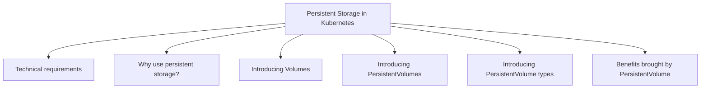

## Chapter 10: Running Production-Grade Kubernetes Workloads

**Questions this chapter answers:**
- What does this chapter explain about Technical requirements?
- What does this chapter explain about Ensuring High Availability and Fault Tolerance on Kubernetes?
- What does this chapter explain about High availability?

**Key points:**
- Source section: Technical requirements.
- Source section: Ensuring High Availability and Fault Tolerance on Kubernetes.
- Source section: High availability.
- Source section: Fault tolerance.

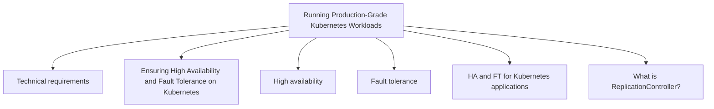

## Chapter 11: Using Kubernetes Deployments for Stateless Workloads

**Questions this chapter answers:**
- What does this chapter explain about Technical requirements?
- What does this chapter explain about Introducing the Deployment object?
- What does this chapter explain about Creating a Deployment object?

**Key points:**
- Source section: Technical requirements.
- Source section: Introducing the Deployment object.
- Source section: Creating a Deployment object.
- Source section: Exposing Deployment Pods using Service objects.

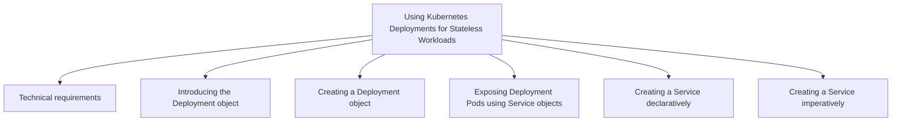

## Chapter 12: StatefulSet – Deploying Stateful Applications

**Questions this chapter answers:**
- What does this chapter explain about Technical requirements?
- What does this chapter explain about Introducing the StatefulSet object?
- What does this chapter explain about Managing state in containers?

**Key points:**
- Source section: Technical requirements.
- Source section: Introducing the StatefulSet object.
- Source section: Managing state in containers.
- Source section: Managing state in Kubernetes Pods.

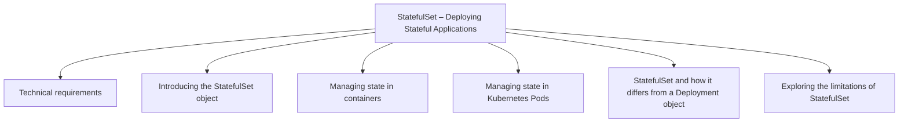

## Chapter 13: DaemonSet – Maintaining Pod Singletons on Nodes

**Questions this chapter answers:**
- What does this chapter explain about Technical requirements?
- What does this chapter explain about Introducing the DaemonSet object?
- What does this chapter explain about How DaemonSet Pods are scheduled?

**Key points:**
- Source section: Technical requirements.
- Source section: Introducing the DaemonSet object.
- Source section: How DaemonSet Pods are scheduled.
- Source section: Checking DaemonSets.

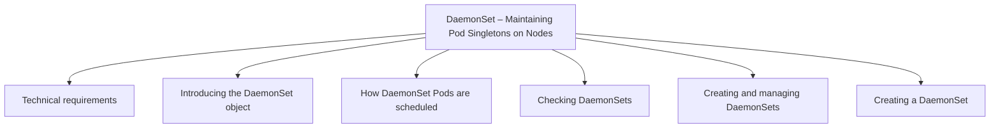

## Chapter 14: Working with Helm Charts and Operators

**Questions this chapter answers:**
- What does this chapter explain about Technical requirements?
- What does this chapter explain about Understanding Helm?
- What does this chapter explain about Releasing software to Kubernetes using Helm?

**Key points:**
- Source section: Technical requirements.
- Source section: Understanding Helm.
- Source section: Releasing software to Kubernetes using Helm.
- Source section: Installing Helm on Linux.

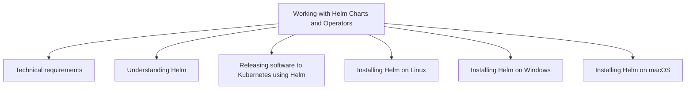

## Chapter 15: Kubernetes Clusters on Google Kubernetes Engine

**Questions this chapter answers:**
- What does this chapter explain about Technical requirements?
- What does this chapter explain about What are Google Cloud Platform and Google Kubernetes Engine??
- What does this chapter explain about Google Cloud Platform?

**Key points:**
- Source section: Technical requirements.
- Source section: What are Google Cloud Platform and Google Kubernetes Engine?.
- Source section: Google Cloud Platform.
- Source section: Google Kubernetes Engine.

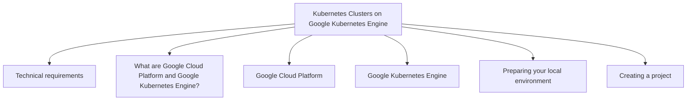

## Chapter 16: Launching a Kubernetes Cluster on Amazon Web Services with Amazon Elastic Kubernetes Service

**Questions this chapter answers:**
- What does this chapter explain about Technical requirements?
- What does this chapter explain about What are Amazon Web Services and Amazon Elastic Kubernetes Service??
- What does this chapter explain about Amazon Web Services?

**Key points:**
- Source section: Technical requirements.
- Source section: What are Amazon Web Services and Amazon Elastic Kubernetes Service?.
- Source section: Amazon Web Services.
- Source section: Amazon Elastic Kubernetes Service.

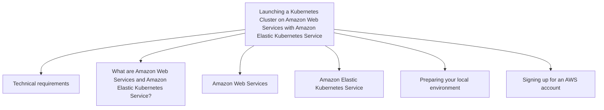

## Chapter 17: Kubernetes Clusters on Microsoft Azure with Azure Kubernetes Service

**Questions this chapter answers:**
- What does this chapter explain about Technical requirements?
- What does this chapter explain about What are Microsoft Azure and Azure Kubernetes Service??
- What does this chapter explain about Microsoft Azure?

**Key points:**
- Source section: Technical requirements.
- Source section: What are Microsoft Azure and Azure Kubernetes Service?.
- Source section: Microsoft Azure.
- Source section: Azure Kubernetes Service.

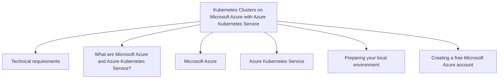

## Chapter 18: Security in Kubernetes

**Questions this chapter answers:**
- What does this chapter explain about Technical Requirements?
- What does this chapter explain about Authentication and Authorization – User Access Control?
- What does this chapter explain about Authentication and User Management?

**Key points:**
- Source section: Technical Requirements.
- Source section: Authentication and Authorization – User Access Control.
- Source section: Authentication and User Management.
- Source section: The authentication workflow in Kubernetes.

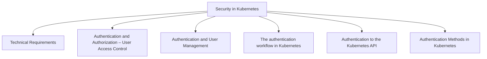

## Chapter 19: Advanced Techniques for Scheduling Pods

**Questions this chapter answers:**
- What does this chapter explain about Technical requirements?
- What does this chapter explain about Refresher – What is kube-scheduler??
- What does this chapter explain about Managing Node affinity?

**Key points:**
- Source section: Technical requirements.
- Source section: Refresher – What is kube-scheduler?.
- Source section: Managing Node affinity.
- Source section: Using nodeName for Pods.

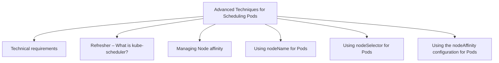

## Chapter 20: Autoscaling Kubernetes Pods and Nodes

**Questions this chapter answers:**
- What does this chapter explain about Technical requirements?
- What does this chapter explain about Pod resource requests and limits?
- What does this chapter explain about Autoscaling Pods vertically using a VerticalPodAutoscaler?

**Key points:**
- Source section: Technical requirements.
- Source section: Pod resource requests and limits.
- Source section: Autoscaling Pods vertically using a VerticalPodAutoscaler.
- Source section: Enabling InPlacePodVerticalScaling.

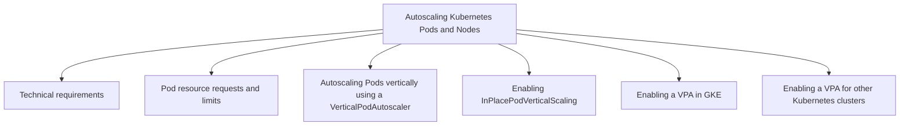

## Chapter 21: Advanced Kubernetes: Traffic Management, Multi-Cluster Strategies, and More

**Questions this chapter answers:**
- What does this chapter explain about Technical Requirements?
- What does this chapter explain about Advanced Traffic Routing with Ingress?
- What does this chapter explain about Refresher – Kubernetes Services?

**Key points:**
- Source section: Technical Requirements.
- Source section: Advanced Traffic Routing with Ingress.
- Source section: Refresher – Kubernetes Services.
- Source section: Overview of the Ingress object.

```mermaid
flowchart TD
    C["Advanced Kubernetes: Traffic Management, Multi-Cluster Strategies, and More"]
    C --> S1["Technical Requirements"]
    C --> S2["Advanced Traffic Routing with Ingress"]
    C --> S3["Refresher – Kubernetes Services"]
    C --> S4["Overview of the Ingress object"]
    C --> S5["Using nginx as an Ingress Controller"]
    C --> S6["Deploying the NGINX Ingress Controller in minikube"]
```
