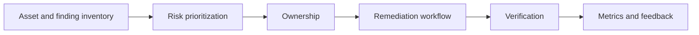

# Vulnerability Management for Platform Engineers

*Weave Intelligence — Report*

## Agent guide

Frames vulnerability management as a platform workflow for turning findings into prioritized, owned, and verifiable remediation work.
### Questions this chapter answers
- How can platform teams reduce vulnerability-management toil?
- How should findings be prioritized and assigned to owners?
- Which platform workflows support remediation and verification?
### Key points
- Raw vulnerability volume is less useful than risk-aware prioritization.
- Clear ownership connects findings to actionable developer work.
- Platform automation can support remediation, verification, and feedback loops.

## Conceptual diagram

## Detailed source transcript

### Page 1
Weave Intelligence
Vulnerability
management for
platform engineers
### Page 2
02   Vulnerability management for platform engineers
Introduction
	Platform engineers face a stark reality. Vulnerability management has become
	an unsustainable burden that consumes engineering time without reducing
	systemic risk. You own the foundation that every application builds upon. When
	that foundation contains vulnerabilities, every downstream service inherits the
	risk, creating cascading liability across your organization.
	The traditional "shift left" approach - pushing security responsibilities onto
	developers - has reached its limits. Developers now spend 19% of their weekly
	hours on security tasks, effectively losing one full workday to security toil.
	Vulnerability management alone costs organizations an average of \$1.9M
	annually, while vulnerability drag - the hidden productivity tax of constant
	remediation - can exceed \$31M per year.
Vulnerability management alone
costs organizations an average of              \$1.9M annually
	The thesis: you must shift security       This whitepaper provides the strategic
	down into the platform itself, building   framework and implementation
	secure-by-design systems that             roadmap for transforming
	automate detection, enforcement, and      vulnerability management from
	remediation without developer             reactive firefighting to invisible,
	intervention.
		automated platform capability. The
			following sections define what
	With 40,000+ new CVEs published in        security platform engineering means,
	2024 (a 38% year-over-year increase)      why it matters for organizational
	and 84% of codebases containing at        velocity and risk, and how to
	least one vulnerability, manual           implement it through concrete
	approaches cannot scale. The time for     practices and cultural alignment.
	platform-embedded security is now.
### Page 3
03   Vulnerability management for platform engineers
	Key takeaways
	Before diving into details, here are the essential insights you should take from
	this whitepaper:
	Vulnerability management is a platform capability, not a
	developer responsibility
	Shifting security down into the platform eliminates toil while
	improving protection
	The CVE doom cycle cannot be solved by working harder
	It requires architectural change that makes secure paths the default paths
	Four core capabilities define secure-by-design platforms
	Automated image hardening, policy-as-code enforcement, pre-approved
	service templates, and continuous secret rotation.
	Platform teams that embed security create a ROI loop
	Reduced friction drives developer adoption, adoption justifies investment,
	investment enables further automation.
	Cultural alignment between platform and security teams
	is non-negotiable
	Shared ownership and security metrics in platform KPIs transform adversarial
	relationships into collaborative partnerships.
	These takeaways frame the strategic shift. The following sections
	provide the definitions, frameworks, and implementation guidance to
	make them actionable.
### Page 4
04   Vulnerability management for platform engineers
What is vulnerability
management for
platform engineers?
	Understanding vulnerability management for platform engineers
	requires distinguishing it from both traditional security operations and the
	"shift left" movement.
	Defining security platform engineering
	Security platform engineering is an        additional task for developers. This
	emerging discipline that sits at the       approach encompasses automated
	intersection of platform engineering       scanning integration in CI/CD
	and security operations. It represents a   pipelines, policy-as-code enforcement
	fundamental shift in how                   at deployment boundaries, hardened
	organizations approach vulnerability       base images and golden paths, and
	management.
		continuous monitoring with
			automated response.
	Security platform engineering is the
	practice of embedding security             The platform team owns the
	controls, policies, and automated          security posture of the foundation.
	remediation directly into the internal     Application teams inherit that security
	developer platform (IDP), making           by default when they build on
	security an invisible property of the      platform-provided primitives.
	infrastructure rather than an
### Page 5
05   Vulnerability management for platform engineers
	Shift left vs. shift down
	The "shift left" movement has               patches - which adds cognitive
	dominated security conversations for       load and context-switching to
	years, but we are increasingly             already-burdened development
	discovering its limitations.               teams. Shift down removes that
	Understanding the distinction              burden entirely by making the
	between shifting left and shifting         platform responsible for security;
	down is essential for effective            developers use secure primitives
	vulnerability management.
	(hardened images, pre-approved
		templates, automated secret rotation)
		Shift left asks developers to catch        without needing to understand the
		vulnerabilities earlier in the             underlying security mechanisms.
		development cycle - running scans,
		reviewing findings, applying
		The practical difference: shift left means developers run
		security tools; shift down means the platform runs
		security tools and developers never see the findings unless
		action is required.
		This is not merely a semantic distinction. It represents a change in domain
		ownership where security becomes part of how the platform works, not
		something teams must remember to do.
### Page 6
06   Vulnerability management for platform engineers
Scope and assumptions
	Security platform engineering is not a universal solution - it requires specific
	organizational conditions and infrastructure maturity. This section establishes
	the boundaries and assumptions that shape implementation. This whitepaper
	assumes you have:
	Established CI/CD pipelines with automated build and deployment processes
	Container-based workloads (Kubernetes or similar orchestration)
	An internal developer platform or the intent to build one
	At least one dedicated platform engineer or team
	Organizations at earlier maturity          application-level security testing
	stages should focus first on pipeline      (penetration testing, threat
	automation and container adoption          modeling) or security operations
	before attempting comprehensive            center (SOC) functions. Platform
	security platform engineering.
	teams own the security of shared
		infrastructure and golden paths;
		The scope covers vulnerability             application teams retain responsibility
		management for container images,           for business logic vulnerabilities and
		dependencies, and infrastructure           data handling practices.
		configurations. It does not cover
		This approach works best when platform adoption is
		voluntary or incentive-driven. Mandated platforms with poor
		developer experience will not benefit from embedded security
		as an adoption lever.
		Mandy Hubbard
		Chainguard
### Page 7
07   Vulnerability management for platform engineers
Why vulnerability
management for platform
engineers matters
	The strategic importance of platform-embedded vulnerability management
	becomes clear when examining both the costs of the current state and the
	organizational friction it creates. This section makes the business case through
	concrete scenarios and quantified impact.
	The CVE doom cycle
	Most platform engineers recognize this scenario immediately - it plays out daily
	in organizations without platform-embedded security.
		PHASE 1                PHASE 2                     PHASE 3             PHASE 4
		Developer pulls      Security scans the        Output: Hundreds of    Engineering teams
		Daily
			an image from a      image for CVEs.           CVEs, many of which    waste hours triaging
		doom        public repository.                             are false positives.   and patching.
			REPEAT
	A developer pulls a Python base image from a public registry to build a new
	service. The security scanner flags 287 vulnerabilities, including 52 rated high
	or critical severity. The developer spends four hours triaging findings,
	determining which vulnerabilities are exploitable in their context, documenting
	exceptions for false positives, and applying patches where possible.
### Page 8
08   Vulnerability management for platform engineers
	The next day, a new CVE is published      organization hemorrhages
	affecting the same base image. The        engineering capacity to repetitive,
	cycle repeats, and the developer loses    low-value security toil. This is not a
	another half-day to remediation           failure of individual diligence , it’s a
	instead of feature development.
	systemic problem that requires
		system wide solutions.
		Multiply this across dozens of services
		and hundreds of developers, and your
		Quantified organizational impact
		Beyond individual developer frustration, poor vulnerability management
		creates measurable organizational costs that compound over time.
		Vulnerability management alone costs organizations an average of \$1.9M
		annually in direct remediation effort, tooling, and compliance documentation.
Vulnerability drag, the hidden productivity tax of
	\$31M
	per year
constant context-switching, delayed releases, and
accumulated security debt, costs organizations up to
	The average data breach costs \$4.88M. High-profile vulnerabilities like
	Log4Shell resulted in 7,386 unique incidents in Q4 2023 alone, averaging
	\$90,000 per exposure.
	At the same time, fewer than 30% of platform teams report successful
	voluntary adoption, and security friction is a major driver of developer
	resistance. When security is embedded effectively, platform teams can create
	an ROI flywheel: reduced friction boosts adoption, adoption justifies continued
	investment, and that investment enables further automation.
### Page 9
09   Vulnerability management for platform engineers
Decision criteria
and trade-offs
	Implementing security platform engineering requires deliberate choices about
	tooling, automation scope, and organizational change. This section provides
	the decision framework for evaluating options and understanding trade-offs.
	Evaluation framework
	Not all security automation delivers     impact, evaluating whether it reduces
	equal value, so teams need clear         cognitive load or introduces new gates
	criteria to decide where to invest       and approvals; feedback loop quality,
	limited resources and engineering        considering whether insights appear
	capacity. Key evaluation dimensions      where developers already work, such
	include integration depth, meaning       as pull requests or dashboards, rather
	whether the capability embeds into       than in isolated reporting silos; and
	existing CI/CD pipelines and IDP         compliance evidence generation,
	workflows or requires separate tools     measuring whether audit artifacts are
	and context switching; automation        produced automatically or require
	completeness, assessing whether it       manual documentation. Evaluating
	goes beyond detection to include         investments against these criteria
	automated remediation and policy         helps identify capabilities that deliver
	enforcement; developer experience        the highest platform ROI.
	Trade-offs analysis
	Every implementation choice
	Automation involves a balance
		involves trade-offs. Understanding       between scope and implementation
		them helps teams make informed           complexity. Comprehensive
		decisions instead of reacting after      automation such as image rebuilding,
		problems occur.                          policy enforcement, and secret
### Page 10
10   Vulnerability management for platform engineers
	rotation can deliver strong long-term value, but it requires a higher upfront
	investment. A practical approach is to start with high-impact, low-complexity
	capabilities and expand incrementally.
	At the same time, security strictness must also be balanced with
	developer friction.
	Blocking all images that contain any CVE maximizes
	security, but it can create massive deployment bottlenecks.
	Risk-based thresholds that block critical and high issues
	while warning on medium ones often provide a better
	balance between protection and delivery speed.
	Another consideration is centralized        and cost savings, but they take effort
	control versus team autonomy.               to integrate and maintain. Commercial
	Platform-enforced policies improve          platforms can be quicker to adopt, but
	consistency, but they may not cover         they increase vendor dependency.
	legitimate edge cases. Instead of
	absolute blocks, provide controlled         The right position on each trade-off
	escape hatches with clear audit trails.
	depends on organizational maturity,
		risk tolerance, and platform team
		Finally, the build-versus-buy decision      capacity. There is no universal
		matters. Open-source tools such as          right answer.
		Trivy, Grype, and Syft offer flexibility
### Page 11
11   Vulnerability management for platform engineers
How to apply
vulnerability management
for platform engineers
	It is crucial to understand a practical maturity journey for security platform
	engineering. This is a battle tested seven-step roadmap that sequences
	capabilities from baseline assessment to continuous trust and compliance
	automation. Alongside a playbook of highest-impact practices, focusing on
	hardened base images, policy-as-code, automated SBOMs, developer-native
	insights, and measurable security outcomes.
	Seven-step implementation roadmap
	Implementing security platform engineering is a maturity journey, not a single
	initiative. This roadmap sequences capabilities for incremental adoption with
	clear ownership boundaries.
	STEP                                              Map current risk and workflow - audit delivery flow from
01
	commit to runtime, identify friction points, generate SBOMs
	Baseline                      with Syft or Grype, classify risk ownership. Owner: Platform
		team. Cadence: One-time assessment, quarterly refresh.
	STEP                                              Build policy-as-code enforcement - adopt OPA,
02
	Kyverno, or Conftest; define baselines (no unscanned images,
	Guardrails
		block CVEs ≥7); integrate into CI/CD. Owner: Platform team
		with security input. Cadence: Policies reviewed monthly.
		S ecure the foundation - centralize image management
	STEP
03
	in registries with automatic rescanning; harden and
	S upply chain                 sign base images; automate rebuilds on upstream CVE
		disclosure. Owner: Platform team. Cadence:
		Continuous automation.
### Page 12
12   Vulnerability management for platform engineers
	STEP                                              Embed in developer workflows - add secure templates
04
	(Terraform, Helm) enforcing best practices; bake in scanning
	IDP integration               hooks; surface insights in dashboards and PR comments.
		Owner: Platform team. Cadence: Template updates quarterly.
	STEP                                              Automate credential management - integrate Vault, AWS
05
	Secrets Manager, or Doppler; enforce short-lived tokens; add
	Secrets                       secret scanning to pipelines. Owner: Platform team with
		security review. Cadence: Rotation policies continuous.
	STEP                                              Embed shared ownership - position platform as enabler not
06
	enforcer; partner with security to codify ownership; add
	Culture                       security metrics to platform KPIs. Owner: Platform and
		security teams jointly. Cadence: Quarterly alignment reviews.
		Iterate toward compliance invisibility - track reduction in
	STEP                                              manual approvals and CVE resolution time; automate
07                   Continuous trust              compliance evidence generation; evolve toward audits
	generated from pipeline data. Owner: Platform team.
	Cadence: Continuous
### Page 13
13   Vulnerability management for platform engineers
	Success metrics and start now plan
	Measuring progress and taking immediate action transforms strategy into
	results. These metrics and steps provide the accountability framework.
	Success metrics (track direction over time)
	Mean time to patch: Target decreasing trend as automation handles
	routine remediation
	Percentage of vulnerabilities auto-remediated: Target increasing toward
	80%+ for routine CVEs
	CVE backlog trend: Target decreasing as platform capabilities mature
	Developer time on security tasks: Target decreasing from 19% baseline
	Platform adoption rate: Target increasing as security friction decreases
	Compliance evidence generation time: Target decreasing toward
	near-zero manual effort
### Page 14
14   Vulnerability management for platform engineers
	Start now: Seven steps to begin
01                   First step (this week): Generate SBOMs for your three highest-traffic
	services using Syft or Grype - establish baseline visibility into your current
	dependency landscape
02                   Audit your current delivery flow and identify the three highest-friction
	security touchpoints.
03                   Deploy one policy-as-code rule in warning mode (e.g., flag images with
	critical CVEs without blocking).
04                   Configure your CI/CD pipeline to surface scan findings in PR comments
	for one team.
05                   Schedule a joint session with your security team to define shared
	ownership boundaries.
06                   Establish baseline measurements for the six success metrics above.
07                   Identify one base image used across multiple services and create a
	hardened, signed alternative.
	With these practical starting points, you can begin practising the incredible
	value generating discipline of security platform engineering.
### Page 15
15   Vulnerability management for platform engineers
Conclusion
	Vulnerability management is no longer    enforcement. Automated SBOMs turn
	a problem that can be solved with        uncertainty into fast answers.
	more alerts, more dashboards, or more    Developer-native feedback loops
	developer effort. The scale and          close issues without friction.
	velocity of modern software delivery     Measurable security outcomes
	demand a structural response, and        transform security from a cost center
	that response sits squarely with         into a visible platform capability.
	platform teams. By shifting security
	down into the platform, organizations    Most importantly, embedded security
	replace reactive firefighting with       changes organizational dynamics.
	systems that make secure behavior        Platform teams move from
	the default, not an exception.
	gatekeepers to enablers. Security
		teams move from blockers to
		This whitepaper has shown that           partners. Developers regain focus on
		security platform engineering is not     delivering customer value while
		about perfection or zero                 inheriting stronger protection by
		vulnerabilities. It is about leverage.   default.
		Hardened base images eliminate
		entire classes of risk at once.
	The journey outlined here is
		Policy-as-code replaces inconsistent     incremental and pragmatic. You do
		human judgment with predictable          not need to solve everything at once.
		Start where the leverage is highest, automate relentlessly,
		and measure what matters.
		In a world of accelerating CVEs and constrained engineering capacity, the
		winning organizations will not work harder at vulnerability management. They
		will design it into the platform and make it disappear.
## Code map
- No matching code repository has been identified for this book.
## Source note
This is the complete generated chapter transcript. Source identity and status are recorded in the database properties.
