# Big Data on Kubernetes

*Neylson Crepalde, Thariq Mahmood — Book*
## Chapter 1: The Modern Data Stack

**Questions this chapter answers:**
- What does this chapter explain about Chapter 4: The Modern Data Stack?
- What does this chapter explain about Data architectures?
- What does this chapter explain about The Lambda architecture?

**Key points:**
- Source section: Chapter 4: The Modern Data Stack.
- Source section: Data architectures.
- Source section: The Lambda architecture.
- Source section: The Kappa architecture.

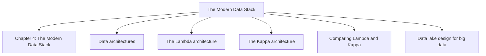

## Chapter 2: Big Data Processing with Apache Spark

**Questions this chapter answers:**
- What does this chapter explain about Chapter 5: Big Data Processing with Apache Spark?
- What does this chapter explain about Technical requirements?
- What does this chapter explain about Getting started with Spark?

**Key points:**
- Source section: Chapter 5: Big Data Processing with Apache Spark.
- Source section: Technical requirements.
- Source section: Getting started with Spark.
- Source section: Installing Spark locally.

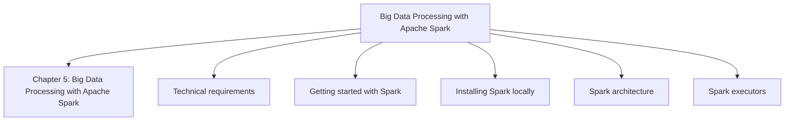

## Chapter 3: Building Pipelines with Apache Airflow

**Questions this chapter answers:**
- What does this chapter explain about Chapter 6: Building Pipelines with Apache Airflow?
- What does this chapter explain about Technical requirements?
- What does this chapter explain about Getting started with Airflow?

**Key points:**
- Source section: Chapter 6: Building Pipelines with Apache Airflow.
- Source section: Technical requirements.
- Source section: Getting started with Airflow.
- Source section: Installing Airflow with Astro.

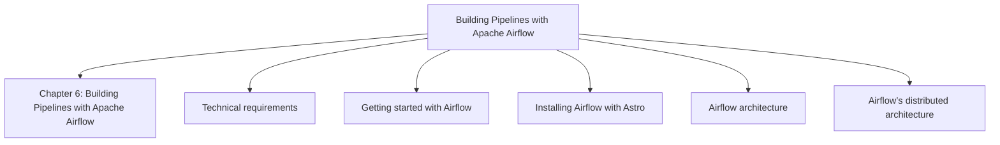

## Chapter 4: Apache Kafka for Real-Time Events and Data Ingestion

**Questions this chapter answers:**
- What does this chapter explain about Chapter 7: Apache Kafka for Real-Time Events and Data Ingestion?
- What does this chapter explain about Technical requirements?
- What does this chapter explain about Getting started with Kafka?

**Key points:**
- Source section: Chapter 7: Apache Kafka for Real-Time Events and Data Ingestion.
- Source section: Technical requirements.
- Source section: Getting started with Kafka.
- Source section: Exploring the Kafka architecture.

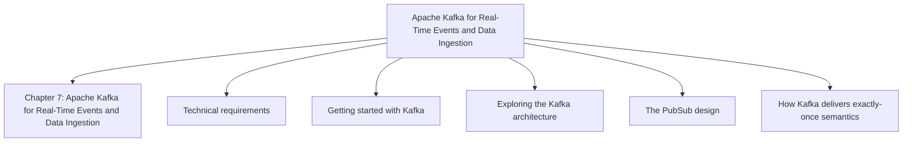

## Chapter 5: Deploying the Big Data Stack on Kubernetes

**Questions this chapter answers:**
- What does this chapter explain about Chapter 8: Deploying the Big Data Stack on Kubernetes?
- What does this chapter explain about Technical requirements?
- What does this chapter explain about Deploying Spark on Kubernetes?

**Key points:**
- Source section: Chapter 8: Deploying the Big Data Stack on Kubernetes.
- Source section: Technical requirements.
- Source section: Deploying Spark on Kubernetes.
- Source section: Deploying Airflow on Kubernetes.

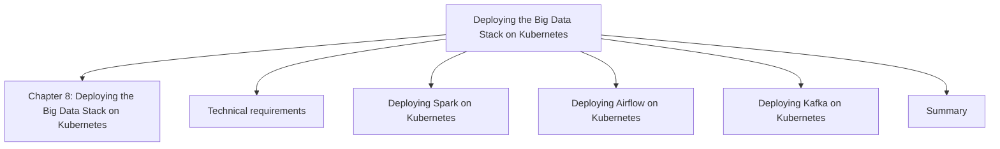

## Chapter 6: Data Consumption Layer

**Questions this chapter answers:**
- What does this chapter explain about Chapter 9: Data Consumption Layer?
- What does this chapter explain about Technical requirements?
- What does this chapter explain about Getting started with SQL query engines?

**Key points:**
- Source section: Chapter 9: Data Consumption Layer.
- Source section: Technical requirements.
- Source section: Getting started with SQL query engines.
- Source section: The limitations of traditional data warehouses.

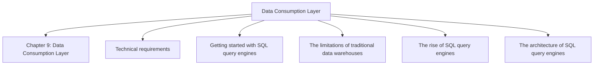

## Chapter 7: Building a Big Data Pipeline on Kubernetes

**Questions this chapter answers:**
- What does this chapter explain about Chapter 10: Building a Big Data Pipeline on Kubernetes?
- What does this chapter explain about Technical requirements?
- What does this chapter explain about Checking the deployed tools?

**Key points:**
- Source section: Chapter 10: Building a Big Data Pipeline on Kubernetes.
- Source section: Technical requirements.
- Source section: Checking the deployed tools.
- Source section: Building a batch pipeline.

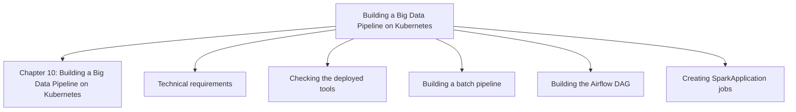

## Chapter 8: Generative AI on Kubernetes

**Questions this chapter answers:**
- What does this chapter explain about Chapter 11: Generative AI on Kubernetes?
- What does this chapter explain about Technical requirements?
- What does this chapter explain about What generative AI is and what it is not?

**Key points:**
- Source section: Chapter 11: Generative AI on Kubernetes.
- Source section: Technical requirements.
- Source section: What generative AI is and what it is not.
- Source section: The power of large neural networks.

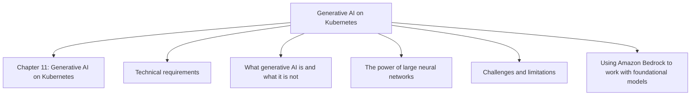

## Chapter 9: Where to Go from Here

**Questions this chapter answers:**
- What does this chapter explain about Chapter 12: Where to Go from Here?
- What does this chapter explain about Important topics for big data in Kubernetes?
- What does this chapter explain about Kubernetes monitoring and application monitoring?

**Key points:**
- Source section: Chapter 12: Where to Go from Here.
- Source section: Important topics for big data in Kubernetes.
- Source section: Kubernetes monitoring and application monitoring.
- Source section: Building a service mesh.

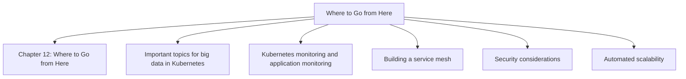

## Chapter 10: Getting Started with Containers

**Questions this chapter answers:**
- What does this chapter explain about Chapter 1: Getting Started with Containers?
- What does this chapter explain about Technical requirements?
- What does this chapter explain about Container architecture?

**Key points:**
- Source section: Chapter 1: Getting Started with Containers.
- Source section: Technical requirements.
- Source section: Container architecture.
- Source section: Installing Docker.

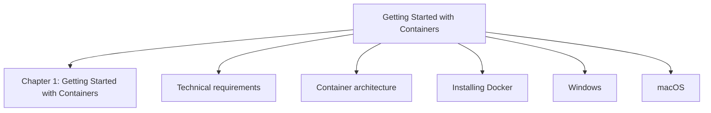

## Chapter 11: Kubernetes Architecture

**Questions this chapter answers:**
- What does this chapter explain about Chapter 2: Kubernetes Architecture?
- What does this chapter explain about Technical requirements?
- What does this chapter explain about Control plane?

**Key points:**
- Source section: Chapter 2: Kubernetes Architecture.
- Source section: Technical requirements.
- Source section: Control plane.
- Source section: Node components.

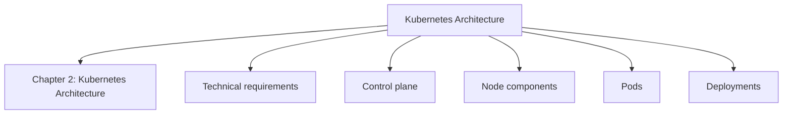

## Chapter 12: Getting Hands-On with Kubernetes

**Questions this chapter answers:**
- What does this chapter explain about Chapter 3: Getting Hands-On with Kubernetes?
- What does this chapter explain about Technical requirements?
- What does this chapter explain about Installing kubectl?

**Key points:**
- Source section: Chapter 3: Getting Hands-On with Kubernetes.
- Source section: Technical requirements.
- Source section: Installing kubectl.
- Source section: Deploying a local cluster using Kind.

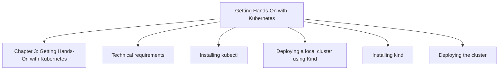
