# Application Lifecycle Management on Microsoft Power Platform

*Benedikt Bergmann — Book*

## Chapter 1: An Intro to ALM

**Questions this chapter answers:**
- What does this chapter explain about Chapter 1: An Intro to ALM?
- What does this chapter explain about ALM overview?
- What does this chapter explain about Stages of the ALM cycle?

**Key points:**
- Source section: Chapter 1: An Intro to ALM.
- Source section: ALM overview.
- Source section: Stages of the ALM cycle.
- Source section: Plan.

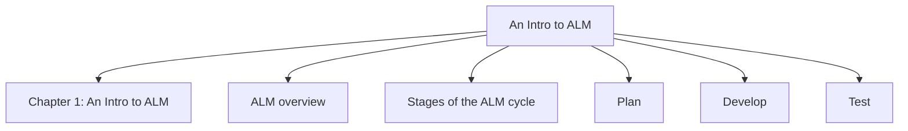

## Chapter 2: ALM in Power Platform

**Questions this chapter answers:**
- What does this chapter explain about Chapter 2: ALM in Power Platform?
- What does this chapter explain about Terminology?
- What does this chapter explain about Tenant?

**Key points:**
- Source section: Chapter 2: ALM in Power Platform.
- Source section: Terminology.
- Source section: Tenant.
- Source section: Environment.

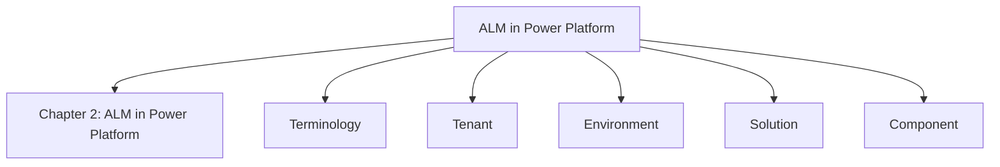

## Chapter 3: Power Platform Environments

**Questions this chapter answers:**
- What does this chapter explain about Chapter 3: Power Platform Environments?
- What does this chapter explain about Environment basics?
- What does this chapter explain about Environment types?

**Key points:**
- Source section: Chapter 3: Power Platform Environments.
- Source section: Environment basics.
- Source section: Environment types.
- Source section: Default.

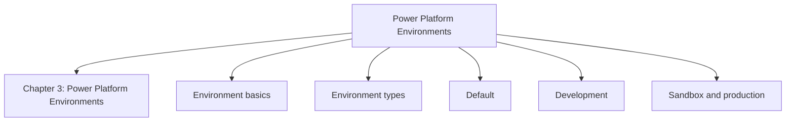

## Chapter 4: Dataverse Solutions

**Questions this chapter answers:**
- What does this chapter explain about Chapter 4: Dataverse Solutions?
- What does this chapter explain about Basics of Dataverse Solutions?
- What does this chapter explain about Customization versus data?

**Key points:**
- Source section: Chapter 4: Dataverse Solutions.
- Source section: Basics of Dataverse Solutions.
- Source section: Customization versus data.
- Source section: Managed versus unmanaged.

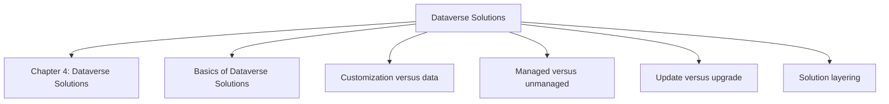

## Chapter 5: Power Platform CLI

**Questions this chapter answers:**
- What does this chapter explain about Chapter 5: Power Platform CLI?
- What does this chapter explain about Technical requirements?
- What does this chapter explain about About the Power Platform CLI?

**Key points:**
- Source section: Chapter 5: Power Platform CLI.
- Source section: Technical requirements.
- Source section: About the Power Platform CLI.
- Source section: Command Groups.

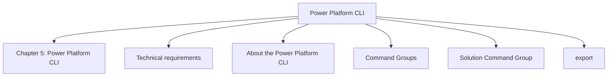

## Chapter 6: Environment Variables, Connection References, and Data

**Questions this chapter answers:**
- What does this chapter explain about Chapter 6: Environment Variables, Connection References, and Data?
- What does this chapter explain about Environment variables?
- What does this chapter explain about Data types?

**Key points:**
- Source section: Chapter 6: Environment Variables, Connection References, and Data.
- Source section: Environment variables.
- Source section: Data types.
- Source section: Creating an environment variable.

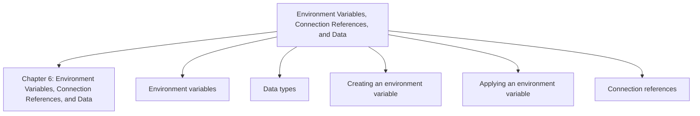

## Chapter 7: Approaches to Managing Changes in Power Platform ALM

**Questions this chapter answers:**
- What does this chapter explain about Chapter 7: Approaches to Managing Changes in Power Platform ALM?
- What does this chapter explain about Environment-centric approach?
- What does this chapter explain about Advantages and disadvantages?

**Key points:**
- Source section: Chapter 7: Approaches to Managing Changes in Power Platform ALM.
- Source section: Environment-centric approach.
- Source section: Advantages and disadvantages.
- Source section: Source code-centric approach.

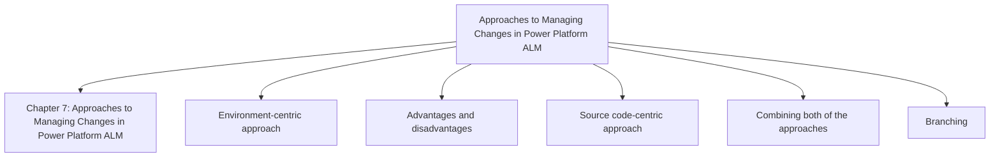

## Chapter 8: Essential ALM Tooling for Power Platform

**Questions this chapter answers:**
- What does this chapter explain about Chapter 8: Essential ALM Tooling for Power Platform?
- What does this chapter explain about Pipelines in Power Platform?
- What does this chapter explain about ALM Accelerator?

**Key points:**
- Source section: Chapter 8: Essential ALM Tooling for Power Platform.
- Source section: Pipelines in Power Platform.
- Source section: ALM Accelerator.
- Source section: Azure DevOps/GitHub.

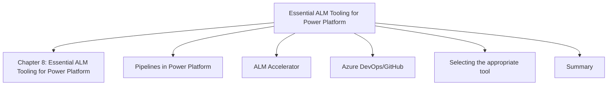

## Chapter 9: Project Setup

**Questions this chapter answers:**
- What does this chapter explain about Chapter 9: Project Setup?
- What does this chapter explain about Service principal?
- What does this chapter explain about Add SPN to Dataverse?

**Key points:**
- Source section: Chapter 9: Project Setup.
- Source section: Service principal.
- Source section: Add SPN to Dataverse.
- Source section: Setting up Azure DevOps.

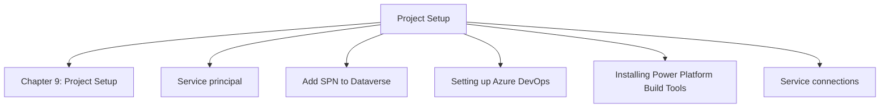

## Chapter 10: Pipelines

**Questions this chapter answers:**
- What does this chapter explain about Chapter 10: Pipelines?
- What does this chapter explain about Technical requirements?
- What does this chapter explain about What is YAML?

**Key points:**
- Source section: Chapter 10: Pipelines.
- Source section: Technical requirements.
- Source section: What is YAML.
- Source section: Source code-centric approach.

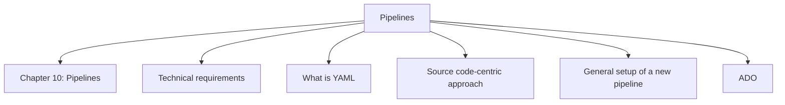

## Chapter 11: Advanced Techniques

**Questions this chapter answers:**
- What does this chapter explain about Chapter 11: Advanced Techniques?
- What does this chapter explain about Technical requirements?
- What does this chapter explain about Exploring advanced YAML?

**Key points:**
- Source section: Chapter 11: Advanced Techniques.
- Source section: Technical requirements.
- Source section: Exploring advanced YAML.
- Source section: Variables and parameters.

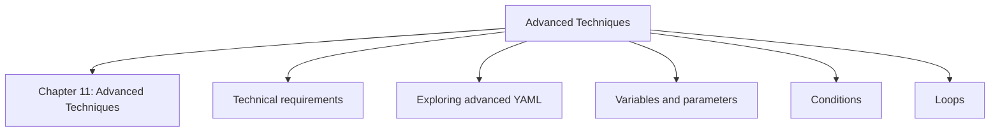

## Chapter 12: Continuous Integration/Continuous Delivery

**Questions this chapter answers:**
- What does this chapter explain about Chapter 12: Continuous Integration/Continuous Delivery?
- What does this chapter explain about Branching?
- What does this chapter explain about Types of branches?

**Key points:**
- Source section: Chapter 12: Continuous Integration/Continuous Delivery.
- Source section: Branching.
- Source section: Types of branches.
- Source section: Quality gates.

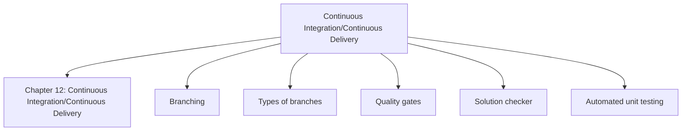

## Chapter 13: Deepening ALM Knowledge

**Questions this chapter answers:**
- What does this chapter explain about Chapter 13: Deepening ALM Knowledge?
- What does this chapter explain about Testing?
- What does this chapter explain about Unit tests?

**Key points:**
- Source section: Chapter 13: Deepening ALM Knowledge.
- Source section: Testing.
- Source section: Unit tests.
- Source section: Integration tests.

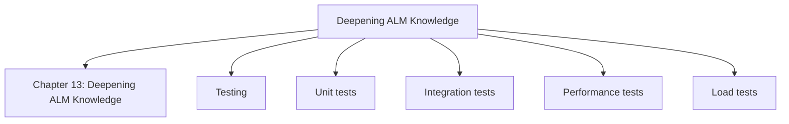
