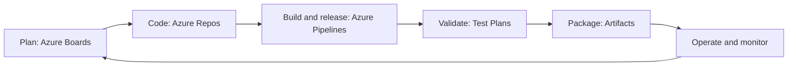
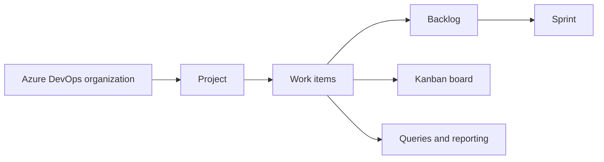

# Azure DevOps Explained

*Not recorded — Book*

## Chapter 1: Azure DevOps Overview

**Questions this chapter answers:**
- Which principles define a DevOps operating model?
- How do Azure DevOps services support the application lifecycle?
- Where do planning, source control, pipelines, testing, and artifacts connect?
- How is the chapter's starter scenario organized?

**Key points:**
- DevOps combines customer focus, product thinking, end-to-end ownership, autonomous teams, learning, and automation.
- Azure Boards, Repos, Pipelines, Test Plans, and Artifacts cover complementary lifecycle responsibilities.
- Continuous feedback and infrastructure as code connect delivery work to operational learning.
- Tool adoption is useful only when paired with the organizational principles described in the chapter.

## Chapter 2: Managing Projects with Azure DevOps Boards

**Questions this chapter answers:**
- How are Azure DevOps organizations and projects created?
- How do work items, backlogs, boards, and sprints relate?
- What role do process templates play?
- How can queries expose project state?

**Key points:**
- The organization and project establish the administrative boundary for delivery work.
- Process templates define work-item types and workflow behavior.
- Backlogs prioritize work, boards visualize flow, and sprints organize time-boxed execution.
- Queries provide reusable views over work-item state and relationships.

