# CI/CD Design Patterns

*Garima Bajpai, Michel Schildmeijer, Muktesh Mishra, Pawel Piwosz — Book*

## Chapter 1: Foundations of CI/CD Design Patterns

**Questions this chapter answers:**
- What does this chapter explain about Chapter 1: Foundations of CI/CD Design Patterns?
- What does this chapter explain about An overview of design patterns?
- What does this chapter explain about Types of design patterns?

**Key points:**
- Source section: Chapter 1: Foundations of CI/CD Design Patterns.
- Source section: An overview of design patterns.
- Source section: Types of design patterns.
- Source section: Where design patterns meet CI/CD.

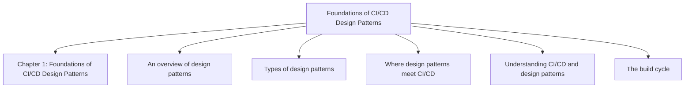

## Chapter 2: Understanding Types of CI/CD Design Patterns and Their Components

**Questions this chapter answers:**
- What does this chapter explain about Chapter 2: Understanding Types of CI/CD Design Patterns and Their Components?
- What does this chapter explain about Common CI/CD design patterns?
- What does this chapter explain about The build and deploy model?

**Key points:**
- Source section: Chapter 2: Understanding Types of CI/CD Design Patterns and Their Components.
- Source section: Common CI/CD design patterns.
- Source section: The build and deploy model.
- Source section: Key component – Pipeline as Code.

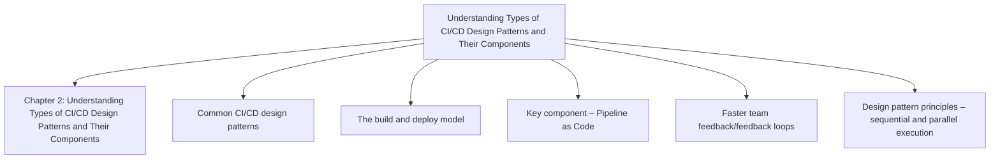

## Chapter 3: Advancing on CI/CD Design Patterns – from Testing to Deployment

**Questions this chapter answers:**
- What does this chapter explain about Chapter 3: Advancing on CI/CD Design Patterns – from Testing to Deployment?
- What does this chapter explain about Design pattern components – test automation?
- What does this chapter explain about Design pattern components – artifacts?

**Key points:**
- Source section: Chapter 3: Advancing on CI/CD Design Patterns – from Testing to Deployment.
- Source section: Design pattern components – test automation.
- Source section: Design pattern components – artifacts.
- Source section: Using artifacts.

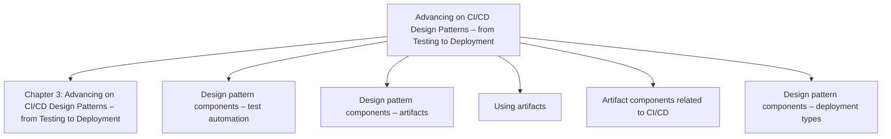

## Chapter 4: Business Outcome Alignment with CI/CD Design Patterns

**Questions this chapter answers:**
- What does this chapter explain about Chapter 4: Business Outcome Alignment with CI/CD Design Patterns?
- What does this chapter explain about CI/CD design patterns – strategic intent?
- What does this chapter explain about State of play – CI/CD design patterns?

**Key points:**
- Source section: Chapter 4: Business Outcome Alignment with CI/CD Design Patterns.
- Source section: CI/CD design patterns – strategic intent.
- Source section: State of play – CI/CD design patterns.
- Source section: A decade of action using CI/CD design patterns.

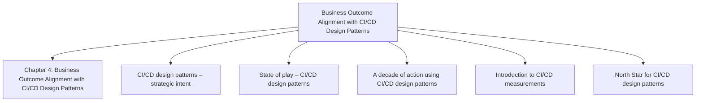

## Chapter 5: Exploring Structural CI/CD Design Patterns

**Questions this chapter answers:**
- What does this chapter explain about Chapter 5: Exploring Structural CI/CD Design Patterns?
- What does this chapter explain about Introducing structural design patterns?
- What does this chapter explain about CI/CD design pattern principles – monorepo and polyrepo scalability?

**Key points:**
- Source section: Chapter 5: Exploring Structural CI/CD Design Patterns.
- Source section: Introducing structural design patterns.
- Source section: CI/CD design pattern principles – monorepo and polyrepo scalability.
- Source section: Design examples for the monorepo and polyrepo approaches.

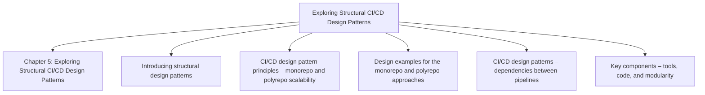

## Chapter 6: Deployment Strategies for Structural Design Patterns for CI/CD

**Questions this chapter answers:**
- What does this chapter explain about Chapter 6: Deployment Strategies for Structural Design Patterns for CI/CD?
- What does this chapter explain about Structural CI/CD Patterns – deployment strategies?
- What does this chapter explain about Types of deployment strategies?

**Key points:**
- Source section: Chapter 6: Deployment Strategies for Structural Design Patterns for CI/CD.
- Source section: Structural CI/CD Patterns – deployment strategies.
- Source section: Types of deployment strategies.
- Source section: Blue-green deployments.

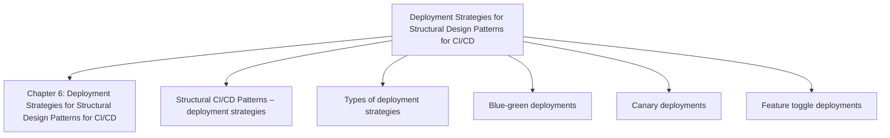

## Chapter 7: Understanding Behavioral Design Patterns for CI/CD

**Questions this chapter answers:**
- What does this chapter explain about Chapter 7: Understanding Behavioral Design Patterns for CI/CD?
- What does this chapter explain about An overview of behavioral CI/CD design patterns?
- What does this chapter explain about Behavioral CI/CD design pattern principles?

**Key points:**
- Source section: Chapter 7: Understanding Behavioral Design Patterns for CI/CD.
- Source section: An overview of behavioral CI/CD design patterns.
- Source section: Behavioral CI/CD design pattern principles.
- Source section: Key components – tools and processes for AI-based observability.

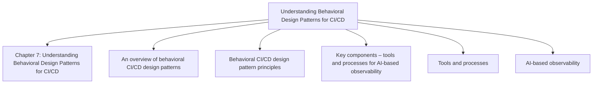

## Chapter 8: Domain-Driven Design Patterns for Regulated Sectors

**Questions this chapter answers:**
- What does this chapter explain about Chapter 8: Domain-Driven Design Patterns for Regulated Sectors?
- What does this chapter explain about An overview of a domain-driven CI/CD design pattern?
- What does this chapter explain about Domain-driven CI/CD design pattern principles – implementing regulation actions?

**Key points:**
- Source section: Chapter 8: Domain-Driven Design Patterns for Regulated Sectors.
- Source section: An overview of a domain-driven CI/CD design pattern.
- Source section: Domain-driven CI/CD design pattern principles – implementing regulation actions.
- Source section: Key components – managing access control.

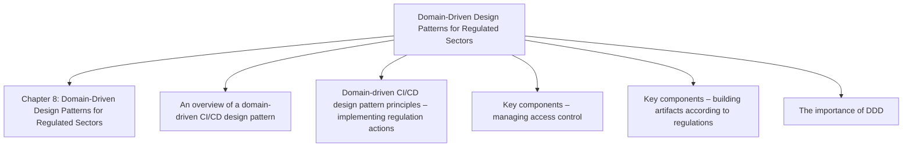

## Chapter 9: Applying Creational CI/CD Design Patterns

**Questions this chapter answers:**
- What does this chapter explain about Chapter 9: Applying Creational CI/CD Design Patterns?
- What does this chapter explain about Creational design patterns – the concept?
- What does this chapter explain about Creational CI/CD design pattern principles – scalability and resilience?

**Key points:**
- Source section: Chapter 9: Applying Creational CI/CD Design Patterns.
- Source section: Creational design patterns – the concept.
- Source section: Creational CI/CD design pattern principles – scalability and resilience.
- Source section: Singleton pattern.

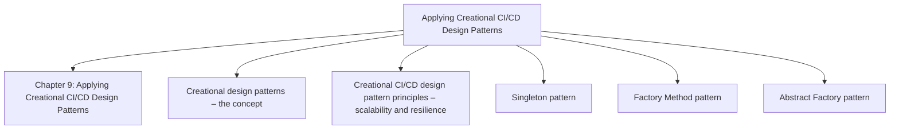

## Chapter 10: Understanding Deployment Strategies – Creational CI/CD with Cloud Providers

**Questions this chapter answers:**
- What does this chapter explain about Chapter 10: Understanding Deployment Strategies – Creational CI/CD with Cloud Providers?
- What does this chapter explain about Creational design pattern used in CI/CD?
- What does this chapter explain about Landing zones?

**Key points:**
- Source section: Chapter 10: Understanding Deployment Strategies – Creational CI/CD with Cloud Providers.
- Source section: Creational design pattern used in CI/CD.
- Source section: Landing zones.
- Source section: Code repositories as a singleton.

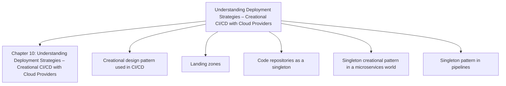

## Chapter 11: Auditing and Assessment of Design Patterns

**Questions this chapter answers:**
- What does this chapter explain about Chapter 11: Auditing and Assessment of Design Patterns?
- What does this chapter explain about Overview – taxonomy of assessment and audits?
- What does this chapter explain about Conducting a comprehensive assessment of CI/CD design patterns?

**Key points:**
- Source section: Chapter 11: Auditing and Assessment of Design Patterns.
- Source section: Overview – taxonomy of assessment and audits.
- Source section: Conducting a comprehensive assessment of CI/CD design patterns.
- Source section: Tools and techniques for comprehensive assessments.

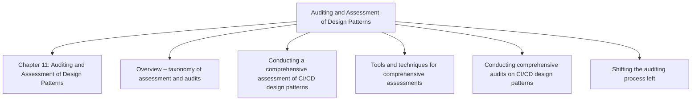

## Chapter 12: Advanced CI/CD Design Patterns and Use Cases

**Questions this chapter answers:**
- What does this chapter explain about Chapter 12: Advanced CI/CD Design Patterns and Use Cases?
- What does this chapter explain about Self-learning CI/CD design practices?
- What does this chapter explain about Understanding real-time utility-based CI/CD design patterns?

**Key points:**
- Source section: Chapter 12: Advanced CI/CD Design Patterns and Use Cases.
- Source section: Self-learning CI/CD design practices.
- Source section: Understanding real-time utility-based CI/CD design patterns.
- Source section: The challenges of implementing real-time utility-based CI/CD systems.

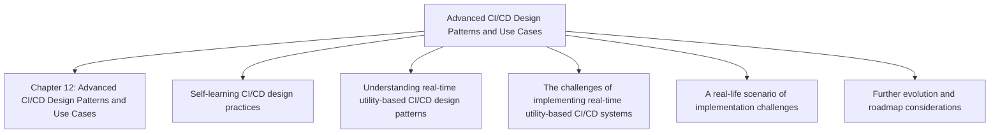

## Chapter 13: Exploring Anti-Patterns for CI/CD Design Pattern Deployments

**Questions this chapter answers:**
- What does this chapter explain about Chapter 13: Exploring Anti-Patterns for CI/CD Design Pattern Deployments?
- What does this chapter explain about Anti-patterns for CI/CD design patterns?
- What does this chapter explain about What is an anti-pattern??

**Key points:**
- Source section: Chapter 13: Exploring Anti-Patterns for CI/CD Design Pattern Deployments.
- Source section: Anti-patterns for CI/CD design patterns.
- Source section: What is an anti-pattern?.
- Source section: Best fit design patterns – considerations.

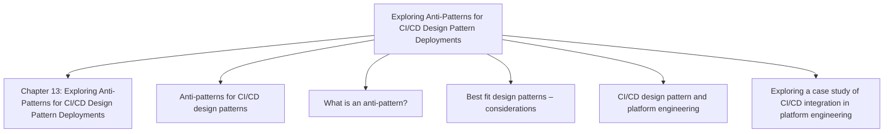

## Chapter 14: Appendix – Knowledge Test and Case Studies

**Questions this chapter answers:**
- What does this chapter explain about Chapter 14: Appendix – Knowledge Test and Case Studies?
- What does this chapter explain about Knowledge test?
- What does this chapter explain about The quiz?

**Key points:**
- Source section: Chapter 14: Appendix – Knowledge Test and Case Studies.
- Source section: Knowledge test.
- Source section: The quiz.
- Source section: Answers.

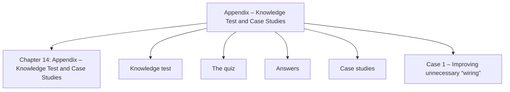
