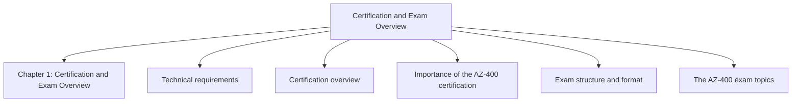
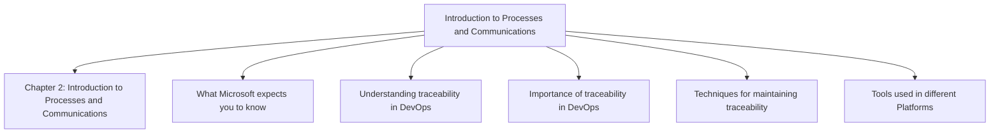

# Designing and Implementing Microsoft DevOps Solutions AZ-400 Certification Guide

*Werner Rall — Book*

## Chapter 1: Certification and Exam Overview

**Questions this chapter answers:**
- What does this chapter explain about Chapter 1: Certification and Exam Overview?
- What does this chapter explain about Technical requirements?
- What does this chapter explain about Certification overview?

**Key points:**
- Source section: Chapter 1: Certification and Exam Overview.
- Source section: Technical requirements.
- Source section: Certification overview.
- Source section: Importance of the AZ-400 certification.

## Chapter 2: Introduction to Processes and Communications

**Questions this chapter answers:**
- What does this chapter explain about Chapter 2: Introduction to Processes and Communications?
- What does this chapter explain about What Microsoft expects you to know?
- What does this chapter explain about Understanding traceability in DevOps?

**Key points:**
- Source section: Chapter 2: Introduction to Processes and Communications.
- Source section: What Microsoft expects you to know.
- Source section: Understanding traceability in DevOps.
- Source section: Importance of traceability in DevOps.

