# Hands-On Python for DevOps

*Ankur Roy — Book*

## Chapter 1: Introducing DevOps Principles

**Questions this chapter answers:**
- What does this chapter explain about Chapter 1: Introducing DevOps Principles?
- What does this chapter explain about Exploring automation?
- What does this chapter explain about Automation and how it relates to the world?

**Key points:**
- Source section: Chapter 1: Introducing DevOps Principles.
- Source section: Exploring automation.
- Source section: Automation and how it relates to the world.
- Source section: How automation evolves from the perspective of an operations engineer.

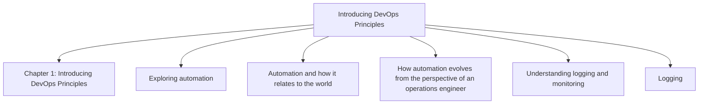

## Chapter 2: Talking about Python

**Questions this chapter answers:**
- What does this chapter explain about Chapter 2: Talking about Python?
- What does this chapter explain about Python 101?
- What does this chapter explain about Beautiful-ugly/explicit-implicit?

**Key points:**
- Source section: Chapter 2: Talking about Python.
- Source section: Python 101.
- Source section: Beautiful-ugly/explicit-implicit.
- Source section: Simple-complex-complicated.

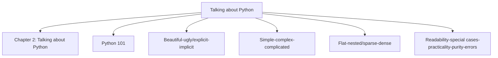

## Chapter 3: The Simplest Ways to Start Using DevOps in Python Immediately

**Questions this chapter answers:**
- What does this chapter explain about Chapter 3: The Simplest Ways to Start Using DevOps in Python Immediately?
- What does this chapter explain about Technical requirements?
- What does this chapter explain about Introducing API calls?

**Key points:**
- Source section: Chapter 3: The Simplest Ways to Start Using DevOps in Python Immediately.
- Source section: Technical requirements.
- Source section: Introducing API calls.
- Source section: Exercise 1 – calling a Hugging Face Transformer API.

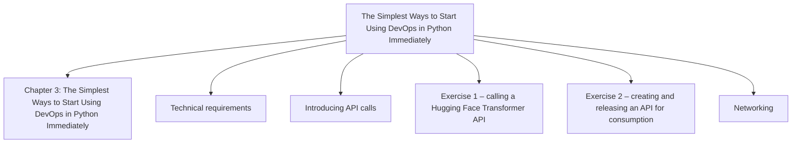

## Chapter 4: Provisioning Resources

**Questions this chapter answers:**
- What does this chapter explain about Chapter 4: Provisioning Resources?
- What does this chapter explain about Technical requirements?
- What does this chapter explain about Python SDKs (and why everyone uses them)?

**Key points:**
- Source section: Chapter 4: Provisioning Resources.
- Source section: Technical requirements.
- Source section: Python SDKs (and why everyone uses them).
- Source section: Creating an AWS EC2 instance with Python’s boto3 library.

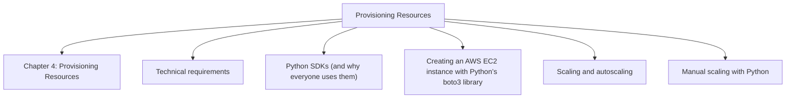

## Chapter 5: Manipulating Resources

**Questions this chapter answers:**
- What does this chapter explain about Chapter 5: Manipulating Resources?
- What does this chapter explain about Technical requirements?
- What does this chapter explain about Event-based resource adjustment?

**Key points:**
- Source section: Chapter 5: Manipulating Resources.
- Source section: Technical requirements.
- Source section: Event-based resource adjustment.
- Source section: Edge location-based resource sharing.

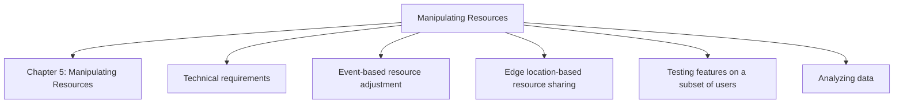

## Chapter 6: Security and DevSecOps with Python

**Questions this chapter answers:**
- What does this chapter explain about Chapter 6: Security and DevSecOps with Python?
- What does this chapter explain about Technical requirements?
- What does this chapter explain about Securing API keys and passwords?

**Key points:**
- Source section: Chapter 6: Security and DevSecOps with Python.
- Source section: Technical requirements.
- Source section: Securing API keys and passwords.
- Source section: Store environment variables.

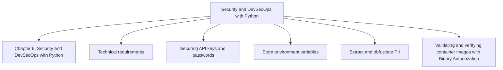

## Chapter 7: Automating Tasks

**Questions this chapter answers:**
- What does this chapter explain about Chapter 7: Automating Tasks?
- What does this chapter explain about Automating server maintenance and patching?
- What does this chapter explain about Sample 1: Running fleet maintenance on multiple instance fleets at once?

**Key points:**
- Source section: Chapter 7: Automating Tasks.
- Source section: Automating server maintenance and patching.
- Source section: Sample 1: Running fleet maintenance on multiple instance fleets at once.
- Source section: Sample 2: Centralizing OS patching for critical updates.

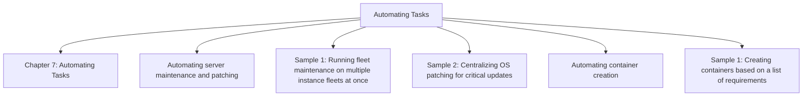

## Chapter 8: Understanding Event-Driven Architecture

**Questions this chapter answers:**
- What does this chapter explain about Chapter 8: Understanding Event-Driven Architecture?
- What does this chapter explain about Technical requirements?
- What does this chapter explain about Introducing Pub/Sub and employing Kafka with Python using the confluent-kafka library?

**Key points:**
- Source section: Chapter 8: Understanding Event-Driven Architecture.
- Source section: Technical requirements.
- Source section: Introducing Pub/Sub and employing Kafka with Python using the confluent-kafka library.
- Source section: Understanding the importance of events and consequences.

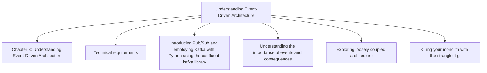

## Chapter 9: Using Python for CI/CD Pipelines

**Questions this chapter answers:**
- What does this chapter explain about Chapter 9: Using Python for CI/CD Pipelines?
- What does this chapter explain about Technical requirements?
- What does this chapter explain about The origins and philosophy of CI/CD?

**Key points:**
- Source section: Chapter 9: Using Python for CI/CD Pipelines.
- Source section: Technical requirements.
- Source section: The origins and philosophy of CI/CD.
- Source section: Scene 1 – continuous integration.

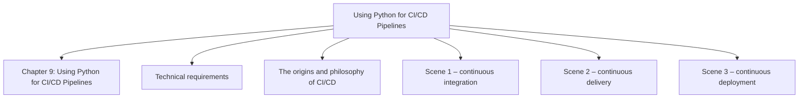

## Chapter 10: Common DevOps Use Cases in Some of the Biggest Companies in the World

**Questions this chapter answers:**
- What does this chapter explain about Chapter 10: Common DevOps Use Cases in Some of the Biggest Companies in the World?
- What does this chapter explain about AWS use case – Samsung electronics?
- What does this chapter explain about Scenario?

**Key points:**
- Source section: Chapter 10: Common DevOps Use Cases in Some of the Biggest Companies in the World.
- Source section: AWS use case – Samsung electronics.
- Source section: Scenario.
- Source section: Brainstorming.

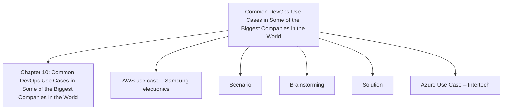

## Chapter 11: MLOps and DataOps

**Questions this chapter answers:**
- What does this chapter explain about Chapter 11: MLOps and DataOps?
- What does this chapter explain about Technical requirements?
- What does this chapter explain about How MLOps and DataOps differ from regular DevOps?

**Key points:**
- Source section: Chapter 11: MLOps and DataOps.
- Source section: Technical requirements.
- Source section: How MLOps and DataOps differ from regular DevOps.
- Source section: DataOps use case – JSON concatenation.

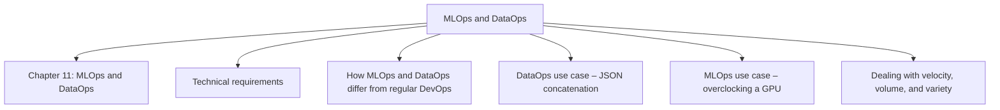

## Chapter 12: How Python Integrates with IaC Concepts

**Questions this chapter answers:**
- What does this chapter explain about Chapter 12: How Python Integrates with IaC Concepts?
- What does this chapter explain about Technical requirements?
- What does this chapter explain about Automation and customization with Python’s Salt library?

**Key points:**
- Source section: Chapter 12: How Python Integrates with IaC Concepts.
- Source section: Technical requirements.
- Source section: Automation and customization with Python’s Salt library.
- Source section: How Ansible works and the Python code behind it.

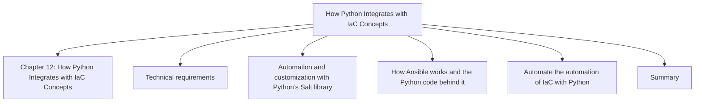

## Chapter 13: The Tools to Take Your DevOps to the Next Level

**Questions this chapter answers:**
- What does this chapter explain about Chapter 13: The Tools to Take Your DevOps to the Next Level?
- What does this chapter explain about Technical requirements?
- What does this chapter explain about Advanced automation tools?

**Key points:**
- Source section: Chapter 13: The Tools to Take Your DevOps to the Next Level.
- Source section: Technical requirements.
- Source section: Advanced automation tools.
- Source section: Advanced monitoring tools.

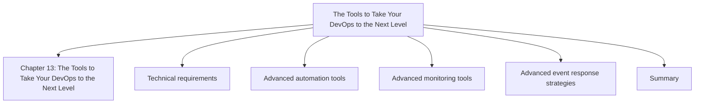
