# Implementing CI-CD Using Azure Pipelines

*Piti Champeethong, Roberto Mardeni — Book*
## Chapter 1: Understanding Azure Pipelines

**Questions this chapter answers:**
- What does this chapter explain about Chapter 1: Understanding Azure Pipelines?
- What does this chapter explain about Technical requirements?
- What does this chapter explain about What is CI/CD??

**Key points:**
- Source section: Chapter 1: Understanding Azure Pipelines.
- Source section: Technical requirements.
- Source section: What is CI/CD?.
- Source section: Introducing Azure DevOps.

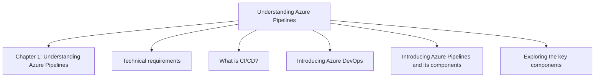

## Chapter 2: Creating Build Pipelines

**Questions this chapter answers:**
- What does this chapter explain about Chapter 2: Creating Build Pipelines?
- What does this chapter explain about Creating a build pipeline with a single job?
- What does this chapter explain about Creating tasks?

**Key points:**
- Source section: Chapter 2: Creating Build Pipelines.
- Source section: Creating a build pipeline with a single job.
- Source section: Creating tasks.
- Source section: Creating multiple jobs.

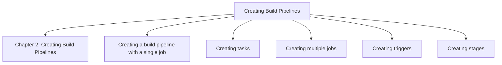

## Chapter 3: Setting Variables, Environments, Approvals, and Checks

**Questions this chapter answers:**
- What does this chapter explain about Chapter 3: Setting Variables, Environments, Approvals, and Checks?
- What does this chapter explain about Creating a service connection for Azure resources?
- What does this chapter explain about Exploring Azure app registration?

**Key points:**
- Source section: Chapter 3: Setting Variables, Environments, Approvals, and Checks.
- Source section: Creating a service connection for Azure resources.
- Source section: Exploring Azure app registration.
- Source section: Creating a service connection.

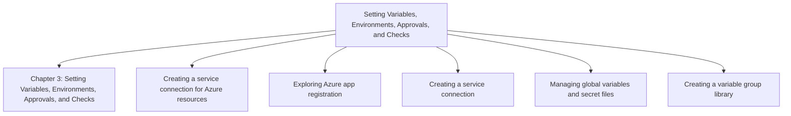

## Chapter 4: Extending Advanced Azure Pipelines Using YAML

**Questions this chapter answers:**
- What does this chapter explain about Chapter 4: Extending Advanced Azure Pipelines Using YAML?
- What does this chapter explain about Creating a build pipeline using YAML?
- What does this chapter explain about Creating a release pipeline using YAML?

**Key points:**
- Source section: Chapter 4: Extending Advanced Azure Pipelines Using YAML.
- Source section: Creating a build pipeline using YAML.
- Source section: Creating a release pipeline using YAML.
- Source section: Cloning, exporting, and importing a YAML pipeline.

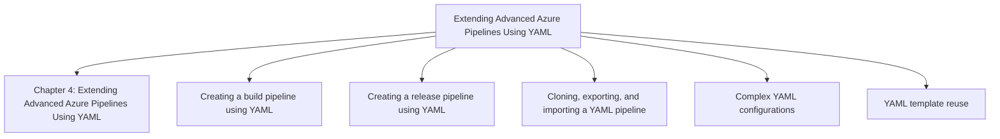

## Chapter 5: Implementing the Build Pipeline Using Deployment Tasks

**Questions this chapter answers:**
- What does this chapter explain about Chapter 5: Implementing the Build Pipeline Using Deployment Tasks?
- What does this chapter explain about Working with Node.js and NPM tasks?
- What does this chapter explain about Working with .NET Core CLI tasks?

**Key points:**
- Source section: Chapter 5: Implementing the Build Pipeline Using Deployment Tasks.
- Source section: Working with Node.js and NPM tasks.
- Source section: Working with .NET Core CLI tasks.
- Source section: Working with Docker tasks.

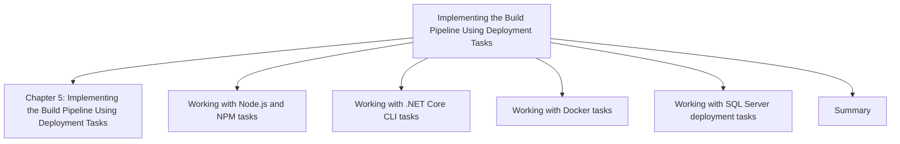

## Chapter 6: Integrating Testing, Security Tasks, and Other Tools

**Questions this chapter answers:**
- What does this chapter explain about Chapter 6: Integrating Testing, Security Tasks, and Other Tools?
- What does this chapter explain about Technical requirements?
- What does this chapter explain about Understanding the Azure DevOps extensibility model?

**Key points:**
- Source section: Chapter 6: Integrating Testing, Security Tasks, and Other Tools.
- Source section: Technical requirements.
- Source section: Understanding the Azure DevOps extensibility model.
- Source section: Installing a code quality assessment tool, SonarQube.

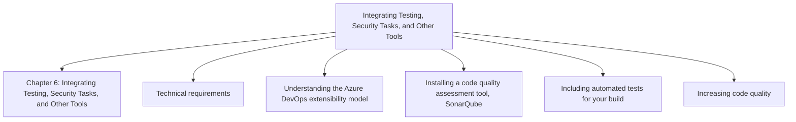

## Chapter 7: Monitoring Azure Pipelines

**Questions this chapter answers:**
- What does this chapter explain about Chapter 7: Monitoring Azure Pipelines?
- What does this chapter explain about Technical requirements?
- What does this chapter explain about Understanding monitoring concepts?

**Key points:**
- Source section: Chapter 7: Monitoring Azure Pipelines.
- Source section: Technical requirements.
- Source section: Understanding monitoring concepts.
- Source section: Monitoring pipeline tasks and their performance.

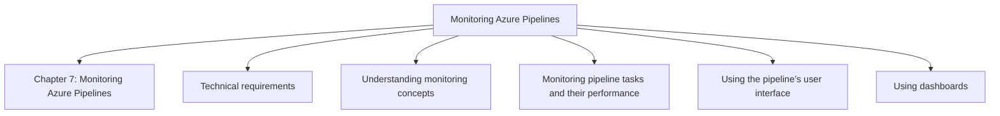

## Chapter 8: Provisioning Infrastructure Using Infrastructure as Code

**Questions this chapter answers:**
- What does this chapter explain about Chapter 8: Provisioning Infrastructure Using Infrastructure as Code?
- What does this chapter explain about Technical requirements?
- What does this chapter explain about Installing Azure tools?

**Key points:**
- Source section: Chapter 8: Provisioning Infrastructure Using Infrastructure as Code.
- Source section: Technical requirements.
- Source section: Installing Azure tools.
- Source section: Installing AWS tools.

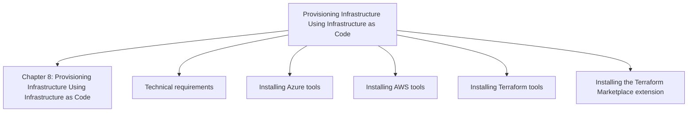

## Chapter 9: Implementing CI/CD for Azure Services

**Questions this chapter answers:**
- What does this chapter explain about Chapter 9: Implementing CI/CD for Azure Services?
- What does this chapter explain about Technical requirements?
- What does this chapter explain about Getting started?

**Key points:**
- Source section: Chapter 9: Implementing CI/CD for Azure Services.
- Source section: Technical requirements.
- Source section: Getting started.
- Source section: Importing the sample repository.

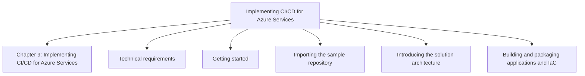

## Chapter 10: Implementing CI/CD for AWS

**Questions this chapter answers:**
- What does this chapter explain about Chapter 10: Implementing CI/CD for AWS?
- What does this chapter explain about Technical requirements?
- What does this chapter explain about Explaining the solution architecture?

**Key points:**
- Source section: Chapter 10: Implementing CI/CD for AWS.
- Source section: Technical requirements.
- Source section: Explaining the solution architecture.
- Source section: Building and packaging applications and IaC.

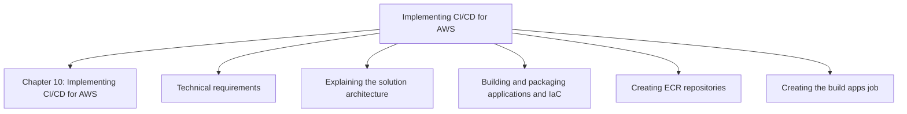

## Chapter 11: Automating CI/CD for Cross-Mobile Applications by Using Flutter

**Questions this chapter answers:**
- What does this chapter explain about Chapter 11: Automating CI/CD for Cross-Mobile Applications by Using Flutter?
- What does this chapter explain about Technical requirements?
- What does this chapter explain about Explaining the solution architecture?

**Key points:**
- Source section: Chapter 11: Automating CI/CD for Cross-Mobile Applications by Using Flutter.
- Source section: Technical requirements.
- Source section: Explaining the solution architecture.
- Source section: Managing secure files.

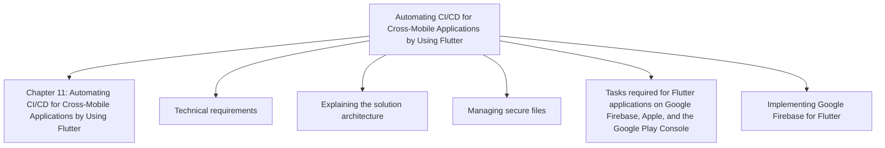

## Chapter 12: Navigating Common Pitfalls and Future Trends in Azure Pipelines

**Questions this chapter answers:**
- What does this chapter explain about Chapter 12: Navigating Common Pitfalls and Future Trends in Azure Pipelines?
- What does this chapter explain about Common pitfalls?
- What does this chapter explain about Best practices?

**Key points:**
- Source section: Chapter 12: Navigating Common Pitfalls and Future Trends in Azure Pipelines.
- Source section: Common pitfalls.
- Source section: Best practices.
- Source section: Future trends.

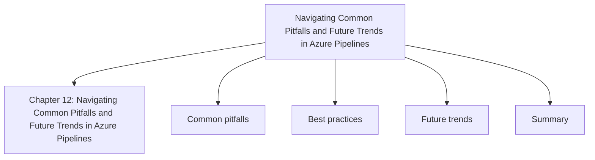
