# Implementing GitOps with Kubernetes

*Pietro Libro, Artem Lajko — Book*

## Chapter 1: An Introduction to GitOps

**Questions this chapter answers:**
- What does this chapter explain about Chapter 1: An Introduction to GitOps?
- What does this chapter explain about Technical requirements?
- What does this chapter explain about GitOps unveiled – reshaping development culture and practices?

**Key points:**
- Source section: Chapter 1: An Introduction to GitOps.
- Source section: Technical requirements.
- Source section: GitOps unveiled – reshaping development culture and practices.
- Source section: Traditional CI/CD with DevOps against GitOps.

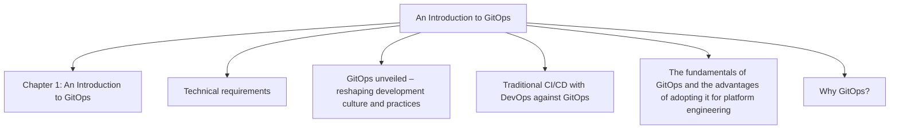

## Chapter 2: Navigating Cloud-native Operations with GitOps

**Questions this chapter answers:**
- What does this chapter explain about Chapter 2: Navigating Cloud-native Operations with GitOps?
- What does this chapter explain about Technical requirements?
- What does this chapter explain about An overview of the integration of GitOps and cloud-native technology?

**Key points:**
- Source section: Chapter 2: Navigating Cloud-native Operations with GitOps.
- Source section: Technical requirements.
- Source section: An overview of the integration of GitOps and cloud-native technology.
- Source section: An introduction to Kubernetes.

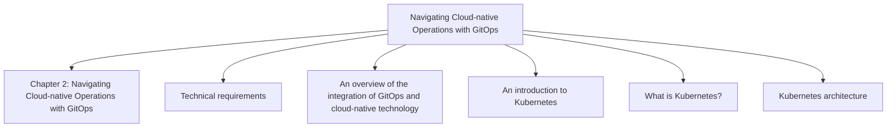

## Chapter 3: Version Control and Integration with Git and GitHub

**Questions this chapter answers:**
- What does this chapter explain about Chapter 3: Version Control and Integration with Git and GitHub?
- What does this chapter explain about Technical requirements?
- What does this chapter explain about Exploring version control systems – local, centralized, and distributed?

**Key points:**
- Source section: Chapter 3: Version Control and Integration with Git and GitHub.
- Source section: Technical requirements.
- Source section: Exploring version control systems – local, centralized, and distributed.
- Source section: Why Git?.

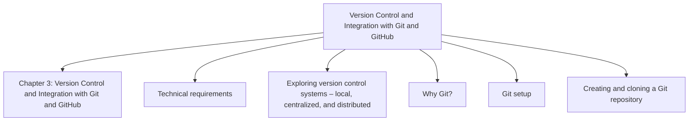

## Chapter 4: Kubernetes with GitOps Tools

**Questions this chapter answers:**
- What does this chapter explain about Chapter 4: Kubernetes with GitOps Tools?
- What does this chapter explain about Technical requirements?
- What does this chapter explain about Overview of popular GitOps tools?

**Key points:**
- Source section: Chapter 4: Kubernetes with GitOps Tools.
- Source section: Technical requirements.
- Source section: Overview of popular GitOps tools.
- Source section: A deep dive into Helm and Kustomize.

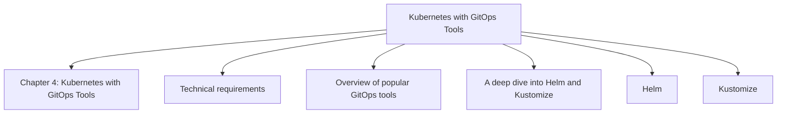

## Chapter 5: GitOps at Scale and Multitenancy

**Questions this chapter answers:**
- What does this chapter explain about Chapter 5: GitOps at Scale and Multitenancy?
- What does this chapter explain about Technical requirements?
- What does this chapter explain about Traditional CI/CD versus GitOps CD?

**Key points:**
- Source section: Chapter 5: GitOps at Scale and Multitenancy.
- Source section: Technical requirements.
- Source section: Traditional CI/CD versus GitOps CD.
- Source section: Platform engineering versus IDPs.

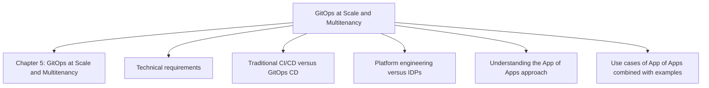

## Chapter 6: GitOps Architectural Designs and Operational Control

**Questions this chapter answers:**
- What does this chapter explain about Chapter 6: GitOps Architectural Designs and Operational Control?
- What does this chapter explain about Exploring diverse GitOps architectural frameworks for Kubernetes environments?
- What does this chapter explain about Examining the impact of architectural choices on GitOps’ effectiveness?

**Key points:**
- Source section: Chapter 6: GitOps Architectural Designs and Operational Control.
- Source section: Exploring diverse GitOps architectural frameworks for Kubernetes environments.
- Source section: Examining the impact of architectural choices on GitOps’ effectiveness.
- Source section: Architectural choices impacting GitOps.

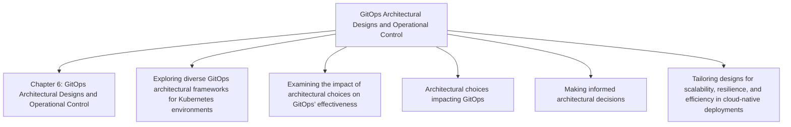

## Chapter 7: Cultural Transformation in IT for Embracing GitOps

**Questions this chapter answers:**
- What does this chapter explain about Chapter 7: Cultural Transformation in IT for Embracing GitOps?
- What does this chapter explain about Treating infrastructure as an application?
- What does this chapter explain about Understanding IaC?

**Key points:**
- Source section: Chapter 7: Cultural Transformation in IT for Embracing GitOps.
- Source section: Treating infrastructure as an application.
- Source section: Understanding IaC.
- Source section: Understanding infrastructure as applications in Argo CD’s GitOps framework.

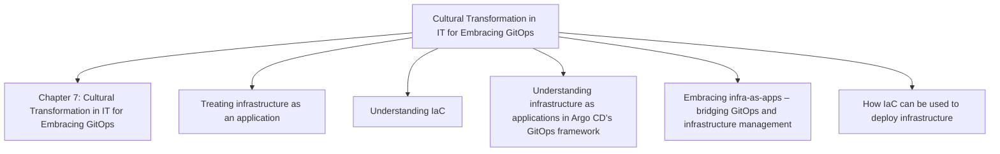

## Chapter 8: GitOps with OpenShift

**Questions this chapter answers:**
- What does this chapter explain about Chapter 8: GitOps with OpenShift?
- What does this chapter explain about Technical requirements?
- What does this chapter explain about Introduction to Red Hat OpenShift?

**Key points:**
- Source section: Chapter 8: GitOps with OpenShift.
- Source section: Technical requirements.
- Source section: Introduction to Red Hat OpenShift.
- Source section: Red Hat OpenShift environment setup.

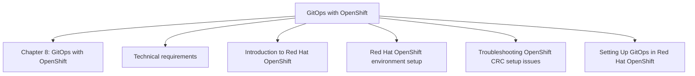

## Chapter 9: GitOps for Azure and AWS Deployments

**Questions this chapter answers:**
- What does this chapter explain about Chapter 9: GitOps for Azure and AWS Deployments?
- What does this chapter explain about Technical requirements?
- What does this chapter explain about Azure and AWS accounts?

**Key points:**
- Source section: Chapter 9: GitOps for Azure and AWS Deployments.
- Source section: Technical requirements.
- Source section: Azure and AWS accounts.
- Source section: Cloud GitOps essentials – Azure and AWS.

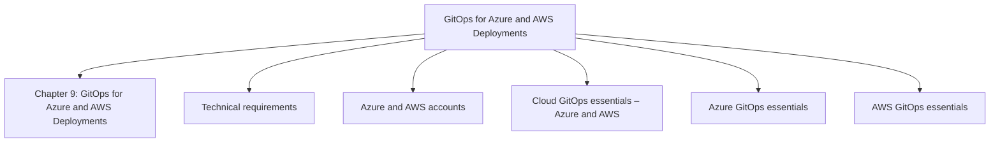

## Chapter 10: GitOps for Infrastructure Automation – Terraform and Flux CD

**Questions this chapter answers:**
- What does this chapter explain about Chapter 10: GitOps for Infrastructure Automation – Terraform and Flux CD?
- What does this chapter explain about Technical requirements?
- What does this chapter explain about Introducing infrastructure automation with Terraform and Flux CD?

**Key points:**
- Source section: Chapter 10: GitOps for Infrastructure Automation – Terraform and Flux CD.
- Source section: Technical requirements.
- Source section: Introducing infrastructure automation with Terraform and Flux CD.
- Source section: Setting up Terraform in a GitOps workflow.

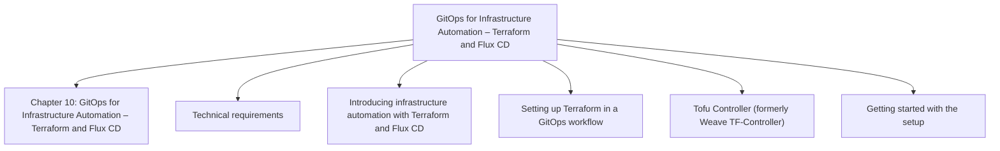

## Chapter 11: Deploying Real-World Projects with GitOps on Kubernetes

**Questions this chapter answers:**
- What does this chapter explain about Chapter 11: Deploying Real-World Projects with GitOps on Kubernetes?
- What does this chapter explain about Technical requirements?
- What does this chapter explain about Establishing a GitOps and Kubernetes development environment?

**Key points:**
- Source section: Chapter 11: Deploying Real-World Projects with GitOps on Kubernetes.
- Source section: Technical requirements.
- Source section: Establishing a GitOps and Kubernetes development environment.
- Source section: Implementing CI/CD with GitOps.

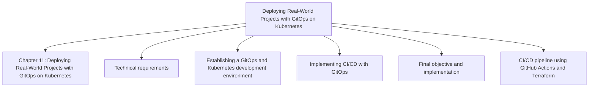

## Chapter 12: Observability with GitOps

**Questions this chapter answers:**
- What does this chapter explain about Chapter 12: Observability with GitOps?
- What does this chapter explain about Exploring the fundamentals of SRE for GitOps and Kubernetes?
- What does this chapter explain about The intersection of SRE with GitOps?

**Key points:**
- Source section: Chapter 12: Observability with GitOps.
- Source section: Exploring the fundamentals of SRE for GitOps and Kubernetes.
- Source section: The intersection of SRE with GitOps.
- Source section: SRE principles in a Kubernetes context.

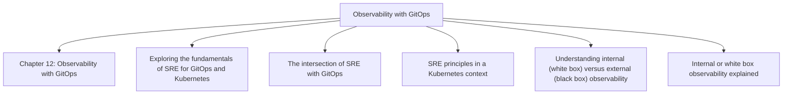

## Chapter 13: Security with GitOps

**Questions this chapter answers:**
- What does this chapter explain about Chapter 13: Security with GitOps?
- What does this chapter explain about Hardening declarative GitOps CD on Kubernetes?
- What does this chapter explain about Addressing configuration vulnerabilities?

**Key points:**
- Source section: Chapter 13: Security with GitOps.
- Source section: Hardening declarative GitOps CD on Kubernetes.
- Source section: Addressing configuration vulnerabilities.
- Source section: Enhancing password management and RBAC.

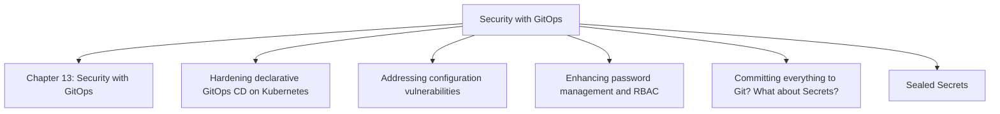

## Chapter 14: FinOps, Sustainability, AI, and Future Trends for GitOps

**Questions this chapter answers:**
- What does this chapter explain about Chapter 14: FinOps, Sustainability, AI, and Future Trends for GitOps?
- What does this chapter explain about Covering the fundamentals of FinOps?
- What does this chapter explain about Forecasting and monitoring costs with GitOps?

**Key points:**
- Source section: Chapter 14: FinOps, Sustainability, AI, and Future Trends for GitOps.
- Source section: Covering the fundamentals of FinOps.
- Source section: Forecasting and monitoring costs with GitOps.
- Source section: How GitOps complements FinOps.

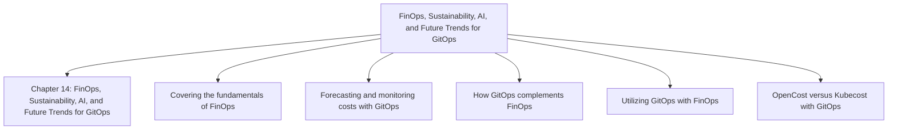
