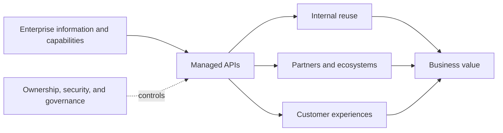
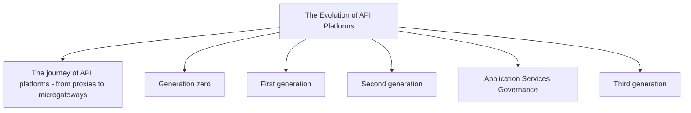
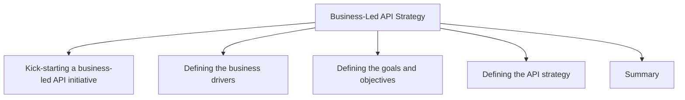
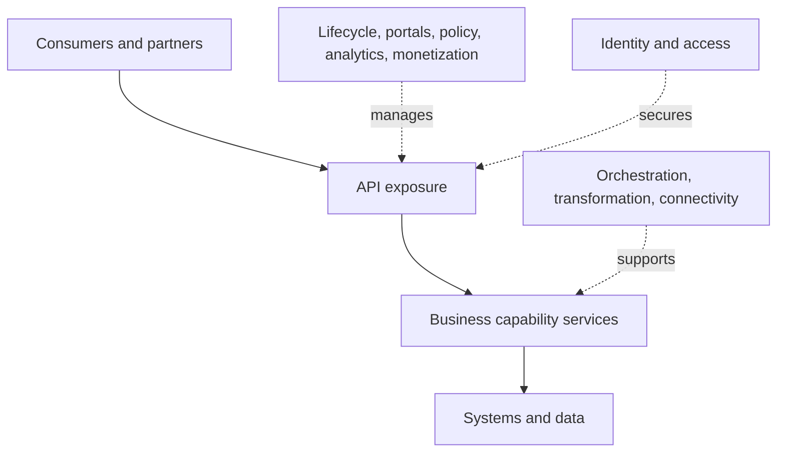
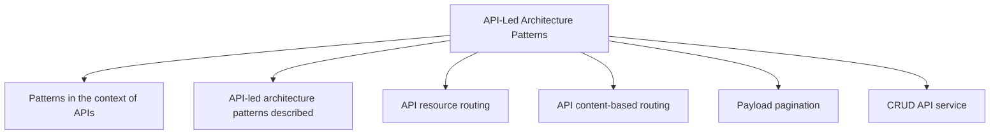
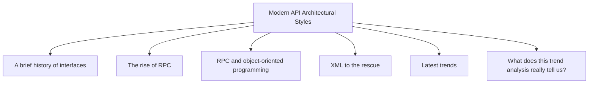
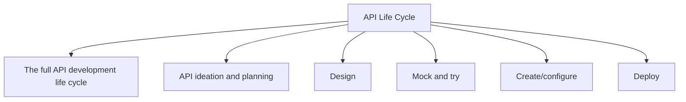
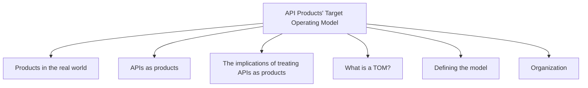

# Enterprise API Management

*Luis Weir — Book*
## Chapter 1: The Business Value of APIs

**Questions this chapter answers:**
- Why do APIs matter to business strategy rather than only integration teams?
- How can APIs enable innovation, monetization, compliance, and reuse?
- What risks arise from unmanaged hyperconnectivity?
- What participants make up an API value chain?

**Key points:**
- API programs should start from business drivers and reusable capabilities, not gateway technology.
- APIs can support innovation, new revenue, regulatory obligations, and internal reuse.
- Hyperconnectivity without ownership and governance produces fragile dependencies.
- Value emerges through a chain of producers, platform operators, developers, partners, and consumers.

## Chapter 2: The Evolution of API Platforms

**Questions this chapter answers:**
- What does this chapter explain about The journey of API platforms - from proxies to microgateways?
- What does this chapter explain about Generation zero?
- What does this chapter explain about First generation?

**Key points:**
- Source section: The journey of API platforms - from proxies to microgateways.
- Source section: Generation zero.
- Source section: First generation.
- Source section: Second generation.

## Chapter 3: Business-Led API Strategy

**Questions this chapter answers:**
- What does this chapter explain about Kick-starting a business-led API initiative?
- What does this chapter explain about Defining the business drivers?
- What does this chapter explain about Defining the goals and objectives?

**Key points:**
- Source section: Kick-starting a business-led API initiative.
- Source section: Defining the business drivers.
- Source section: Defining the goals and objectives.
- Source section: Defining the API strategy.

## Chapter 4: API-Led Architectures

**Questions this chapter answers:**
- Which capabilities belong in an API-led architecture?
- How do management, exposure, security, and runtime services interact?
- What distinguishes semi-decoupled from fully decoupled services?
- Where do lifecycle, analytics, monetization, and identity controls belong?

**Key points:**
- API design, policy, portals, runtime operations, analytics, and monetization form one lifecycle.
- Exposure controls authentication, authorization, routing, throttling, transformation, and resilience.
- Business-capability services can be semi-decoupled or fully decoupled depending on runtime and data ownership.
- Identity, orchestration, connectivity, and observability are cross-cutting architectural capabilities.

## Chapter 5: API-Led Architecture Patterns

**Questions this chapter answers:**
- What does this chapter explain about Patterns in the context of APIs?
- What does this chapter explain about API-led architecture patterns described?
- What does this chapter explain about API resource routing?

**Key points:**
- Source section: Patterns in the context of APIs.
- Source section: API-led architecture patterns described.
- Source section: API resource routing.
- Source section: API content-based routing.

## Chapter 6: Modern API Architectural Styles

**Questions this chapter answers:**
- What does this chapter explain about A brief history of interfaces?
- What does this chapter explain about The rise of RPC?
- What does this chapter explain about RPC and object-oriented programming?

**Key points:**
- Source section: A brief history of interfaces.
- Source section: The rise of RPC.
- Source section: RPC and object-oriented programming.
- Source section: XML to the rescue.

## Chapter 7: API Life Cycle

**Questions this chapter answers:**
- What does this chapter explain about The full API development life cycle?
- What does this chapter explain about API ideation and planning?
- What does this chapter explain about Design?

**Key points:**
- Source section: The full API development life cycle.
- Source section: API ideation and planning.
- Source section: Design.
- Source section: Mock and try.

## Chapter 8: API Products' Target Operating Model

**Questions this chapter answers:**
- What does this chapter explain about Products in the real world?
- What does this chapter explain about APIs as products?
- What does this chapter explain about The implications of treating APIs as products?

**Key points:**
- Source section: Products in the real world.
- Source section: APIs as products.
- Source section: The implications of treating APIs as products.
- Source section: What is a TOM?.

