# Technical Program Manager's Handbook

*Joshua Alan Teter — Book*

## Chapter 1: Fundamentals of a Technical Program Manager

**Questions this chapter answers:**
- What does this chapter explain about Understanding the modern TPM?
- What does this chapter explain about Old title, new meaning?
- What does this chapter explain about Learning the fundamentals?

**Key points:**
- Source section: Understanding the modern TPM.
- Source section: Old title, new meaning.
- Source section: Learning the fundamentals.
- Source section: The Systems Development Life Cycle.

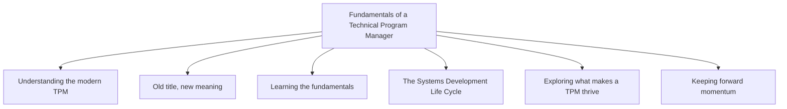

## Chapter 2: Pillars of a Technical Program Manager

**Questions this chapter answers:**
- What does this chapter explain about Understanding project management?
- What does this chapter explain about Exploring the typical project management tactics?
- What does this chapter explain about Project planning?

**Key points:**
- Source section: Understanding project management.
- Source section: Exploring the typical project management tactics.
- Source section: Project planning.
- Source section: Resource management.

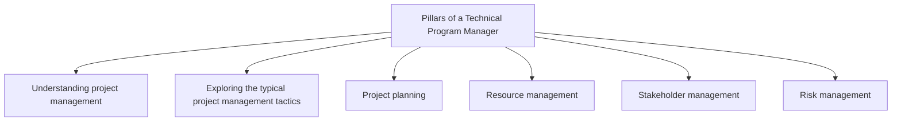

## Chapter 3: Career Paths

**Questions this chapter answers:**
- What does this chapter explain about Examining the career paths of a TPM?
- What does this chapter explain about The path to becoming a TPM?
- What does this chapter explain about The paths of a TPM?

**Key points:**
- Source section: Examining the career paths of a TPM.
- Source section: The path to becoming a TPM.
- Source section: The paths of a TPM.
- Source section: Exploring the IC path.

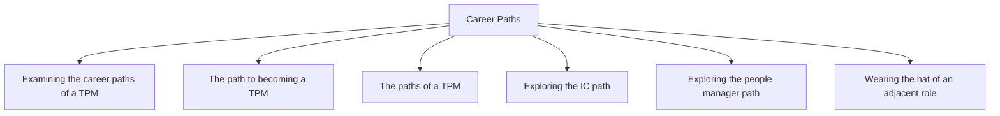

## Chapter 4: An Introduction to Program Management Using a Case Study

**Questions this chapter answers:**
- What does this chapter explain about Introducing the Mercury program?
- What does this chapter explain about Mercury program charter?
- What does this chapter explain about Mercury project structure?

**Key points:**
- Source section: Introducing the Mercury program.
- Source section: Mercury program charter.
- Source section: Mercury project structure.
- Source section: Examining the program-project intersection.

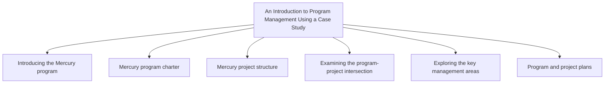

## Chapter 5: Driving Toward Clarity

**Questions this chapter answers:**
- What does this chapter explain about Clarifying thoughts into plans?
- What does this chapter explain about Using clarity in key management areas?
- What does this chapter explain about Planning?

**Key points:**
- Source section: Clarifying thoughts into plans.
- Source section: Using clarity in key management areas.
- Source section: Planning.
- Source section: What can happen when you don’t clarify your plan enough?.

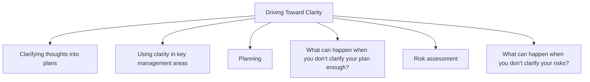

## Chapter 6: Plan Management

**Questions this chapter answers:**
- What does this chapter explain about Driving clarity from requirements to planned work?
- What does this chapter explain about Project management tools?
- What does this chapter explain about Diving deep into the project plan?

**Key points:**
- Source section: Driving clarity from requirements to planned work.
- Source section: Project management tools.
- Source section: Diving deep into the project plan.
- Source section: Requirements gathering and refinement.

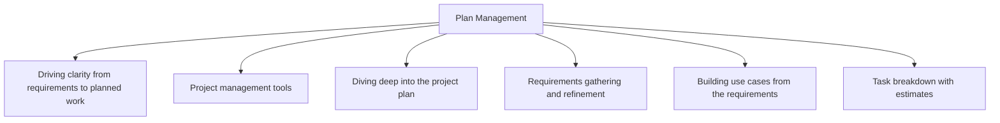

## Chapter 7: Risk Management

**Questions this chapter answers:**
- What does this chapter explain about Driving clarity in risk assessment?
- What does this chapter explain about Risk identification?
- What does this chapter explain about Risk analysis?

**Key points:**
- Source section: Driving clarity in risk assessment.
- Source section: Risk identification.
- Source section: Risk analysis.
- Source section: Updating the plan.

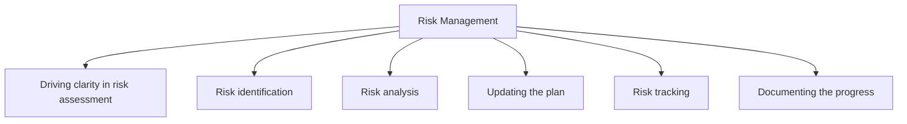

## Chapter 8: Stakeholder Management

**Questions this chapter answers:**
- What does this chapter explain about Driving clarity in stakeholder management?
- What does this chapter explain about Stand-up?
- What does this chapter explain about Status update?

**Key points:**
- Source section: Driving clarity in stakeholder management.
- Source section: Stand-up.
- Source section: Status update.
- Source section: Leadership review.

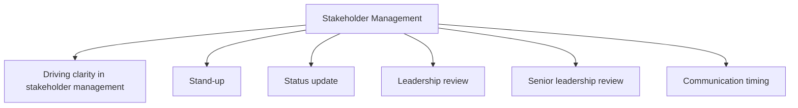

## Chapter 9: Managing a Program

**Questions this chapter answers:**
- What does this chapter explain about Defining a program?
- What does this chapter explain about Defining boundaries?
- What does this chapter explain about Deciding when to build a program?

**Key points:**
- Source section: Defining a program.
- Source section: Defining boundaries.
- Source section: Deciding when to build a program.
- Source section: Building a program from the start.

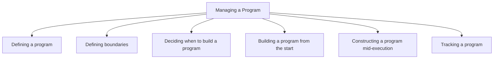

## Chapter 10: Emotional Intelligence in Technical Program Management

**Questions this chapter answers:**
- What does this chapter explain about Identifying the components of emotional intelligence?
- What does this chapter explain about Self-awareness?
- What does this chapter explain about Self-regulation?

**Key points:**
- Source section: Identifying the components of emotional intelligence.
- Source section: Self-awareness.
- Source section: Self-regulation.
- Source section: Empathy.

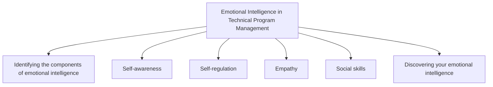

## Chapter 11: The Technical Toolset

**Questions this chapter answers:**
- What does this chapter explain about Examining the need for a technical background?
- What does this chapter explain about TPM specializations?
- What does this chapter explain about Technical proficiencies used daily?

**Key points:**
- Source section: Examining the need for a technical background.
- Source section: TPM specializations.
- Source section: Technical proficiencies used daily.
- Source section: Using your technical toolset to wear many hats.

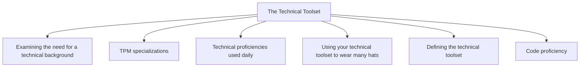

## Chapter 12: Code Development Expectations

**Questions this chapter answers:**
- What does this chapter explain about Understanding code development expectations?
- What does this chapter explain about No code writing required!?
- What does this chapter explain about Exploring programming language basics?

**Key points:**
- Source section: Understanding code development expectations.
- Source section: No code writing required!.
- Source section: Exploring programming language basics.
- Source section: Diving into data structures.

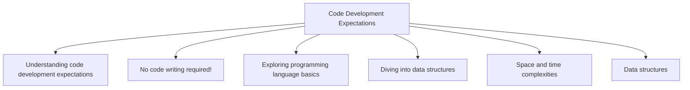

## Chapter 13: System Design and Architecture Landscape

**Questions this chapter answers:**
- What does this chapter explain about Learning about common system design patterns?
- What does this chapter explain about Model-View-Presenter?
- What does this chapter explain about Object-oriented architecture?

**Key points:**
- Source section: Learning about common system design patterns.
- Source section: Model-View-Presenter.
- Source section: Object-oriented architecture.
- Source section: Domain-driven design architecture.

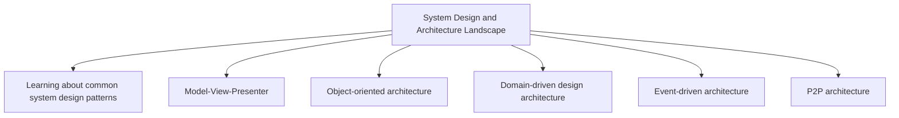

## Chapter 14: Harnessing the Power of Artificial Intelligence in Technical Program Management

**Questions this chapter answers:**
- What does this chapter explain about Distilling generative AI basics?
- What does this chapter explain about Data processing?
- What does this chapter explain about Generative model?

**Key points:**
- Source section: Distilling generative AI basics.
- Source section: Data processing.
- Source section: Generative model.
- Source section: Feedback and improvement processes.

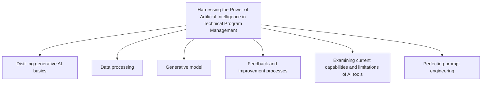

## Chapter 15: Enhancing Management Using Your Technical Toolset

**Questions this chapter answers:**
- What does this chapter explain about Driving toward clarity?
- What does this chapter explain about Plan management?
- What does this chapter explain about Requirements analysis?

**Key points:**
- Source section: Driving toward clarity.
- Source section: Plan management.
- Source section: Requirements analysis.
- Source section: Project plan.

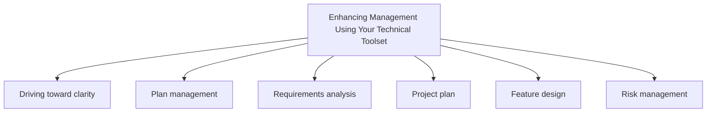
